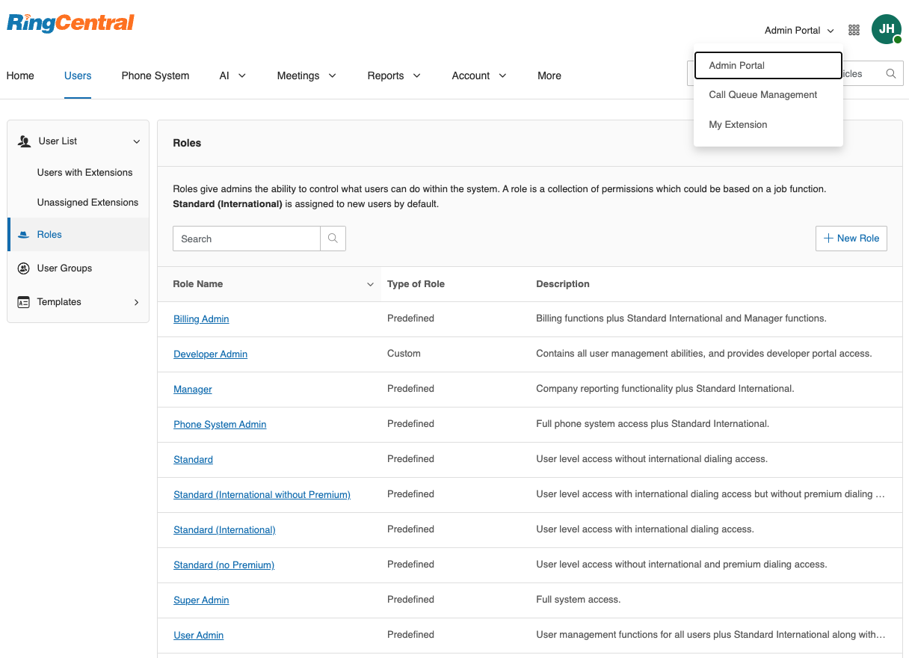
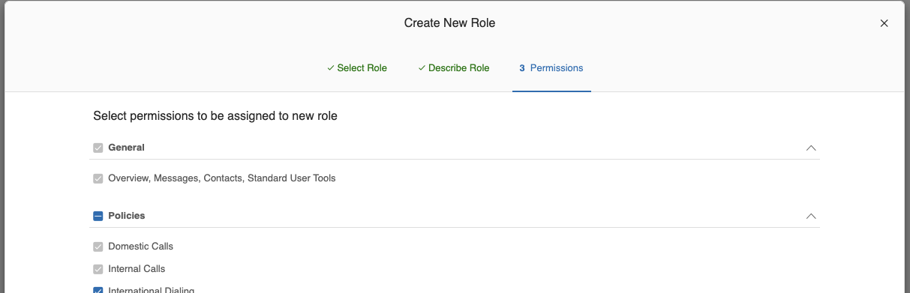

---
hide:
    - navigation
---

# Admin Roles and Permissions

Users assigned with predefined Manager and Super Admin roles can access Archiver and archive data for the entire company. Administrators of Admin portal can also create custom roles and grant necessary permissions for admin archiving.

## To Create Custom Admin Archiver Role

1. Log in to [https://service.ringcentral.com](https://service.ringcentral.com) with admin portal administrator account.
2. Switch to Admin Portal from the dropdown on the top right corner.
3. Navigate to **Users** -> **Roles**.
   
4. Click on **+ New Role** to create custom roles.
5. Pick an existing role as the starting point for the new role.
   
6. Give the new role a name and description.
   
7. In the **Permissions** tab, as shown below:
   
8. Make sure the following permissions are ticked:

    | Permissions                                                                                                                    | Screenshot                                        |
    | ------------------------------------------------------------------------------------------------------------------------------ | ------------------------------------------------- |
    | User Management <ul><li>Users</li></ul>                                                                                   |   |
    | Features <ul><li>Archiver for Admins</li></ul>                                                                            |          |
    | Company Call Log <ul><li>Access Recordings</li><li>Delete Records</li><li>Download & Delivery</li><li>View Only</li></ul> |  |

9. Click on **Save** to save the new role.
10. After that, you can assign the new role to user(s) as needed by clicking on the **Assigned Users** button. Or you can navigate to **Users** -> **Roles**, and click on your custom role, then navigate to the **Assigned Users** tab and click on **+ Assign User** to assign the custom role to user(s) as needed.
    
