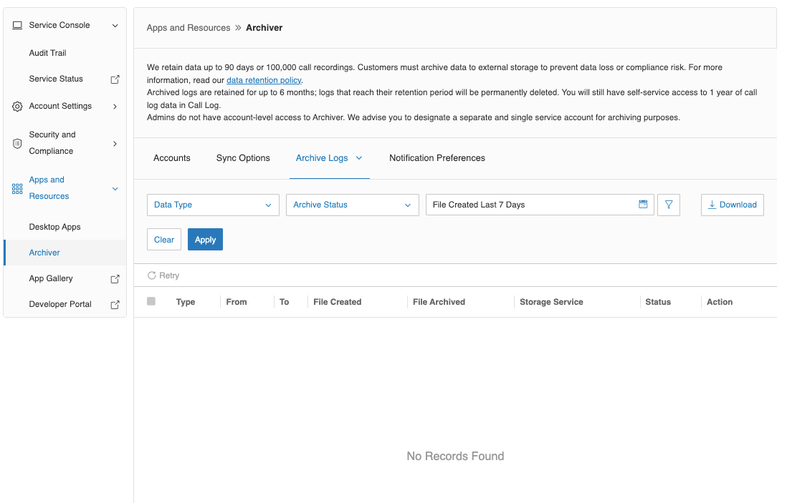

---
hide:
    - toc
---

# Archive Logs

When the Turn On Backup checkbox is selected, archive jobs run every 30 minutes. Each task is logged in the backend, and users can view these logs under the Archive Logs -> Phone Logs tab. By default, logs from the past 7 days are displayed.

For more information about:

-   Automatic retry mechanism, see [Retry Mechanism](retry-mechanism.md)
-   Archive status and data types, see [Archive Status and Data Types](archive-status.md)
