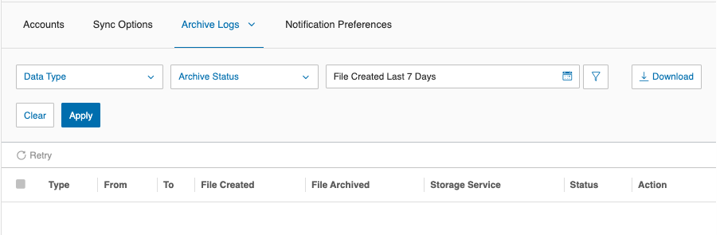
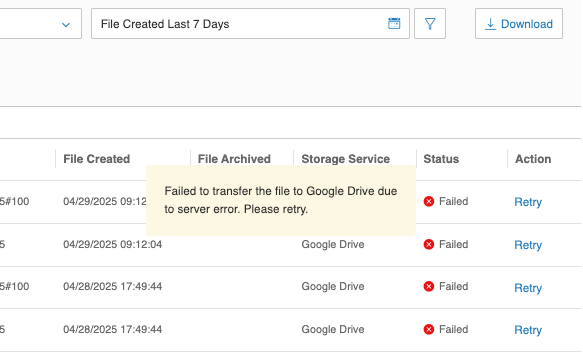

---
hide:
    - toc
---

# Archive Status and Data Types

## Data Types

All data types are supported:

-   Call Recording
-   SMS/MMS
-   Fax
-   Voicemails

## Status Types

You can check the item status from Archive Logs by applying different filters:

| Status      | Description                                                                                                  |
| ----------- | ------------------------------------------------------------------------------------------------------------ |
| Pending     | The item is awaiting pickup by the Archiver job                                                              |
| In Progress | The item is currently being archived to storage                                                              |
| Archived    | The item has been successfully archived to storage, and the File Archived column will be updated accordingly |
| Failed      | The item failed to archive. You can check the failure reason by clicking on the 'Failed' text                |

## File Created

-   You can filter for items from the last 180 days
-   Can only fetch 30 days of data at a time
