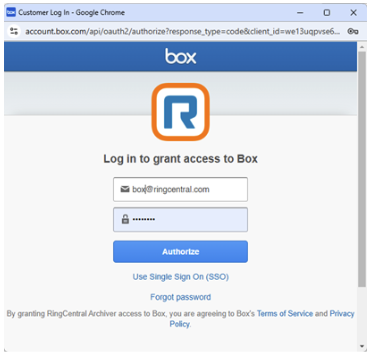

---
hide:
    - navigation
---

# :simple-box: Connect Box

Enterprise-grade cloud content management for your RingCentral archives.

## Overview

Box provides enterprise-grade security and compliance features, making it ideal for organizations with strict data governance requirements. Archive your RingCentral communications with confidence.

---

## Connection Steps

**Step 1:** Click **Connect** next to Box.

**Step 2:** Sign in to your Box account when prompted.

**Step 3:** Authorize RingCentral Archiver to access your Box account.

**Step 4:** Complete the authorization process.

---

## Next Steps

-   :material-sync:{ .lg .middle } **Configure Sync Options**

    ---

    Set up what data gets archived and scheduling preferences.

    [:octicons-arrow-right-24: Go to Sync Options](sync-options.md)

-   :material-file-document:{ .lg .middle } **Archive Logs**

    ---

    Monitor your archive activity and status.

    [:octicons-arrow-right-24: View Logs](archive-logs.md)

