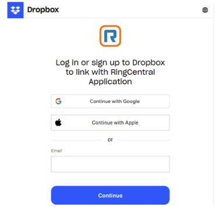

---
hide:
    - navigation
---

# :simple-dropbox: Connect Dropbox

Simple and reliable cloud storage for your RingCentral archives.

## Overview

Dropbox offers a straightforward and reliable cloud storage solution. With its intuitive interface and robust syncing capabilities, your archived RingCentral data is always accessible when you need it.

---

## Connection Steps

**Step 1:** Click **Connect** next to Dropbox.

**Step 2:** Sign in to your Dropbox account when prompted.

**Step 3:** Complete the authentication steps.

**Step 4:** Allow access to a RingCentral app folder in Dropbox.

!!! tip "App Folder Access"
    RingCentral Archiver will create a dedicated folder in your Dropbox to store all archived data, keeping it organized and separate from your other files.

**Step 5:** Finalize the connection.

---

## Next Steps

-   :material-sync:{ .lg .middle } **Configure Sync Options**

    ---

    Set up what data gets archived and scheduling preferences.

    [:octicons-arrow-right-24: Go to Sync Options](sync-options.md)

-   :material-file-document:{ .lg .middle } **Archive Logs**

    ---

    Monitor your archive activity and status.

    [:octicons-arrow-right-24: View Logs](archive-logs.md)

