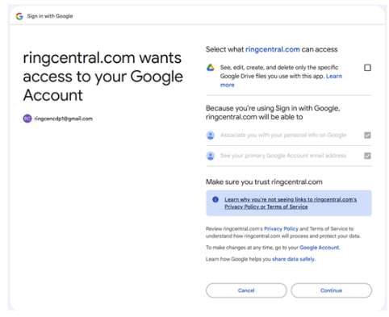

---
hide:
    - navigation
---

# :simple-googledrive: Connect Google Drive

Archive your RingCentral data directly to your Google Workspace environment.

## Overview

Google Drive integration allows you to automatically archive your RingCentral communications to your existing Google Workspace, making it easy to access and manage your archived data alongside other business documents.

---

## Connection Steps

**Step 1:** Click **Connect** next to Google Drive.

**Step 2:** Sign in to your Google account when prompted.

**Step 3:** Grant permissions by selecting:

!!! info "Required Permission"
    **See, edit, create, and delete only the specific Google Drive files you use with this app**

Then click **Continue**.

**Step 4:** Complete the authorization process.

---

## Next Steps

-   :material-sync:{ .lg .middle } **Configure Sync Options**

    ---

    Set up what data gets archived and scheduling preferences.

    [:octicons-arrow-right-24: Go to Sync Options](sync-options.md)

-   :material-file-document:{ .lg .middle } **Archive Logs**

    ---

    Monitor your archive activity and status.

    [:octicons-arrow-right-24: View Logs](archive-logs.md)

