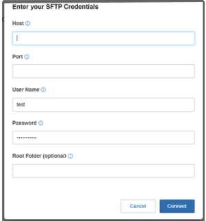

---
hide:
    - navigation
---

# :material-server-network: Connect SFTP

Securely archive your RingCentral data to your own server infrastructure using SFTP.

## Overview

RingCentral Archiver offers an automatic backup solution for securely storing and retrieving RingCentral data using an SFTP server. This option gives you full control over your data storage location and security policies.

---

## Prerequisites

!!! warning "Firewall Configuration Required"
    Before connecting to an SFTP server, ensure your firewall is configured to allow the Archiver application to communicate properly.

### Add RingCentral IPs to Allowlist

1. Check the [RingCentral Archiver section](https://support.ringcentral.com/network-requirements.html) for the IP addresses and destination ports in the network requirements document.
2. Follow the steps for your FTP server solution to add the IP addresses to your allowlist, or contact your IT admin for assistance with firewall policy updates.

---

## Connection Steps

**Step 1:** Follow the steps to [connect your RingCentral account to a cloud storage](connect-storage.md).

**Step 2:** Click **Connect** next to SFTP.

**Step 3:** Enter your connection details:

| Field | Description |
|-------|-------------|
| **Host** | Your SFTP server hostname or IP address |
| **Port** | SFTP port (default: 22) |
| **User Name** | Your SFTP username |
| **Password** | Your SFTP password |
| **Root Folder** | *(Optional)* Target directory for archives |

**Step 4:** Click **Connect** to establish the connection.

---

## Related Resources

-   :material-shield-alert:{ .lg .middle } **Security Upgrade Notice**

    ---

    Important information about SFTP Key Exchange algorithm updates.

    [:octicons-arrow-right-24: View Notice](sftp-security-upgrade.md)

-   :material-sync:{ .lg .middle } **Sync Options**

    ---

    Configure what data gets archived and how often.

    [:octicons-arrow-right-24: Configure Sync](sync-options.md)

-   :material-file-document:{ .lg .middle } **Archive Logs**

    ---

    Monitor your archive activity and troubleshoot issues.

    [:octicons-arrow-right-24: View Logs](archive-logs.md)

