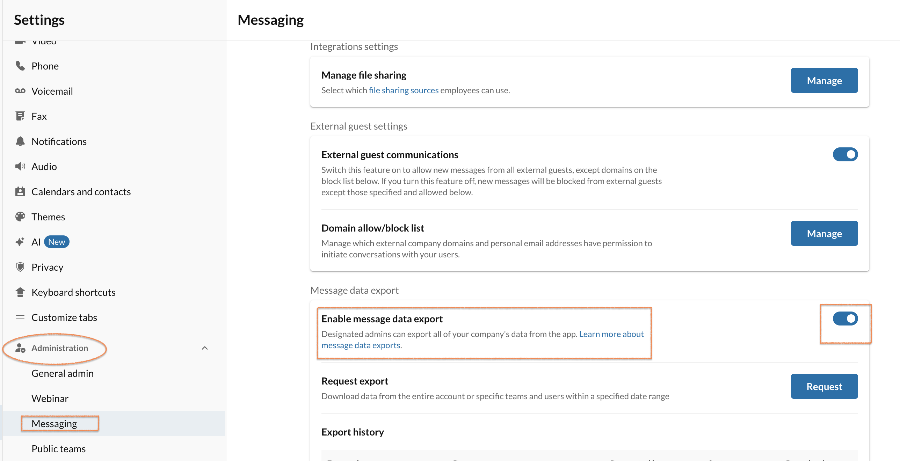
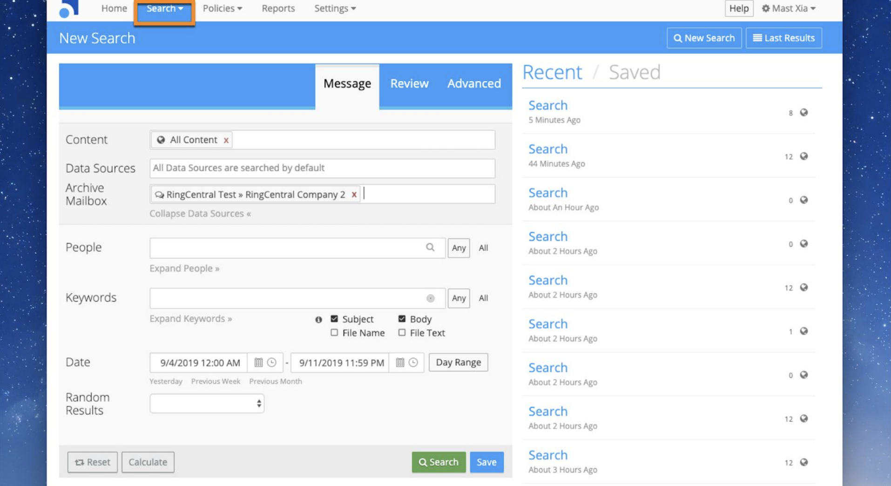
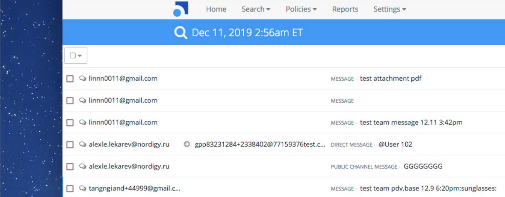
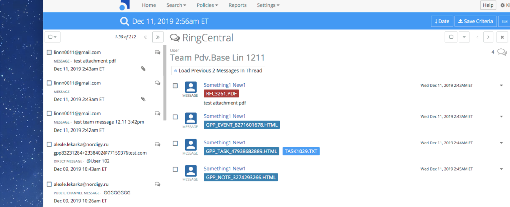

---
hide:
    - toc
---

# Connecting RingCentral with Smarsh

## Prerequisites

There are four prerequisites for setting up the RingCentral for Smarsh in your environment:

1. RingCentral Archiver access: Premium or above
2. A Smarsh account (token of 32-characters long)
3. You must be granted the RingCentral app Admin privilege for your RingCentral account
4. Enabled Compliance Exports configuration in the RingCentral app

See your IT admin to ensure prerequisites 1-3 have been set up. To comply with prerequisite 4, go to the RingCentral app -> Settings -> Administration -> Messaging, then toggle the button in Enable message data export to the ON position.

## Configuring RingCentral Archiver to connect with Smarsh

1. Go to the RingCentral Online account, and click on Tools > Archiver Beta
2. By default, there is no connection to a storage repository. Click Connect on Smarsh
3. The screen displays a pop-up window with fields to enter the Smarsh Token and Description. Click Connect to proceed.

After providing the Smarsh Token to enable the connection to Smarsh, a pop-up window will display, allowing you to select data types.

4. Click Go to Sync Options and click OK in the next pop-up window to be redirected to Sync Options

## Configuring RingCentral Archiver to select data types for archiving in Smarsh

1. Go to the Sync Options tab and select Account Settings from the drop down menu
2. Check the box beside RingCentral app Messages

If you choose Account Settings, all the extensions managed by this admin account will be archived. Currently, only the RingCentral app is supported. Additional options will be supported in future releases.

When enabled, you will see a message confirming the connection.

## Data search in Smarsh

### Initiating a new search

After logging in to Smarsh, go to the Search tab to initiate a new search

### Search result list

Your search results display will be shown as below: you can click any one thread to see the breakdown info inside. Different prefix headers are shown for different message types, such as MESSAGE and DIRECT MESSAGE.

### Search result preview or download

Some subtypes from the RingCentral app are shown as attached files within the thread, including Event, Task, Note, and Attached file. The attached file within Task attached directly to the message rather than the event itself. Click an attachment to either download it or preview it online.

