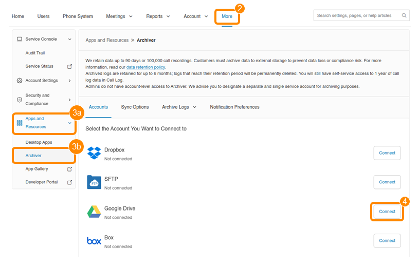

---
hide:
    - navigation
---

# Linking Cloud Storage to RingCentral Archiver

The RingCentral Archiver feature can be configured in the Admin Portal to enable archiving capabilities for administrators or all users. After enabling the feature, you can integrate cloud storage services or SFTP servers with the Archiver. Note that you can only connect one account per storage service type at a time.

Follow these steps to add a cloud storage service to Archiver:

1. Access the Admin Portal and log in
2. Select the More menu option
3. Navigate to Apps and Resources and select Archiver
4. Find your preferred cloud storage provider and click the **Connect** button to integrate it with your RingCentral account

## Storage Options

- [Dropbox](./connect-dropbox.md)
- [SFTP](./connect-sftp.md)
- [Google Drive](./connect-gdrive.md)
- [Box](./connect-box.md)
