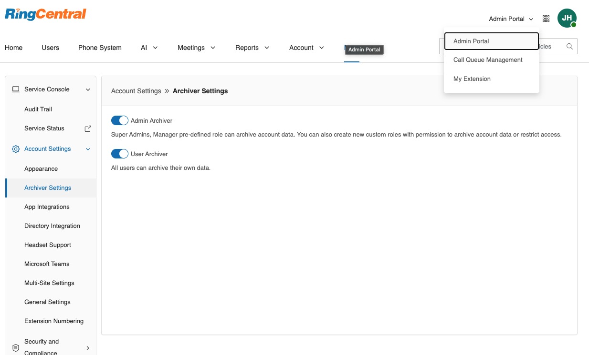

---
hide:
    - navigation
---

# Enable Archiver

Archiver access can be enabled for administrators and/or for all users.

## To enable Archiver

1. Log in to [https://service.ringcentral.com](https://service.ringcentral.com) with your Admin Portal administrator account.
2. Switch to Admin Portal from the dropdown on the top right corner.
3. Navigate to **More** -> **Account Settings** -> **Archiver Settings**.
   

4. On the Archiver Setting tab, administrators can turn on Admin Archiver and/or User Archiver as needed.

## Admin vs User Archiver

-   **Admin Archiver**: When enabled, pre-defined roles Super Admin and Manager will be able to access and archive data for the entire organization. Custom roles with proper permissions can access and archive account data as well (see [Create custom roles for Archiver as needed](admin-roles-permissions.md)).
-   **User Archiver**: When enabled, all users can access archiver and archive their own data.
