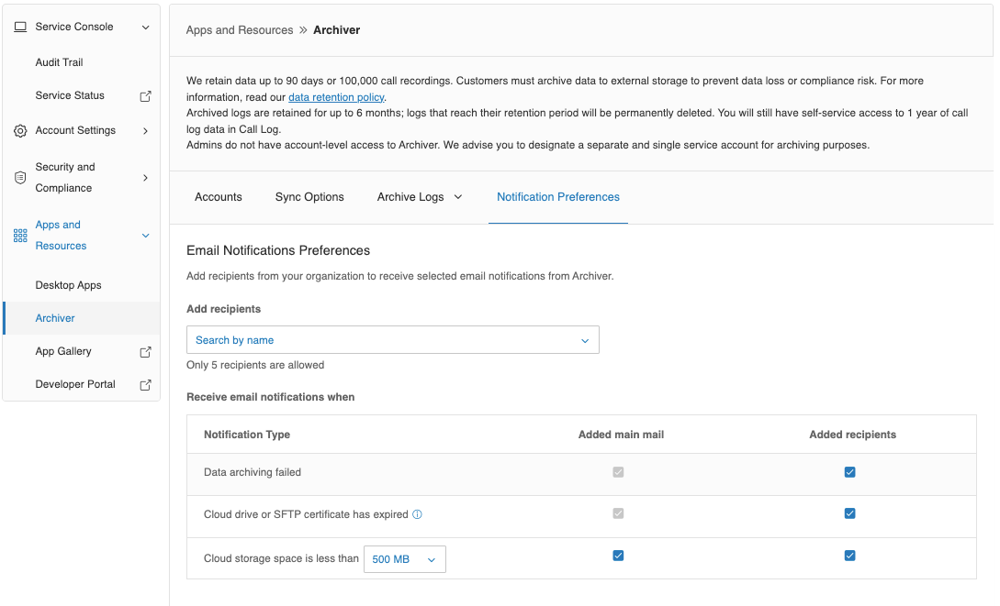

---
hide:
    - toc
---

# Setting up Email Notifications

You can set up email notifications in Archiver to alert users in your organization of issues with a connection.

1. Sign in to the [https://service.ringcentral.com](https://service.ringcentral.com).
2. Click the More tab.
3. Go to Apps and Resources, then click Archiver.
4. Click the Notification Preferences tab.
5. Add up to five recipients to be notified when:
    - Your data failed to be archived.
    - Your Cloud Drive or SFTP certification has expired.
    - Your cloud storage space is less than a selected size.
6. Click **Save**.

