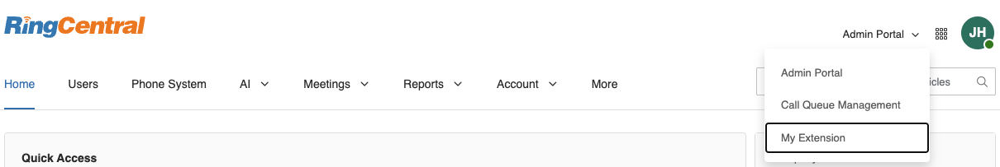
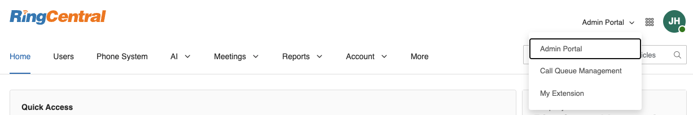
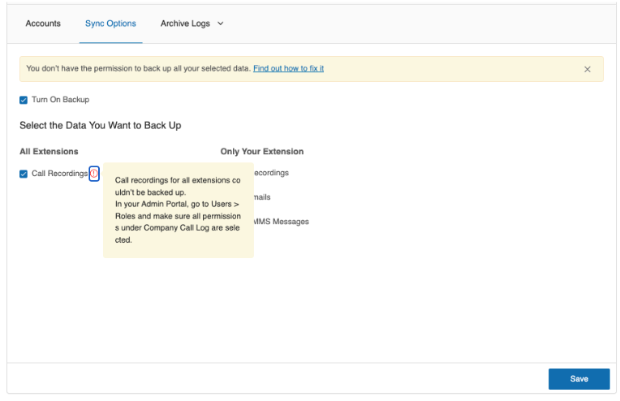
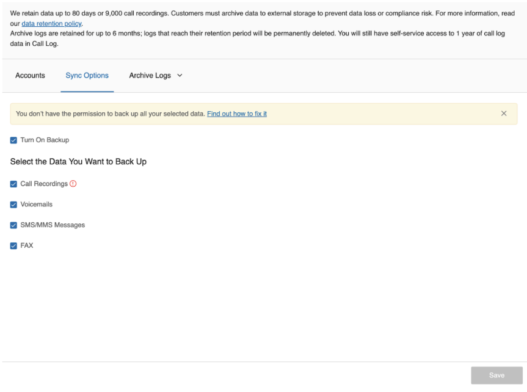

---
hide:
    - toc
---

# General Questions

## Q. How do I locate the Archiver Settings section in the Admin Portal if it's not visible?

A. If the Archiver Setting tab cannot be found in More -> Account Settings -> Archiver Settings, please ensure that:

-   Your organization's subscription plan includes the Archiver feature.
-   You are logged into the Admin Portal with administrator privileges.
-   You are viewing the Admin Portal interface rather than My Extension settings (switch between them using the dropdown menu in the top right).
-   If you still cannot access the Archiver Settings tab after confirming these points, please reach out to RingCentral Support for assistance.

## Q. After enabling User Archiver in Archiver Settings, why can't users access the Archiver?

A. In the service portal, the user should make sure that they are in the **My Extension** view, then select More -> Apps and Resources -> Archiver. Please reach out to our support if you are unable to find the Archiver app.

## Q. Why are administrators unable to access Archiver even after Admin Archiver has been enabled in the settings?

A. Administrators should check that their role has been granted all of the following permissions:

-   Features - Archiver for Admins
-   Company Call Log - Access Recordings
-   Company Call Log - Delete Records
-   Company Call Log - Download & Delivery
-   Company Call Log - View Only
-   User Management - Users

If the permissions are configured correctly, then the admin should also make sure that they are in the **Admin Portal** view in the service portal, then navigating to More -> Apps and Resources -> Archiver.

## Q. Why does an admin user see the error "Call recordings for all extensions couldn't be backed up" when trying to back up call recordings for all extensions?

A. This error occurs when the admin user lacks the required permissions to access company call recordings. To resolve this, verify that [the admin user's role has all the required permissions](./admin-roles-permissions.md). Without these permissions, the system cannot archive call recordings for all extensions, even when the option is selected.

## Q. Why do users receive a "Call recordings for your extensions couldn't be backed up" error in the Sync Options tab when Call Recordings is selected?

A. This error appears when users lack the necessary permissions to access their own call recordings. To resolve this, ensure that [the user's role has all the required permission](./user-roles-permissions.md). Without these permissions, users will be unable to archive call recordings for their extension.

## Q. What permissions are required in Storage to archive RingCentral data?

A. To archive RingCentral data to your storage, the user or admin connected to the storage must have the following permissions:

-   For Google Drive, Box, or Dropbox storage: Ensure the user has **read, write, and delete** permissions for both folders and files.
-   For SFTP storage: Ensure the user has **read, list, write, and delete** permissions for both directories and files.

## Q. Can multiple admin users connect to the same single storage or different admin users connect to different data storages?

A. If multiple admin users or standard users connect to the same data storage, the data will not be duplicated in the storage. However, this approach will put a significant load on the RingCentral server while accessing RingCentral data and verifying if it has already been archived to the storage by different users.

If different admin users connect to different data storages, it will result in data duplication. (Example: If Admin A is connected to Google Drive to archive all extensions' call recordings and Admin B is connected to Dropbox to archive all extensions' call recordings, this duplicates the data in different storages).

We recommend designating a separate and single service account for archiving purposes.

## Q. I see failed items even after my storage is connected and all permissions are granted.

A. If there has been any change in the storage scope or a password update, we recommend the following steps:

1. Disconnect your storage in Archiver.
2. Log out of your storage account.
3. Log back into your storage account.
4. Return to Archiver and reconnect your storage to ensure the latest scope and password changes are applied.

## Q. Can I retrieve call recordings, SMS, Fax, and Voicemails that are older and archive them to my storage?

A. We retain data for up to 90 days or 100,000 call recordings. Customers must archive data to external storage to prevent data loss or compliance risk. For more information, please read our [data retention policy](https://support.ringcentral.com/article-v2/RingCentral-data-retention-policies.html?brand=RingCentral&product=RingEX&language=en_US).

## Q. What is the file name format of the call recording file stored in the storage?
A. The file naming pattern is constructed from these components:
date: The date in YYYYMMDD format
timestamp: A timestamp (shown as \\w+ in the regex)
toMainNumber: The main phone number
toExtNumber: The extension number
id: The recording ID
fileExt[dataType]: The file extension (mp3 for call recordings)

## Q: Who can use RingCentral for Smarsh?
A: Admins who are able to login to RingCentral Archiver can configure the connection to Smarsh.

## Q: What data sources are supported in RingCentral for Smarsh?
A: Currently, only the RingCentral app is supported. Support for additional data sources is planned for future releases.

## Q: Can I use my RingCentral app sandbox for testing?If so, how can I configure it?
A: We suggest using your RingCentral app production environment to test. As long as you set up different Smarsh tokens or feeds, your production environment will not be affected.

## Q: Can I assign any time period of data to upload to Smarsh?
A: Currently, it takes 24 hours for data upload in Smarsh.

## Q: If I edit or delete the message in the RingCentral app, how will it be handled in Smarsh? A: In this release, updated and deleted messages aren’t handled, but enhancements are planned for future releases.

## Q: Can I upload data to the Smarsh testing environment or sandbox rather than the production environment I have now?
A: The Smarsh environment or sandbox is determined by your Smarsh token. Contact Smarsh for more details.

## Q: If I already use Archiver for Google Drive, Dropbox, Box, or SFTP, and I want to use RingCentral for Smarsh as well, what should I do?
A: We suggest creating an additional admin account for Smarsh. Although Smarsh configuration is embedded in Archiver, its current functionality interferes with connections to other cloud storage sites, which may already be set up to process daily archiving tasks.

## Q: How to purge the testing data in Smarsh after Beta testing?
A: The Smarsh environment or sandbox is determined by your Smarsh token. Contact Smarsh for more details.
