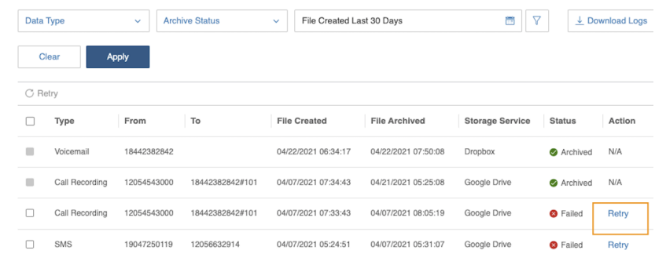
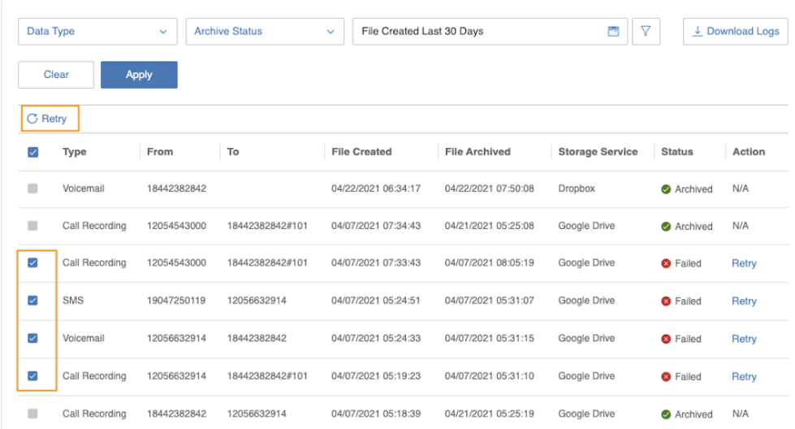

---
hide:
    - navigation
---

# Retry Mechanism

## Automatic Retry

If a backup fails due to any issue, the Archiver will automatically attempt to re-upload the failed items up to five times. Here is how the automatic retry logic works:

| Retry Attempt | Wait Time  |
| ------------- | ---------- |
| 1st retry     | 5 minutes  |
| 2nd retry     | 20 minutes |
| 3rd retry     | 1 hour     |
| 4th retry     | 3 hours    |
| 5th retry     | 24 hours   |

If the job still fails after the 5th retry, an email notification will be sent, and the **manual retry option will be enabled**. Users can then perform a bulk manual retry for up to 3 additional attempts.

## Manual Retry

Users can either:

-   Click the Retry button next to each log entry

    

-   Select multiple failed records and click the Retry button in the top-left corner to perform a bulk retry

    
