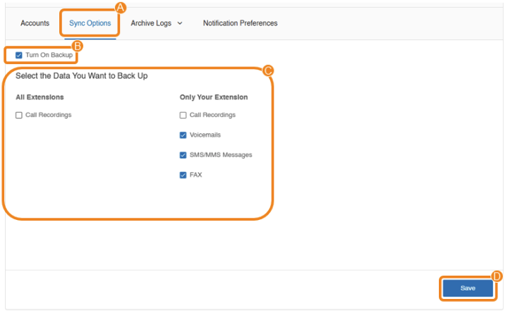
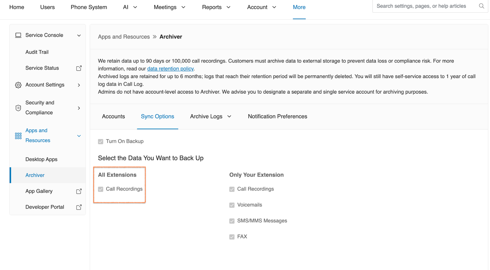
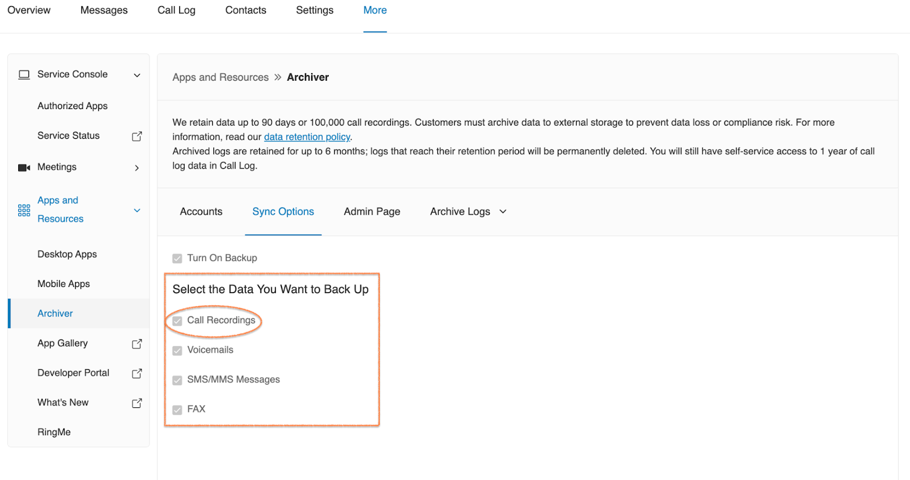

---
hide:
    - navigation
---

# Syncing RingCentral data backup to cloud storage

Once you connect your RingCentral account to a cloud storage account, you'll be redirected to **Sync Options (A)**, where the **Turn On Backup (B)** box is checked by default. You can uncheck the box if you want to disable cloud backup.
Select the data you want to back up (C), then click **Save (D)**. Archiver will automatically back up new data based on your selections. The backup data will appear in the RingCentral folder of your cloud storage account within 24 hours.

## Admin Sync Options View

As an admin user, you have the ability to archive all call recordings across all extensions within your organization. To do so, make sure the 'Call Recordings' option is enabled under 'All Extensions'. (See the figure below for reference.)

## User Sync Options View

In addition to archiving voicemails, SMS/MMS messages, and faxes, users can also archive their own call recordings to their connected storage. This is separate from the admin, who is already responsible for archiving call recordings for the entire organization.

**Note**: Archiver won't back up the data generated before it was connected to the account.
Once the setup is complete, the RingCentral Archiver creates the following folder structure in the connected account or server:

