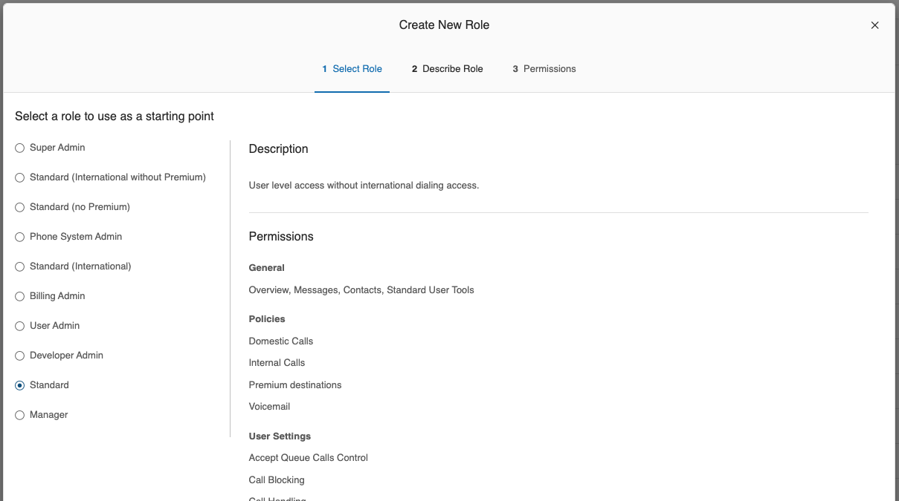
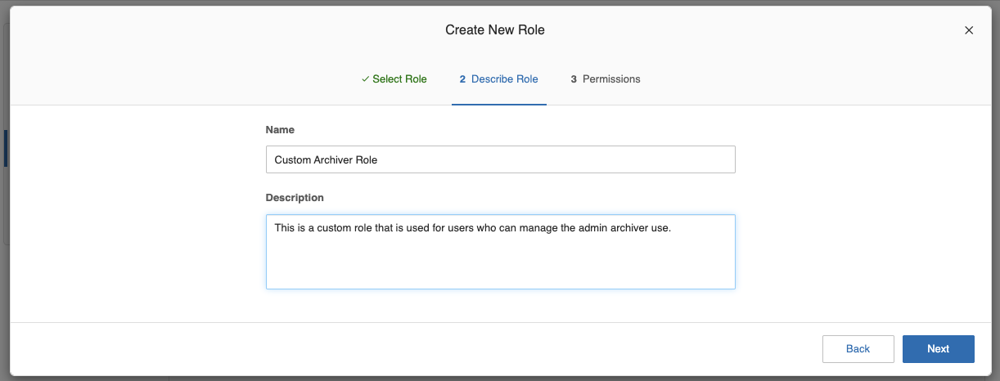
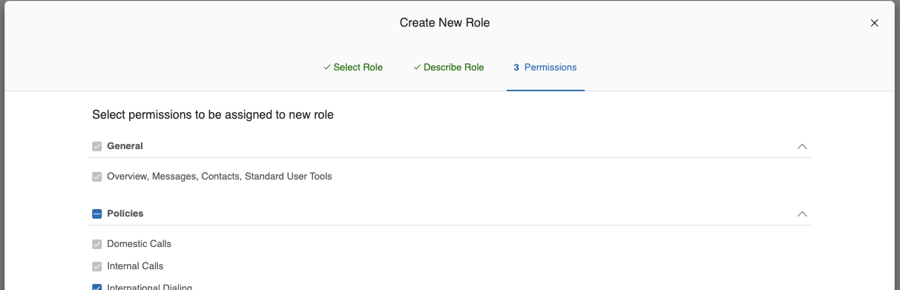
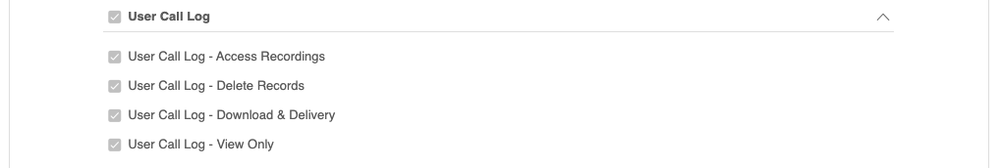
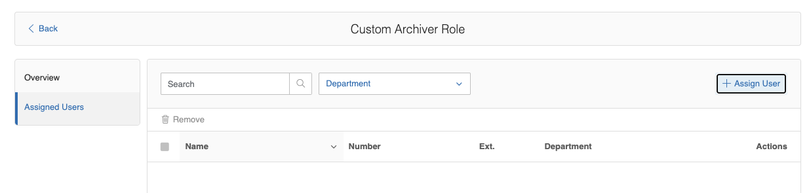

---
hide:
    - navigation
---

# User Roles and Permissions

Users who archive call recordings at extension level need to be assigned to a role with sufficient permissions by the admin portal administrator. Otherwise, extension users cannot archive his or her call recordings.

## To Create Custom User Archiver Role

1. Log in to [https://service.ringcentral.com](https://service.ringcentral.com) with Admin portal administrator account.
2. Switch to Admin Portal from the dropdown on the top right corner.
3. Navigate to **Users** -> **Roles**.
   
4. Click on **+ New Role** to create custom roles.
5. Pick an existing role as the starting point for the new role.
   
6. Give the new role a name and description.
   
7. In the **Permissions** tab, as shown below:
   
8. Make sure the following permissions are ticked:

    | Permissions                                                                                                                 | Screenshot                                        |
    | --------------------------------------------------------------------------------------------------------------------------- | ------------------------------------------------- |
    | User Call Log <ul><li>Access Recordings</li><li>Delete Records</li><li>Download & Delivery</li><li>View Only</li></ul> |  |

9. Click on **Save** to save the new role.
10. After that, you can assign the new role to user(s) as needed by clicking on the **Assigned Users** button. Or you can navigate to **Users** -> **Roles**, and click on your custom role, then navigate to the **Assigned Users** tab and click on **+ Assign User** to assign the custom role to user(s) as needed.
    
