---
hide:
    - toc
---

<style>
img {
    display: block;
    margin-left: auto;
    margin-right: auto;
}
</style>

# Installation and Configuration

## Quick Navigation

- **[Install the app from AppSource](#install-the-app-from-appsource)** - Install CIF and RingCentral for Dynamics 365
- **[Enable Click to Dial feature](#enable-click-to-dial-with-ringcentral)** - Configure Click to Dial functionality
- **[Uninstall the app](#uninstall-the-app)** - Remove RingCentral for Dynamics 365

## Install the app from AppSource

### 1.1 Install CIF

1. Open AppSource
2. Search "Dynamics 365 Channel Integration Framework"
3. Click "Get it now"

 AppSource Search | Get More Apps |
|------------------|---------------|
| 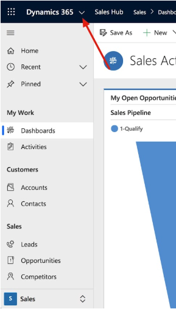 | 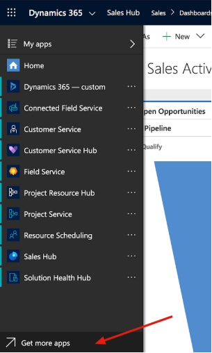

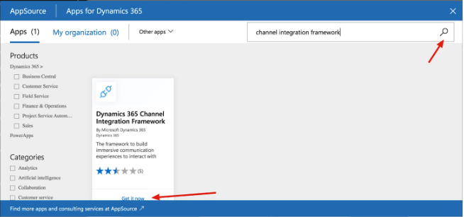

4. Click "Continue" if you want to install CIF
5. Choose the Organization where CIF is to be installed
6. Review the terms details from Microsoft
7. Click "Agree" to continue

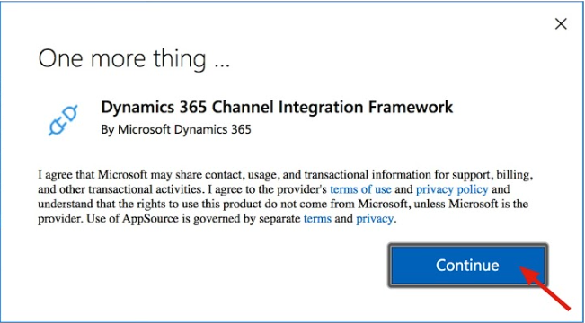

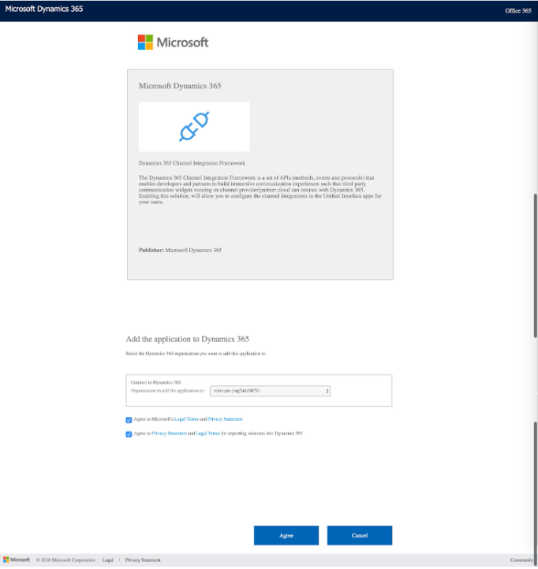

8. CIF will start installing. The STATUS will be updated once complete.
   **Please note:** The time required for installation depends on Microsoft server and also your network.
9. Once the STATUS is "Installed", the CIF installation is done.
10. Now you can start installing RingCentral for Dynamics.

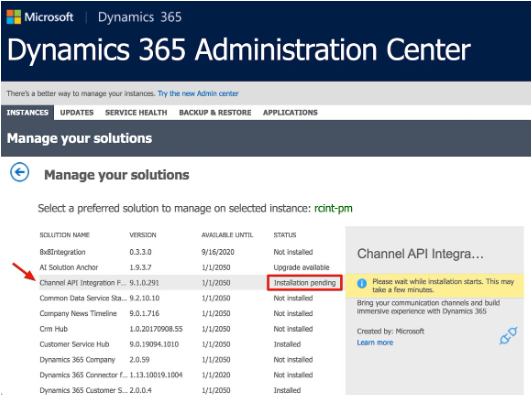

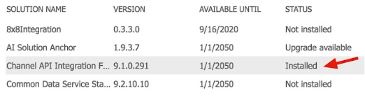

### 1.2 Install RingCentral for Dynamics 365

1. Access RingCentral for Dynamics 365 in [AppSource](https://appsource.microsoft.com/en/product/dynamics-365/ringcentral.ringcentral_for_dynamics_crm?tab=Overview). Click the Get it Now button.
2. Select the target organization and click install.
3. The Dynamics 365 apps list page will popup and the installation status will be shown. (need to refresh to load the latest status).

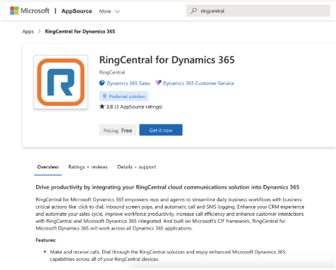

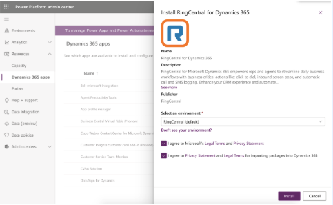

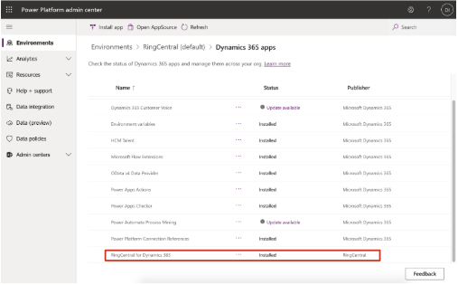

### 1.3 Enable RingCentral for Dynamics

1. Go to Channel Integration Framework
2. Add an active channel provider, click the "New" button to create a new CIF provider.
3. A new table will be opened. Once this form was finished, the CIF configuration was done.

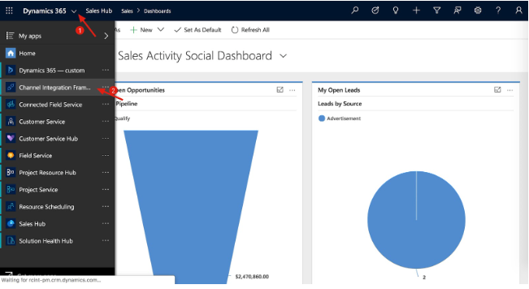

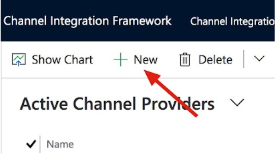

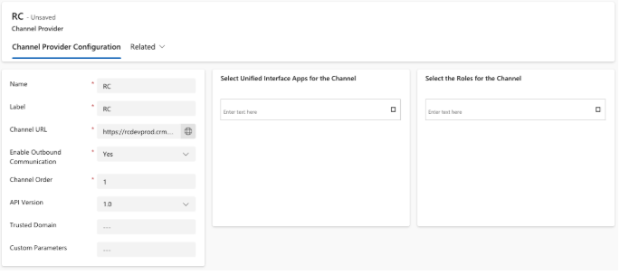

**Tips to fill in the form:**

- **Name:** RingCentral
- **Label:** RingCentral for Dynamics
- **Enable Outbound Communication:** Yes
- **Channel Order:** 0
- **Select Unified Interface Apps for Channel:** Select the Apps that you wish to enable for RingCentral for Dynamics
- **Select the Roles for Channel:** Select the user roles that you wish to allow to use for RingCentral for Dynamics. Please ensure Channel Access is included, and users have the correct role assigned in the channel.
- **Channel URL:** The Channel URL points to the App provided by RingCentral solution (the app you installed in 1.2).

The format of the URL is:
```
https://XXXX.YYYY.dynamics.com/WebResources/RingCentral_/adapter.html#
```

XXXX.YYYY is the org code of your Dynamics site. Check the current address of your browser.

For example, if your browser address is:
```
https://rcint-pm.crm.dynamics.com/...
```

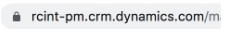

So the XXXX.YYYY in this case, equals rcint-pm.crm. So the site is:
```
https://rcint-pm.crm.dynamics.com/WebResources/RingCentral_/adapter.html#
```

Put the full link in the field, and click the Save button on the right bottom corner.

**Please add # in the end of the URL to be compatible with a higher CIF version**

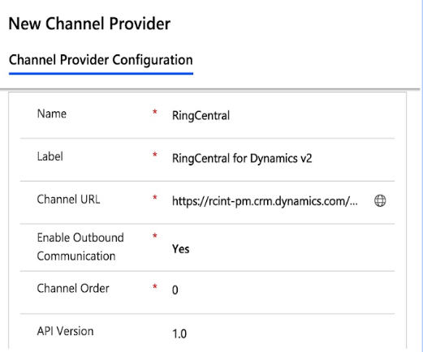

4. **Activate the App:** Select RingCentral and click "Activate".
   - If the CIF does not show up in Apps, re-activate to make it appear.

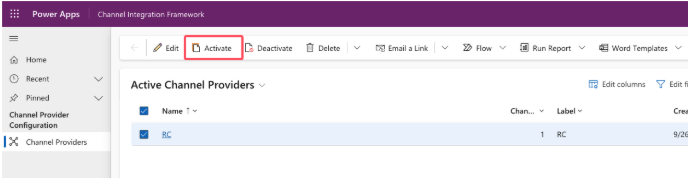

### Run CIF in United Interface apps

To run CIF, open any United Interface Apps that you selected to see the CIF framework with RingCentral for Dynamics.

**Notices:** CIF is also a new product in Microsoft, it could have bugs. We have seen several times that the CIF didn't show up in a selected app. If you run into a similar case, please let us know. More voices could help drive Microsoft to improve their product as well.

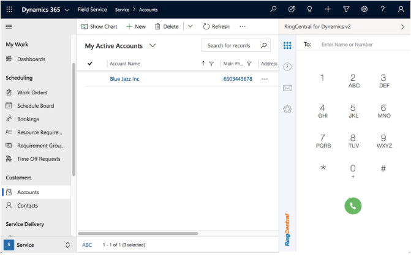

## Enable Click to Dial with RingCentral

Click to Dial from Phone fields in targeted pages is now available by CIF.

With this feature on, you can click the "Call" icon next to a phone field, and make a call by RingCentral.

**Note:** it must be a phone field. and it must be configured in advance.

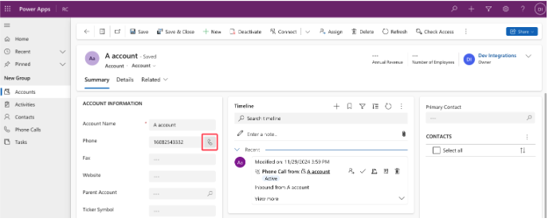

### 2.1 Config Click to Dial

1. Click the "Setting" gear icon, select "Advanced Settings" from the list.

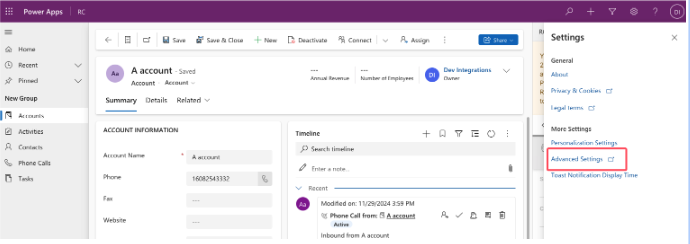

2. Click the menu "Customizations" and then click "Customize the System".

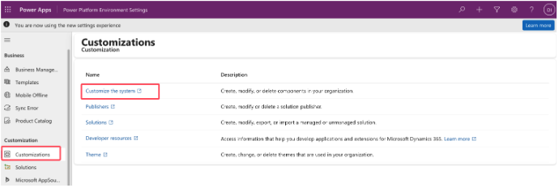

3. On the tree menu:
   - Expand "Entities"
   - Select the entity you want to configure and expand it (in this case, we choose Account entity)
   - Select "Forms"
   - In the Forms view, you can see the forms that belong to this entity. This customizes the main page of Account.

**Note:** A form can be considered a page in Dynamics. Let's take Account for example. You might have many ways to view the account data: the account page, the account card, etc. In this page Dynamics lists all the views.

If you want to enable Click to Dial in multiple pages of this entity, you will need to customize them all.

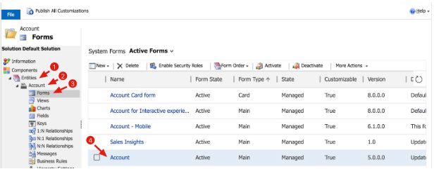

### 2.2 Customize a field in a page

1. Double click the field (must be a phone field), and a pop up page will appear.

2. In the pop up page, click the "Controls" tab, and click "Add Control", select "Channel Communication Control".

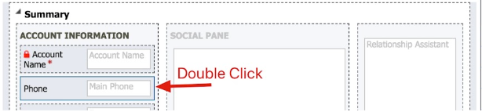

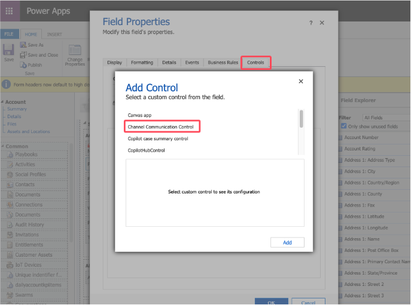

3. Switch the radio button for Web, Phone, and Tablet for Channel Communication Control.

4. Save and Close the page.

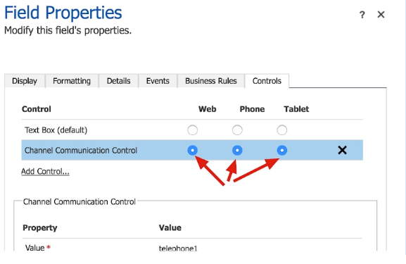

5. Return to the main page, click "Save" and then "Publish."

6. Go to the Account page, you will find the call button changed, now you have Click to Dial enabled.

You can configure all the required fields in all entities to enable Click to Dial, but remember, it must be a Phone field.

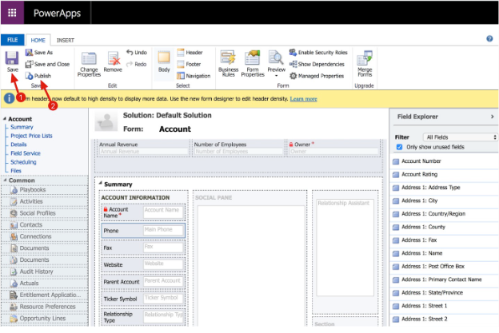

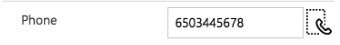

## Uninstall the app

### 3.1 Uninstall

1. Go to Solutions
2. Find the solution you want to delete, and select.
3. Click the Delete button on top.
4. Click Confirm on the popup page.

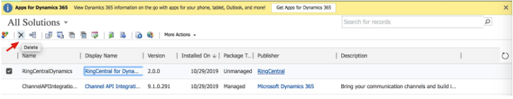

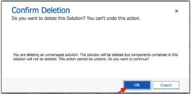

### 3.2 Remove Record in CIF

1. Select record
2. Delete
3. Confirm delete and complete

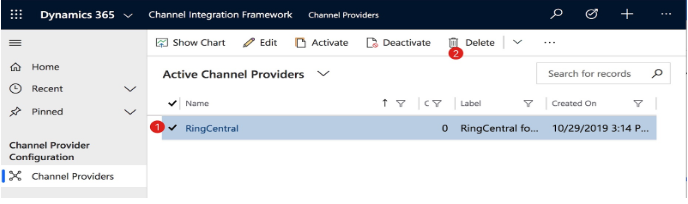

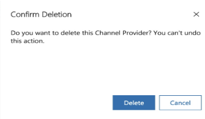