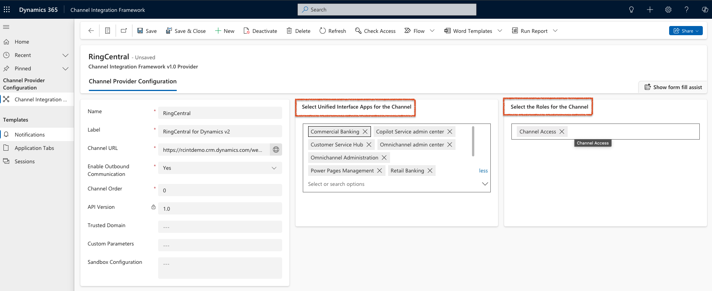

---
hide:
    - toc
---

# General Questions

##Q: I don't see any new tab or window opening on incoming calls.

A: When a call comes in, it rings on your softphone (or any other client with the same account). Simultaneously, the call log section in RC for Dynamics with matched entities will expand from the sidebar.

##Q: Why am I seeing the message "Your email login {email address} does not match the authenticated MS Dynamics 365 account. Please use the same email address you used for your RingCentral account so that you can have access to all these features"?

A: This message appears when:

- Your Dynamics administrator has connected your Dynamics 365 environment to RingCentral's Auto Call Logging (AAL) service
- The email address associated with your RingCentral account does not match the email address of any user in your Dynamics 365 environment

**Why this happens:**

The integration requires the email address used for your RingCentral account to match the email address of a Dynamics 365 user to authenticate and enable features like automatic call logging, contact matching, and other integration capabilities. When these email addresses don't match, the system cannot authenticate you as a valid Dynamics user, which limits access to integration features.

**How to resolve this:**

1. Verify the email address in your RingCentral account (Admin Portal → Users → your user → Email)
2. Verify the email address in Dynamics 365 (Settings → Security → Users → your user → Email)
3. Ensure both email addresses match exactly (case-sensitive)
4. If your organization uses UPN (User Principal Name) for authentication, ensure the email address in your Identity Provider (IDP) profile matches the email address in your RingCentral user details (contact email). The system uses the email from your IDP profile for authentication, so it must match the email in your RingCentral account

5. If they differ:
    - Update your RingCentral account email to match your Dynamics 365 email (or your IDP profile email if using UPN), OR
    - Update your Dynamics 365 user email (or IDP profile email if using UPN) to match your RingCentral account email

6. After updating, sign out and sign back in to the RingCentral for Dynamics integration

**Note:** If you cannot change either email address, contact your Dynamics administrator to verify the AAL connection and user mapping, or contact RingCentral Support for assistance.

**Additional information:**

- This check occurs when your Dynamics administrator has authorized the environment on AAL (adminAuth: true) but your email doesn't match a Dynamics user (isAuthenticated: false)
- The email address shown in the message is the one associated with your RingCentral account
- Once the emails match, you'll have access to all integration features including automatic call logging, contact matching, and call activity synchronization

##Q: I can see some phone numbers in Dynamics, but the click-to-call icon is not displayed.

A: By default, the phone icon is present on Business Phone and Mobile Phone fields as they are of phone type. To see a phone icon beside other phone numbers for click-to-dial functionality, those fields must be configured as "Phone" fields. This configuration needs to be done separately by your administrator following the admin guide (https://assets.ringcentral.com/us/guide/admin-guide/dynamics_beta_admin.pdf) on page 15, Step 4: Enable Click to Dial with RingCentral Description.

##Q. Why isn't the RingCentral panel showing up for users?

A. After an admin completes the installation for RingCentral for Dynamics integration and CIF from the Power Platform (https://admin.powerplatform.microsoft.com/), there could be two reasons why:

Reason 1:

-   Ensure that the app where the user is trying to access the RingCentral integration is added as part of 'Select Unified Interface Apps for Channel' in the Channel Integration Framework (CIF) setup.
-   Ensure the user role of those not seeing the integration is added to the 'Select the Roles for Channel'.

Reason 2:

-   Ensure that 'Channel Access' is included in the 'Select the Roles for Channel'.

All of this information is included in the RingCentral for Dynamics 365 admin guide (https://assets.ringcentral.com/us/guide/admin-guide/dynamics_beta_admin.pdf) on page 11, Step 3: Enable RingCentral for Dynamics.

##Q. Why do missed calls get logged to Dynamics 365, even after deselecting the options for "Missed calls with voicemail" and "Missed calls without voicemail" in the integration console?

A. Integration Console settings are specific to server-side call logging. This means when a user receives a missed call with or without voicemail on any RingCentral platform apart from the RingCentral for Dynamics integration inside Microsoft Dynamics 365, these calls do not get logged to the contact/account/leads/opportunities.

All other settings configured in the integration console (integrations.ringcentral.com) are only applicable for server-side calls (outside the RingCentral for Dynamics 365). Any call operations performed inside the RingCentral for Dynamics 365 integration within Microsoft Dynamics 365 are called client-side operations.

##Q. Why do I see a blank screen on the RingCentral for Dynamics 365 integration panel?

A. This issue occurs for users who have recently updated their RingCentral for Dynamics integration to version 2.3.2 or above. To resolve this issue, we recommend users follow these steps:

-   Have a Dynamics admin user complete the setup in the Integration Console (integrations.ringcentral.com).
-   Clear the browser cache and cookies or restart the browser.
-   To restart the browser, users must QUIT the browser, not just close it. Closing the browser will not hard reset or clear the cache.

If the issue persists after trying these steps, we recommend the following:

-   Open developer tools
-   Switch to the network tab
-   Check the 'Disable cache' checkbox
-   Reload the Dynamics application and test it again

If the issue persists after completing the correct setup, please follow these steps:

-   Collect HAR and console logs from the 'Customer Service Hub'/application screen where the CFI is installed. Right-click anywhere on the screen, inspect the element, and reload the page. Ask the customer to open the RingCentral for Dynamics panel in the top right corner.
