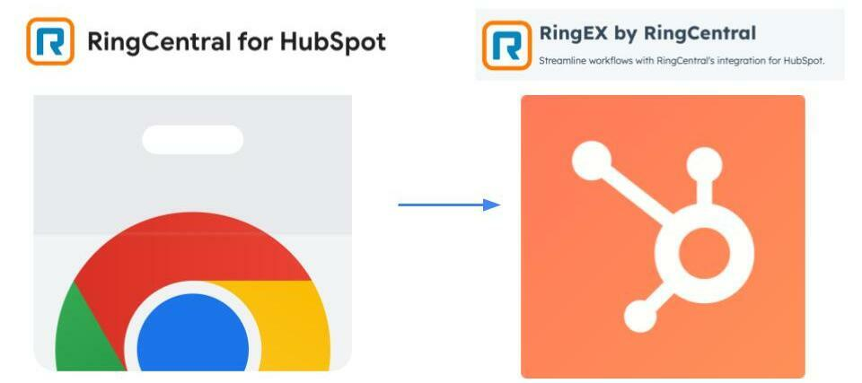
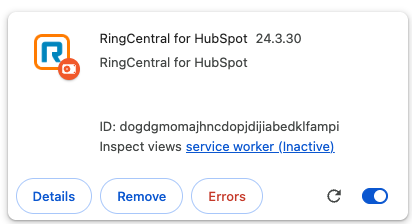
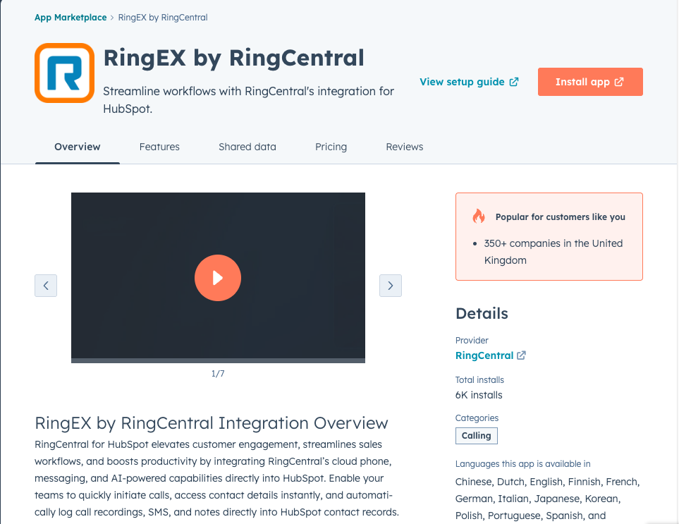
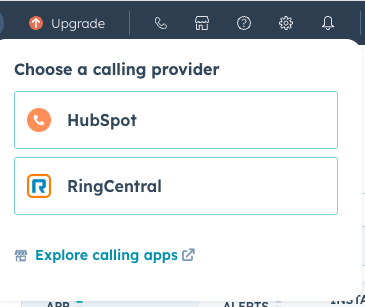

---
hide:
    - toc
---

# Migraton from Chrome to Native 

## Why Migrate to the New RingCentral for HubSpot Integration?

{style="max-width: 450px"}

The new **RingCentral for HubSpot** integration offers a fully native experience, allowing you to make calls, log activities, and manage communications directly within HubSpot—without relying on a browser extension. Key benefits include:

**Seamless Integration** – Stay within HubSpot’s ecosystem without switching tabs.

**Automatic Call Logging** – No more manual data entry—calls are logged instantly.

**Better Performance & Stability** – Avoid browser limitations and extension compatibility issues.

**Company-Wide Deployment** – Once installed by an admin, it’s available to all users.

---

{style="max-width: 450px"}

## Step 1: Uninstall the RingCentral for HubSpot Chrome Extension

1.  Open **Google Chrome**.
2.  Click on the **three-dot menu** (`⋮`) in the top-right corner.
3.  Navigate to **Extensions** > **Manage Extensions**.
4.  Locate the **RingCentral Chrome Extension**.
5.  Click **Remove** and confirm deletion.

**Tip:** Restart Chrome to ensure the extension is fully removed.

---

{style="max-width: 450px"}

## Step 2: Install the RingCentral for HubSpot Integration

**For Admins: Installing for All Users**

1.  Go to the HubSpot App Marketplace:
    * In HubSpot, click the settings gear ⚙️ in the top-right corner.
    * Navigate to **Marketplace** > **App Marketplace**.
    * Search for **RingCentral** and select the integration.
2.  Click **Connect App** and sign in with your **RingCentral credentials**.
3.  Grant necessary permissions and authorize the integration.

The integration will now be installed **for all users** in your HubSpot account.

📌 **Important:** End users do not need to install anything—they just need to select RingCentral as their calling provider.

---

{style="max-width: 450px"}

## Step 3: End User Setup – Selecting RingCentral as the Calling Provider

1.  Click on the phone icon in the toolbar.
2.  Choose **Calling Provider** > **Select RingCentral**.
3.  Sign in with your **RingCentral account** if prompted.
4.  Start making calls directly from HubSpot!

**Tip:** Make a test call to ensure everything is working correctly.

 