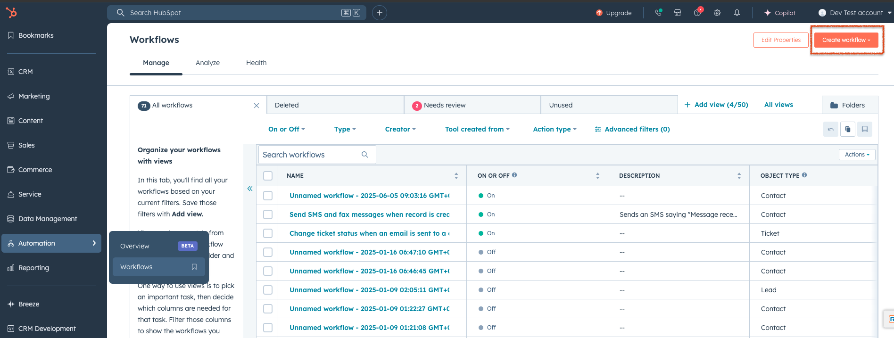
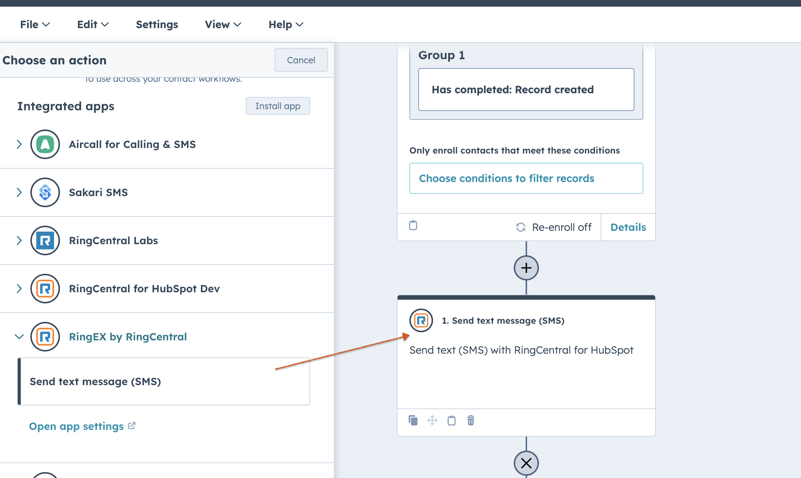
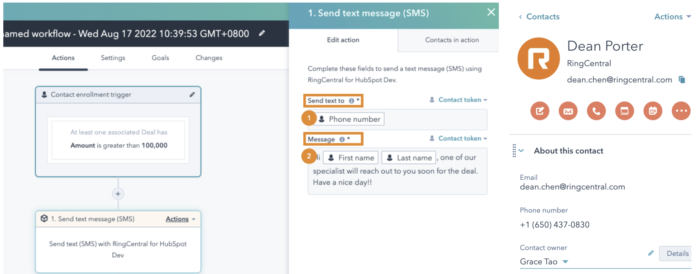
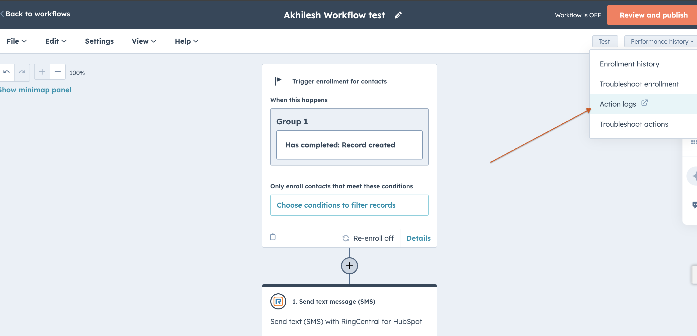
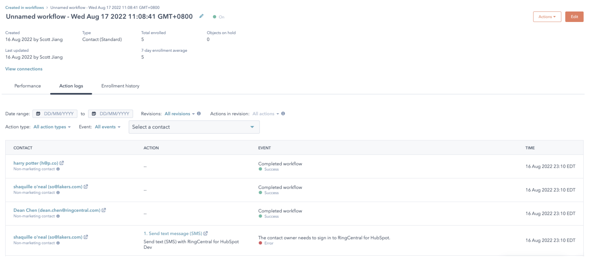
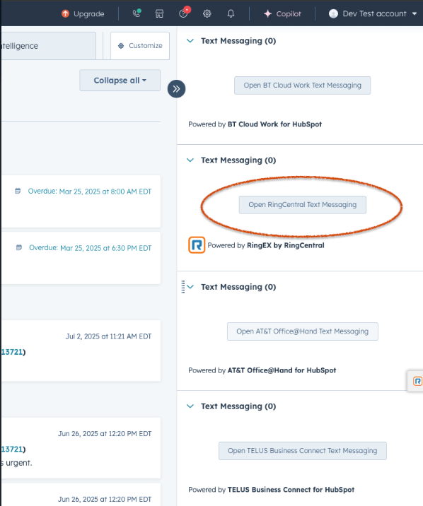

---
hide:
    - toc
---

# General Questions

## Q. I keep seeing 'Webphone Unavailable' error message?

A. Users may encounter a "Webphone Unavailable" error message when attempting to call from RingCentral for HubSpot. This error typically occurs due to insufficient microphone permissions in the browser. To identify and resolve the issue, consider the following rules:

Solution 1: Enable Microphone Permissions

When users see the "Webphone Unavailable" error message, instruct them to click on it. This action will open the browser site settings. Ensure that the toggle for Microphone is turned on. Once enabled, the error message should disappear, allowing users to use RingCentral for HubSpot for making calls.

Solution 2: Check Browser Privacy Settings

If users still encounter the "Webphone Unavailable" error message after allowing microphone permissions, recommend checking the browser privacy settings. For Google Chrome:

1. Go to Browser Settings
2. Select Privacy and security
3. Select Microphone
4. Verify the following: - The correct microphone is selected (e.g., MacBook Pro Microphone (Built-in)(System default)) - Under default behavior, "Sites can ask to use your microphone" radio button is selected - The HubSpot site is not listed under "Not allowed to use your microphone" - The HubSpot site is present under "Allowed to use your microphone"

## Q. The contact page does not open in HubSpot when there is an inbound call in RingCentral for HubSpot?

A. Contact Page Not Opening for Inbound Calls

The screen pop feature in HubSpot opens a contact screen or the contact search page for multiple matches when a user receives an inbound call. If it does not work as expected, there are several reasons to check if the customer has configured the settings correctly.

Check if the user has enabled the toggle for 'Show matches for inbound calls'. If the user has not enabled this toggle in the RingCentral for HubSpot integration, the screen pop feature will not work.

Even if the 'Show matches for inbound calls' toggle is enabled and users don't see the feature working, we need to determine if they are checking this feature after the inbound phone call is answered or while it is ringing. This feature only works when the inbound phone call is answered, not when the integration starts ringing with the matched contact.

If the user has already enabled 'Show matches for inbound calls', is answering inbound calls, and the feature still does not work, we need to check if there are any browser pop-up blockers in place. Go to Settings -> Privacy and security -> Site settings -> Pop-ups and redirects -> Ensure that the radio button is selected for 'Sites can send pop-ups and use redirects'.

## Q. Why isn't my SMS being logged automatically?

A: Once you enable the Auto-Log Texts toggle in Settings, all new incoming and outgoing texts will be logged automatically by the app. SMS messages are typically logged within 10 minutes, and the app will retry any failed attempts.

If you don't see your SMS in HubSpot, it could be due to one of the following:

The RingCentral for HubSpot app may not be showing the most up-to-date logging status.

You might be viewing the wrong HubSpot contact, company, or deal.

To resolve this:

1. Sign out and sign back in to the RingCentral for HubSpot app to refresh the sync.

2. Click the "View Log Details" icon to open the exact record where the SMS has been logged in HubSpot.

## Q. Why is a contact getting created in HubSpot for unknown phone numbers?

A. When the "Auto log calls" toggle is enabled in RingCentral for HubSpot settings, the app creates a new contact for inbound calls with no matching record. The new contact is named "Caller + phone number in e164 format," and the call is logged under this new contact. The same process applies to SMS messages. If there's no matched record, the app creates a new contact named "SMS + phone number in e164 format" and logs the SMS to this new record.

## Q Why is there no available hub to log in?

A. If you're unable to log in, reach out to your HubSpot administrator to connect the HubSpot account you would like to use with RingCentral.
If this has already been done, please ensure:

-   You have access to the Hub in HubSpot
-   You use the same email to sign in to both HubSpot and RingCentral for HubSpot
    If you are still unable to log in after verifying these points, please contact RingCentral Support for assistance.

## Q. I have enabled/updated call outcome/call type in HubSpot, but why are the changes not synced back to RingCentral for HubSpot?

A. To sync the changes, log out of the app and then log back in.

## Q. Why do I see the error message "Cannot match contact. Try clicking the Create log icon in your call history." when I make or pick up a call?

A. This error message appears when your company reaches the rate limit imposed by HubSpot at that specific moment. As a result, the call information is displayed as "Unknown" because the contact matching process fails due to the rate limitation. However, potential matches may still exist despite the "Unknown" status. To resolve this, you can return to your call history and click the "Create call log" icon for the specific call. This action will trigger the contact matching process again, attempting to find and associate the correct contact information.

I have checked with Jack and have the same insights. This would be considered a product feature request, and there is currently no estimated time of arrival (ETA) for its implementation and delivery. I will proceed to create an improvement ticket. You can also refer the customer to my previous comment and suggest they submit a feature request through ideas.ringcentral.com.

Please let me know if you have any additional concerns.

## Q. Why is the call not matched, but the contact exists in my HubSpot?

A. First, ensure you have signed into the hub where your contacts exist in RingCentral for HubSpot.
Second, RingCentral for HubSpot follows the contact match logic for both national and international calls. If you make or receive national calls, the company/contact records with phone number or mobile phone number in any format will be matched. For example, if a phone number +16508888888 calls you and there are 4 contacts with the phone number saved as +16508888888, 1 (650)-888-8888, 650_888_8888, 6508888888 in your HubSpot, all of these will be matched.

## Q. Why is there no call recording link for playback in HubSpot contact activity?

A. If there is no call recording link present inside the HubSpot contact/company activity for the logged call, it is most likely that the integration was closed immediately after the call ended. We recommend users not to hit the close button for the integration after the call is ended, as this will terminate the integration instance and prevent the update API calls from occurring to update the call log with several parameters such as Call Duration, Call Recording Link, and Call Ended Time. If the user did not close the integration and still does not see the call recording playback link, please check the RingCentral admin portal to see if that call was recorded. If it is present there, please report the issue to RingCentral support.

## Q. Can I make calls directly from HubSpot?

A. Yes. You can use the RingCentral dialer inside HubSpot to call contacts. Calls are logged automatically with details like duration, timestamp, and optional notes.

## Q. Will inbound calls be logged in HubSpot?

A. Yes. Both answered and missed incoming calls are logged, helping you track all interactions. If you take a call outside HubSpot, it's still logged through Activity sync if it's set up.

## Q. What happens if I take a call outside of HubSpot?

A. Calls made or received on your deskphone and RingCentral mobile or desktop apps are still logged in HubSpot through Activity Sync. You may need to manually add notes and update call details.

## Q. Does RingCentral for HubSpot support call recordings?

A. Yes. If call recording is turned on in your RingCentral account, a playback link will appear in HubSpot. Recordings are stored in RingCentral's system.

## Q. Can I use RingCentral for HubSpot on mobile?

A. You can make and receive calls using the RingCentral mobile app. However, full integration features like in-app calling and automatic logging work best on the HubSpot desktop or web app. You need to use the HubSpot app to manually disposition and log calls. HubSpot doesn't currently support third-party calling from RingCentral in their mobile app.

## Q. Is RingCentral for HubSpot free?

A. The integration is free for RingCentral Advanced and Ultra users.

## Q. What HubSpot objects does RingCentral integrate with?

A. RingCentral for HubSpot primarily integrates with:

-   Contacts: Call logs link to HubSpot contacts to help track interactions.
-   Companies: Calls can be linked to company records for easier team collaboration.
-   Deals: Calls can be logged under active deals to track communications during the sales process.
-   Tickets: Support teams can log calls under tickets to keep a record of customer interactions.

## Q. Does RingCentral work with HubSpot automations?

A. Yes. RingCentral integrates with HubSpot workflows and automation tools. You can:

-   Trigger workflows based on call events, like creating a follow-up task when a call is logged.
-   Send notifications when a call is completed or missed.
-   Create follow-up reminders to help boost customer engagement.

## Q. Who should I contact for support?

A.

-   For RingCentral technical issues, contact Support.
-   For HubSpot CRM questions, contact HubSpot Support.
-   End users should visit the RingCentral support site or reach out to their system admin for integration-related questions.

##Q. How to set up workflow in HubSpot?
A. RingCentral for HubSpot provides a contact-based workflow action called "Send text message (SMS)," enabling a workflow to send text messages to enrolled contacts via the RingCentral for HubSpot app. These messages can be logged manually or automatically based on your app settings.

You can find Workflows in your HubSpot Automation > Workflows (see figure below). For more details on how to set up a workflow, read "Create workflows" (https://knowledge.hubspot.com/workflows/create-workflows).

"Send text message (SMS)" is a custom contact-based workflow action. You can find it in the HubSpot workflow action section (see figure).

When you add this action to your workflow, you can configure:

-   Send text to: Define the phone number to send a message to (Figure, step 1). Usually choose the contact records' phone number field and/or mobile phone number field.
-   Message: Define the SMS content (Figure, step 2).

Using the example in the figure, the workflow will enroll a contact record with a deal amount over 100,000 and send an SMS to the enrolled contact automatically. For instance, if a contact named Dean Porter has a deal with an amount of 150,000 and the contact owner for Dean is Grace Tao, Dean will receive a message sent from Grace Porter's RingCentral number to his phone number with the content: "Hi Dean Porter, one of our specialists will reach out to you soon for the deal. Have a nice day!" The workflow uses Grace's RingCentral account to send the SMS as if Grace does it herself. Please ensure the contact owner (Grace Tao in this case) has a valid RingCentral account and is able to sign in to RingCentral for HubSpot.

Workflow results and errors will be tracked in HubSpot workflow action logs (see figure). Read "Understand your workflow details page" for more information.

##Q. Does RingCentral for HubSpot workflow support calls?
A. No, currently RingCentral for HubSpot Workflow automation only supports the SMS feature. All other RingCentral features, including those related to calls, faxes, and contacts, are not supported.

##Q. SMS are not sent through Workflow automation.

A. There could be several reasons why the workflow automation does not execute and send SMS from the RingCentral for HubSpot integration. To identify if the RingCentral integration has failed to execute the "Send text message" action, navigate to the action log of the workflow and check the Action section. Look for "Send text message (SMS)" with a failure event. The events can include the following error messages:

1. General Error Messages:

    - "Something went wrong when sending the message."
    - "Connection failed. Please try again later."
    - "Cannot connect due to internal errors. Please try again later."
    - "Cannot connect due to network issues. Please try again later."

2. Permission-Related Errors:

    - "You don't have permission to send messages."
    - "You don't have permission to send messages to recipients outside of your organization."
    - "In order to call this API endpoint, user needs to have [InternalSMS] permission for requested resource."

3. Phone Number Validation Errors:

    - "Please enter a valid phone number."
    - "Phone Number Validation Error."
    - "Please enter a valid receiver number."
    - "A valid phone number is required to send text messages to recipients outside of your company. Please contact your administrator to add a direct number to your account."

4. Extension-Related Errors:

    - "The extension number does not exist."
    - "Sending SMS from/to extension numbers is not available"
    - "Cannot send to an extension number with main phone number. If you want to send to an extension number, please just enter extension number."

5. International/Regional Errors:

    - "International SMS is not supported"
    - "International MMS feature is not available"
    - "Sending SMS to international phone number is not supported"

6. Special Number Errors:

    - "Sending texts to emergency/special service numbers is not supported."
    - "Sending SMS to short numbers is not available"

7. Text Content Errors:

    - "Please enter the text to be sent."
    - "Text is too long, 1,000-character limit"
    - "Text is too long, 5000 limit"

8. Sender-Related Errors:

    - "You must select a number from your phone numbers to send"
    - "Please set {areaCodeLink} to use 7-digit local phone numbers."

9. Account Configuration Errors:

    - "A valid phone number is required to send text messages to recipients outside of your company. Please contact your administrator to add a direct number to your account."

10. Message Status Errors:
    - "Queued"
    - "Delivered"
    - "Sent"
    - "SendingFailed"
    - "DeliveryFailed"

These error messages are localized and available in multiple languages (English, German, Italian, etc.) to provide a better user experience for international users.

##Q. I see an error message: "The contact owner's phone number is not set up to send text messages from RingCentral for HubSpot. Check the number's permissions or contact your administrator for help." in the Actions logs for RingCentral.

A. Users will see this error message when they do not have permission to send messages from their RingCentral extension. Also, ensure the following note from the user guide is satisfied (https://assets.ringcentral.com/us/guide/RingCentral_for_Hubspot_User_Guide.pdf):

Note: The workflow always sends the SMS from the contact owner's phone number. Therefore, please ensure the contact owner has a valid RingCentral account (using the same email address to sign in to both HubSpot and RingCentral) and is able to sign in to RingCentral for HubSpot, so that the "Send text message (SMS)" action will work properly.

There is a quick way to test to ensure the workflow works:

-   Login to RingCentral integration with the same email address used for signing in to HubSpot.
-   Connect to the Hub which the HubSpot is connected to.
-   Navigate to the Messages section in the RingCentral integration and then send a test text message.
-   If the message is sent successfully from the above test, then execute the workflow.

##Q. Why do I see the error message "Please enter a valid phone number for this contact" while setting up a workflow in HubSpot?

A. Users encounter this error message when they do not enter a valid phone number in the "Send text to" field while setting up the workflow. To resolve this issue:

-   Ensure you select the correct phone number field (e.g., Phone Number or Mobile Phone Number).
-   Alternatively, enter a phone number manually in the e.164 format.
-   Update the changes and perform a test of the workflow automation.

##Q. Can we use the company main number to send SMS using the workflow automation in HubSpot?

A. No. Unfortunately, it is not possible to send SMS from your company's main number if it is tied to your main company line. This number cannot be used as the SMS Caller ID in the HubSpot workflow.

There is a related thread on our Community Site that our engineers are actively working on. Feel free to join the discussion and add your question there:

https://community.ringcentral.com/developer-platform-apis-integrations-5/cannot-send-sms-from-main-company-number-2658If

However, if the main company number and company number(s) have the SMS feature enabled for sending text messages from those phone numbers, only the user extension assigned to handle SMS for those company numbers would be allowed to send SMS from the RingEx by RingCentral integration. The assignment is set by default to the main super admin user but can be changed from the admin portal (service.ringcentral.com) via the company auto-receptionist general settings. Follow these steps:

-   Login to service.ringcentral.com as a RingCentral admin user
-   Navigate to Phone System -> Auto Receptionist -> General Settings
-   Under Call Handling section -> settings
-   Scroll down to Fax/SMS recipient and click on the 'Select Extension' button (Select an extension that will send and receive faxes and SMS text messages using the company phone numbers.)

The extension selected above can send/receive fax and SMS for the company main number in RingEx by RingCentral integration.

##Q. Why do I see the message 'This call wasn't recorded' for the logged call in HubSpot?

A. Users may see this message on the HubSpot logged call for multiple reasons:

-   If the call was not recorded from the RingEx by RingCentral integration, the call recording is not added to the call log. We recommend checking the RingCentral Admin Portal (service.ringcentral.com) Call Log reports to see if the call recordings exist. This applies to both on-demand and automatic call recordings.
-   If a user closes the HubSpot integration (by clicking the 'X' button on the integration) immediately after the call is completed, it will terminate the call-log sync API call that updates the call log with necessary information such as call recording and call duration. It is recommended not to close the integration after the call ends; users can navigate to other HubSpot pages or browser tabs instead.
-   If users check the call log for the call recording soon after the call has just ended, they are more likely to see the message 'This call wasn't recorded'.

Here is background information on how this feature works:
When the Integration is logging the call during the active call period and immediately after the call has ended, it uses telephony session data to log the call. This data does not contain recording information. The Integration must wait until it receives the same call data from the call-log API to obtain the recording information. The longer the recorded call, the longer the wait time. It can take up to 30 minutes for calls lasting a few hours. There is no clear estimation of the delay as it depends on the recorded call time and possibly the server load.

##Q. Why are missed call queue calls not logged to HubSpot?

A. Missed call queue calls are not logged to HubSpot for the following reason:

If a call is missed by one member and picked up by another, multiple records would be created as one member logs it as a missed call, while another logs it as a connected call. This issue becomes more complex if the queue rings all members simultaneously. To address this problem, the application now ignores Call Queue calls that are ringing and appear to be missed by the current user. Ringing queue calls are ignored because the outcome of the call can only be determined after it's been picked up by someone or completely missed by the account. Missed calls are ignored as presumably another member will pick up the call and log it.

This behavior is intentional. The call should be logged by another member if it is picked up. If the call is completely missed, it will likely not be logged. The logic to log this would conflict with the logic to avoid duplications. As a workaround, users should follow the server-side call logging logic, which requires an admin to complete the setup in the integration console (integrations.ringcentral.com) and enable Activity Sync. Our server component handles the logging of calls and will be able to log missed call queue calls correctly, as the service sees the call logs from the standpoint of the entire account.

##Q. Why are the notes overridden in the call log after the call is logged to HubSpot?

A. Below is how the call logging feature works:

-   RingEx by RingCentral Integration app continuously updates the call log as the call progresses through different stages. After the call ends, there is a final update when we obtain the call recording link.
-   Simultaneously, customers may use other third-party integrations with HubSpot or manually add content to the notes section after the call.
-   This creates a race condition where sometimes the third-party integration or manually entered information populates the contents first, and sometimes RingEx by RingCentral integration app insert the recording link first.
-   If the third-party integration or manually typed information is added first, RingEx by RingCentral integration app may override that content when we update the notes with recording links.

## Q. Why isn't there a Send SMS engagement option on the Contact detail page?

A. In HubSpot, the CRM contact page has a set of default engagement types such as Call, Email, Task, and Meeting. HubSpot does not provide support for SMS. Adding a custom activity button (like for SMS) directly to that row of activity buttons isn't natively supported through the default UI, but there are workarounds you can use.

-   On the right section of the contact page, users should see a Text Messaging section with an "Open RingCentral Text Messaging" button. This button will open the native integration for users to enable texting within HubSpot using 'RingCentral' as the provider.
-   Attaching a screenshot for reference.

## Q. Why is there an automatic call made to the contact from RingEX by the RingCentral HubSpot Native integration when switching tabs?

A. This is a known feature from HubSpot when call goes out from RingCentral integration that means a 'Call' type task is created for that contact.

-   This call task and dialing interaction is a core feature of HubSpot's power dialing functionality. It works as intended, assuming users who click on call tasks want to immediately engage in the call.
-   According to https://community.hubspot.com/t5/CRM/How-to-stop-auto-opening-action-box-from-Tasks-view/m-p/1037304, there currently appears to be no workaround other than creating a different type of task.
-   In this case, our native CTI only receives a request to make a call; our app does not automatically initiate dialing on its own. Essentially, HubSpot instructs our app to make the call.
-   Our Chrome extension did not function this way because it does not fully integrate with HubSpot's CTI solution. For example, clicking on native phone buttons in HubSpot does not work with the extension, but the extension scans the page to offer our own injected call buttons.

**Workarounds:**

-   The only known workaround is to create tasks as "To-Do" type rather than call tasks.

We recommend the customer consider this workaround or contact HubSpot for potential alternative solutions. Our partnership with HubSpot may lead to full support of their native solution and potential retirement of the extension in the future. It may be more effective if the request to disable this auto-dialing behavior comes from customers rather than from RingCentral.

## Q. Unable to select RingEx by RingCentral in the location field while editing or scheduling a meeting in HubSpot.

A. When users encounter a disabled RingEx by RingCentral option in the location field while editing or scheduling a meeting, it may be due to the following reasons:

-   Ensure you are logged in to the RingEx by RingCentral integration in your HubSpot CRM. You may see a message stating, "Please login to RingCentral for HubSpot and refresh the page to continue scheduling a meeting."

-   If you are logged in to the integration but still see the option disabled, it is likely that the email address used for the RingCentral integration differs from the one used to sign in to HubSpot. Always ensure you log in to the RingCentral integration using the same email address you use to sign in to HubSpot.

## Q. Can RingCentral for HubSpot integration help progress the Lead to the next stage after a call is completed?

A. No, RingCentral for HubSpot does not automatically move leads to the next stage when you complete a call. This is a HubSpot feature that needs to be configured separately.

How to Achieve Lead Stage Progression:

To automatically move leads to the next stage when calls are completed, you need to:

1. Configure HubSpot Workflows: Set up workflows in HubSpot that trigger based on call log creation.
2. Use Call Outcomes as Triggers: Configure workflows to move leads when specific call outcomes are logged.
3. Set Up Property Updates: Create workflow rules that update lead stage properties based on call activity.

Example HubSpot Workflow Setup:

1. Go to HubSpot Settings → Automation → Workflows
2. Create a new workflow triggered by "Call logged"
3. Add conditions based on call outcomes (e.g., "Connected" calls)
4. Add actions to update lead stage property
5. Set the target stage (e.g., from "New" to "Qualified")

The lead stage progression is a HubSpot workflow automation feature, not a RingCentral feature. RingCentral provides the call logging data that can be used as triggers for HubSpot workflows, but the actual stage progression logic must be configured within HubSpot's automation system.

## Q. Why can I not generate reports for the logged SMS in HubSpot CRM, while I can generate reports with logged calls?

A. This is not an issue but rather an intentional design choice that optimizes user experience. SMS logs appear in the Activities tab with full content visibility, aligning with user expectations. Calls, however, appear in both Activities and Reports for comprehensive tracking. These different logging methods effectively serve distinct use cases.

Reasons why SMS does not appear in Reports:

-   SMS is logged as a "custom timeline event," whereas calls are logged as "Engagements" in HubSpot's Contact/Company/Deals/Leads Activities.
-   We opted not to log SMS as an "Engagement" field type due to its limitations, particularly in text content length. SMS messages often contain longer text that wouldn't fit well in standard engagement fields. Custom Timeline Events allow for richer content display.
-   Choosing to use the engagement field for SMS would result in losing the rich SMS content display in the timeline, as the content would be truncated to fit engagement field limits.

I would also recommend that the user reach out to HubSpot support to inquire why 'custom timeline events' are not showing up in the HubSpot Reports.

## Q. Why do I see all HubSpot contacts in RingCentral integration? I can access contacts which I don't have permission to.

A. This issue stems from a feature limitation in the RingCentral for HubSpot integration. The current implementation lacks permission checks, resulting in users seeing contacts without proper access. The contact search API calls don't include user permission filters. Consequently, the HubSpot API returns all matching contacts, and the integration doesn't filter contacts based on the current user's ownership or access rights.

We call the Search API "https://api-rcapps.ringcentral.com/crm-framework/v1/services/hubspot/contacts/search". This API returns all contacts present in HubSpot that match the search criteria, regardless of user permissions.
