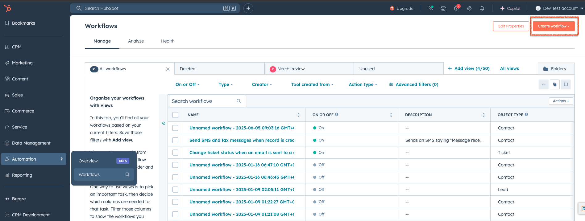
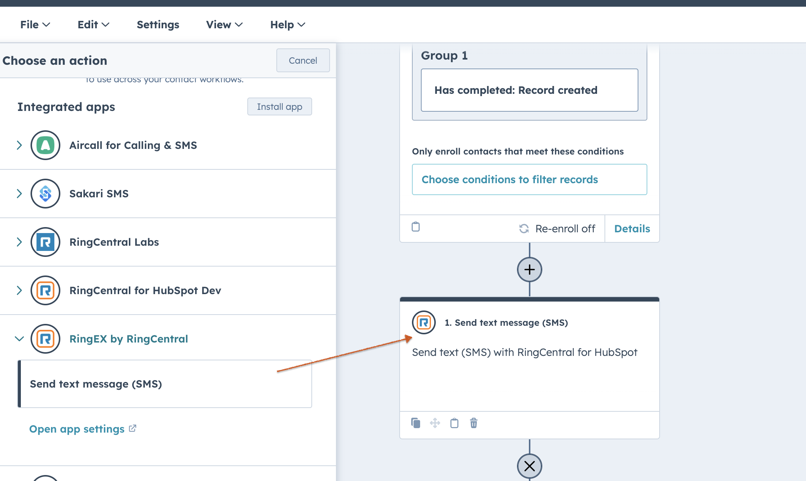
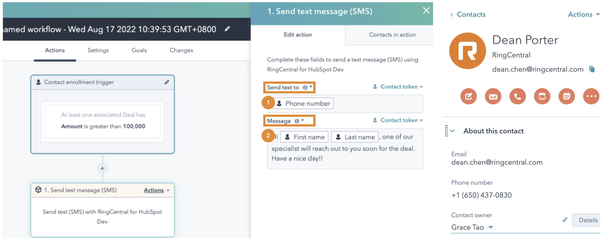
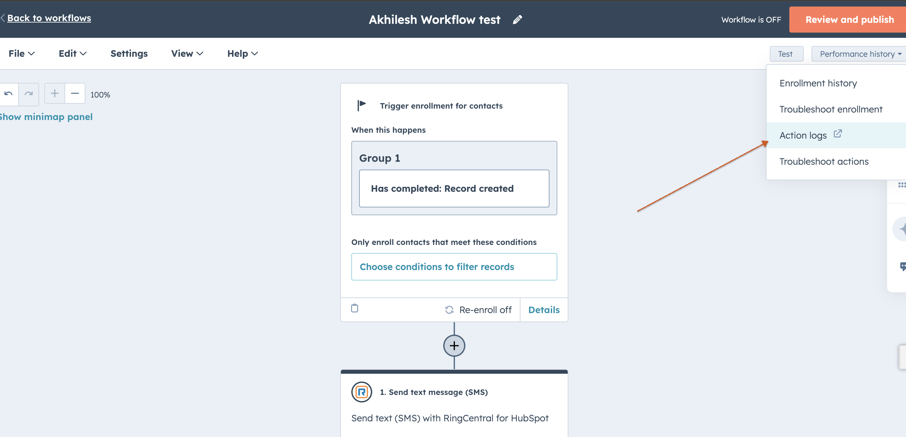
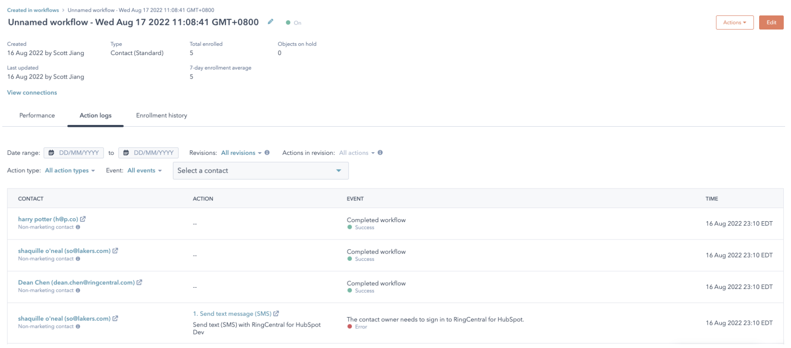
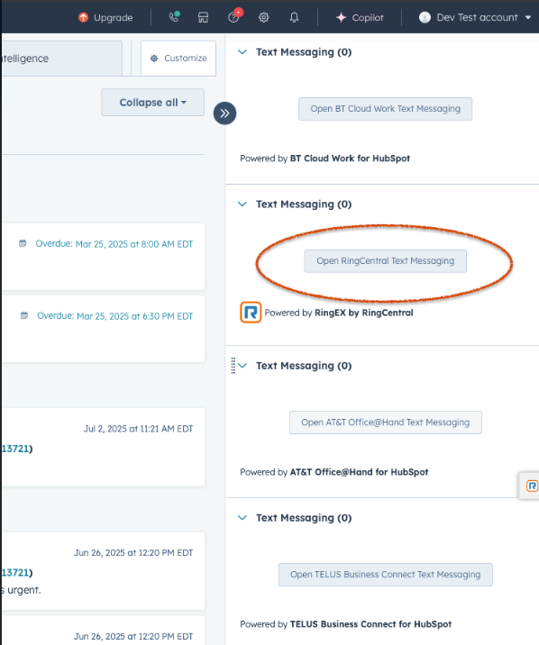

---
hide:
    - toc
---

# General Questions

## Q. I keep seeing 'Webphone Unavailable' error message?

A. Users may encounter a "Webphone Unavailable" error message when attempting to call from RingCentral for HubSpot. This error typically occurs due to insufficient microphone permissions in the browser. To identify and resolve the issue, consider the following rules:

Solution 1: Enable Microphone Permissions

When users see the "Webphone Unavailable" error message, instruct them to click on it. This action will open the browser site settings. Ensure that the toggle for Microphone is turned on. Once enabled, the error message should disappear, allowing users to use RingCentral for HubSpot for making calls.

Solution 2: Check Browser Privacy Settings

If users still encounter the "Webphone Unavailable" error message after allowing microphone permissions, recommend checking the browser privacy settings. For Google Chrome:

1. Go to Browser Settings
2. Select Privacy and security
3. Select Microphone
4. Verify the following: - The correct microphone is selected (e.g., MacBook Pro Microphone (Built-in)(System default)) - Under default behavior, "Sites can ask to use your microphone" radio button is selected - The HubSpot site is not listed under "Not allowed to use your microphone" - The HubSpot site is present under "Allowed to use your microphone"

## Q. The contact page does not open in HubSpot when there is an inbound call in RingCentral for HubSpot?

A. Contact Page Not Opening for Inbound Calls

The screen pop feature in HubSpot opens a contact screen or the contact search page for multiple matches when a user receives an inbound call. If it does not work as expected, there are several reasons to check if the customer has configured the settings correctly.

Check if the user has enabled the toggle for 'Show matches for inbound calls'. If the user has not enabled this toggle in the RingCentral for HubSpot integration, the screen pop feature will not work.

Even if the 'Show matches for inbound calls' toggle is enabled and users don't see the feature working, we need to determine if they are checking this feature after the inbound phone call is answered or while it is ringing. This feature only works when the inbound phone call is answered, not when the integration starts ringing with the matched contact.

If the user has already enabled 'Show matches for inbound calls', is answering inbound calls, and the feature still does not work, we need to check if there are any browser pop-up blockers in place. Go to Settings -> Privacy and security -> Site settings -> Pop-ups and redirects -> Ensure that the radio button is selected for 'Sites can send pop-ups and use redirects'.

## Q. Why isn't my SMS being logged automatically?

A. After Auto-log texts (or equivalent) is enabled, new inbound/outbound SMS is picked up on a scheduled / batch sync, not as an instant per-message push to HubSpot.

Typical timing: allow roughly 8–15 minutes before assuming a problem; short delays are normal. Failed attempts are retried on later cycles.

If nothing appears:

- Refresh login / integration state.
- Confirm you are on the right contact / company / deal.
- Use View log details (or equivalent) to open the HubSpot side if a log was created.

If messages are consistently missing past ~15 minutes, contact support with CPR and an example time + number.

## Q. Why is a contact getting created in HubSpot for unknown phone numbers?

A. A new HubSpot contact (for example "Caller" / "SMS" + E.164 number) is created when automatic logging is configured to create a record for unmatched numbers—not simply because a generic "auto log" toggle is on.

Typical controls include:

- Automatic call logging (client and/or Activity Sync / server-side) and its call-type list (for example, whether missed or unknown numbers are included).
- Unknown number policy for calls and SMS (for example, create contact vs skip vs log without linking), as set in your integration / console configuration.

If contacts are being created when you do not want that, review unknown-number and call-type settings with your admin. If you want creation but see "Unknown" or no log, check rate limits, multiple matches, or queue rules instead.

## Q. Why is there no available hub to log in?

A. If you're unable to log in, reach out to your HubSpot administrator to connect the HubSpot account you would like to use with RingCentral.
If this has already been done, please ensure:

-   You have access to the Hub in HubSpot
-   You use the same email to sign in to both HubSpot and RingCentral for HubSpot
    If you are still unable to log in after verifying these points, please contact RingCentral Support for assistance.

## Q. I have enabled/updated call outcome/call type in HubSpot, but why are the changes not synced back to RingCentral for HubSpot?

A. To sync the changes, log out of the app and then log back in.

## Q. Why do I see the error message "Cannot match contact. Try clicking the Create log icon in your call history." when I make or pick up a call?

A. This error message appears when your company reaches the rate limit imposed by HubSpot at that specific moment. As a result, the call information is displayed as "Unknown" because the contact matching process fails due to the rate limitation. However, potential matches may still exist despite the "Unknown" status. To resolve this, you can return to your call history and click the "Create call log" icon for the specific call. This action will trigger the contact matching process again, attempting to find and associate the correct contact information.

I have checked with Jack and have the same insights. This would be considered a product feature request, and there is currently no estimated time of arrival (ETA) for its implementation and delivery. I will proceed to create an improvement ticket. You can also refer the customer to my previous comment and suggest they submit a feature request through ideas.ringcentral.com.

Please let me know if you have any additional concerns.

## Q. Why is the call not matched, but the contact exists in my HubSpot?

A. First, confirm you are signed into the correct Hub in RingCentral for HubSpot.

Matching uses normalized phone numbers against the HubSpot fields included in the integration's match request (typically Phone and Mobile phone for contacts, in common national formats). If the number only lives in Phone number 2 / 3 or a custom field, it may not match even though a "contact exists" elsewhere in the record.

If the number is on Phone or Mobile and still does not match, check for HubSpot API rate limiting (temporary "Unknown"), country / format issues, or multiple contacts sharing the same number.

## Q. Why is there no call recording link for playback in HubSpot contact activity?

A. A recording link is added only when RingCentral actually has a recording for that call and the integration has received that information from RingCentral call log data and successfully updated the HubSpot engagement.

Common cases with no link:

1. Recording was never turned on or not generated for that call (confirm in RingCentral admin / call reports).
2. Update never reached HubSpot: the integration often fills duration and recording after call-log sync. If the embedded app was closed immediately after hangup, client-side updates can be interrupted; with Activity Sync / server-side logging, updates may still occur, but timing depends on backend processing.
3. Timing: immediately after hangup, the UI may still show "This call wasn't recorded" until call-log data arrives. Long recordings can take longer to appear.

What to do: Confirm recording exists in RingCentral; wait and refresh HubSpot; avoid closing the integration right after hangup if you rely on the in-app update path. If recording exists in RingCentral for a long time but HubSpot never updates, open a support case with time of call and CPR.

## Q. Can I make calls directly from HubSpot?

A. Yes. You can use the RingCentral dialer inside HubSpot to call contacts. Calls are logged automatically with details like duration, timestamp, and optional notes.

## Q. Will inbound calls be logged in HubSpot?

A. In general, answered inbound calls can be logged to HubSpot when automatic call logging (client and/or Activity Sync / server-side automatic call logging, depending on your setup) is enabled and allowed for that call type.

Missed inbound calls are not all treated the same:

- For normal direct calls, a missed inbound may still be logged when your automatic call logging configuration allows that call type (for example, missed with or without voicemail), subject to match / unknown-number rules.
- For call queue calls, the integration suppresses many auto-log paths while the outcome is ambiguous (for example, missed on one agent but the call may still be answered by another queue member). Queue calls are generally only treated as loggable when the session is answered (CallConnected / OnHold) for the flows the product tracks. Do not assume every missed queue leg appears in HubSpot.

Calls handled only on a desk phone or RingCentral mobile/desktop can still appear in HubSpot when Activity Sync / server-side automatic call logging is correctly enabled—but the same queue, call-type, and unknown-number rules apply.

If a specific call is missing, check call queue vs direct, AAL call-type settings, unknown-number policy, and multiple matches (user may need to choose a record).

## Q. What happens if I take a call outside of HubSpot?

A. Calls placed or answered on your desk phone or RingCentral mobile or desktop apps can still produce HubSpot activities when Activity Sync (or server-side automatic call logging from the integration console) is enabled and the call is eligible under your automatic call logging rules.

Eligibility is the same class of rules as inside HubSpot: allowed call types (outbound, answered inbound, missed, voicemail, etc.), call queue handling (many missed queue legs are not auto-logged to avoid duplicate or wrong activities), unknown-number behavior, and multiple matches (user may need to select a contact).

You may still need to add notes or disposition in HubSpot manually if your workflow expects fields the server log does not populate.

## Q. Does RingCentral for HubSpot support call recordings?

A. Yes. If call recording is turned on in your RingCentral account, a playback link will appear in HubSpot. Recordings are stored in RingCentral's system.

## Q. Can I use RingCentral for HubSpot on mobile?

A. You can make and receive calls using the RingCentral mobile app. However, full integration features like in-app calling and automatic logging work best on the HubSpot desktop or web app. You need to use the HubSpot app to manually disposition and log calls. HubSpot doesn't currently support third-party calling from RingCentral in their mobile app.

## Q. Is RingCentral for HubSpot free?

A. The integration is free for RingCentral Advanced and Ultra users.

## Q. What HubSpot objects does RingCentral integrate with?

A. RingCentral for HubSpot primarily integrates with:

-   Contacts: Call logs link to HubSpot contacts to help track interactions.
-   Companies: Calls can be linked to company records for easier team collaboration.
-   Deals: Calls can be logged under active deals to track communications during the sales process.
-   Tickets: Support teams can log calls under tickets to keep a record of customer interactions.

## Q. Does RingCentral work with HubSpot automations?

A. Yes. RingCentral integrates with HubSpot workflows and automation tools. You can:

-   Trigger workflows based on call events, like creating a follow-up task when a call is logged.
-   Send notifications when a call is completed or missed.
-   Create follow-up reminders to help boost customer engagement.

## Q. Who should I contact for support?

A.

-   For RingCentral technical issues, contact Support.
-   For HubSpot CRM questions, contact HubSpot Support.
-   End users should visit the RingCentral support site or reach out to their system admin for integration-related questions.

##Q. How to set up workflow in HubSpot?
A. RingCentral for HubSpot provides a contact-based workflow action called "Send text message (SMS)," enabling a workflow to send text messages to enrolled contacts via the RingCentral for HubSpot app. These messages can be logged manually or automatically based on your app settings.

You can find Workflows in your HubSpot Automation > Workflows (see figure below). For more details on how to set up a workflow, read "Create workflows" (https://knowledge.hubspot.com/workflows/create-workflows).

"Send text message (SMS)" is a custom contact-based workflow action. You can find it in the HubSpot workflow action section (see figure).

When you add this action to your workflow, you can configure:

-   Send text to: Define the phone number to send a message to (Figure, step 1). Usually choose the contact records' phone number field and/or mobile phone number field.
-   Message: Define the SMS content (Figure, step 2).

Using the example in the figure, the workflow will enroll a contact record with a deal amount over 100,000 and send an SMS to the enrolled contact automatically. For instance, if a contact named Dean Porter has a deal with an amount of 150,000 and the contact owner for Dean is Grace Tao, Dean will receive a message sent from Grace Porter's RingCentral number to his phone number with the content: "Hi Dean Porter, one of our specialists will reach out to you soon for the deal. Have a nice day!" The workflow uses Grace's RingCentral account to send the SMS as if Grace does it herself. Please ensure the contact owner (Grace Tao in this case) has a valid RingCentral account and is able to sign in to RingCentral for HubSpot.

Workflow results and errors will be tracked in HubSpot workflow action logs (see figure). Read "Understand your workflow details page" for more information.

##Q. Does RingCentral for HubSpot workflow support calls?
A. No, currently RingCentral for HubSpot Workflow automation only supports the SMS feature. All other RingCentral features, including those related to calls, faxes, and contacts, are not supported.

##Q. SMS are not sent through Workflow automation.

A. There could be several reasons why the workflow automation does not execute and send SMS from the RingCentral for HubSpot integration. To identify if the RingCentral integration has failed to execute the "Send text message" action, navigate to the action log of the workflow and check the Action section. Look for "Send text message (SMS)" with a failure event. The events can include the following error messages:

1. General Error Messages:

    - "Something went wrong when sending the message."
    - "Connection failed. Please try again later."
    - "Cannot connect due to internal errors. Please try again later."
    - "Cannot connect due to network issues. Please try again later."

2. Permission-Related Errors:

    - "You don't have permission to send messages."
    - "You don't have permission to send messages to recipients outside of your organization."
    - "In order to call this API endpoint, user needs to have [InternalSMS] permission for requested resource."

3. Phone Number Validation Errors:

    - "Please enter a valid phone number."
    - "Phone Number Validation Error."
    - "Please enter a valid receiver number."
    - "A valid phone number is required to send text messages to recipients outside of your company. Please contact your administrator to add a direct number to your account."

4. Extension-Related Errors:

    - "The extension number does not exist."
    - "Sending SMS from/to extension numbers is not available"
    - "Cannot send to an extension number with main phone number. If you want to send to an extension number, please just enter extension number."

5. International/Regional Errors:

    - "International SMS is not supported"
    - "International MMS feature is not available"
    - "Sending SMS to international phone number is not supported"

6. Special Number Errors:

    - "Sending texts to emergency/special service numbers is not supported."
    - "Sending SMS to short numbers is not available"

7. Text Content Errors:

    - "Please enter the text to be sent."
    - "Text is too long, 1,000-character limit"
    - "Text is too long, 5000 limit"

8. Sender-Related Errors:

    - "You must select a number from your phone numbers to send"
    - "Please set {areaCodeLink} to use 7-digit local phone numbers."

9. Account Configuration Errors:

    - "A valid phone number is required to send text messages to recipients outside of your company. Please contact your administrator to add a direct number to your account."

10. Message Status Errors:
    - "Queued"
    - "Delivered"
    - "Sent"
    - "SendingFailed"
    - "DeliveryFailed"

These error messages are localized and available in multiple languages (English, German, Italian, etc.) to provide a better user experience for international users.

##Q. I see an error message: "The contact owner's phone number is not set up to send text messages from RingCentral for HubSpot. Check the number's permissions or contact your administrator for help." in the Actions logs for RingCentral.

A. Users will see this error message when they do not have permission to send messages from their RingCentral extension. Also, ensure the following note from the user guide is satisfied (https://assets.ringcentral.com/us/guide/RingCentral_for_Hubspot_User_Guide.pdf):

Note: The workflow always sends the SMS from the contact owner's phone number. Therefore, please ensure the contact owner has a valid RingCentral account (using the same email address to sign in to both HubSpot and RingCentral) and is able to sign in to RingCentral for HubSpot, so that the "Send text message (SMS)" action will work properly.

There is a quick way to test to ensure the workflow works:

- Login to RingCentral integration with the same email address used for signing in to HubSpot.
- Connect to the Hub which the HubSpot is connected to.
- Navigate to the Messages section in the RingCentral integration and then send a test text message.
- If the message is sent successfully from the above test, then execute the workflow.

## Q. Why does my HubSpot workflow fail with OWNER_NOT_SIGNED_IN (or the message "The contact owner needs to sign in to RingCentral for HubSpot") in the workflow error details?

A. In the workflow action log, `OWNER_NOT_SIGNED_IN` is the technical code for this case. HubSpot may show that code and/or the clearer text: "The contact owner needs to sign in to RingCentral for HubSpot." They mean the same thing.

The "Send text message (SMS)" action sends the SMS from the HubSpot contact owner's RingCentral line. RingCentral must know which RingCentral user matches that HubSpot owner. If the contact owner has never opened and signed in to RingCentral for HubSpot inside HubSpot, that connection is missing and the workflow can fail with `OWNER_NOT_SIGNED_IN`.

**What to do**

- Have the contact owner open RingCentral for HubSpot in HubSpot and sign in at least once.
- Use the same email address as HubSpot (with a valid RingCentral account).
- After they can send a test SMS from the integration, run the workflow again.

**If it still fails**

- Confirm SMS permissions and a valid sender number with your RingCentral admin.
- If needed, contact RingCentral support with the workflow name, time of the run, and a screenshot of the workflow error details (including `OWNER_NOT_SIGNED_IN` if shown).

## Q. Why are SMS messages sent by my HubSpot workflow not showing up automatically in HubSpot activities, even though auto-logging is on?

A. Auto-log texts in RingCentral for HubSpot applies to SMS you send or receive through the RingCentral for HubSpot Messages experience in HubSpot when the number can be matched to a contact and your settings allow logging. Those conversations can be logged automatically (or updated on a schedule, depending on your configuration).

SMS sent by the "Send text message (SMS)" HubSpot workflow action is sent on a different path: HubSpot calls RingCentral's workflow / automation integration. The message is delivered, but that path does not go through the same in-app Messages flow that drives automatic creation of the SMS activity in HubSpot today. So workflow-sent SMS may not appear as an automatic HubSpot activity, even when auto-log texts is enabled for the widget.

**Workaround**

- In RingCentral for HubSpot, open Messages, find the SMS thread (including texts that were sent by the workflow), and use Log (or your product's equivalent) to attach the conversation to the right HubSpot contact or company manually.
- You can still confirm delivery in RingCentral message history if needed.

**Product note**

Automatic logging of workflow-sent SMS into HubSpot activities is a known limitation today; the product team is aware of the request for a future improvement. No specific release date is promised in this article.

##Q. Why do I see the error message "Please enter a valid phone number for this contact" while setting up a workflow in HubSpot?

A. Users encounter this error message when they do not enter a valid phone number in the "Send text to" field while setting up the workflow. To resolve this issue:

-   Ensure you select the correct phone number field (e.g., Phone Number or Mobile Phone Number).
-   Alternatively, enter a phone number manually in the e.164 format.
-   Update the changes and perform a test of the workflow automation.

##Q. Can we use the company main number to send SMS using the workflow automation in HubSpot?

A. No. Unfortunately, it is not possible to send SMS from your company's main number if it is tied to your main company line. This number cannot be used as the SMS Caller ID in the HubSpot workflow.

There is a related thread on our Community Site that our engineers are actively working on. Feel free to join the discussion and add your question there:

https://community.ringcentral.com/developer-platform-apis-integrations-5/cannot-send-sms-from-main-company-number-2658If

However, if the main company number and company number(s) have the SMS feature enabled for sending text messages from those phone numbers, only the user extension assigned to handle SMS for those company numbers would be allowed to send SMS from the RingEx by RingCentral integration. The assignment is set by default to the main super admin user but can be changed from the admin portal (service.ringcentral.com) via the company auto-receptionist general settings. Follow these steps:

-   Login to service.ringcentral.com as a RingCentral admin user
-   Navigate to Phone System -> Auto Receptionist -> General Settings
-   Under Call Handling section -> settings
-   Scroll down to Fax/SMS recipient and click on the 'Select Extension' button (Select an extension that will send and receive faxes and SMS text messages using the company phone numbers.)

The extension selected above can send/receive fax and SMS for the company main number in RingEx by RingCentral integration.

## Q. Why do I see the message 'This call wasn't recorded' for the logged call in HubSpot?

A. That message usually means the HubSpot engagement does not yet have a recording URL, or no recording exists for that call in RingCentral.

Typical causes:

- No recording in RingCentral for that session (policy, on-demand not pressed, compliance, etc.).
- Not updated yet: during and right after the call, logging may use telephony session data without recording metadata; the integration waits for call-log data that includes the recording. Refresh after a short delay; very long calls can take much longer.
- Client update missed: closing the integration panel immediately after hangup can stop in-browser follow-up updates; server-side / Activity Sync may still backfill later, but not instantly.

Use RingCentral admin call reports to verify a recording exists. If it does and HubSpot never shows a link, contact support with CPR and call time.

## Q. Why are missed call queue calls not logged to HubSpot?

A. For call queue traffic, a single customer call can ring multiple agents, be missed on one line, and still be answered by someone else—or end as a true miss for the queue. If the integration auto-logged every ring or every "missed" leg for each agent, HubSpot could get duplicate or conflicting activities for one real conversation.

Because of that, RingCentral for HubSpot intentionally does not auto-log many call queue legs where the final outcome is not clear yet from that extension's point of view (for example, missed on this agent while the call may still be in progress for the queue).

**What the product does today (native integration):**

In the browser (client auto call logging): When auto call logging is on and server-side automatic call logging is off, call queue calls are only auto-saved when the session for that flow shows the call was actually answered (CallConnected / OnHold). If the call only rang or was missed on that agent without connecting, it is not auto-logged from the client.

Server-side / integration-console automatic call logging: The same integration still applies call queue rules (including whether the call is treated as answered for logging). You should not assume that turning on Activity Sync or server-side automatic call logging by itself will automatically create HubSpot activities for missed call-queue scenarios in all cases—that overstates today's behavior and is not something we document as a workaround anymore.

**Practical workaround:** Once the outcome is known, users can log the call manually from the call history / call log UI, or follow an internal workflow your team defines for queue calls.

**Roadmap:** Better handling of call queue and missed cases in HubSpot (including clearer account-level behavior) is tracked as a product backlog / enhancement; we are not committing to a release date in this article.

## Q. Why doesn't server-side call logging work, or why isn't my call logged in HubSpot when I used the RingCentral desktop or mobile app?

A. Calls handled only in the RingCentral desktop or mobile app still need Activity Sync (server-side automatic call logging from the integration console) to be enabled and configured for your account, and the call must be eligible under those rules (call type, queue behavior, unknown numbers, multiple matches, and so on).

**Check the following:**

- **Admin / console:** Confirm Activity Sync is turned on and that this user is on the inclusion list (or not on the exclusion list), per your organization's policy.
- **First-time connection:** The user must sign in to RingCentral for HubSpot at least once so the link between RingCentral and HubSpot is established for that account. Use the same email address as HubSpot—not the RingCentral phone number or a different alias.
- **Call queue calls:** For call queue traffic, many missed-on-this-agent or ring-only legs are intentionally not auto-logged so HubSpot does not get duplicate or wrong activities for one customer interaction. Do not assume every missed queue call appears in HubSpot. If the outcome is unclear from that extension's view, the call may need to be logged manually from call history once the outcome is known.

**Other troubleshooting steps:**

- In the integration console, remove the user's HubSpot connection and add it again, then have the user sign in to the integration again with the HubSpot-matching email.
- If calls that should be eligible still do not appear after the above, open a RingCentral support ticket for the integration team and include a sample call (date/time, direction, approximate duration, extension or user, and whether it was a queue call) for investigation.

## Q. Why are the notes overridden in the call log after the call is logged to HubSpot?

A. Below is how the call logging feature works:

-   RingEx by RingCentral Integration app continuously updates the call log as the call progresses through different stages. After the call ends, there is a final update when we obtain the call recording link.
-   Simultaneously, customers may use other third-party integrations with HubSpot or manually add content to the notes section after the call.
-   This creates a race condition where sometimes the third-party integration or manually entered information populates the contents first, and sometimes RingEx by RingCentral integration app insert the recording link first.
-   If the third-party integration or manually typed information is added first, RingEx by RingCentral integration app may override that content when we update the notes with recording links.

## Q. Why isn't there a Send SMS engagement option on the Contact detail page?

A. In HubSpot, the CRM contact page has a set of default engagement types such as Call, Email, Task, and Meeting. HubSpot does not provide support for SMS. Adding a custom activity button (like for SMS) directly to that row of activity buttons isn't natively supported through the default UI, but there are workarounds you can use.

-   On the right section of the contact page, users should see a Text Messaging section with an "Open RingCentral Text Messaging" button. This button will open the native integration for users to enable texting within HubSpot using 'RingCentral' as the provider.
-   Attaching a screenshot for reference.

## Q. Why is there an automatic call made to the contact from RingEX by the RingCentral HubSpot Native integration when switching tabs?

A. This is a known feature from HubSpot when call goes out from RingCentral integration that means a 'Call' type task is created for that contact.

-   This call task and dialing interaction is a core feature of HubSpot's power dialing functionality. It works as intended, assuming users who click on call tasks want to immediately engage in the call.
-   According to https://community.hubspot.com/t5/CRM/How-to-stop-auto-opening-action-box-from-Tasks-view/m-p/1037304, there currently appears to be no workaround other than creating a different type of task.
-   In this case, our native CTI only receives a request to make a call; our app does not automatically initiate dialing on its own. Essentially, HubSpot instructs our app to make the call.
-   Our Chrome extension did not function this way because it does not fully integrate with HubSpot's CTI solution. For example, clicking on native phone buttons in HubSpot does not work with the extension, but the extension scans the page to offer our own injected call buttons.

Workarounds:

-   The only known workaround is to create tasks as "To-Do" type rather than call tasks.

We recommend the customer consider this workaround or contact HubSpot for potential alternative solutions. Our partnership with HubSpot may lead to full support of their native solution and potential retirement of the extension in the future. It may be more effective if the request to disable this auto-dialing behavior comes from customers rather than from RingCentral.

## Q. Unable to select RingEx by RingCentral in the location field while editing or scheduling a meeting in HubSpot.

A. When users encounter a disabled RingEx by RingCentral option in the location field while editing or scheduling a meeting, it may be due to the following reasons:

-   Ensure you are logged in to the RingEx by RingCentral integration in your HubSpot CRM. You may see a message stating, "Please login to RingCentral for HubSpot and refresh the page to continue scheduling a meeting."

-   If you are logged in to the integration but still see the option disabled, it is likely that the email address used for the RingCentral integration differs from the one used to sign in to HubSpot. Always ensure you log in to the RingCentral integration using the same email address you use to sign in to HubSpot.

## Q. Can RingCentral for HubSpot integration help progress the Lead to the next stage after a call is completed?

A. No, RingCentral for HubSpot does not automatically move leads to the next stage when you complete a call. This is a HubSpot feature that needs to be configured separately.

How to Achieve Lead Stage Progression:

To automatically move leads to the next stage when calls are completed, you need to:

1. Configure HubSpot Workflows: Set up workflows in HubSpot that trigger based on call log creation.
2. Use Call Outcomes as Triggers: Configure workflows to move leads when specific call outcomes are logged.
3. Set Up Property Updates: Create workflow rules that update lead stage properties based on call activity.

Example HubSpot Workflow Setup:

1. Go to HubSpot Settings → Automation → Workflows
2. Create a new workflow triggered by "Call logged"
3. Add conditions based on call outcomes (e.g., "Connected" calls)
4. Add actions to update lead stage property
5. Set the target stage (e.g., from "New" to "Qualified")

The lead stage progression is a HubSpot workflow automation feature, not a RingCentral feature. RingCentral provides the call logging data that can be used as triggers for HubSpot workflows, but the actual stage progression logic must be configured within HubSpot's automation system.

## Q. Why can I not generate reports for the logged SMS in HubSpot CRM, while I can generate reports with logged calls?

A. Calls are logged using HubSpot call engagements, which participate in reporting the way standard call activities do.

SMS from the native RingCentral integration is logged using the mechanism HubSpot and the integration use for SMS / communications timeline (not the same shape as a classic call engagement). That affects which native HubSpot reporting and filters see the activity. Custom timeline style behavior may still apply to some SMS log surfaces depending on version and log path; if your portal UI moved items under Communication, use those filters and HubSpot guidance for reporting on SMS / communications.

Practical guidance: For dashboards and reports, use the object and activity types HubSpot exposes for SMS / communications for the native integration. For workflow triggers, rebuild around the current SMS / communication triggers HubSpot supports (see also the workflow migration Q&A below).

If a specific report type does not list SMS, that is often a HubSpot reporting limitation for that activity type—not a RingCentral "bug." HubSpot Support can confirm which report types include SMS / communications data.

## Q. Why do I see all HubSpot contacts in RingCentral integration? I can access contacts which I don't have permission to.

A. This issue stems from a feature limitation in the RingCentral for HubSpot integration. The current implementation lacks permission checks, resulting in users seeing contacts without proper access. The contact search API calls don't include user permission filters. Consequently, the HubSpot API returns all matching contacts, and the integration doesn't filter contacts based on the current user's ownership or access rights.

We call the Search API "https://api-rcapps.ringcentral.com/crm-framework/v1/services/hubspot/contacts/search". This API returns all contacts present in HubSpot that match the search criteria, regardless of user permissions.

## Q. There is no ringer audio when there is an inbound call to RingEx by RingCentral app in HubSpot.
A. This is a common issue caused by browser auto-play protection policies. Modern browsers (Chrome, Edge, Firefox) block audio playback until the user interacts with the page to prevent unwanted sounds.

To resolve this:

1. Click anywhere on the RingEx by RingCentral standalone window when you first open it.
2. Interact with any element(buttons, menus, etc.) in the window
3. Refresh the page if the issue persists

Why this happens:

- Browsers require user interaction before allowing audio playback
- The first/initial inbound call of the day often triggers this protection
- RingCentral for HubSpot integration needs audio permissions to play ringtones and call sounds

Pro tip: Always click on the RingEx by RingCentral integration window once after opening it to ensure audio permissions are granted for the entire session. If the issue continues after following these steps, please contact RingCentral support for further assistance.

## Q. When I use SSO to log in to RingCentral for HubSpot or RingEx by RingCentral native HubSpot integration, I get the error message "We didn't find any matched account. Try another account to log in again."

A. The user is experiencing this issue because:
- SSO only handles RingCentral authentication.
- It doesn't automatically connect to HubSpot.
- The system needs to know which HubSpot account belongs to your RingCentral account.
- This connection must be established first using username/password authentication.

Solution:

Step 1: Use Username/Password First (NOT SSO)

You need to use username/password authentication first to establish the connection:

- Go to RingCentral HubSpot integration.
- Click "Sign In" and "Next" (NOT "Single Sign-on").
- Enter your RingCentral username and password. (Ensure the email address you use to sign in to the RingCentral app is the same one you use to sign in to HubSpot.)
- Complete the authentication process.
- This establishes the connection between your RingCentral account and HubSpot account.

Step 2: Then SSO Will Work

After the connection is established:

- SSO will work because the system now knows which HubSpot account matches your RingCentral credentials.
- You can use "Single Sign-on" for future logins.
- The account matching will succeed because the connection is already established.

## Q. Why is there a delay in auto logging SMS to HubSpot Contact Activity?

A. Auto-logged SMS is processed on a batch / polling schedule and depends on RingCentral → integration → HubSpot timing and HubSpot API load. Expect roughly 8–15 minutes in normal conditions; longer spikes can occur.

Manual logging from the integration still goes to HubSpot on a direct save and should appear much sooner.

If delays are always much longer than ~15 minutes, collect CPR from the affected session for investigation.

## Q. Why do calls show "Call with unknown contact" as the title in HubSpot?

A. This happens when calls are manually logged without selecting a contact. The system matches contacts and shows suggestions, but if none are selected before saving, the call is saved without associations, so HubSpot displays "Call with unknown contact."

### Common Reasons:

- Multiple contact matches appear and the user isn't sure which to select
- The user doesn't notice the suggested contacts dropdown
- The user saves quickly without selecting a contact

### How to Fix Existing Logs:

1. Open the call engagement in HubSpot
2. Click "Edit"
3. In the "Contact" or "Associated with" field, search for and select the correct contact
4. Save the changes
5. The title will update to "Call with [Contact Name]"

### How to Prevent This:

When manually logging calls from RingCentral call history:

1. Click "Create Log" for the call
2. Review the suggested contacts in the dropdown
3. Select at least one contact before saving
4. If multiple matches appear, choose the most relevant one (check name, company, or recent activity)
5. Click "Save" only after selecting a contact

**Important:** The system cannot automatically link calls after saving. You must select a contact during the logging process.

### For Multiple Matches:

If you see several suggested contacts, select the one that matches the person you spoke with, or the most recently active contact. You can edit the log in HubSpot later to change associations if needed.

### Long-term Solution:

Consider enabling Activity Auto Logging (AAL) with the CREATE_CONTACT setting for unknown numbers. This automatically creates and links contacts, reducing manual errors and "Call with unknown contact" entries.

## Q. Why are some of the calls not auto-logged to HubSpot Activity?

A. Common reasons a call does not auto-log:

1. Multiple HubSpot matches and the user did not choose a record during the call (when the product requires a choice).
2. Call queue behavior: many ringing or missed-on-this-agent queue legs are skipped so the same customer interaction is not logged multiple times or against the wrong agent.
3. Automatic call logging / Activity Sync call-type filters exclude that outcome (for example, certain missed or internal types, depending on admin configuration).
4. Unknown number policy set to skip when there is no match and no selection.
5. HubSpot rate limiting or transient API errors (retry / manual log may be needed).

What to do: Check call history in the integration for multiple match prompts, queue icon/context, and AAL / console settings. Use Create log manually when auto-log did not run.

## Q. How do the Contacted and Association fields work?

A. When a call is made to a contact through the RingCentral extension, the integration automatically retrieves all CRM records currently associated with that contact in HubSpot. This includes contacts, companies, deals, and tickets that are already linked to the contact in HubSpot CRM. These records appear as "suggested" options in the Associations field dropdown.

### How the Association field works:

- **Automatic retrieval**: The system pulls all related records linked to the contact in HubSpot
- **Manual selection required**: By default, nothing is automatically selected and the user needs to manually check the boxes for the records they want to associate with the call
- **Selective logging**: Only the records explicitly selected will be saved with the call log
- **Multiple record types**: Shows contacts, companies, deals, and tickets that are relevant to the call

### How the Contacted field works:

- **Contact-specific**: Works similarly to the Association field but only shows contacts
- **Manual selection**: Users must manually select which contacts to associate with the call
- **No automatic selection**: The system does not automatically select contacts even if there's only one match

### Best practices:

1. **Review suggestions**: Always check the suggested associations before logging the call
2. **Select relevant records**: Only associate records that are actually related to the call
3. **Check all record types**: Consider whether the call relates to specific deals, companies, or tickets
4. **Verify accuracy**: Ensure you're selecting the correct records to maintain data integrity

## Q. Why did my SMS workflows stop working after switching to the native RingEX by RingCentral integration, and why do SMS activities now appear under Communication instead of Integrations?

A. Expected behavior after moving to the native embedded integration: SMS is logged through HubSpot's native SMS / communications model so it appears under Communication (and similar timeline views), not under legacy Integrations → custom app event filters used by some older Chrome / Labs setups.

Workflow impact: Workflows that fired on old triggers (for example custom app / integration events for "SMS log") will not fire on the new model. You need to rebuild automations using HubSpot's current triggers for SMS / communications (with help from HubSpot Support if needed).

Reporting: The same communications vs engagement split affects which native reports include SMS; align reports to SMS / communication objects HubSpot documents for your plan.

This is by design for the native integration, not a regression of the old extension.

When contacting HubSpot Support, the customer can say:

> "I'm using the native RingEX by RingCentral integration and need help building workflows that trigger from HubSpot's standard SMS communication events (SMS sent/delivered/failed/etc.) instead of the old RingCentral custom 'SMS Log' app events."

## Q. Why doesn't RingCentral for HubSpot match my contact when the number is only in HubSpot's "Phone number 2" or "Phone number 3"?

A. Phone contact matching goes through the integration's contact match flow (client sends the dialed or caller number to the CRM service `/contacts/match`). On the HubSpot side, the integration's documented search pattern relies on HubSpot's searchable phone handling (in our API materials, filtering on `hs_searchable_calculated_phone_number`) and standard contact phone fields such as `phone` and `mobilephone` in the examples. Additional HubSpot contact properties such as "Phone number 2", "Phone number 3", or custom phone fields are not represented in that documented match path in this codebase, so a number stored only there may not be found and the integration can treat the call as unmatched (and may create a Caller + number style record if your unknown-number / auto-log settings allow that).

**Resolution**

Store the number you expect to match for calls in a standard place the match path can see—at minimum the primary phone and/or `mobilephone` fields on the contact (the examples in our HubSpot contact API spec use both `phone` and `mobilephone`).

Keep Phone number 2 / Phone number 3 for extra numbers if you want, but do not rely on them alone for automatic matching.

**Enhancement**

Broadening match to all HubSpot phone properties (including extra phone fields) is a product enhancement; this repository does not implement that today.

If matching still fails with the number on `phone` or `mobilephone`, escalate with a sample contact ID, which fields hold the number, and call time for the integration team.

## Q. Why is there a new contact created by the integration with "Caller +Phone number" format when I use phone numbers that are stored in secondary phone fields?

A. Contact matching uses the standard HubSpot contact phone fields the integration is configured to search (typically including Phone and Mobile phone in supported formats). It does not match against arbitrary extra phone properties such as "Phone number 2", "Phone number 3", or custom phone fields unless the product explicitly adds them to the match query.

If the only stored copy of the number is in a non-searched field, the call may look unmatched and—when your unknown-number policy is set to create a record—the integration can create "Caller + E.164" (or similar) as a new contact for logging.

What to do: Put the primary number you expect to match in a searched standard field (Phone or Mobile phone), or manually select the right contact when logging. Merging duplicate "Caller + …" contacts may be needed if duplicates were already created.

Enhancement requests to search additional HubSpot phone properties are tracked as product feedback.