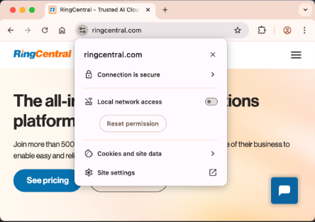
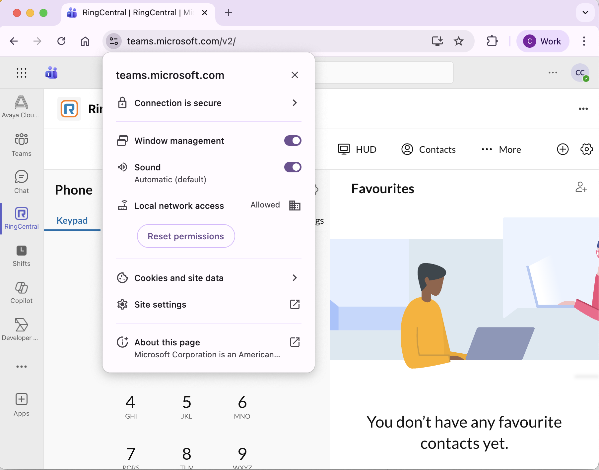

This guide applies to:

- RingCentral Embedded App + Desktop Plugin users and Administrators
- Chrome version 142 (or later) on Windows, macOS, Linux
- Teams web version xxx (or later)

## 🛠️ Important Update: Potential Connection Issue

Starting October 28, 2025, a security update in Chrome and other browsers based on the Chromium technology (version 142 or later) may affect how our RingCentral Embedded App works within Microsoft Teams.

This update introduces a new security measure requiring applications to ask for permission before connecting to devices on your local network (like your computer's desktop app).

Reference articles about this upgrade:

- LNA restrictions: [https://chromestatus.com/feature/5152728072060928](https://chromestatus.com/feature/5152728072060928)
- LNA Adoption guide: [https://docs.google.com/document/d/1QQkqehw8umtAgz5z0um7THx-aoU251p705FbIQjDuGs/edit?tab=t.0](https://docs.google.com/document/d/1QQkqehw8umtAgz5z0um7THx-aoU251p705FbIQjDuGs/edit?tab=t.0)

{ style="border: 2px solid #ddd; border-radius: 4px; padding: 4px;" }

### What This Means for You

Our RingCentral Embedded App for Microsoft Teams connects to the RingCentral Desktop Plugin on your computer using your local network to provide the essential calling capabilities.

**Temporary Fix for Version 142 (Current Impact)**: The Chromium browser update has started to block a minor part of this connection. If you open the Embedded App in Teams before the Desktop Plugin is running, the two might not connect immediately. The solution is simple: just refresh the Teams page (or close and re-open the Embedded App) and the connection will be restored.

**Future Impact (Potential Concern)**: Future updates to Chromium will likely block more of the necessary connections. When this happens, the Embedded App will not be able to connect to your Desktop Plugin at all until we implement a required configuration change.

<mark>We are actively working on a solution to manage these new browser security changes seamlessly and will provide an update before the more significant browser change occurs.</mark>

## ⚙️ One-Time Setup: Connecting Your App

Due to the new security changes, you will need to complete a quick, one-time setup to ensure your RingCentral Embedded App can connect to the RingCentral Desktop Plugin.

### Step-by-Step Instructions

**1. First Launch**: The first time you open the RingCentral Embedded App (version number TBD) in Teams (version TBD) using Chrome or a Chromium browser (version 142 or later), you will see a security prompt asking for permission to access your local network.

  • **Action**: You must click the "Allow" button for the app to work correctly.

{ style="border: 2px solid #ddd; border-radius: 4px; padding: 4px;" }

**2. What if I Clicked "Block"?** If you accidentally click "Block" or close the prompt, the Embedded App will not be able to connect to your Desktop Plugin.

  • **Fix**: You can easily change this setting. Look for the "View site information" icon (usually a padlock  or 'i' symbol) near your browser's address bar and adjust the site permissions there.

  • You can also use the Site Settings to adjust your permissions

 

**3. This is a One-Time Setup**: Once you grant this permission, it is saved for that specific browser profile. You will not need to do this again unless you switch to a different browser or clear your profile settings.

## 💻 Administrator Configuration (Recommended)

To proactively prevent connection issues for your users and bypass the need for individual setup, administrators can configure a policy to automatically allow local network access for the necessary sites.

### Configuration Steps:

1. **Navigate to Google Admin Console**: Go to your Google Admin Console.
2. **Access Chrome Settings**: Navigate to Chrome browser → Custom configuration.
3. **Apply Configuration**: Select the relevant Organizational Unit (OU) for your users.
4. **Add JSON Policy**: Under the "Configurations" section, add the following JSON policy block. This explicitly allows the Teams and RingCentral sites to connect to the local network:
   ```json
   {
     "LocalNetworkAccessAllowedForUrls": [
       "https://teams.microsoft.com",
       "https://teams.ringcentral.com"
     ]
   }
   ```
   { style="border: 2px solid #ddd; border-radius: 4px; padding: 4px;" }

5. **Save**: Be sure to save the setting.

### How to Verify the Policy:

**Policy Sync Time**: The policy may take some time to sync from the Admin Console to your end-users' browsers.

**Immediate Check (Optional)**: An end-user can manually check and accelerate the sync by doing the following:

1. In the Chrome address bar, type: `chrome://policy/`

2. Click the "Reload Policies" button.

{ style="border: 2px solid #ddd; border-radius: 4px; padding: 4px;" }

**Verification**: Once the policy has synced, the user should see the entry `LocalNetworkAccessAllowedForUrls` listed under the "Policies" section

{ style="border: 2px solid #ddd; border-radius: 4px; padding: 4px;" }

### Outcome:

When this policy is in place and successfully synced, your end-users will see that Local network access is automatically allowed by the organization, and the RingCentral Embedded App will connect correctly with the Desktop Plugin without requiring any manual steps from the user.