---
hide:
    - toc
---

# Installing the RingCentral for Teams embedded app using Microsoft Azure or OAuth {#installing-the-ringcentral-for-teams-embedded-app-using-microsoft-azure-or-oauth}

Admins can remotely install the RingCentral for Microsoft Teams embedded app using OAuth or Microsoft Azure in the Admin Portal.

Which method do you want to use?

<button type="button" class="presence-method-btn" data-presence-method="azure" role="tab" aria-selected="false" tabindex="-1" id="tab-embedded-azure">Microsoft Azure</button>
<button type="button" class="presence-method-btn is-active" data-presence-method="oauth" role="tab" aria-selected="true" id="tab-embedded-oauth">OAuth</button>

<strong>OAuth</strong> install steps are shown below.

## Installing the embedded app using OAuth {#install-using-oauth}

To install the RingCentral embedded app, you must have all the following administrator roles to your organization’s RingCentral and Microsoft 365 accounts.

| RingCentral | Microsoft 365 |
|-------------|----------------|
| **Super admin** AND **User admin** | **Global admin** OR **Privileged roles** admin, User admin, Teams admin, and Application admin |

Supported operating systems (OS) for the desktop and web version of RingCentral for Teams include:

- Windows 10, or later  
- macOS 10.15 (Catalina), or later  

The app won’t work on these operating systems due to framework upgrades:

- Windows 7, 8, and 8.1  
- macOS 10.13 and 10.14  

Make sure to turn on all required permissions from your Microsoft Teams admin center.

- Check that [third-party apps can be added](https://learn.microsoft.com/en-us/microsoftteams/manage-apps#manage-org-wide-app-settings) to the organization’s Teams app.  
- Make sure the RingCentral app is [allowed under **Manage Apps**](https://learn.microsoft.com/en-us/microsoftteams/manage-apps#allow-or-block-apps) in the Teams admin center.  

Please refer to [RingCentral's network requirements](https://support.ringcentral.com/article-v2/Network-requirements.html?brand=RingCentral&product=RingEX&language=en_US) for the firewall and web proxy configurations required for Teams and RingCentral to operate correctly.

## Connect your Microsoft 365 account to RingCentral

1. Sign in to the [RingCentral Admin Portal](https://service.ringcentral.com/).
2. Click **More** in the main navigation.
3. Click **Account Settings** → **Microsoft Teams**.
4. Click the **Embedded App** tab.
5. Click **Connect via OAuth**.
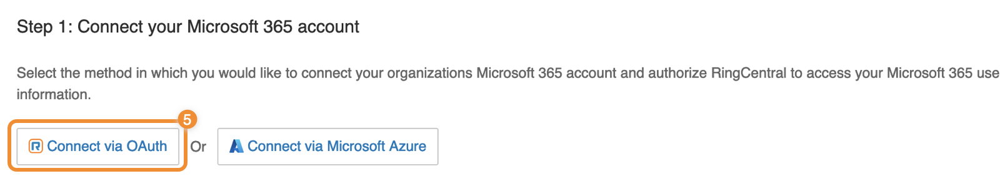
6. In the popup window, enter your Microsoft 365 admin credentials and click **Sign in**.
7. Check the box next to **Consent on behalf of your organization** (**a**), then click **Accept** (**b**).

!!! note
    You must be a global admin, application admin, or user administrator to do this step.

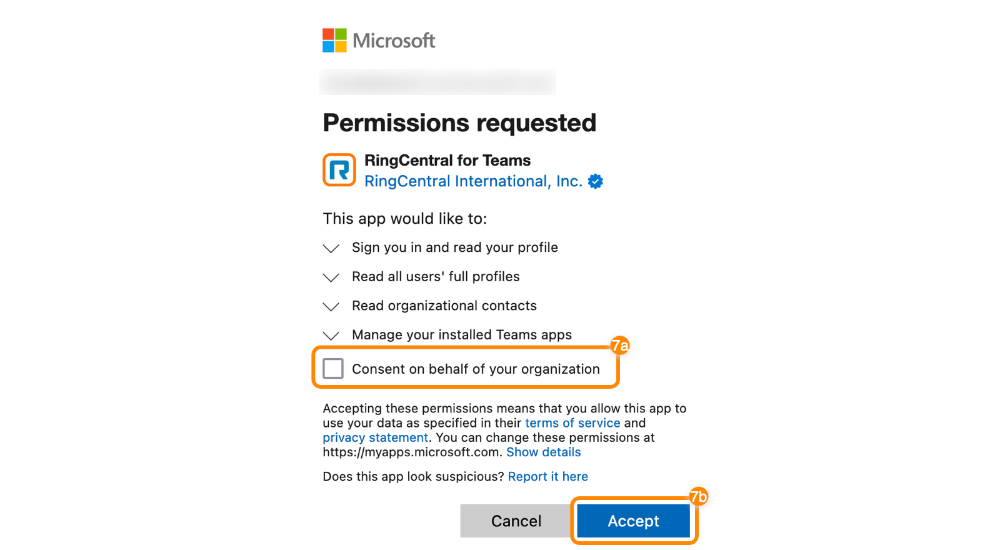

8. Click **Authorize RingCentral**.

    

9. In the popup window, enter your credentials if prompted.

10. Click **Accept**.

    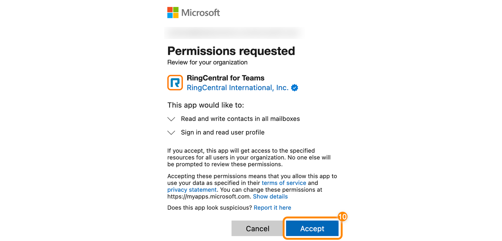

You’ll see a confirmation message saying your Microsoft 365 account is connected and authorized.

You can also [connect multiple Microsoft 365 tenants to your account](embedded-app-multiple-m365-tenants.md).

### Connecting multiple RingCentral accounts to one Microsoft 365 account

If your company uses multiple RingCentral accounts with a single Microsoft 365 account and wants to install the RingCentral for Teams app for all users, connect each RingCentral account to Microsoft 365 individually using the previous steps.

## Installing the embedded app {#installing-the-embedded-app-oauth}

On the **Embedded app** tab, select who you want to install the app for:

- **All users**  
- **Multiple users**  
- **A single user**  

If you’re going through Step 2 for the first time, you’ll only see the first two buttons as shown below.
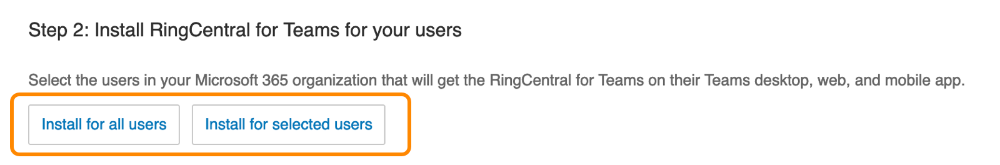
Once the embedded app is installed, a table will appear with the installation status and other details. You can always select more users if you don’t install the app for all users.

Before proceeding, ensure the username (user principal name) and email address for a user’s Microsoft and RingCentral account match. If both don’t match, the embedded app won’t display:

- Chat notifications for missed communications.  
- Personal contacts from the Microsoft contact directory.  

For accounts with more than 15,000 user profiles, the Admin Portal will redirect you to [install the embedded app using the Teams admin center](embedded-app-teams-admin-center-install.md).
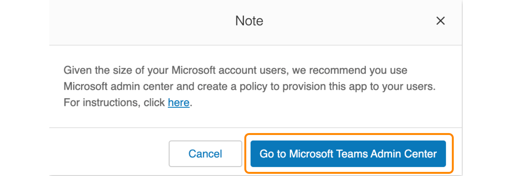
### Install the embedded app for all users

1. Click **Install for all users**. You’ll see an **Installing** message appear. Depending on the network and number of users, it might take several minutes.
2. Once completed, you’ll see a confirmation message with a summary of the installation. Click **OK** to view the user table.
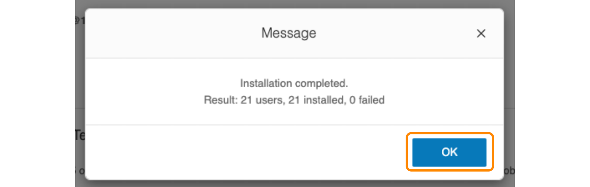
The table includes the installation status, users with the app installed, and the ability to sort or filter the table.
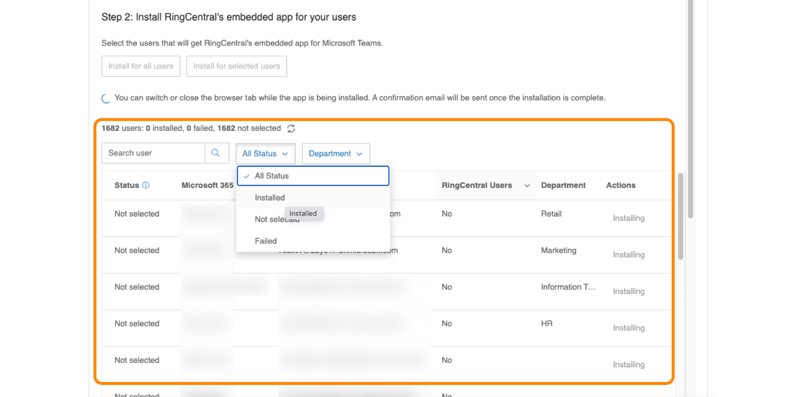
Additionally, you’ll receive an email containing the installation summary and more details.
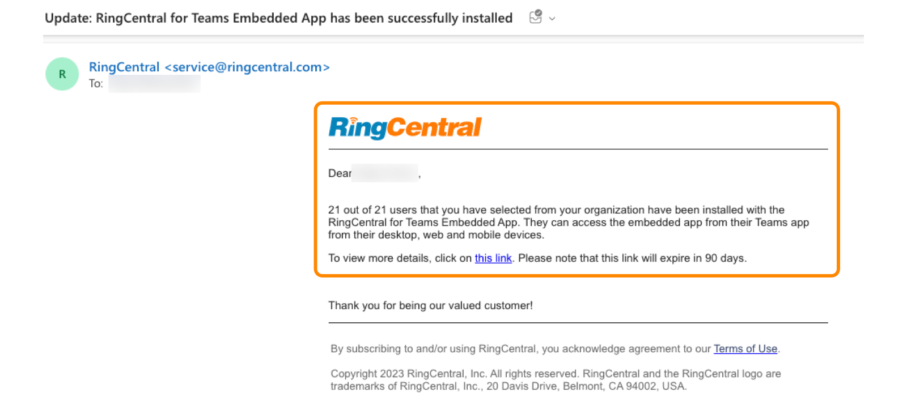
### Install the embedded app for selected users

To add the embedded app to Teams for a specific set of users:

1. Click **Install for selected users**.
2. Check the boxes next to the users for whom you want to install the embedded app.
3. Click **Install**.
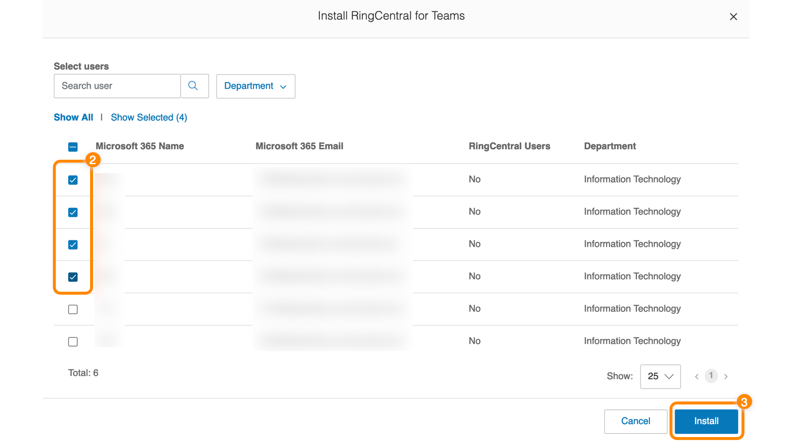
You’ll see an **Installing** message. Once the embedded app is installed for all users, a table will appear with the complete list.

### Install the embedded app for a single user

You can install the embedded app for a single user from the table under Step 2. Click **Install** at the far right to add the embedded app to the user’s Teams app.
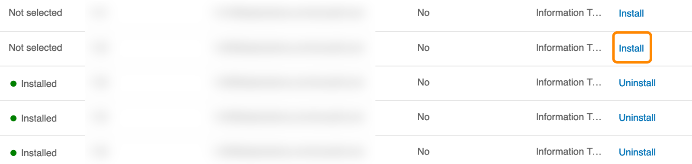
!!! important
    Make sure the Microsoft Teams Admin Center isn’t blocking third-party apps, either directly or through group policies, as this can prevent installation.

To check your organization-wide settings in the Teams Admin Center:

1. Go to **Teams apps**, then click **Manage apps**.
2. Click the **Actions** dropdown.
3. Select **Org-wide app settings**.
4. Make sure the **Let users install and use available apps by default** toggle is on.
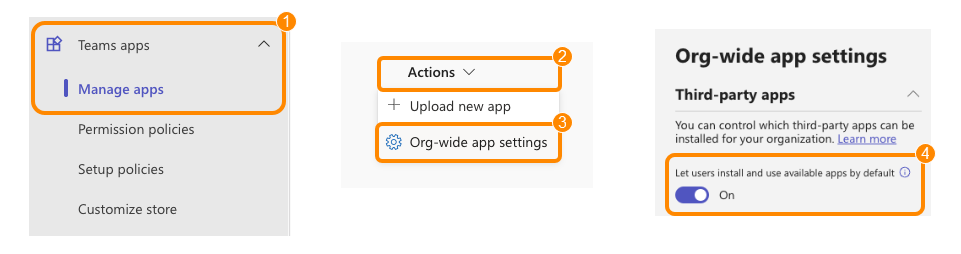

### Manually refresh the user list

Whenever users are added or removed from your Microsoft organization, you can refresh the user table.

During the refresh, all buttons in Step 1 and Step 2 will be temporarily disabled. However, you can still view, sort, search, and filter the user table.
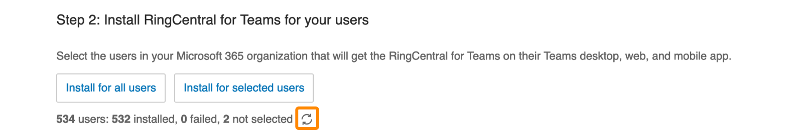
Refreshing might take several minutes, depending on the number of users in your organization.

### Uninstalling the embedded app

If you want to remove the embedded app from one or more users, click **Uninstall** to the far right of their name.

The **Uninstall** link only appears if the embedded app was already installed previously.
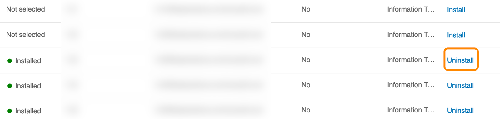
### Pin the RingCentral embedded app

For quick access, you can [pin the RingCentral embedded app](https://support.microsoft.com/en-us/office/pin-an-app-for-easy-access-in-microsoft-teams-3045fd44-6604-4ba7-8ecc-1c0d525e89ec) within your users’ Teams app.

## Download the desktop plugin and enable mobile mode {#download-the-desktop-plugin-and-enable-mobile-mode-oauth}

### Downloading the plugin

RingCentral also offers a desktop plugin to make and receive phone calls, and manage active call controls. You can download the plugin under Step 2, then leverage your company’s end-point management solution to remotely install the plugin on your users’ computers.
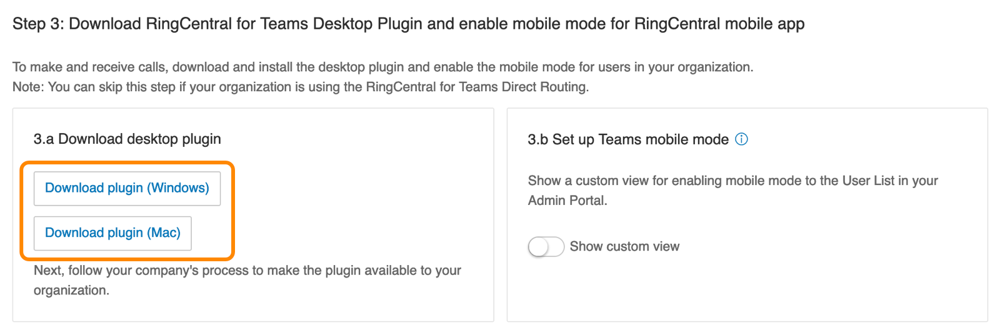
You can also download the plugin packages using the links below:

- [For Windows](https://teams.ringcentral.com/assets/desktop-plugin/rc/latest/windows/RingCentralForTeamsDesktopPlugin-admin.msi) (MSI Format) — use the download link in the **RingCentral Admin Portal** on the **Embedded App** tab.  
- [For MacOS](https://teams.ringcentral.com/assets/desktop-plugin/rc/latest/mac/RingCentralForTeamsDesktopPlugin-admin.pkg) (PKG Format) — use the download link in the **RingCentral Admin Portal** on the **Embedded App** tab.  

### Setting up mobile mode

Admins can set up a mobile mode for users in their organization to make and receive calls within the RingCentral for Teams mobile app. The mobile mode provides a focused call-only experience.
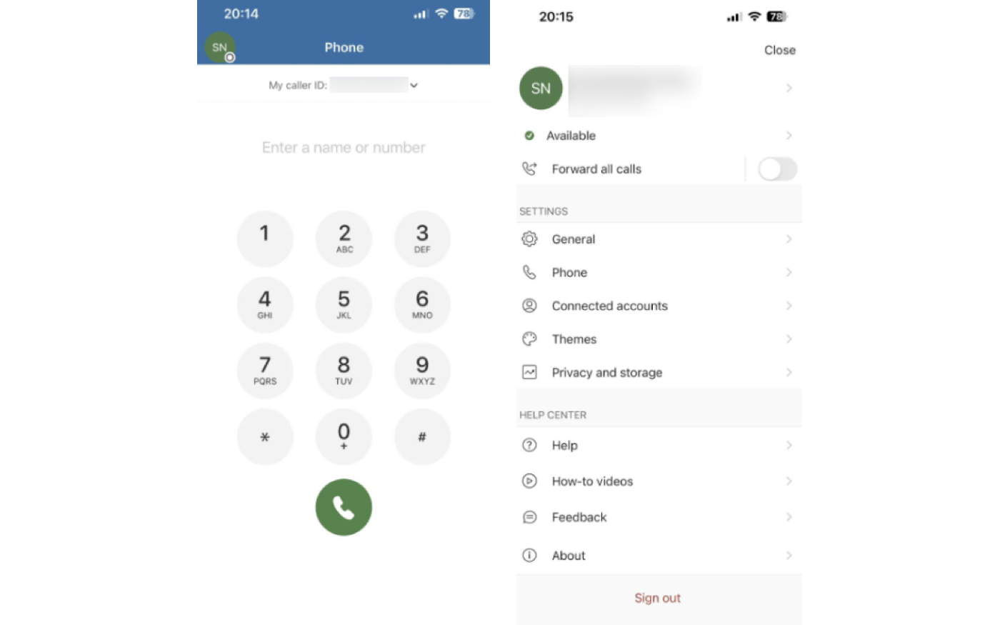
Any message, video, or other RingCentral features are hidden in the app so the user can focus on phone tasks.

To apply the mobile mode:

1. Click the toggle to turn on **Show custom view**.

    !!! note
        You must be a user admin or super admin to perform this task.

2. Click **Go to User List**.
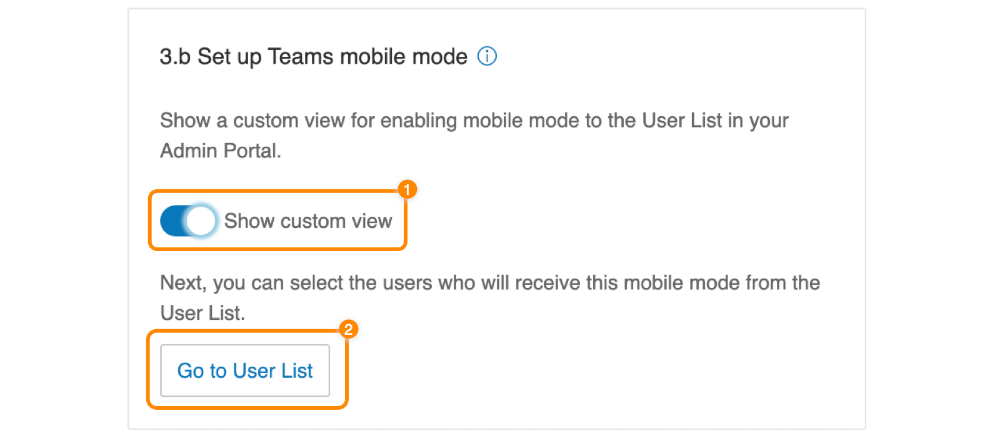
    If you don’t see the toggles immediately after navigation, please refresh the page and check again.

3. Click the toggle to turn on **MS Teams mobile mode** for selected users.
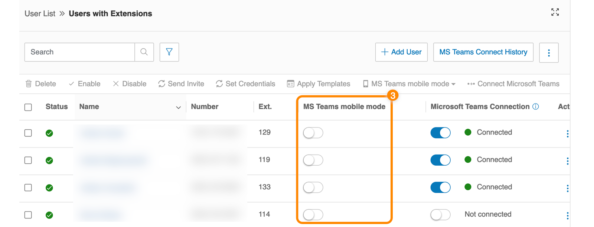
You can set up the app for users in bulk by checking the boxes next to their names, then clicking **MS Teams mobile mode** → **Enable**.
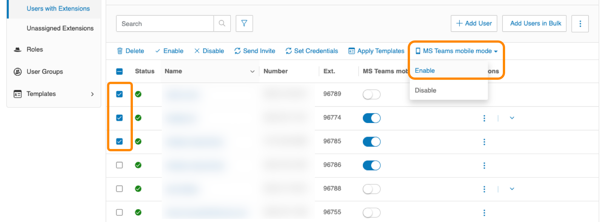

## Installing the embedded app using Microsoft Azure {#installing-the-embedded-app-using-microsoft-azure}

To remotely install the embedded app, you must have the following permissions:

| RingCentral | Microsoft 365 |
|-------------|----------------|
| **Super admin**  *and*  **User admin** | **Global admin**  *or*  **Privileged roles** |

### Prerequisites to use RingCentral for Teams

Supported operating systems (OS) for the desktop and web version of RingCentral for Teams embedded app include:

- Windows 10, or later  
- macOS 10.15 (Catalina), or later  

The app won’t work on these operating systems due to framework upgrades:

- Windows 7, 8, and 8.1  
- macOS 10.13 and 10.14  

Make sure to turn on all required permissions from your Microsoft Teams admin center.

- Check that [third-party apps can be added](https://learn.microsoft.com/en-us/microsoftteams/manage-apps#manage-org-wide-app-settings) to the organization’s Teams app.  
- Make sure the RingCentral app is [allowed under **Manage apps**](https://learn.microsoft.com/en-us/microsoftteams/manage-apps#allow-or-block-apps) in the Teams admin center.  

Please refer to [**RingCentral Network Requirements**](https://support.ringcentral.com/article-v2/Network-requirements.html?brand=RingCentral&product=RingEX&language=en_US) for the firewall and web proxy configurations required for Teams and RingCentral to operate correctly.

---

## Getting credentials from Microsoft Azure

1. Sign in to the [Microsoft Azure portal](https://portal.azure.com).
2. Click **App registrations** under Azure services.

!!! note
    If you don’t see **App registrations**, click **More services**. Search for, then click, **App registrations**.

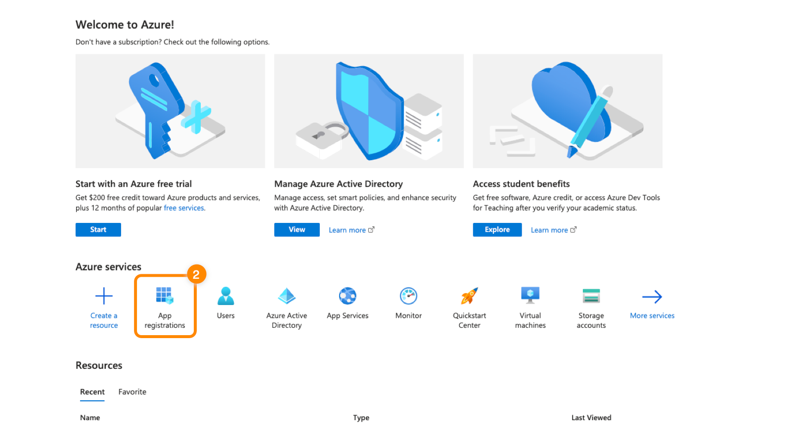

3. Click **New registration**.

    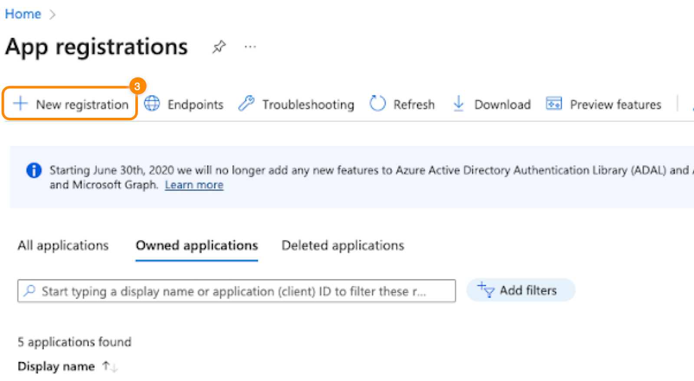

4. Enter an app name (for example, **RingCentral for Teams**).

5. Under **Supported account types**, select **Accounts in this organizational directory only (Single tenant)**.

6. Click **Register**.

    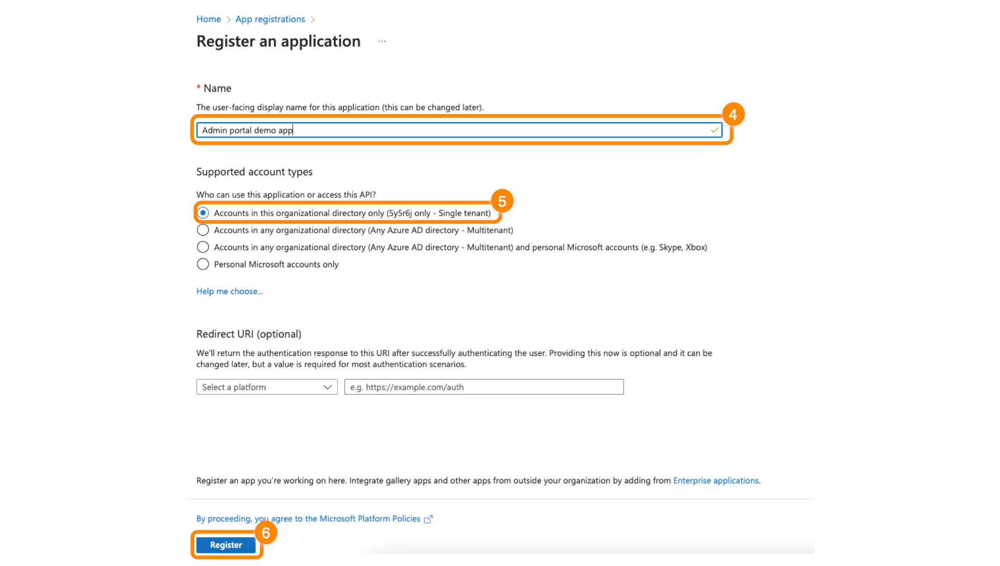

7. Once you’ve registered successfully, click **Certificates and secrets** in the **Manage** menu on the left.

8. Click **New client secret**.

    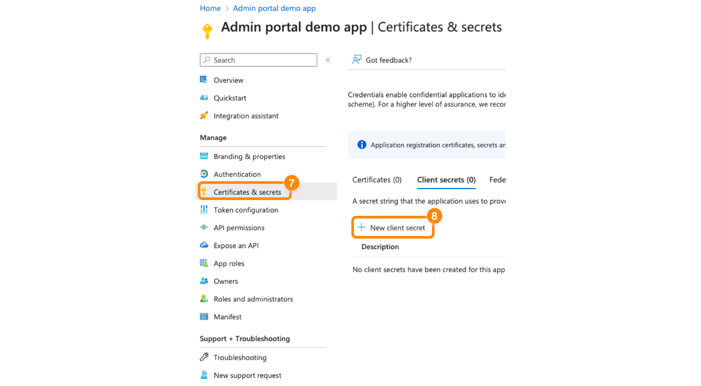

9. In the popup, enter a description and select an expiration date from the dropdown, then click **Add**.

!!! note
    The expiration date is the date by which you need to update the client secret in Microsoft Azure. The RingCentral Admin Portal will remind you seven days before the expiration date.

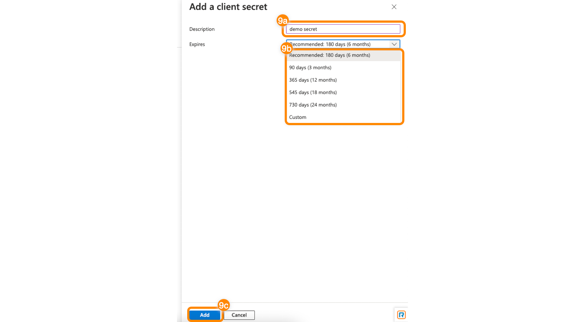

10. Copy the **Expires** and **Value** information and paste it into a text document.

11. Click **API permissions**.

12. Click **Add a permission**.

    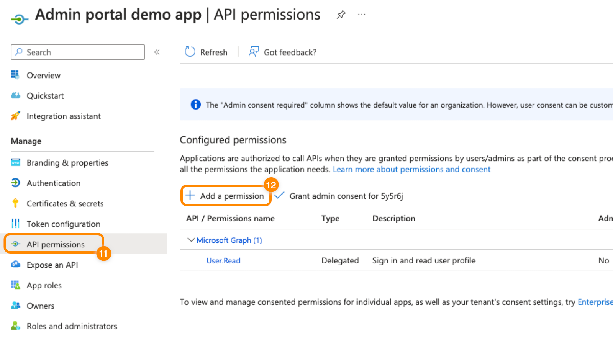

13. Click **Microsoft Graph**.

    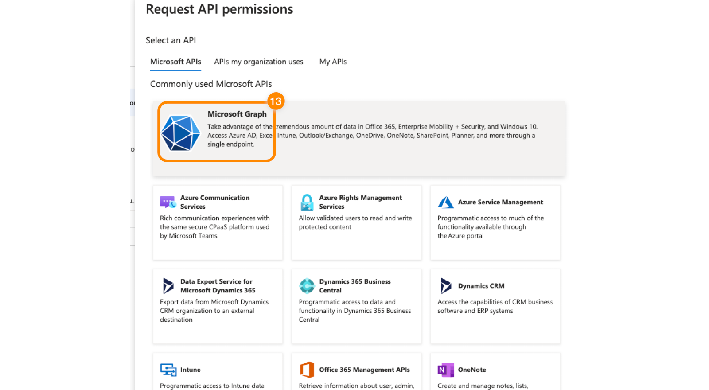

14. Click **Application permissions**.

15. Search for and check the boxes next to the following permissions:

**Mandatory permissions**

- **`Contacts.Read`** — Syncs personal contacts from the Azure Directory to the RingCentral for Teams embedded app.
- **`OrgContact.Read.All`** — Syncs Azure Directory contacts with the RingCentral for Teams embedded app.
- **`User.Read.All`** — Maps RingCentral and Teams users so that Teams personal contacts sync with the correct users to make sure message notifications triggered by RingCentral go to the correct users.

**Optional permissions**

- **`TeamsAppInstallation.ReadWriteForUser.All`** — Allows the RingCentral Admin Portal to install and uninstall the RingCentral for Teams embedded app for selected users in your Microsoft account.
- **`Contacts.ReadWrite`** — Syncs personal contacts from the Azure Directory with the RingCentral for Teams embedded app, and allows you to create and update these contacts.

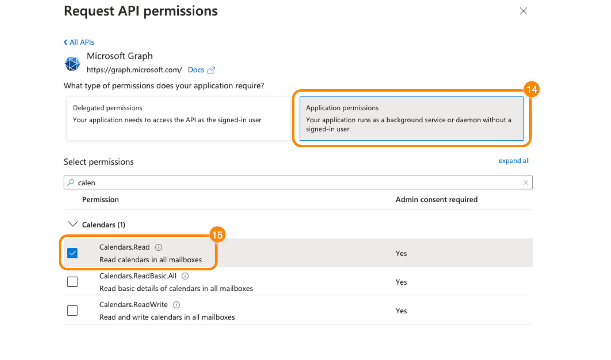

16. Click **Add permissions**.

17. Click **Grant admin consent**.

    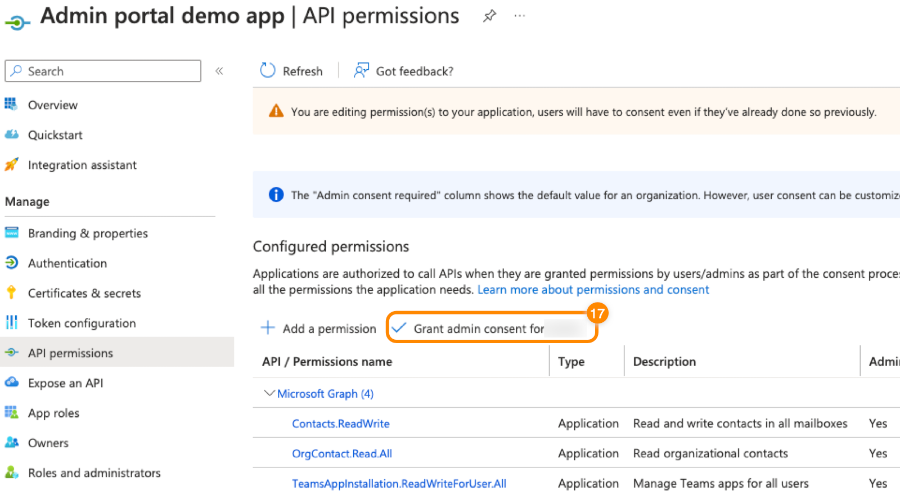

18. Click **Yes** in the popup window. You’ll see a success message in the top right corner when admin access has been granted.

19. Click **Overview** in the left menu.

20. Copy the **Application (client) ID** and **Directory (tenant) ID** and paste them into the text document you created in step 10. You’ll input these credentials in the RingCentral Admin Portal to complete the authentication process and continue with the installation of the embedded app.

    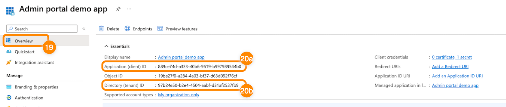

!!! tip
    You can add the permissions required for the Embedded app and presence sync to a **single** app registration in MS Azure. Once that is complete, connect the app registration to both the Embedded app and presence sync settings in the Admin Portal.

### Connecting multiple RingCentral accounts to one Microsoft 365 account

If your company uses multiple RingCentral accounts with a single Microsoft 365 account and wants to install the RingCentral for Teams app for all users, connect each RingCentral account to Microsoft 365 individually using the previous steps.

---

## Authenticating RingCentral with Azure credentials

1. [Sign in to the RingCentral Admin Portal.](https://service.ringcentral.com/)
2. Click **More** → **Account Settings** → **Microsoft Teams**.
3. Click the **Embedded App** tab.
4. Click **Connect via Microsoft Azure**.
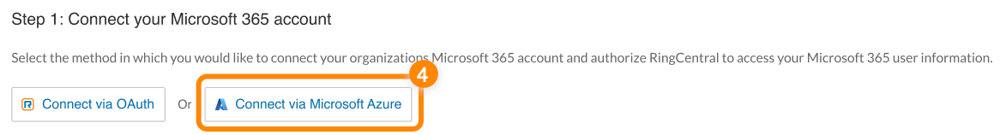
5. Under step 1, select **Connect via Microsoft Azure**.
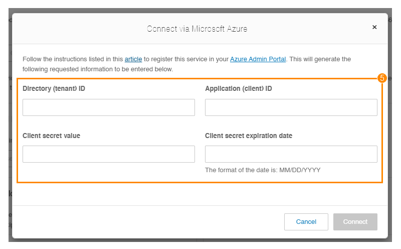
6. Paste the values from your text document into the appropriate fields.
7. Enter the information needed in the **Connect via Microsoft Azure** popup.
8. Click **Connect**.

You can also [connect multiple Microsoft 365 tenants to your account](embedded-app-multiple-m365-tenants.md).

---

## Installing the embedded app {#installing-the-embedded-app-azure}

On the **Embedded app** tab, select who you want to install the app for:

- **All users**  
- **Multiple users**  
- **A single user**  

If you’re going through Step 2 for the first time, you’ll only see the first two buttons as shown below.

Once the embedded app is installed, a table will appear with the installation status and other details. You can always select more users if you don’t install the app for all users.

Before proceeding, ensure the username (user principal name) and email address for a user’s Microsoft and RingCentral account match. If they don’t match, the embedded app won’t display:

- Chat notifications for missed communications.  
- Personal contacts from their Microsoft contact directory.  

For accounts with more than 15,000 user profiles, the Admin Portal will redirect you to [install the embedded app using the Teams admin center](embedded-app-teams-admin-center-install.md).

!!! note
    If you haven’t granted the `TeamsAppInstallation.ReadWriteForUser.All` permission, which lets RingCentral install the embedded app, then step 2 will be disabled.  

You can choose to add this permission in your Azure Admin Portal and try again. Alternatively, you can install the RingCentral embedded app from the Teams admin center.
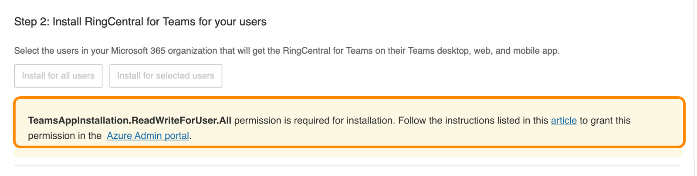

### Install the embedded app for all users

1. Click **Install for all users**. You’ll see an **Installing** message appear. Depending on the network and number of users, it might take several minutes.
2. Once completed, you’ll see a confirmation message with a summary of the installation. Click **OK** to view the user table.

The table includes the installation status, users with the app installed, and the ability to sort or filter the table.

Additionally, you’ll receive an email containing the installation summary and more details.

### Install the embedded app for selected users

To add the embedded app to Teams for a specific set of users:

1. Click **Install for selected users**.
2. Check the boxes next to the users for whom you want to install the embedded app.
3. Click **Install**.

You’ll see an **Installing** message. Once the embedded app is installed for all users, a table will appear with the complete list.

### Install the embedded app for a single user

You can install the embedded app for a single user from the table under Step 2. Click **Install** at the far right to add the embedded app to one user’s Teams app.

!!! important
    Make sure the Microsoft Teams Admin Center isn’t blocking third-party apps, either directly or through group policies, as this can prevent installation.

To check your organization-wide settings in the Teams Admin Center:

1. Go to **Teams apps**, then click **Manage apps**.
2. Click the **Actions** dropdown.
3. Select **Org-wide app settings**.
4. Make sure the **Let users install and use available apps by default** toggle is on.

### Manually refresh the user list

Whenever users are added or removed from your Microsoft organization, you can refresh the user table.

During the refresh, all buttons in Step 1 and Step 2 will be temporarily disabled. However, you can still view, sort, search, and filter the user table.

Refreshing might take several minutes, depending on the number of users in your organization.

### Uninstalling the embedded app

If you want to remove the embedded app from one or more users, click **Uninstall** to the far right of their name.

The **Uninstall** link only appears if the embedded app was already installed previously.

### Pin the RingCentral embedded app

For quick access, you can [pin the RingCentral embedded app](https://support.microsoft.com/en-us/office/pin-an-app-for-easy-access-in-microsoft-teams-3045fd44-6604-4ba7-8ecc-1c0d525e89ec) within your users’ Teams app.

---

## Download the desktop plugin and enable mobile mode {#download-the-desktop-plugin-and-enable-mobile-mode-azure}

### Downloading the plugin

RingCentral also offers a desktop plugin to make and receive phone calls, and manage active call controls. You can download the plugin under Step 2, then leverage your company’s end-point management solution to remotely install the plugin on your users’ computers.

You can also download the plugin packages using the links below:

- [For Windows](https://teams.ringcentral.com/assets/desktop-plugin/rc/latest/windows/RingCentralForTeamsDesktopPlugin-admin.msi) (MSI Format)  
- [For MacOS](https://teams.ringcentral.com/assets/desktop-plugin/rc/latest/mac/RingCentralForTeamsDesktopPlugin-admin.pkg) (PKG Format)  

### Setting up mobile mode

Admins can set up a mobile mode for users in their organization to make and receive calls within the RingCentral for Teams mobile app. The mobile mode provides a focused call-only experience.

Any message, video, and other RingCentral features are hidden in the app so the user can focus on phone tasks.

To apply the mobile mode:

1. Click the toggle to turn on **Show custom view**.

    !!! note
        You must be a user admin or super admin to perform this task.

2. Click **Go to User List**.

    If you don’t see the toggles immediately after navigation, refresh the page and check again.

3. Click the toggle to turn on **MS Teams mobile mode** for selected users.

You can set up the app for users in bulk by checking the boxes next to their names, then clicking **MS Teams mobile mode** → **Enable**.

---

## Updating the Azure secret value and expiration {#updating-the-azure-secret-value-and-expiration}

When your secret value expires, you’ll need to create a new secret value and expiration date.

1. Sign in to the [Microsoft Azure portal](https://portal.azure.com).
2. Click **App registrations** under Azure services.

!!! note
    If you don’t see **App registrations**, click **More services**. Search for, then click, **App registrations**.

3. Click the name of the registration you created.

    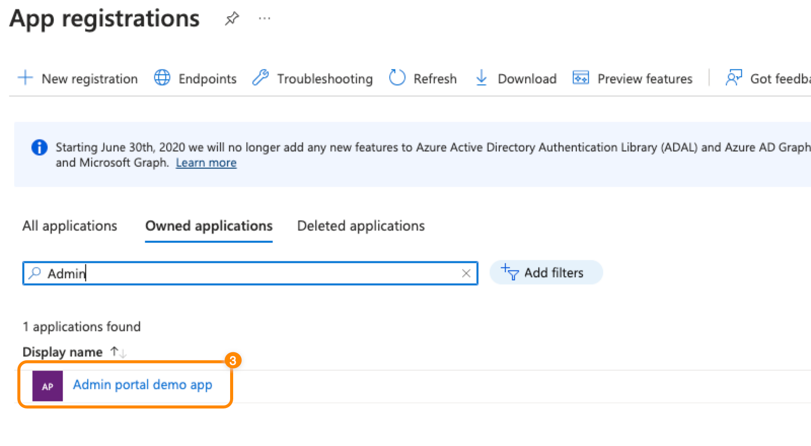

4. In the left menu, click **Certificates and secrets**.

    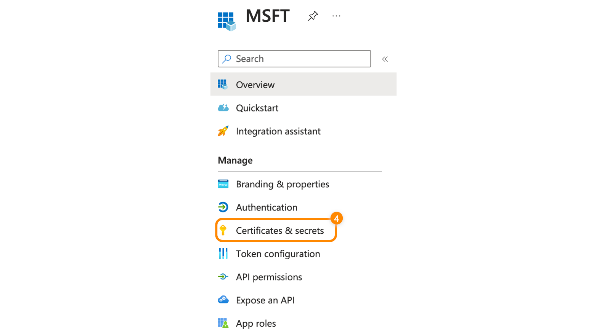

5. Click **New client secret**.

6. In the popup, enter a description and select an expiration date from the dropdown, then click **Add**.

7. Copy the new **Value** and **Expires** information and paste it into a text document.

8. Sign in to the RingCentral Admin Portal.

9. Click **More** → **Account Settings** → **Microsoft Teams**.

10. Click the **Embedded App** tab.

11. Click **Update secret**.

12. Paste the **Client secret** and **Client secret expiration date** from your text document into the appropriate fields.

    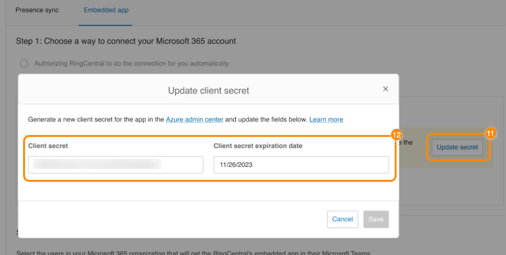

13. Click **Save**.

!!! note
    Whenever you update the app registration (new client secret or new permissions), it may take several minutes for Microsoft to sync the changes with RingCentral. Please allow a few moments before making further changes or installing the embedded app.

---

## Related

- [RingCentral for MS Teams overview](index.md)  
- [Teams Embedded App — User Guide](embedded-app-user.md)  
- [Presence Sync — Admin Guide](presence-sync-admin.md)  
- [General Questions — Microsoft Teams](questions.md)  
- [Log Collection](log-collection.md)
