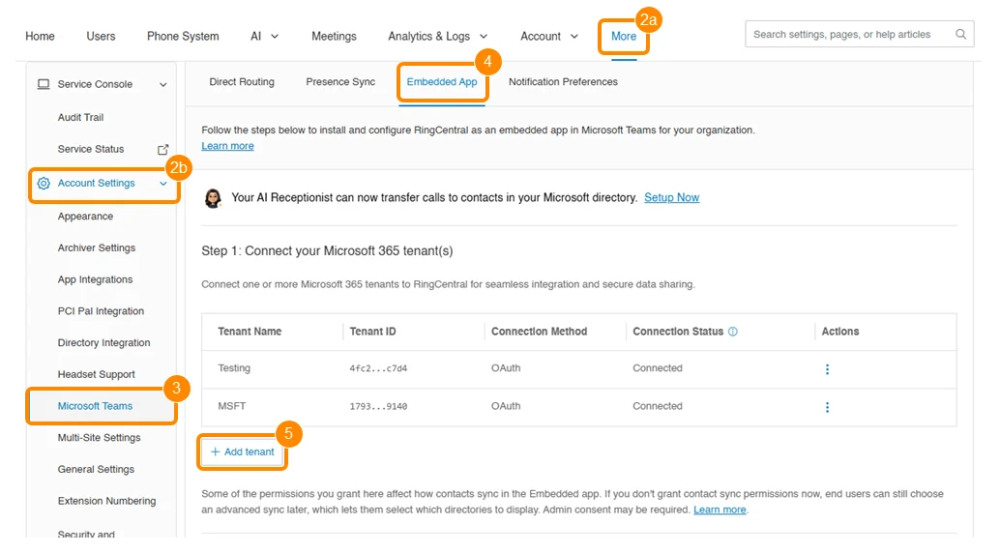
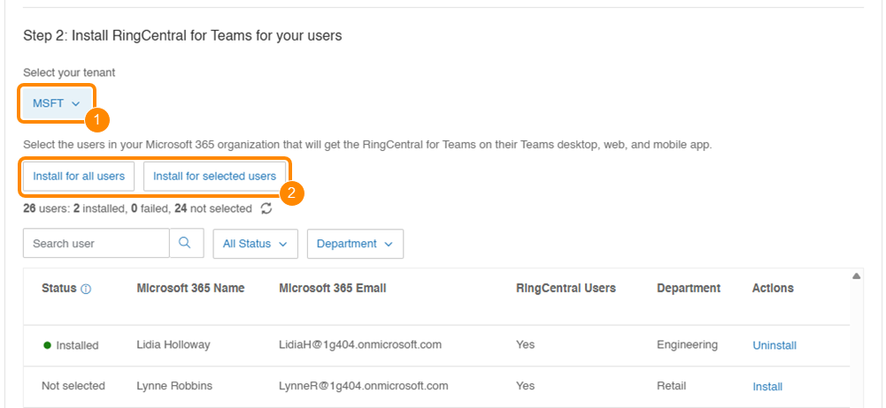

# Connecting multiple Microsoft 365 tenants to a single account

You can connect multiple Microsoft 365 (Microsoft Entra) tenants to a single RingCentral account when installing the RingCentral for Microsoft Teams embedded app for users. This allows centralized management across business units, subsidiaries, or managed clients.

With multi-tenant support, you can:

- Let each tenant manage its own authorization.
- Install and deploy the embedded app on each tenant with user-level control.
- Monitor connection statuses like expired tokens and upcoming client secret expiration.
- Manage all tenants centrally from the Admin Portal.

Connecting your Microsoft 365 tenants

Admins must have global or privileged role admin permissions to authorize Microsoft 365 tenants. To connect multiple tenants to your account:

1. Sign in to the [Admin Portal](https://service.ringcentral.com/).
2. Click More (a), then go to Account Settings (b).
3. Click Microsoft Teams.
4. Click the Embedded App tab.
5. Click Add tenant.

    

    Add tenant Microsoft Teams embedded app

6. Select a connection method:

    - [Connect via OAuth](embedded-app-admin.md#install-using-oauth)
    - [Connect via Microsoft Azure](embedded-app-admin.md#installing-the-embedded-app-using-microsoft-azure)

7. Sign in with your Microsoft 365 global admin credentials.
8. Click Authorize RingCentral.

Once connected, the tenant will show in your list. Repeat these steps to add more tenants.

Managing tenants from the Admin Portal

From the Embedded App tab, you can:

- View all connected tenants.
- Filter tenants by name or connection status.
- Sign out from or update client secrets for tenants.
- Monitor authorization status.

Tenant connection status indicators

You can view the connection status of each Microsoft 365 tenant you add to your account.

| Status | Description | Action needed |
|--------|---------------|---------------|
| Connected | The sign-in and authorization are complete with valid credentials. | None |
| Not authorized | The admin is signed in, but authorization is missing or expired. | Authorize RingCentral to install the app for your users. |
| Not connected | The admin is signed out, but the metadata is retained. | Reauthenticate the connection to the tenant. |
| Connected - expiring | The app-based auth client secret is nearing expiration. | Update the client secret to stay connected. |
| Client secret expired | The app-based auth client secret has expired. | Update the client secret to reconnect. |

Note

Each tenant must complete its own OAuth authorization.

Duplicate tenant connections will be blocked automatically.

Expired auth tokens will trigger a reauthorization prompt in the Admin Portal.

Signing out from a tenant will disconnect the tenant and disable app access for users.

If the Add tenant option doesn’t appear in your account, clear your browser cache and refresh the page.

Installing the app for your users

To install the embedded app for users in each tenant:

1. Click the Select your tenant dropdown and choose a connected tenant.
2. Select an installation option:

    - Install for all users
    - Install for selected users

    

    Install app Microsoft Teams embedded app

3. Monitor the installation status for the users. The Status column will show Installed, Failed, or Pending for all or selected users.

Visit [Installing the RingCentral for Teams embedded app using Microsoft Azure or OAuth](embedded-app-admin.md) to review how to download the desktop plugin and set up Teams mobile mode.
