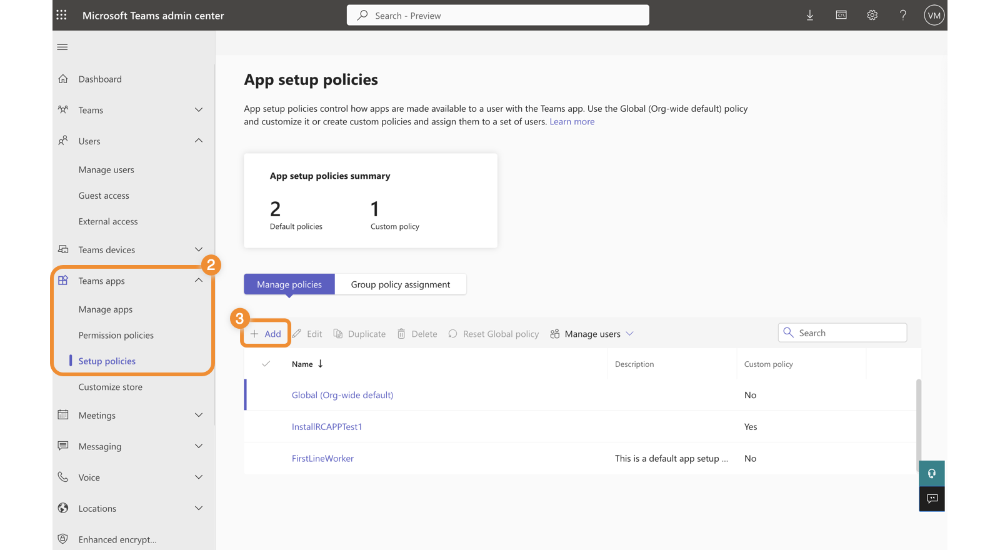
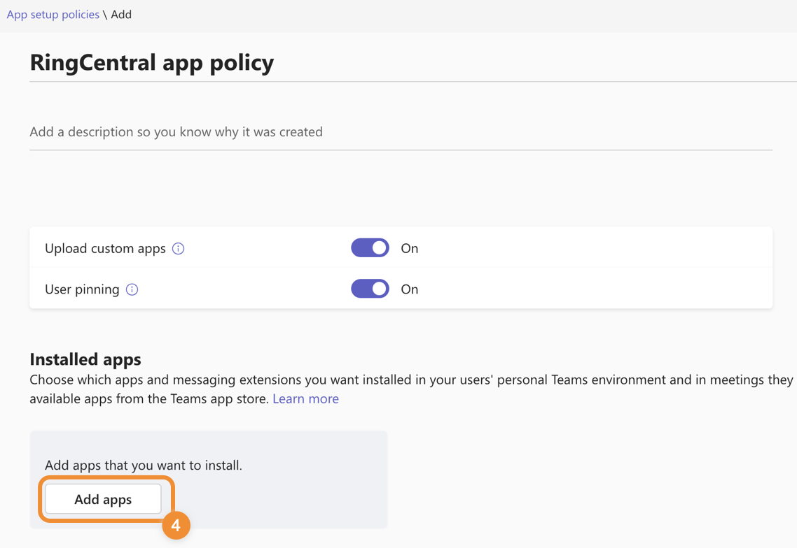
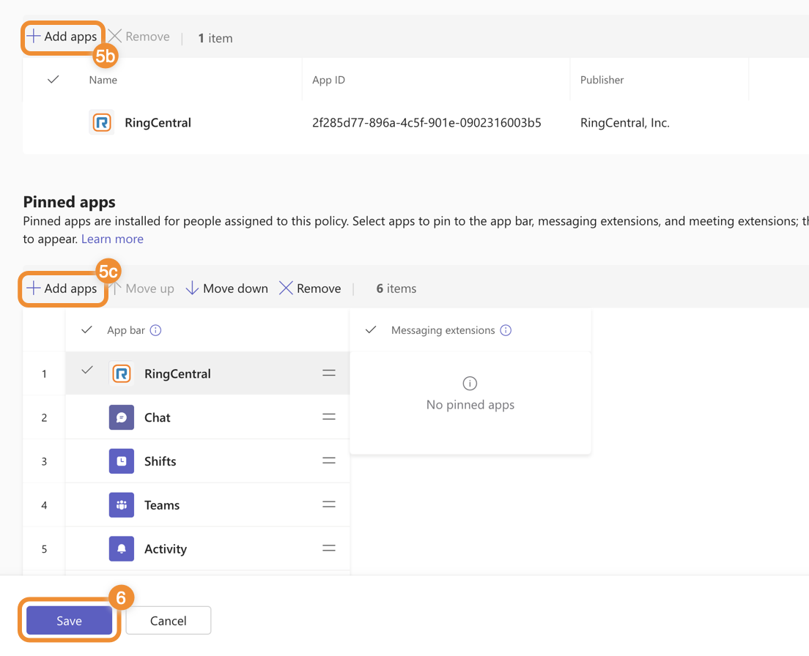
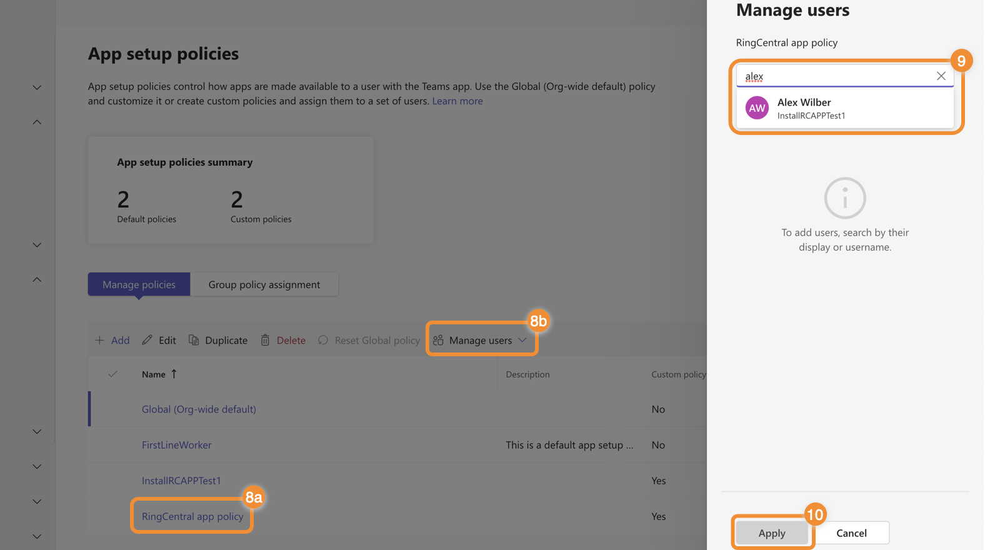

# Installing the RingCentral embedded app from the Teams admin center

Administrators can remotely install the embedded RingCentral app for Microsoft Teams to users in their organization using the [Microsoft Teams Admin Center](https://admin.teams.microsoft.com/). The embedded app will be installed on the user's desktop and web versions of the Teams app.

## Requirements

As part of Step 2 mentioned in the RingCentral Embedded App for Teams Admin Guide, if your account has more than 15,000 users, you’ll be directed to the Microsoft Teams admin center from the RingCentral Admin Portal to complete the installation. Then, you can proceed to Step 3 after the installation completes.

## Installing the embedded app

1. Go to the [Microsoft Teams admin center](https://admin.teams.microsoft.com/) and sign in.

Note: Ensure you have the following administrator permissions to manage the policies required for installation: Global Administrator or Priviledged roles administrator + Teams administrator.

To learn more about the policies and permissions required, please refer to the [Microsoft Teams permission documentation](https://learn.microsoft.com/en-us/microsoftteams/teams-app-permission-policies).

2. From the left menu, go to Teams apps > Setup policies.

3. Click Add to create a new policy.

4. Enter a policy name and description, then click Add apps.

5. Search for RingCentral, then click Add.

Note: You can move the app to the Pinned app bar so users in your organization can find the RingCentral embedded app easily within their Teams desktop, web, and mobile apps (optional).

6. Click the Save button to create your new policy.

7. In the left menu, go to Teams Apps > Setup policies.

8. Click the policy you created, then select Manage users.

9. Type in the user or group name, then click it in the dropdown to add to the policy. Repeat as needed for all users and groups you want included in the policy for the embedded app.

Once you set up the policy, users in your organization will see RingCentral embedded app installed in their Teams app.
