# Using the RingCentral for Microsoft Teams embedded app

The RingCentral for Teams embedded app lets you communicate and collaborate with team members by placing phone calls, managing call queues, looking up contacts, and more.

Features include:

- A redesigned user experience in the Teams desktop and web apps.
- Unified contact search across RingCentral and Teams directories.
- Integrated SMS and fax capabilities.
- Notifications for missed calls, new texts, and new voicemails.
- Ability to customize RingCentral phone settings within Teams.

## Prerequisites for installing the RingCentral for Teams embedded app

Before installing the RingCentral integration for Microsoft Teams, make sure you’ve installed these applications:

- [Microsoft Teams desktop or web app](https://www.microsoft.com/en-us/microsoft-teams/download-app)
- [RingCentral for Microsoft Teams embedded app](https://www.ringcentral.com/microsoft-teams.html)
- [RingCentral for Microsoft Teams desktop plugin](https://support.ringcentral.com/download.html)

Supported operating systems:

- Windows 10, or later
- macOS 10.15 (Catalina), or later

!!! note
    Due to the May 2023 Electron framework upgrades for RingCentral for Teams, the integration won’t function on these operating systems:

    - [Windows 7, 8 and 8.1](https://www.electronjs.org/blog/windows-7-to-8-1-deprecation-notice)
    - [Mac 10.13 and 10.14](https://www.electronjs.org/docs/latest/breaking-changes#removed-macos-1013--1014-support)

Supported Microsoft 365 licenses for RingCentral for Teams 2.0 desktop and web versions:

- Enterprise E1, E3, and E5
- Business Standard and Business Premium
- Frontline F1 and F3

!!! note
    Due to recent changes by Google Chrome as part of the [Privacy Sandbox project](https://privacysandbox.com/), RingCentral for Teams users will encounter issues on Chrome Version 113 and below. To minimize the impact of this conflict:

    - Update your Chrome Browser to the [latest version](https://chromereleases.googleblog.com/).
    - Per your company policies, allow [third-party cookies for websites](https://support.google.com/chrome/answer/95647?hl=en&co=GENIE.Platform%3DDesktop&oco=0#zippy=%2Callow-or-block-third-party-cookies:~:text=Change%20your%20cookie%20settings).

You can use the RingCentral for Teams embedded app in full or companion mode. The full mode includes all RingCentral's telephony features if your users do not have Microsoft Teams phone licenses. The [embedded app companion mode](embedded-app-user.md#using-the-ringcentral-for-teams-embedded-app-in-companion-mode) is used with the [Direct Routing 2.0 integration](https://support.ringcentral.com/article-v2/Enabling-direct-routing-in-RingCentral-and-Microsoft-Teams.html?brand=RingCentral&product=RingEX&language=en_US).

## Installing the RingCentral for Teams embedded app for desktop and web

Either you or your IT admin can install the RingCentral for Teams 2.0 embedded app. We recommend that your [IT admin install the embedded app](embedded-app-admin.md), as they can grant the necessary permissions that let you access all available features.

### Launching the embedded app once installed by IT admin

If your IT admin has installed RingCentral for Teams:

1. Find the app by clicking the three-dot More icon in the left menu of the Teams app.

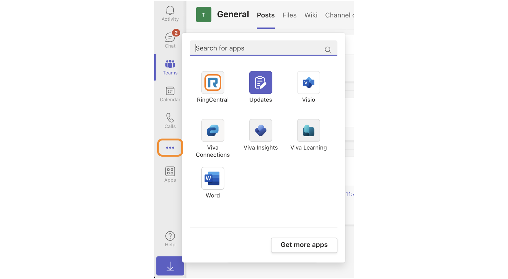

2. Click the RingCentral icon to open the app.

3. Right-click the icon, then select Pin. This adds the app launcher to the main menu bar.

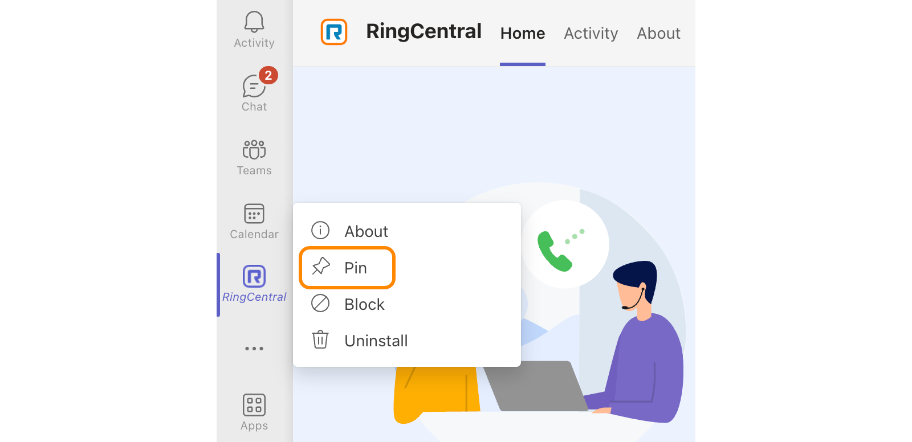

### Adding the embedded app yourself

You can search for and add the RingCentral embedded app within the Teams desktop or web app.

1. In the left menu, click Apps (a). Alternatively, click the three-dot More icon (b) in the left menu, then click Get more apps (c).

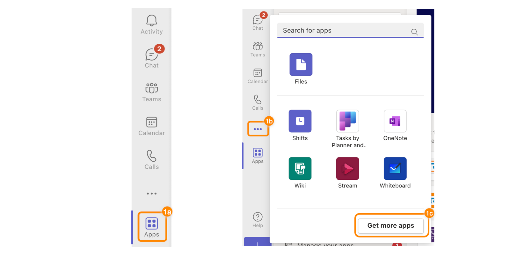

2. Search for RingCentral.

3. At the top right of the search result tile, click Add.

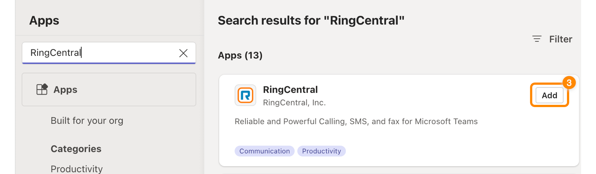

As an alternative to the process above, you can install the embedded app for Teams from [Microsoft AppSource](https://appsource.microsoft.com/en-us/product/office/WA200000135?exp=ubp8), then contact your IT admin for permission to use the embedded app. [Learn more about installing the RingCentral for Teams 2.0 integration using Azure](https://support.ringcentral.com/article-v2/Using-the-Microsoft-Team-admin-experience.html?brand=RingCentral&product=RingEX&language=en_US).

## Signing in to the RingCentral for Teams embedded app

Open the app, then click Sign in to enter your RingCentral credentials and use the app.

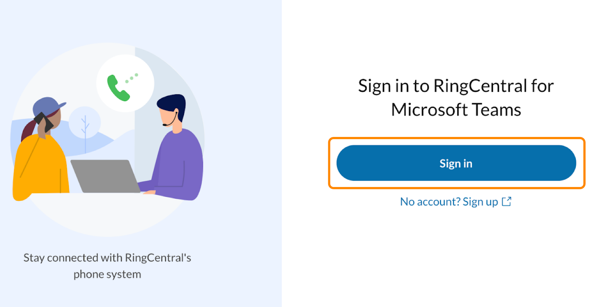

## Adding the desktop plugin and quick checks

If your IT admin hasn’t deployed the RingCentral for Teams desktop plugin, the embedded app will display this message, “To make and receive calls, you need to download and install the desktop plugin.”. Click Download to get the plugin.

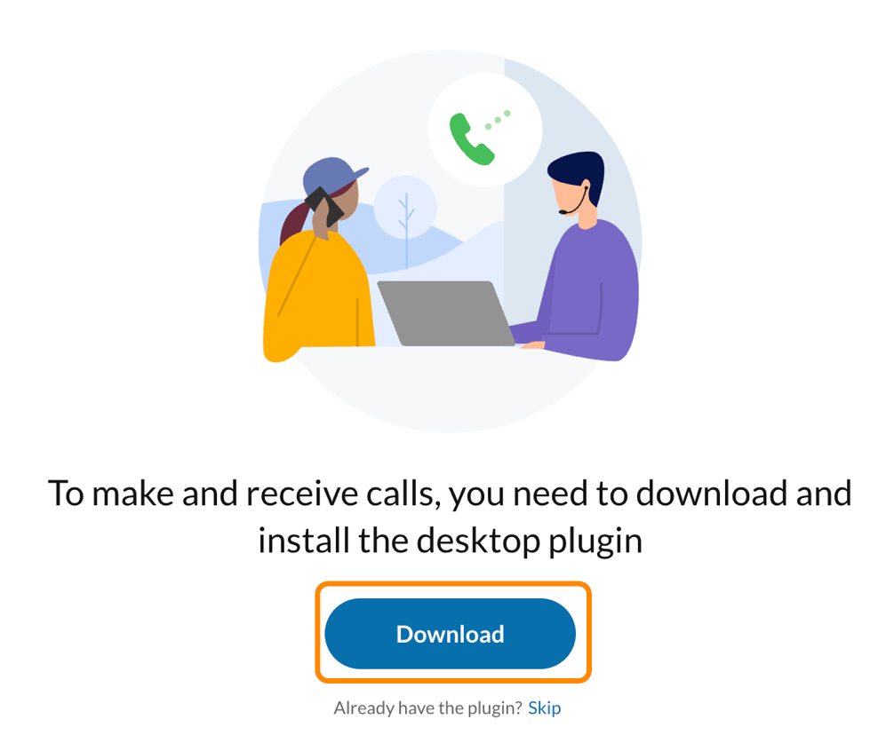

You can also access the latest plugin links on the [app downloads page](https://support.ringcentral.com/download.html): [Windows 32-bit](https://teams.ringcentral.com/assets/desktop-plugin/rc/latest/windows/RingCentralForTeamsDesktopPlugin-admin-x32.msi), [Windows 64-bit](https://teams.ringcentral.com/assets/desktop-plugin/rc/latest/windows/RingCentralForTeamsDesktopPlugin.exe), [Mac (Apple/Intel chip)](https://teams.ringcentral.com/assets/desktop-plugin/rc/latest/mac/RingCentralForTeamsDesktopPlugin-x64.pkg).

## Granting microphone access

If asked during installation, grant access to your microphone. To enable permissions:

1. Click the App permissions icon in the top right corner of the embedded app.

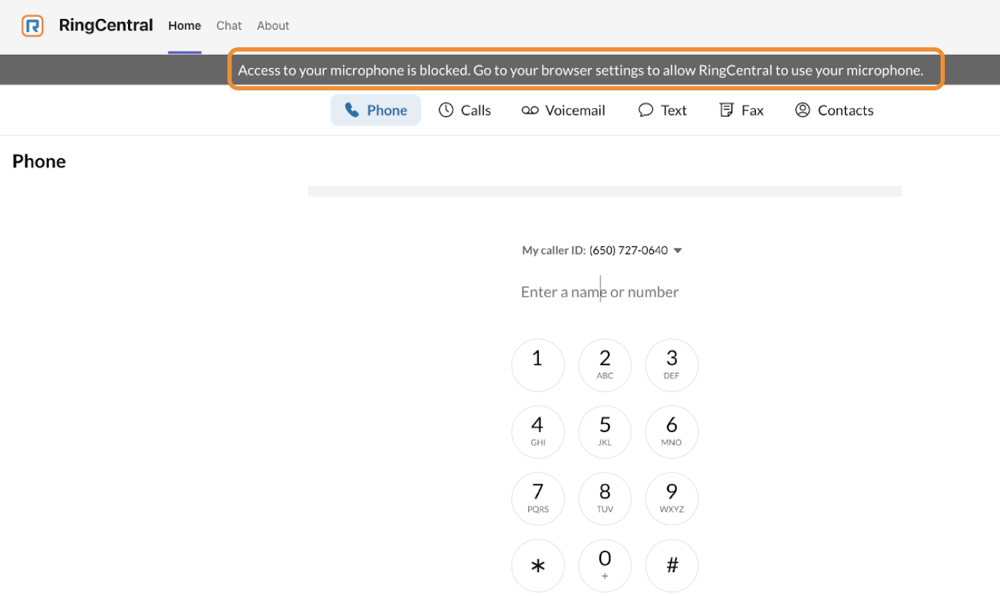

2. Click the Media (Camera, microphone, speakers) toggle on.

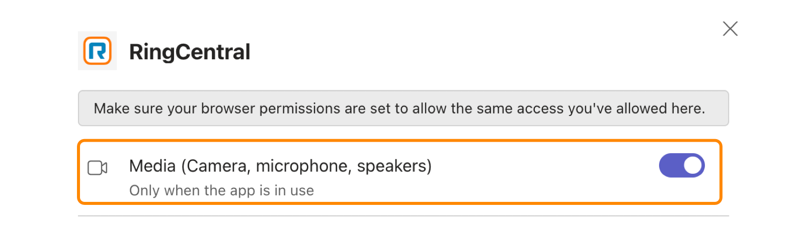

If there isn't a microphone banner in the embedded app:

- Turn on microphone access for the Microsoft Teams app in your system settings or browser settings if you use the web version of the app.
- Turn on media permissions for the embedded app from the Settings > App permissions menu in Microsoft Teams.

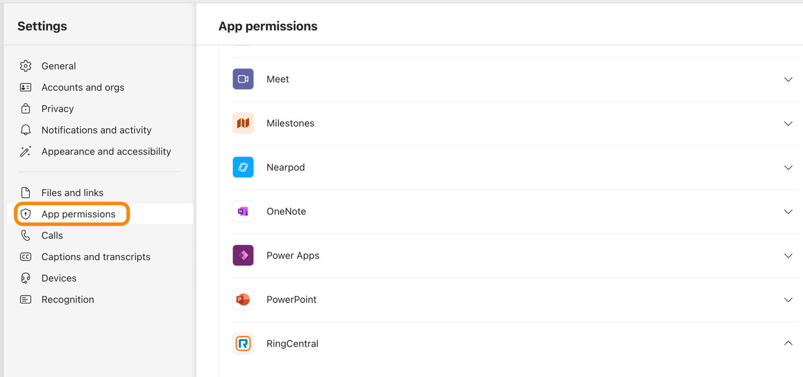

Make sure the RingCentral for Teams Desktop Plugin has permission to use your microphone in your system settings.

## Desktop plugin features

Once you’ve installed the desktop plugin, you’ll have access to these features in RingCentral for Teams.

### Auto launch

Turn on Auto launch to launch the plugin automatically when your computer boots up.

On macOS, the app icon appears in the menu bar as an R in a rounded square. Click this icon to launch the plugin.

On Windows, the app icon appears in the Start menu as an R in a rounded square. Click this icon to launch the plugin.

### Menu

The Menu feature shows you general information about the plugin. To access the menu, click the desktop plugin icon. From the menu:

- Click About to view more information about the desktop plugin.
- Click Quit to quit the desktop plugin.

!!! note
    Once you quit the plugin, the app’s inbound and outbound call features won’t function.

### Call experience

When you make an outgoing call using the embedded app, the desktop plugin will pop up and display the active call controls. Once the call ends, the plugin will return to the background.

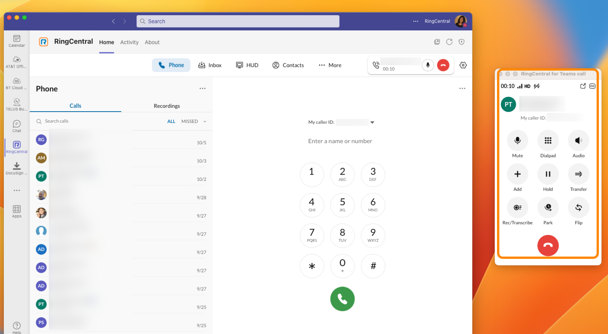

You can also initiate audio conference calls in the plugin quick actions button.

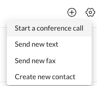

Start-a-conference-call

Click to dial

By default, the plugin lets you make calls from websites and supported apps. To turn this feature off:

1. In the RingCentral for Teams app, click the Settings icon.

2. Click Phone.

3. Scroll down to General, then click the Use RingCentral for click to dial toggle off.

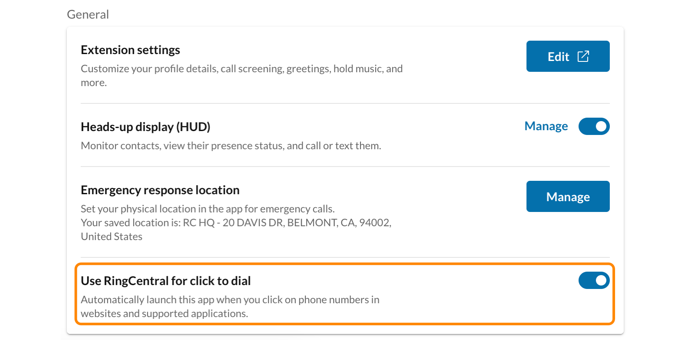

You can also use your OS settings to select the desktop plugin as your default calling app.

On macOS:

1. In the FaceTime app menu bar, click FaceTime, then Settings.

2. Under General, click the Default for calls dropdown, then select the plugin.

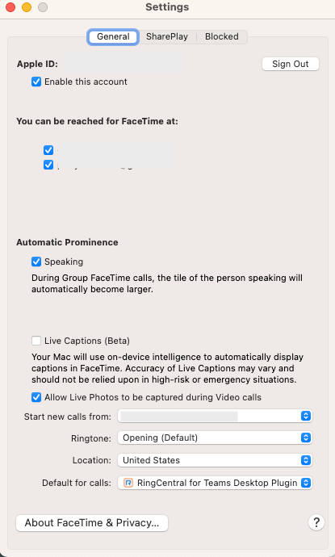

On Windows:

1. In the Start menu, click Settings.

2. In the dialog box, click Apps, then Default apps.

3. Select the RingCentral desktop plugin.

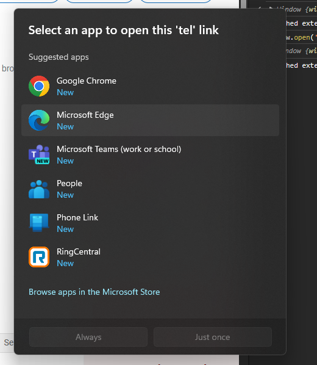

## Updating the desktop plugin

When the desktop plugin is running, a prompt in the embedded app will request that you upgrade to the latest version. Click Restart to upgrade to complete this process.

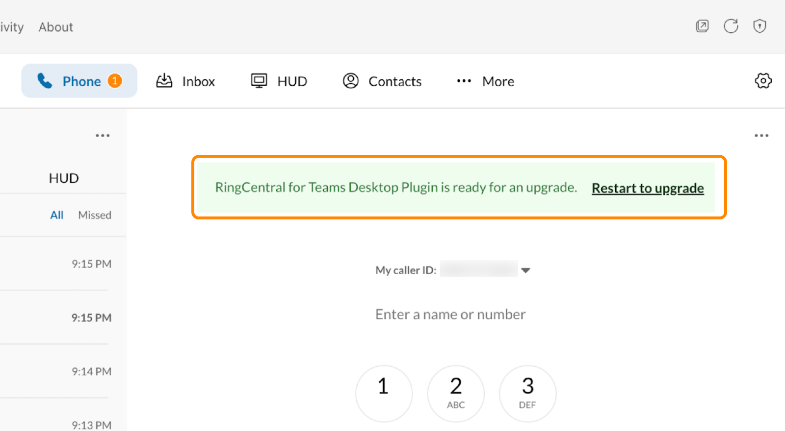

The desktop plugin icon will also display a small indicator that informs you of any available upgrades.

!!! note
    This alert won’t appear if your admin has installed your plugin. To upgrade to the latest version, contact your admin.

## RingCentral for Teams embedded app user experience

Once installed, the RingCentral embedded app will be available within your Teams app on desktop, web, and mobile.

Features of the embedded app include:

- Phone: Make and receive calls and access voicemail recordings.
- Inbox: Send, receive, and manage voicemails, texts (SMS), and faxes.
- HUD: Manage heads-up display extensions.
- Contacts: Access contacts from your personal and company directories.
- More (three-dot icon):
  - Analytics: Open RingCentral Analytics in your browser. (Availability determined by admin setup)
  - Customize: Change tab order and display settings.
- More settings (gear icon):
  - View profile: See the details of your RingCentral profile.
  - Call rules: Change call handling settings.
  - Accept queue calls: Enables call queue feature. (Availability determined by admin setup)
  - Settings: View and change embedded app settings.
  - Sign out: Log out of the embedded app.

  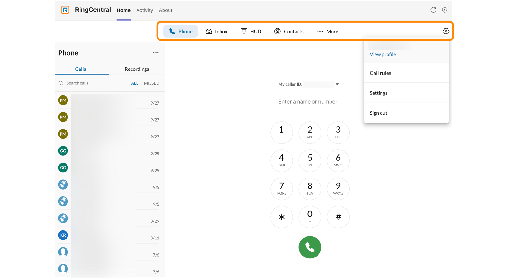

### Queue experience

If you manage queue calls, the Accept queue calls toggle in the embedded app’s Settings menu will be available. Click the toggle on to answer inbound calls.

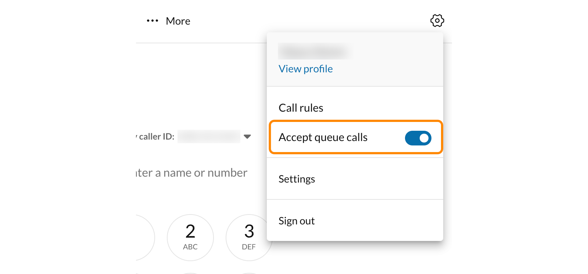

If you manage multiple calls and accept queue calls, the Manage queues option in the Settings menu will be available.

### Notifications

You can use the embedded app to receive notifications about missed calls, texts, or faxes. To access this feature, click the Activity menu. All users receive daily unread notification summaries at their local time of 8 AM. Summary notifications also appear whenever users sign in.

#### Managing notifications settings

All notifications are enabled by default for users. To manage notification settings:

1. In the RingCentral for Teams app, click the Settings icon.

2. Click Notifications.

3. For any notifications you don’t want to receive, click the toggles off.

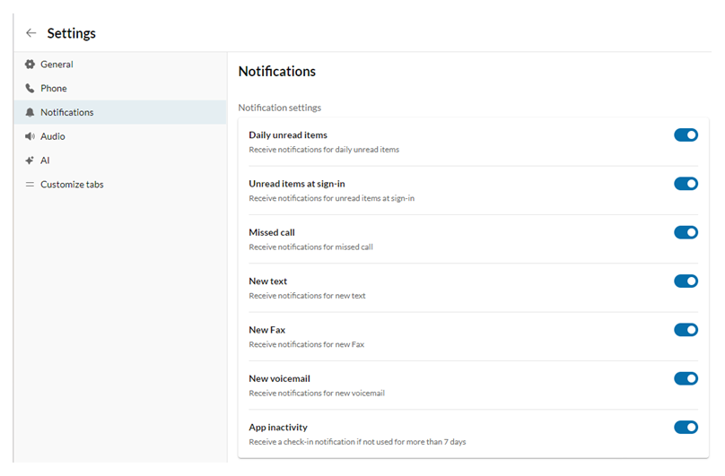

### Text message settings

You can use the embedded app to send, receive, and respond to text (SMS) messages.

To create a new SMS, click the Text tab, then click the plus (+) icon.

### Fax

You can use the embedded app to compose faxes and view your fax history.

To create a new fax, click the Fax tab, then click the plus (+) icon.

### Customizable menu bar

You can customize how the tabs appear in the navigation bar:

1. In the RingCentral for Teams app, click the Settings icon.

2. Click Customize tabs.

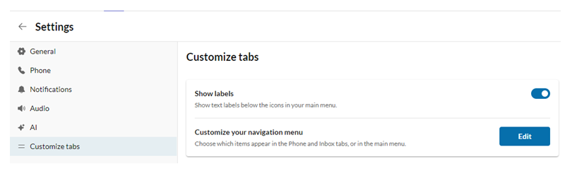

### Managing contacts

Click the Contacts tab to view your Microsoft and RingCentral contacts in the embedded app’s unified contact list.

Advanced Microsoft 365 contact sync:

You can choose which Microsoft 365 contacts are shown in the embedded app:

- Default contact list: Displays all Microsoft 365 contacts, including your company’s Global Address List, personal, and shared contacts.
- Selective contact list: Select which contacts from your company’s Global Address List, personal, and shared contacts to display.

!!! note
    Note: Admin consent is required to display the Global Address List.

Admin consent is only needed for users on your account to display the Global Address List in their RingCentral for Microsoft Teams embedded app. When a user in your organization accesses the app Settings and clicks Manage next to Advanced Microsoft 365 contact sync, the Calendar Service enterprise application is created in your Microsoft Azure Admin Portal.

To grant admin consent to the Global Address List:

1. Sign in to your Azure Admin Portal with Global Admin access.

2. Open the Calendar Service app.

3. In the navigation bar, click Permissions.

4. Click Grant admin consent for MSFT.

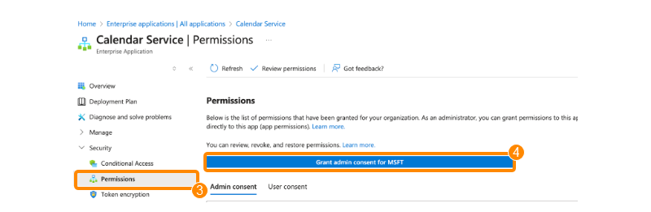

grant admin consent to the Global Address List

This setting only needs to be updated once to allow users to show or hide the Global Address List in their RingCentral app.

Create a new contact:

To create a new contact, click the Contacts tab, then the plus (+) icon.

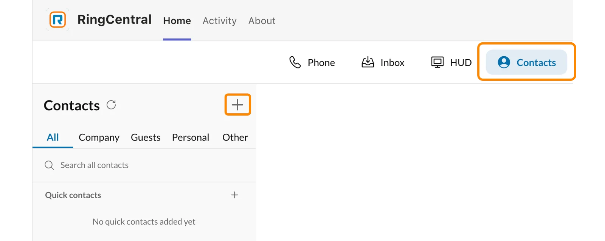

!!! note
    Note: If you don’t see all of your contacts in the Contacts tab, contact your IT admin.

## Headset support

The RingCentral for Teams embedded app and desktop plugin supports Plantronics and Jabra headsets. Once set up, you can control calls using your headset buttons or your USB human interface device (HID).

Call controls include answer/end, mute/unmute, and volume up/down.

### Minimum requirements for using headsets with RingCentral

Supported operating systems:

- Windows 7 or later
- Mac OS 10.13 (Sierra) or later

Supported browsers (latest versions):

- Chrome (Recommended)
- Firefox
- Safari
- Edge
- Chromium Edge

### How to turn on your headset with the embedded app

1. In the RingCentral for Teams app, click the Settings icon.

2. Click Audio.

3. Under Headset, click the Use headset control buttons to answer, end, and mute phone calls toggle on.

4. If you haven’t installed the Plantronics Hub or Jabra extensions, click Download App under Plantronics Hub or Jabra. These extensions are required to control calls using your headset.

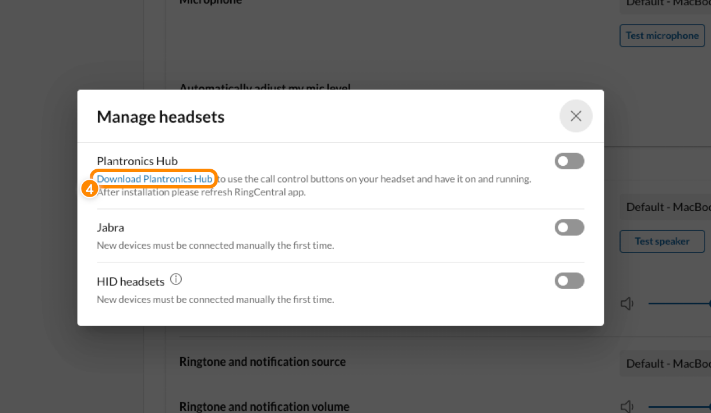

If you’re using a Jabra headset and the RingCentral app on Google Chrome, you must install:

- Jabra Chrome extension
- Jabra Chrome host app

For Plantronics, you must install the Plantronics Hub.

### Tips for supporting multiple headsets

If you have more than one headset connected to the app, the one connected last is considered the active one.

For Jabra headsets, the list of connected devices and currently active headsets are shown in the RingCentral app.

For Poly headsets, choose the active headset in the Plantronics Hub app.

### USB HID devices with the embedded app

RingCentral works with USB HIDs — headsets that connect to your computer through a USB port. You can use these headsets to control calls. The set of controls available on your device depends on the manufacturer and model.

Google Chrome 89 or later

Microsoft Edge 79 or later

#### Setting up USB HID devices

1. Connect your USB HID device to your computer.

2. Open and sign in to your RingCentral for Teams embedded app.

3. Click Settings in the upper right corner.

4. Click Audio.

5. Under Headset, click the Use headset control buttons to answer, end, and mute phone calls toggle on.

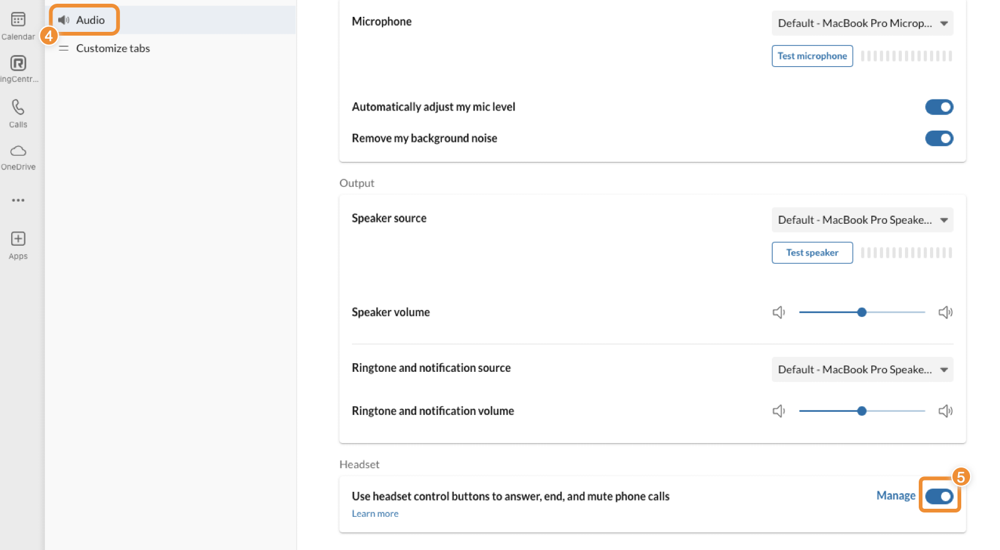

6. Click the HID headsets toggle on.

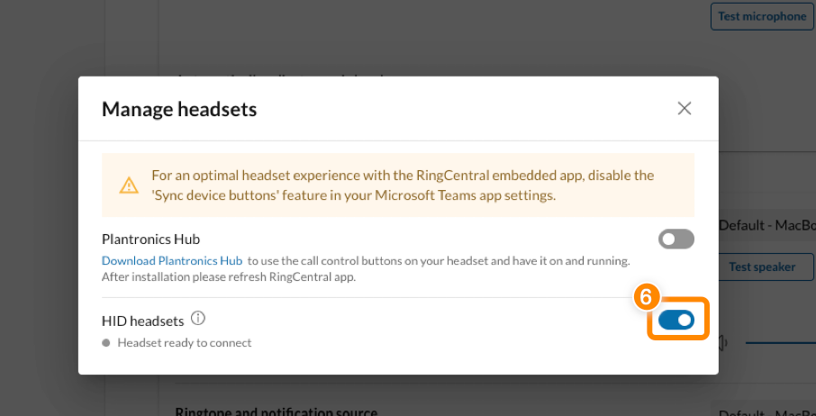

7. Click Connect.

If this is your first time connecting your device, confirm the request to connect your device to the embedded app.

## Phone settings

The embedded app offers phone settings, including default caller ID, call handling, voicemail, and audio preferences. Click the Settings icon to adjust these settings.

## Reporting issues to support

If you have problems with the embedded app or desktop plugin, please report them by filing a case.

1. In the RingCentral for Teams app, click the Settings icon.

2. Under General, click Contact Support.

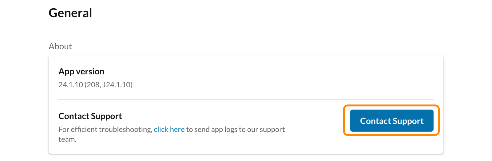

3. [Fill in all relevant information about your issue](https://support.ringcentral.com/article-v2/4362.html?brand=RC_US&product=RingEX&language=en_US).

You can also help RingCentral address your issue by automatically attaching your app logs to any cases you submit.

1. When you follow Steps 1-2 above, click the link in “For efficient troubleshooting, click here to send app logs to our support team” to download the app log.

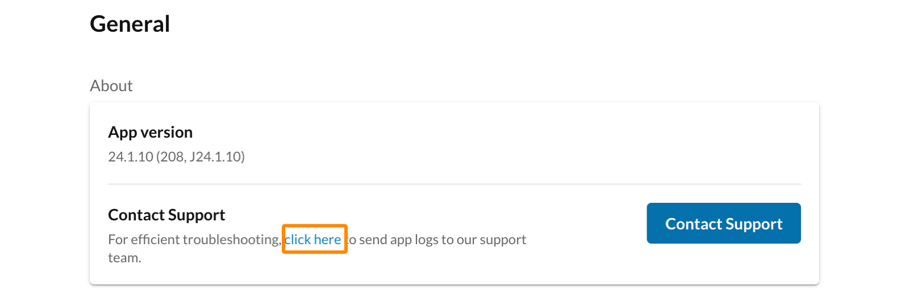

2. Attach the log when submitting your case.

## Using the Presence sync feature in the embedded app

RingCentral Presence Sync lets you display a single, current status that synchronizes across the Microsoft Teams and RingCentral apps. To learn more about this feature, visit [Understanding presence sync between Microsoft Teams and RingCentral](presence-sync-user.md).

## Using the RingCentral for Teams embedded app in companion mode

The RingCentral for Microsoft Teams Direct Routing integration allows users to make and receive calls directly within the Teams app. This integration can be paired with the companion mode of the RingCentral for Teams embedded app for access to fax services, text messaging, and advanced call history management.

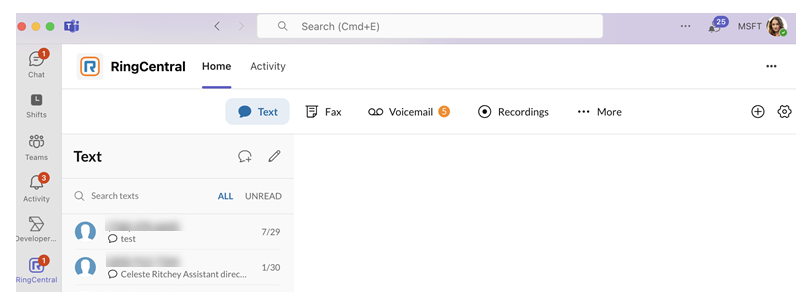

When Direct Routing is set up, the embedded app won’t display calling features to users. The companion mode is auto-detected based on your Microsoft Teams connection status in the RingCentral Admin Portal.

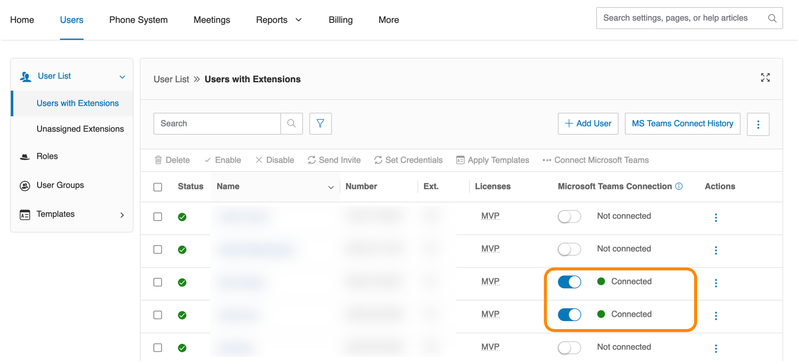

RingCentral-for-Teams-connection-status-in-Admin-Portal

You don't need to install the desktop plugin if you're using Direct Routing 2.0 with companion mode.

Follow the instructions [to install](https://support.cloudwork.bt.com/article-v2/RingCentral-s-next-generation-integration-for-the-Microsoft-Teams-desktop-and-web-app.html?brand=BT&product=Cloud_Work&language=en_US) and [sign in](embedded-app-user.md#signing-in-to-the-ringcentral-for-teams-embedded-app) to the RingCentral for Teams embedded app.
