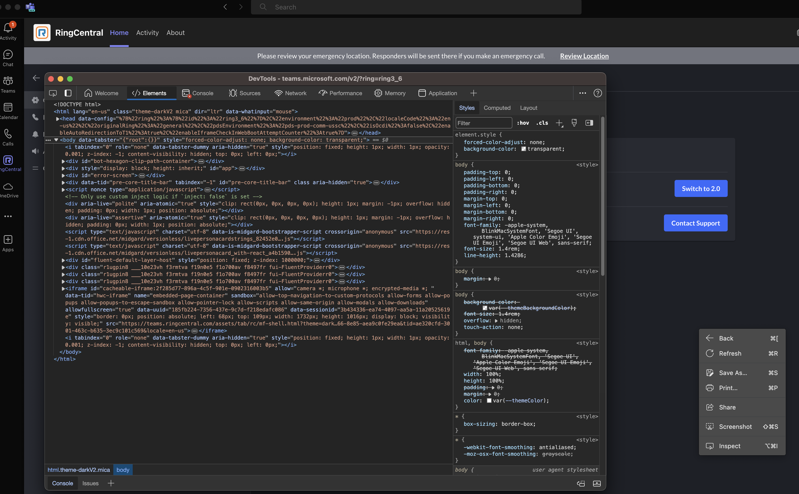
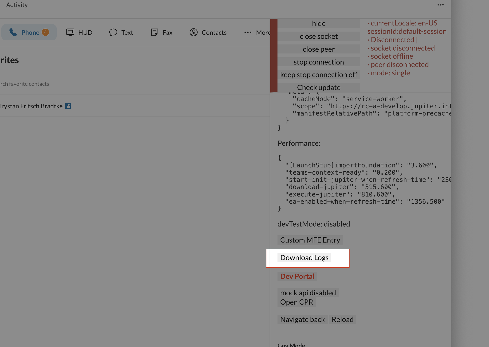
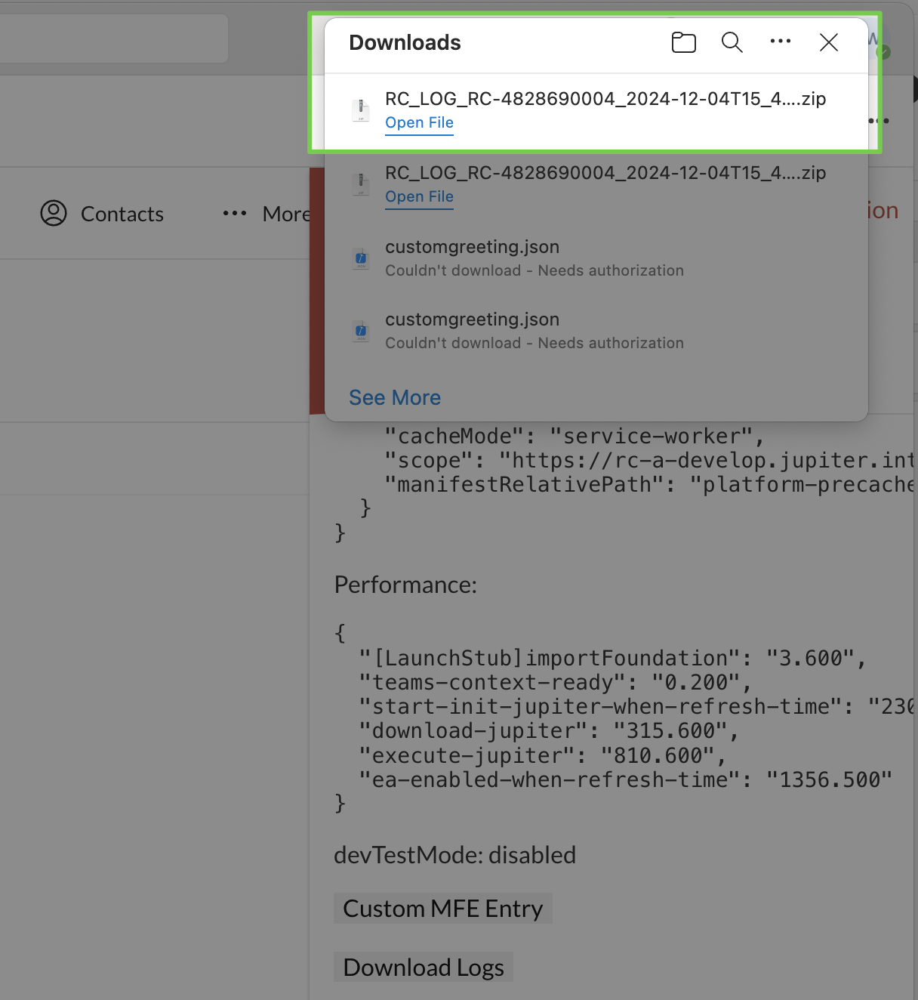
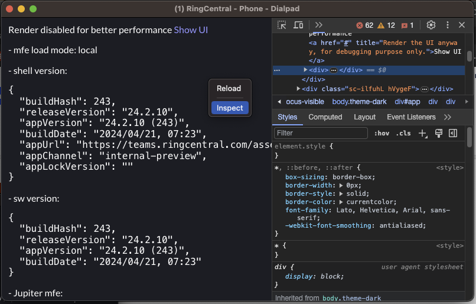

---
hide:
    - toc
---

# RingCentral for Microsoft Teams - Log Collection

## Table of Contents

- [Purpose](#purpose)
- [What is RingCentral for Microsoft Teams](#what-is-ringcentral-for-microsoft-teams)
- [Embedded App (EA)](#embedded-app-ea)
- [Desktop Plugin (DP)](#desktop-plugin-dp)
- [EA/DP](#eadp)
- [Direct Routing (DR)](#direct-routing-dr)
- [Screen Recording](#screen-recording)
- [Log Collection](#log-collection)
- [DP Logs](#dp-logs)
- [EA HAR/Console Logs](#ea-harconsole-logs)
- [Manually Download EA Logs](#manually-download-ea-logs)
- [DP Hidden UI HAR/console logs](#dp-hidden-ui-harconsole-logs)
- [DP (Windows - Exe type): Installation/Uninstallation Debug logs](#dp-windows---exe-type-installationuninstallation-debug-logs)
- [DP - Clear cache](#dp---clear-cache)
- [Log Submission via EA](#log-submission-via-ea)

---

## Purpose

This document intends to provide an overall guidance to RC personnel on the troubleshooting and log collection procedures of the RingCentral for MS Teams integration. The support members should be able to rely on this for gaining some basic understanding of how the integration works, and what logs should be collected when guiding customers to troubleshoot issues with the integration.

## What is RingCentral for Microsoft Teams

The entirety of RingCentral for Microsoft Teams is a large and complex set of front-end applications and backend services that helps to bring RC functionality into MS Teams and provide certain interoperability between the two solutions. In this document, we will focus mainly on the front-end applications as that's what most end-users will be using. The 2 primary pieces of application on the front-end is the Embedded App and the Desktop Plugin.

## Embedded App (EA)

- EA is a web app that is embedded into MS Teams clients, including web version of Teams, desktop Teams clients, and mobile Teams apps.
- EA is a thin wrapper around our RingCentral app with some features taken out: messaging (Glip) and video and more.
- EA does not run the actual web phone connection; it is mainly designed to be the visible user interface for making and managing calls.
- EA requires microphone access when the user has to manage the audio settings, otherwise microphone access for EA does not impact the phone calls themselves.

## Desktop Plugin (DP)

- DP is an electron app that runs natively on the system. This is the component that provides the actual web phone connections.
- Note that for DR users, DP is not needed as DR users make calls through the Teams native call solutions.
- Also note that there's no DP on mobile devices, customers will have to use the RC mobile app if they are not DR users.
- Because DP is the actual app that handles the phone calls, it has to have microphone access granted by the OS.

## EA/DP

- EA and DP work together to provide the full experience to the user.
- DP contains a WebSocket server to allow EA to connect to it. If this connection is blocked, then the integration will not work.
- The network requirement for this integration is the same as RC app except for the video requirement of RC app.

## Direct Routing (DR)

- DR is developed and handled by a different team. The way DR works is very different from the EA/DP solution.
- DR works by using MS Teams' own native calling capabilities, and basically setup call routing with our CloudPBX solutions so that users can make or receive calls with MS Teams' own telephony UX but routed through our telephony networks.
- If a user is configured to use DR, the most notable sign is that the dialer in EA will be missing. EA actually calls our API to check whether the user is DR enabled and hides the phone features in that case.

## Screen Recording

Screen recordings are always important, collect them whenever possible.

- When customers are reporting the issue, we should ask them to do a quick screen recording of the issue if they can do it themselves.
- Guide users to record if they need up. Tickets without recordings are more likely to be sent-back as sometimes the descriptions we see on the tickets are vague and unclear.
- When long recordings are provided in the tickets, please help to list out the timestamps that the engineers should focus on. This will greatly increase the efficiency of the engineers as they don't have to sit through the entire recording to see the problem.

## Log Collection

There are 3 primary log types listed below in the order of priority:

1. **DP Logs**
2. **EA HAR/Console Logs**
3. **DP Hidden UI HAR/Console logs**

They serve different purposes, and some can be difficult to collect. We will go through them in detail one by one.

## DP Logs

- Generally, the most important log to collect.
- Also, the easiest to collect, this should be fairly easy for customers to collect on their own as well.
- Since the web phone and call handling are all done on the DP, we can't stress enough that this is the number one item to collect.
- This should be collected regardless of the issue since it is very simple to do. The only exception is perhaps when the issue is DR related, or if the issue is on mobile devices.

**Steps:**

1. Find the DP in system tray, right click on the icon and select **About**. Then click on **"Download Log"**:

    

## EA HAR/Console Logs

This is the second important log to collect.

**Highly recommended to collect, and is mandatory for the following situations:**

- Dialer is missing (could be DR related)
- Dialer is never ready (dial button is greyed out). Regardless of what banner is showing or not showing on the dialer
- Dialer readiness flashes between ready and not ready constantly
- Any issue with features that are not strictly about making or accepting calls

**Important Notes:**

- There are 2 ways to collect this: using the new version of Teams, or using the web version of Teams
- It is important to only run 1 instance of the EA to avoid complicating the issue
- Simply navigating to a different MS Teams client tab sometimes does not fully kill the EA instance
- Make sure that there is only 1 Teams client running at a time

**Steps:**

1. Check whether the user is using web version of Teams or the desktop Teams client. Generally, we want to collect this using the app that the user uses normally. If the user is using the old version of Teams desktop client, or if the methods described to open the DevTools for the desktop client does not work, then guide the user to use the web version instead.

2. If the user is using the **new Teams desktop client**, navigate to our EA and right click anywhere in the EA and hit **"inspect"**. This should bring up the DevTools window for our EA.

    

3. If the user is using **web version of Teams** or is unable to open DevTools on the desktop client, then check which browser is being used. It's recommended to use either Chrome, or Edge browser to do this. Again, while in Teams, navigate to our EA and right click anywhere in our EA and select **"Inspect"**. Make sure to only have 1 MS Teams running at all times, if the user has to switch browsers, make sure that teams is closed on the old browser.

    

4. If the user is using the **new Teams Client on Windows**, follow the below steps to enable the devTool:

    - Create a file called `configuration.json` in notepad, vscode, or whatever text editor you like. Put this inside it:

      ```json
      {
        "core/devMenuEnabled": true
      }
      ```

    - Save this file to `%localappdata%\Packages\MSTeams_8wekyb3d8bbwe\LocalCache\Microsoft\MSTeams`
    - Be sure you quit teams entirely. Remember, Teams is sneaky and just closing the main window won't do it. Go to the icon in the system tray (might be hidden by default) and right-click on the Teams icon and choose **Quit**
    - Reopen teams (Make sure it's the new one with the flashy **New** written on it). If it is log out unexpectedly, just log in again
    - Right-click on the MS Teams icon on the system tray, select **open dev tools**

        

    - **How to inspect the EA app:**
        - Open the menu item: **Engineering Tools** → **Clouds** → **Commercial** → `edge://inspect`
            
        - In the open window, click on the **"inspect"** on the item as below
            
        - Now you will be able to check the network and console inside the EA app

5. Collect the HAR file and logs in the DevTools by following this doc: **Collecting HAR file and console logs in Chrome/Edge browser**.

6. Generally, don't ask the user to do this unless requested by engineering: refer **Collect performance information in the Chrome/Edge DevTools** for collection performance data.

**For Classic Teams Desktop App:**

If the customer is running on the classic version of Teams and that the issue is only present on the desktop app, then follow the following steps to open the DevTools:

1. Find the Teams app icon in the system tray (or on the dock panel in MacOS), **"LEFT"** click very fast (6 times in a second). This should either make the DevTools available when **"RIGHT"** clicking the system tray icon (or make the Development menu appear on MacOS on top).

    

    

2. Open **Dev Tools**

    

3. Find one ends with **"Iframe-container"**, and Navigate to **"Console"** Tab, choose the **"top"** with one ends with **"mf-shell.html"**

    

4. Then they should be able to follow the same HAR/console log collection steps similar to the New or web version of Teams.

## Manually Download EA Logs

1. After sign-in, single-click for more than 6 times at the bottom-right corner of the EA page frame to show the Green/Red indicator bar

    

2. Click the **"Download Logs"** button

3. Wait for the logs to extract and zip the files, after that

4. It will download the log zip to the `/Downloads` folder

    


## DP Hidden UI HAR/console logs

- This is often optional. Only gather this if requested by engineering.

- This is sometimes needed for detecting network issues, but often the basic logs should contain enough information already.

**Steps:**

1. Find the DP icon in system tray, **"LEFT"** click on the icon very fast (6 times per second). Do not **"RIGHT"** click, as that will not trigger anything. This should make the **"Development"** menu item appear.

    

2. Then in the Development menu, click on **"Show main window"**. This will make the hidden window of DP show up.

    

3. Right click in the hidden window and select **"inspect"**. This will bring up the DevTools. Resize the window to make the DevTools easier to manipulate.

    

4. Generally, apart from how to open DevTools, the HAR/console log collection is the same as: **Collecting HAR file and console logs in Chrome/Edge browser**.

**Important Note:**
One major difference is that in order to sign out and sign back in, you need to sign out and sign back in on the EA. As long as EA and DP are both running and connected, signing out of EA will cause DP to sign out as well, and signing back in EA will also make DP sign back in.

## DP (Windows - Exe type): Installation/Uninstallation Debug logs

Use this way if you (or the customer) face issues during the DP installing or uninstalling.

**Steps:**

- Download the DebugView tool from [https://learn.microsoft.com/en-us/sysinternals/downloads/debugview](https://learn.microsoft.com/en-us/sysinternals/downloads/debugview) (Click **Download DebugView**)

- Extract the content of the zip file to a certain folder, and then run the **"Dbgview.exe"**

- Reproduce the installation/uninstallation issue

- Check the logs in the Dbgview, download the logs, and send to the engineering team

## DP - Clear cache

Use this way if you (or the customer) wants to clear the localStorage/indexDB cache in the hidden main window in DP.

**Steps:**

1. Open the development menu (by clicking the app icon on the system tray quickly for more than 5 times)

2. Click the app icon, navigate to **"Support"** → **"Clean app cache..."**

    

3. Click **"Confirm"** to perform the cleaning

    

4. It is completed if you see the success message

    

## Log Submission via EA

There is a feature for customers to submit logs via EA directly by going to **EA** → **Settings** → **General** → **Contact Support** → **"click here"**:


**Important Considerations:**

- This is made obscure on purpose, as these submitted reports generally take longer to be handled by engineering
- When there is only EA running or when EA is not connected to the DP, then this will only contain the console logs part of the EA HAR/console log collection. Making these submissions rather useless for investigation
- When EA and DP are both connected and running, this will send the equivalent of EA console part and the DP's **About** → **Download Log** part in the report. Which can be sufficient, but these reports can easily be missed by engineering

**Recommendations:**

- Due to the issues above, if support team is already working with client, it makes much more sense to just ask them to gather the logs manually through downloading the DP logs and collect the EA HAR/console logs
- If the user wanted to use this, it is better if they also reach out through support and give us their account id + extension number or id so that we can find these reports in SCP
