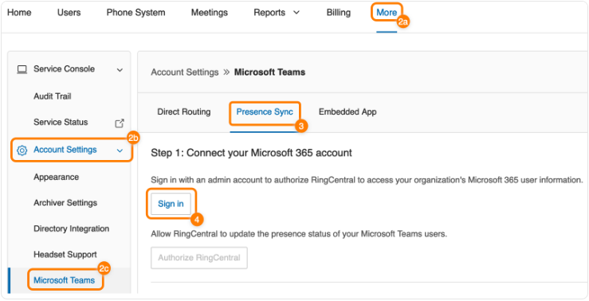
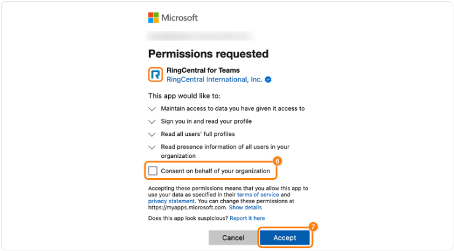
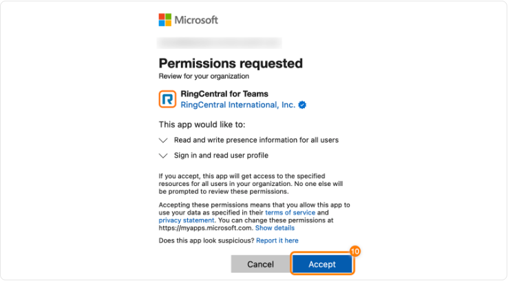
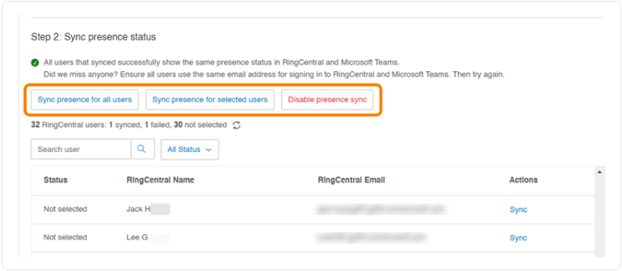
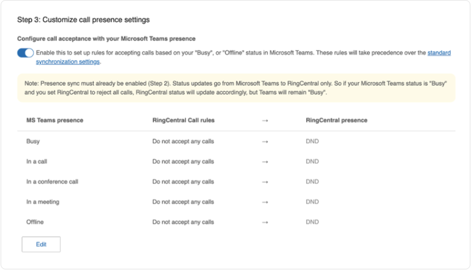
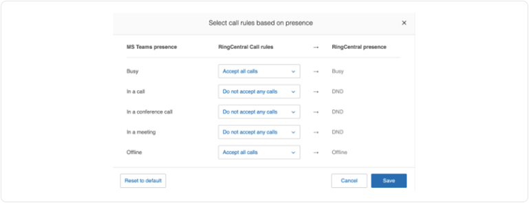
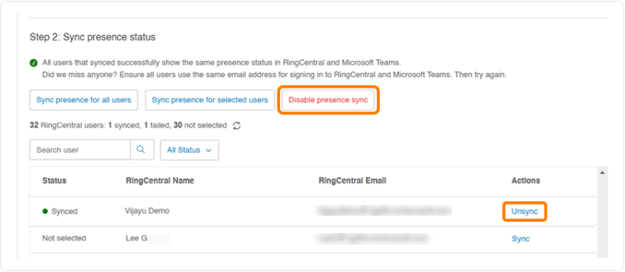

---
hide:
    - toc
---

# Setting up presence sync in Microsoft Teams and RingCentral using OAuth or Microsoft Azure

The RingCentral presence sync feature connects a user’s status in RingCentral and Microsoft Teams. This feature must be set up by an admin to provide unified contact searching and bi-directional presence sync for accurate user availability across platforms. Review [presence sync mapping examples for users](presence-sync-user.md).

## In this article

- **[Prerequisites for presence sync](#prerequisites-for-presence-sync)** — Requirements before you start
- **[Choose how to connect](#choose-how-to-connect)** — OAuth / Microsoft Azure switch, then Step 1 for the method you chose
- **[Step 2: Enable presence sync](#step-2-enable-presence-sync)**
- **[Step 3: Customize call presence settings](#step-3-customize-call-presence-settings)**
- **[Revoking presence sync for users or admins](#revoking-presence-sync-for-users-or-admins)**

## Prerequisites for presence sync

Before turning on presence sync as an admin:

- Verify all users listed in both the RingCentral Admin Portal and Microsoft admin center have been created and enabled.
- For presence sync to function properly, connections are made between Microsoft Teams and RingCentral accounts using a unique email address login name.
- In RingCentral, this identifier is the email address assigned to the user, and in Microsoft Teams, it’s the user principal name (UPN) or email address of the user.
- You need to have a Microsoft Azure Active Directory (AD) admin account.
- You’ll need to provide authentication to Microsoft Azure AD twice during the setup.
- You need a global admin role for this authentication.

## Choose how to connect

Pick **OAuth** or **Microsoft Azure**. The **Step 1** guide below switches instantly to match your choice (same page, no reload).

What method do you want to use to set up presence sync?

<button type="button" class="presence-method-btn is-active" data-presence-method="oauth" role="tab" aria-selected="true" id="tab-presence-oauth">OAuth</button>
<button type="button" class="presence-method-btn" data-presence-method="azure" role="tab" aria-selected="false" tabindex="-1" id="tab-presence-azure">Microsoft Azure</button>

<strong>OAuth</strong> setup is shown below.

## OAuth: Step 1 — Connect your Microsoft 365 account

To connect your Microsoft 365 account using the **OAuth** method:

1. Sign in to the RingCentral Admin Portal.
2. Click the **More** tab (**a**), then **Account Settings** (**b**), and then **Microsoft Teams** (**c**).
3. Click the **Presence Sync** tab if you’re not automatically directed to that page.
4. Click **Connect via OAuth**.

    

5. In the popup, enter your Microsoft 365 credentials and click **Sign in**.
6. Check the box next to **Consent on behalf of your organization**.
7. Click **Accept**. The popup will close.

    

8. Click **Authorize RingCentral**.

    

9. Re-enter your credentials if prompted.
10. Click **Accept**. The popup will close.

    

11. Verify **Sync presence** status. You can **Sync presence for all users**, **Sync presence for selected users**, or **Disable presence sync** when you are ready for [Step 2](#step-2-enable-presence-sync).

    

12. If you have call queues set up, you can turn the **Customize RingCentral call presence with Microsoft Teams Presence** toggle on or off.

!!! note
    Logins must be consistent across both platforms, or presence sync won’t work correctly for the users.

## Microsoft Azure: Step 1 — Connect your Microsoft 365 account

1. In [Microsoft Azure](https://portal.azure.com), create or use an app registration with the correct Microsoft Graph **application** permissions for your RingCentral Teams integration. Use [Getting credentials from Microsoft Azure](embedded-app-admin.md#getting-credentials-from-microsoft-azure) as a reference for registering the app, client secret, and admin consent.

    !!! tip "One app registration for Embedded App and Presence Sync"
        You can use **one** Azure app registration for both the Embedded App and Presence Sync. Connect that registration to **Embedded App** and **Presence Sync** in the Admin Portal when you’re ready.

2. Sign in to the RingCentral Admin Portal.
3. Go to **More** → **Account Settings** → **Microsoft Teams** → **Presence Sync** tab.
4. Click **Connect via Microsoft Azure**.
5. Enter **Application (client) ID**, **Directory (tenant) ID**, and **client secret** (and expiration if prompted), then click **Connect**.

When the connection succeeds, continue with [Step 2: Enable presence sync](#step-2-enable-presence-sync).

## Step 2: Enable presence sync

Once your Microsoft 365 account is connected (via **OAuth** or **Microsoft Azure**), you can **Sync presence for all users** or **Sync presence for selected users**.

You can also **Disable presence sync** for all users.

Once the sync completes, a confirmation message will appear, and you’ll receive an email including details on the number of synchronized users and if any users failed to sync.

!!! note
    Presence Sync will stop working for users if the Microsoft admin’s connection to the RingCentral account is interrupted.

## Step 3: Customize call presence settings

You can then set up specific rules for accepting calls based on a user’s status in Microsoft Teams by **customizing call presence settings**. This feature maps specific Microsoft Teams presence states to RingCentral call handling rules. Incoming calls will then be managed based on the user’s availability in Microsoft Teams.

These settings override the [default presence sync behavior](https://support.ringcentral.com/article-v2/Navigating-presence-sync-as-a-user-in-Microsoft-Teams.html?brand=RingCentral&product=RingEX&language=en_US) set up in [Step 2](#step-2-enable-presence-sync).

!!! note
    Presence configurations made in this step are **one-way only**. Changes in Microsoft Teams update RingCentral call handling, but changes in RingCentral presence don’t update Microsoft Teams.

To update call presence settings:

1. Click the toggle **on** to set up rules for accepting calls based on your status in Microsoft Teams.
2. Click **Edit** to modify the call handling rules for each status.

**Microsoft Teams presence**

- Busy  
- In a call  
- In a conference call  
- In a meeting  
- Offline  

### RingCentral call rules

- **Accept all calls:** All incoming calls will ring through to the user, regardless of their Teams presence.
- **Do not accept queue calls:** Direct calls will ring through, but calls from call queues will not.
- **Do not accept any calls:** All incoming calls will be blocked.

### RingCentral presence

The RingCentral presence status is automatically set based on the selected call rule:

- **Accept all calls:** RingCentral presence changes to Busy or Offline.
- **Do not accept queue calls:** RingCentral presence changes to Busy or Offline.
- **Do not accept any calls:** RingCentral presence is set to Do Not Disturb (DND).

3. Click **Save**. You can click **Reset to default** to restore the previous default settings.

### Example

For example, if a user’s Microsoft Teams status is **In a meeting** and the **Do not accept any calls** rule is selected, RingCentral will:

- Set the user’s RingCentral presence to DND.  
- Prevent all incoming calls from ringing through to the user.

!!! important
    If your Microsoft Teams **Busy** status is mapped to RingCentral’s **Do Not Disturb (DND)**, your Teams status may still show Busy or DND after your call or meeting ends on either platform. This can happen when you make or receive a RingCentral call during a Teams call or meeting, or the other way around.

    To reset your status, manually change it back to **Available** in Teams.

You can also turn the toggle on to **Preserve the RingCentral status during app inactivity**. This feature maintains a user’s RingCentral presence, ignoring Microsoft Teams status changes due to app inactivity. The user’s original presence stays the same until they choose to change it manually in the RingCentral app.

## Revoking presence sync for users or admins

To turn off presence sync for **all users** in your organization, click **Disable presence sync**.

You can also turn off presence sync for **individual users** by clicking **Unsync** under the **Actions** column in the user list.

To turn presence sync back on at the admin level, use the **OAuth / Microsoft Azure** switch under [Choose how to connect](#choose-how-to-connect), complete **Step 1** for that method, then continue with **Step 2**.
