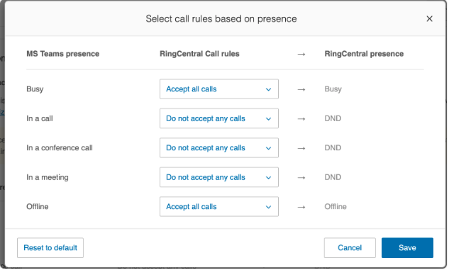
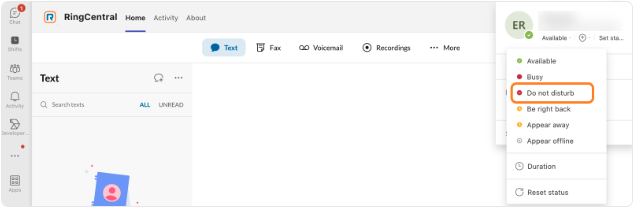
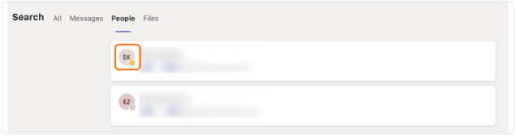
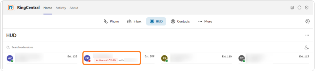
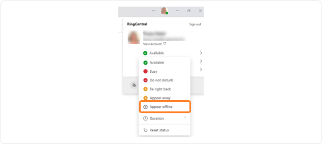

---
hide:
    - toc
---

# Understanding presence sync between Microsoft Teams and RingCentral

The user presence sync feature allows your status to appear across Microsoft Teams and RingCentral. A user's presence will sync across the Microsoft Teams app, RingCentral app, and the RingCentral for Microsoft Teams embedded app, but may display differently depending on which app is actively being used, and the user's current status.

You can't turn on presence sync as a user, but it will be available to you once [your admin sets it up](presence-sync-admin.md).

!!! note
    For the most consistent user experience, we recommend using the RingCentral for Microsoft Teams embedded app to manage phone calls across your organization. Presence sync works on the Microsoft Teams desktop, web, and mobile versions.

## In this article

- **[Mapping presence sync across apps](#mapping-presence-sync-across-apps)** - How presence status syncs between different apps
- **[Customizing call presence settings](#customizing-call-presence-settings)** - Admin-configured call rules based on Teams presence
- **[Presence sync mapping examples](#presence-sync-mapping-examples)** - Real-world scenarios showing how presence sync works

## Mapping presence sync across apps

The presence status in the RingCentral for Microsoft Teams embedded app and the RingCentral app update based on the user's presence in Microsoft Teams, is detailed below.

| Microsoft Teams presence | RingCentral for Microsoft Teams embedded app presence | RingCentral app presence |
|--------------------------|-------------------------------------------------------|--------------------------|
| ● Available | ● Available | ● Available |
| ● On a call - Regular Teams call | ● Busy | No Change |
| ● On a call - Direct Routing (PSTN) call | ● Busy | ● Busy |
| ● In a meeting | ● Busy | No Change |
| ● Busy (manual) | ● Busy | No Change |
| ●− Presenting (Teams Meeting) | ●− Do Not Disturb | ●− Do Not Disturb |
| ●− Focusing (Viva Insights) | ●− Do Not Disturb | ●− Do Not Disturb |
| ●− Do not Disturb | ●− Do Not Disturb | ●− Do Not Disturb |
| ● Away | ●✕ Offline | No Change |
| ● Be right back | ●✕ Offline | No Change |
| ●✕ Invisible | ●✕ Offline | No Change |
| ●✕ Offline | ●✕ Offline | No Change |

!!! note
    No Change means the status will not change in the specified app based on the presence set in the other apps.

## Customizing call presence settings

Admins can set up specific rules for accepting calls based on a user's status in Microsoft Teams by customizing call presence settings. This feature maps specific Microsoft Teams presence states to RingCentral call handling rules. Incoming calls will then be managed based on the user's availability in Microsoft Teams.

These settings override the default presence sync behavior mentioned in the previous section.

Admins can set users' call rules to Accept all calls, Do not accept queue calls, or Do not accept any calls based on their Microsoft Teams presence.

### Call rules based on presence

**MS Teams presence:**

a. Busy  
b. In a call  
c. In a conference call  
d. In a meeting  
e. Offline

**RingCentral call rules:**

- **Accept all calls:** All incoming calls will ring through to the user, regardless of their Teams presence.
- **Do not accept queue calls:** Direct calls will ring through, but calls from call queues will not.
- **Do not accept any calls:** All incoming calls will be blocked.

**RingCentral presence:**

The RingCentral presence status is automatically set based on the selected call rule:

- **Accept all calls:** RingCentral presence changes to Busy or Offline.
- **Do not accept queue calls:** RingCentral presence changes to Busy or Offline.
- **Do not accept any calls:** RingCentral presence is set to Do Not Disturb (DND).

### Example

If a user's Microsoft Teams status is "In a meeting" and the "Do not accept any calls" rule is selected, RingCentral will:

- Set the user's RingCentral presence to DND.
- Prevent all incoming calls from ringing through to the user.

!!! warning "Important"
    If your Microsoft Teams Busy status is mapped to RingCentral's Do Not Disturb (DND), your Teams status may still show Busy or DND after your call or meeting ends on either platform. This can happen when you make or receive a RingCentral call during a Teams call or meeting, or the other way around.

    To reset your status, manually change it back to Available in Teams.

## Presence sync mapping examples

The RingCentral for Microsoft Teams integration embeds RingCentral's reliable calling features into the Teams platform. When user presence sync is turned on, contacts are connected across apps, and a user's presence status can be viewed by colleagues when they search the organization's directory.

The following examples illustrate how presence sync maps across platforms.

### Manually setting presence as Do Not Disturb

Eric is working on a project and sets his presence manually to Do Not Disturb (DND) within his Microsoft Teams app.

Eric's colleague Amber would like to initiate a phone call to discuss a project, so she uses the RingCentral for Microsoft Teams embedded app to locate Eric in the Heads-up display (HUD). The HUD shows the DND status next to Eric's name, so Amber decides to wait until his status shows as available to reach him.

Once Eric finishes his project, he updates his presence status to Available in Microsoft Teams. Amber will see that he's now available for a phone call in the RingCentral for Microsoft Teams embedded app.

### Automatic presence change due to an outbound call

Eric uses the RingCentral for Microsoft Teams embedded app to call a customer's mobile phone. Presence sync detects that an outbound call has connected within the RingCentral network, automatically changing his status to Busy and indicating he's on an active call.

Amber attempts to reach out to Eric by searching for his contact information in the HUD within the RingCentral for Microsoft Teams embedded app. The HUD details show that Eric is on an active call, who he's talking with, and the ongoing call duration.

Once Eric's call ends, Amber can see that his presence has changed back to Available, so she won't interrupt his current call when she attempts to reach him.

### Manually setting presence to Appear offline

Eric would like to show as unavailable for calls while working, so he sets his status to Appear offline in Microsoft Teams. Amber, who wants to reach Eric, searches for him in the RingCentral for Microsoft Teams embedded app HUD. Amber and other users will see Eric as Offline for inbound calls.

