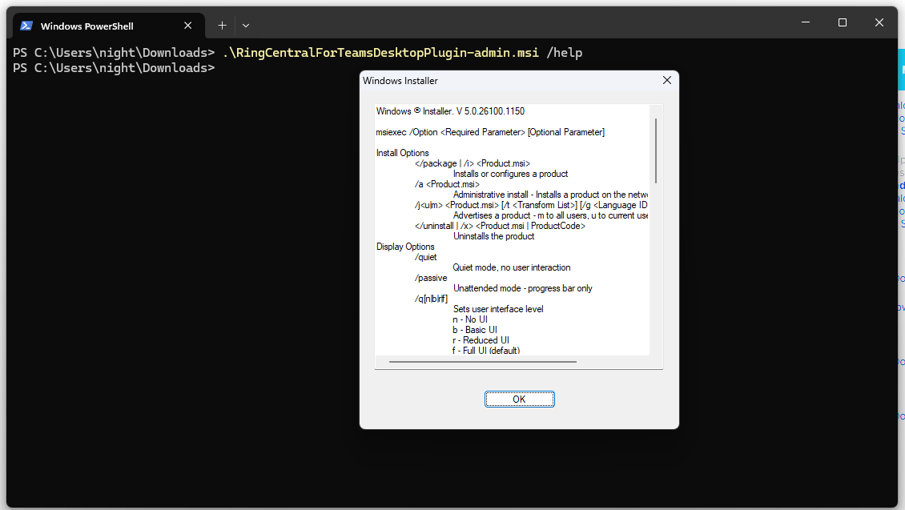
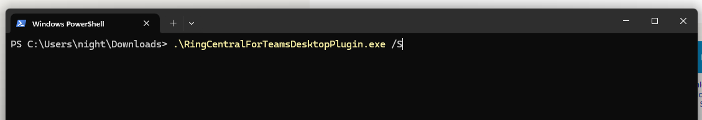
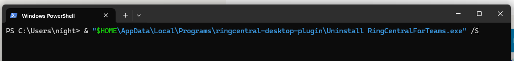

---
hide:
    - toc
---

# General Questions

## Q. What is the difference between the .MSI and the .EXE installers for the RingCentral for MS Teams Desktop Plugin?

A. The .MSI installer is intended for IT admin to deploy the Desktop Plugin with IT management tools. It is designed to not have auto-update features so that the IT admin can manage the update process. The .EXE installer is intended for end users to install the Desktop Plugin on their own and have auto-update features to keep the plugin up to date.

## Q. How do I perform silent installation with the .MSI installer?

A. The .MSI installer actually comes with a help menu to show all the execution options. Use the following command to show the help menu, and you can find the /quiet option listed in the help menu.

## Q. How do I perform silent installation with the .EXE installer?

A. The .EXE installer supports the /S option to perform silent installation. Please note that the /S is case sensitive.

## Q. How do I perform silent uninstallation with the .EXE installer?

A. Unlike the .MSI installer, the .EXE installer it self does not work as a uninstaller. The .EXE installation will create an uninstaller in the installation directory. This uninstaller does support running in silent mode with the same /S option. In the following screenshot, the command assumes that the installation is using the default installation directory.

## Q. If IT has auto user session clean up tools enabled, how do I ensure that the Embedded App's user session can be preserved?

A. The Embedded App's user session is stored in the following locations, please make sure to preserve these folders to keep the user session alive. Most users should be using the new MS Teams app currently, but there may be some virtual desktop users that are still using the classic MS Teams app.

- The new MS Teams app: `C:\Users\%username%\AppData\Local\Packages\MSTeams_8wekyb3d8bbwe`
- The classic MS Teams app: `%appdata%\Microsoft\Teams`
