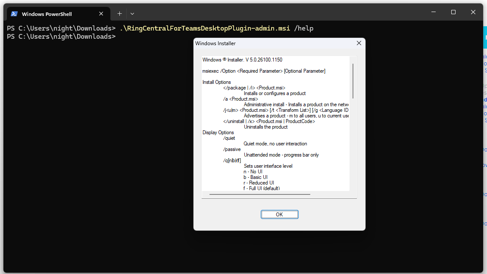
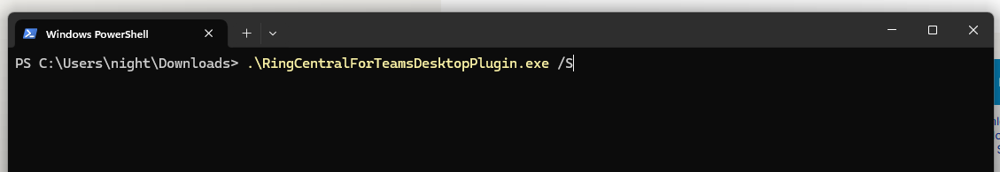
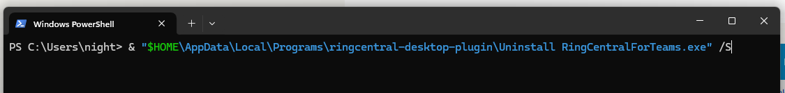
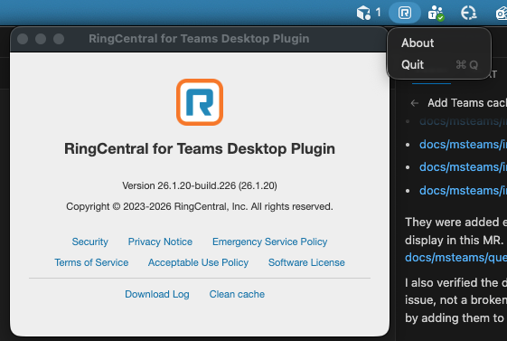
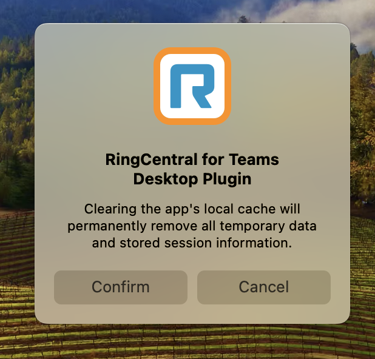
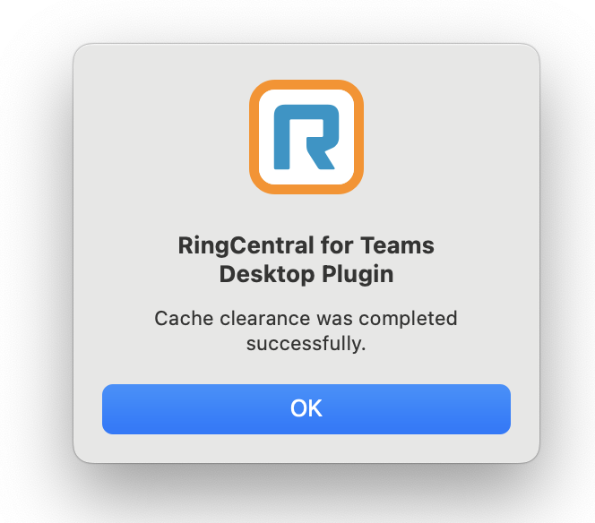

---
hide:
    - toc
---

# General Questions

## Embedded App Questions

## Q. What is the difference between the .MSI and the .EXE installers for the RingCentral for MS Teams Desktop Plugin?

A. The .MSI installer is intended for IT admin to deploy the Desktop Plugin with IT management tools. It is designed to not have auto-update features so that the IT admin can manage the update process. The .EXE installer is intended for end users to install the Desktop Plugin on their own and have auto-update features to keep the plugin up to date.

## Q. How do I perform silent installation with the .MSI installer?

A. The .MSI installer actually comes with a help menu to show all the execution options. Use the following command to show the help menu, and you can find the /quiet option listed in the help menu.



## Q. How do I perform silent installation with the .EXE installer?

A. The .EXE installer supports the /S option to perform silent installation. Please note that the /S is case sensitive.



## Q. How do I perform silent uninstallation with the .EXE installer?

A. Unlike the .MSI installer, the .EXE installer it self does not work as a uninstaller. The .EXE installation will create an uninstaller in the installation directory. This uninstaller does support running in silent mode with the same /S option. In the following screenshot, the command assumes that the installation is using the default installation directory.



## Q. If IT has auto user session clean up tools enabled, how do I ensure that the Embedded App's user session can be preserved?

A. The Embedded App's user session is stored in the following locations, please make sure to preserve these folders to keep the user session alive. Most users should be using the new MS Teams app currently, but there may be some virtual desktop users that are still using the classic MS Teams app.

- **The classic MS Teams app:** 
  - `%appdata%\Microsoft\Teams` 
  - Note that classic Teams should have been deprecated by Microsoft already.
- **The new MS Teams app:** 
  - `C:\Users\%username%\AppData\Local\Packages\MSTeams_8wekyb3d8bbwe` 
  - Or `%LOCALAPPDATA%\Packages\MSTeams_8wekyb3d8bbwe`
  - Note that persisting this entire folder can sometimes cause MS Teams to fail to launch in Citrix. In that case, persist only the specific session folder instead of the entire folder. The session folder is:
    - `C:\Users\%username%\AppData\Local\Packages\MSTeams_8wekyb3d8bbwe\LocalCache\Microsoft\MSTeams\EBWebView\WV2Profile_tfw`
    - Or `%LOCALAPPDATA%\Packages\MSTeams_8wekyb3d8bbwe\LocalCache\Microsoft\MSTeams\EBWebView\WV2Profile_tfw`
- **Desktop Plugin (local settings):** 
  - Some settings are stored locally in the Desktop Plugin instead of in the Embedded App session. To preserve those, persist: 
    - `C:\Users\%username%\AppData\Roaming\ringcentral-desktop-plugin`
    - Or `%APPDATA%\ringcentral-desktop-plugin`

## Q. When I search for a contact in the Embedded App, contacts are not loaded or appearing. How can I resolve this?

A. To resolve contact search issues in the Embedded App, follow these steps:

1. Ensure contact sync is set to "Default contact list" in your Embedded App settings
2. Sign out of the Embedded App completely
3. Sign back into the Embedded App  
4. Wait approximately **10 minutes** for the sync process to complete
5. Search for contacts again and verify they appear

**Why the 10-minute wait?** The app needs to sync all Microsoft 365 contacts (Global Address List, personal, and shared contacts) through multiple API calls. The system loads contacts in pages of 250 with rate limiting, so larger organizations require more time to complete the full sync.

**For web app users:** If the page reloads before contacts finish loading, it interrupts the sync process. Clear browser cache if the issue persists.

If contacts still don't appear after following these steps, escalate to the integration team for further investigation.

## Q. What should I do if the Embedded App repeatedly shows the Open Plugin and Loading Plugin banners, or shows a Network unavailable error?

A. This usually means the internal phone app inside the RingCentral for Teams Desktop Plugin did not load correctly, and cached data is a common cause. The Desktop Plugin now includes a built-in cache clear feature that can often resolve this issue.

**Steps:**

1. Find the RingCentral for Teams Desktop Plugin icon in the system tray, right click it, select **About**, and then click the **Clean cache** link in the **About** window.

    

2. Click **Confirm** and wait for the cache clearing process to complete.

    

3. When the success message appears, click **OK**, then verify whether the Embedded App can connect to the Desktop Plugin successfully.

    

**Important note:** On lower-end devices, this may take a few minutes because the Desktop Plugin must fully load the internal app from the CDN again after the cache is cleared.

## Q. Why don't I see the dialer in the RingCentral Microsoft Teams embedded app, or why is the Phone tab missing?

A. For users who are set up as DR (Direct Routing) users with Microsoft calling (Cloud PBX), the RingCentral for Microsoft Teams embedded app intentionally hides or limits some calling UI—including the Phone tab—because outbound/inbound calling is expected to run through Microsoft Teams (the native Calls tab and Teams dialer), not through the embedded RingCentral dialer.

**How to confirm this is expected for your account**

In Microsoft Teams, open the native Calls tab. If the Teams dialpad is available there, you are typically in the Teams-native calling / DR-style setup where the embedded app does not expose the full RingCentral Phone tab.

**If you want the full RingCentral embedded experience (including Phone)**

That usually means not using Teams as the primary RingCentral calling surface for that user. In practice, the customer must decide whether they want:

- RingCentral calling inside the embedded app (full Phone tab / RC dialer), or
- Calling via Microsoft Teams / Cloud PBX (embedded app without full Phone tab).

If they want the full embedded Phone experience, the account configuration that puts the user in Cloud PBX / DR mode generally needs to be changed (your process: remove the user from Cloud PBX—often handled by Tier 3 / Service Engineering after customer approval). After that change:

- The Teams native Calls dialpad behavior can change (per your tenant setup), and
- The RingCentral embedded Phone tab / dialer can become available again, depending on final licensing and assignment.

**If the customer wants to keep Cloud PBX / DR mode**

Then no Phone tab (or a limited Phone experience) in the embedded app is expected. It is not a defect—the UI matches the Teams-first calling design for that user type.

**Suggested next steps (support)**

- **Confirm intent:** Does the customer want RC calling in the embedded app or Teams native calling?
- **If they want the embedded Phone tab:** Escalate per your runbook (Tier 3 / Service Engineering) to adjust Cloud PBX / DR assignment for the affected user(s).
- **If they want to keep DR / Cloud PBX:** Document that missing Phone tab is by design and train users to use Teams Calls for dialer functions.

## Q. Why does the installation status in the Microsoft Teams embedded app section show fewer users than we know actually have the app?

A. Installation status shown there is stored in IndexedDB (a client-side database in the browser). If Step 1 (Microsoft Teams connection in the setup flow) was disconnected at some point, IndexedDB can be cleared, which removes the stored installation status records for users who were installed earlier. Those users can still have the app installed and working in Teams; the gap is only what the portal can display, not necessarily whether the app is in use.

The admin experience depends on that IndexedDB data to show who is "installed." Microsoft Graph does not offer a way to list current embedded-app installation status for every user in the organization, so we cannot rebuild the full historical list for users who were installed before IndexedDB was cleared. That is why live usage and portal counts may not match.

For large organizations that need reliable, ongoing installation tracking, we recommend deploying the RingCentral for Microsoft Teams embedded app through the Microsoft Teams Admin Center, where installation and assignment can be managed and reported at scale. The RingCentral admin portal remains useful for installs and views driven from that flow (including filters such as department and status), but for enterprise-wide tracking, Teams Admin Center is the recommended approach.

## Q. Why can't we finish Step 1 — Connect your Microsoft 365 tenant(s) for the Microsoft Teams embedded app in Service Web?

A. Step 1 uses OAuth and must be done by someone who meets the role requirements on both Microsoft 365 and RingCentral, as described in the [admin guide](embedded-app-admin.md).

**Microsoft 365:** The account used for Step 1 must be either a Global administrator, or have all of these roles: Privileged Role Administrator, User Administrator, Teams Administrator, and Application Administrator. If the account only has Application Administrator (or another subset), Step 1 will not complete. Use a Global admin account, or assign the full set of four roles above in the Microsoft 365 admin center to the account that will run Step 1.

**RingCentral:** The same person must have Super admin and User admin in RingCentral. If their Roles column appears empty or roles cannot be verified from the service side, confirm in the customer's RingCentral admin portal that the user has Super admin and User admin.

**Microsoft Teams admin center:** Confirm that third-party apps are allowed, that the embedded app (e.g. TELUS Business Connect for Microsoft Teams) is allowed under Manage apps, and that required permissions for the app are enabled.

Until both Microsoft 365 and RingCentral role requirements are satisfied—and Teams policies allow the app—Step 1 may fail or stay incomplete even though the UI looks ready to connect.

## Q. Why don't we see notifications in the Microsoft Teams embedded RingCentral app?

A. Notifications in Teams depend on RingCentral being connected correctly for your tenant and identity, Teams itself allowing notifications, and sometimes a clean app state after policy-driven installs. Work through the checks below.

1. **Complete Microsoft 365 connection (Step 1)**  
   For the embedded app flow, Step 1 — Connect your Microsoft 365 tenant(s) in Service Web / the admin portal must be completed successfully. If Step 1 failed or was disconnected, embedded features (including some notification-related behaviour) may be incomplete or inconsistent.

2. **Align the signed-in user with Teams / Microsoft 365**  
   The person using the app should be signed into RingCentral with the same organizational identity you use in Teams (typically the same work email / Entra ID UPN as in Microsoft 365). If RC is opened under a different email or a personal account while Teams is the work profile, you can miss notifications or see the wrong context.

3. **Confirm Teams is allowed to show notifications**  
   In Microsoft Teams (desktop or web), check Settings → Notifications (and OS-level Do Not Disturb / Focus). If Teams suppresses banners or activity, RingCentral alerts that surface through Teams may not appear even when RingCentral is working.

4. **Try a reinstall if Step 1 is already OK**  
   If Step 1 is complete and identity matches, try removing the embedded app from Teams and adding it again (or signing out of RingCentral inside the embedded app and back in), then retest.

5. **If there is no "Uninstall" option — global deployment**  
   When Uninstall is missing, the app is often deployed and/or pinned by IT using a Teams app setup policy (or similar org-wide assignment). In that case, end users cannot uninstall it themselves. **Next step for IT:** Have the Microsoft Teams administrator either:
    - Temporarily remove the user from the app setup policy so the user can uninstall/reinstall locally, or
    - Remove / redeploy the app for that user (or group) from the Microsoft Teams admin center.

**If it still fails after the above**

Collect approximate time, Teams client (desktop vs web), whether other Teams apps notify normally, and whether the issue is RingCentral in-app alerts vs Teams banners—that narrows whether the problem is Teams notification settings, tenant policy, or RingCentral subscription / session on the backend.

## MS Teams general questions

## Q. What should we try when the Teams client seems unstable (notification badge, embedded app missing, or errors opening the app)?

A. We have seen similar symptoms in other cases when the Teams client is in a bad state, for example:

- Notification badge not updating on Teams desktop
- RingCentral for Teams (embedded app) missing or hard to find in Teams
- The embedded app crashes or shows a broken / error face when opened from the Teams icon

**Recommendation:**

Please ask affected users to fully quit Microsoft Teams, clear the Teams client cache (or use the Reset option for New Teams on Windows, which removes app data), then restart Teams and test again. The first launch after clearing cache may be slower than usual while Teams rebuilds its cache.

**Short steps (summary)**

**Windows – Classic Teams:** Win+R → open `%appdata%\Microsoft\Teams` → delete all files and folders in that folder → restart Teams.

**Windows – New Teams:** Settings → Apps → Installed apps → Microsoft Teams → … → Advanced options → Reset (this clears app data), personalization settings will be removed from Teams

or

Win+R → `%userprofile%\appdata\local\Packages\MSTeams_8wekyb3d8bbwe\LocalCache\Microsoft\MSTeams` → delete contents → restart Teams.

**macOS – Classic Teams:** Quit Teams → Terminal:

```bash
rm -r ~/Library/Application\ Support/Microsoft/Teams
```

→ restart Teams.

**macOS – New Teams:** Quit Teams → Terminal:

```bash
rm -rf ~/Library/Group\ Containers/UBF8T346G9.com.microsoft.teams
rm -rf ~/Library/Containers/com.microsoft.teams2
```

→ restart Teams.

**Official guide:** [Clear Teams cache](https://learn.microsoft.com/en-us/troubleshoot/microsoftteams/teams-administration/clear-teams-cache)

There have been online reports of broader Teams desktop issues after recent updates, so clearing cache or resetting the client is a reasonable first step. After users try this, please let us know whether the embedded app behavior improves.

---

## Presence Sync Questions

### Call Management and Routing

#### Q. When a user is already on a call in Microsoft Teams, whether internal or external, is there a way to prevent additional incoming calls, including those from call queues?

A. When presence sync is enabled, the presence status of the user on a native Teams meeting or call is shown as "Busy" on their Teams app and it is synced to show "Busy" on RC side as well. Now when another incoming call comes in, the source of that call matters. If the source of this new incoming call is:

1. **Microsoft Teams** → then it'll follow the appropriate call waiting behavior set in the user's Teams app settings
2. **RingCentral call** → the call comes through and displays to the user as this new incoming call is coming from a different platform (RingCentral) to what the user is currently on (Teams).

Here, the customer has a choice for #2, they can use the customized presence sync feature in Step 3 of the presence sync setup and choose whether they want to accept regular or queue calls coming from RingCentral when the user is busy in a native Teams meeting or call.

#### Q. If a user is currently on a call that came through a call queue, can other incoming calls be blocked, regardless of whether they are internal or external?

A. Yes, when a user answers a call from a call queue, their status should be updated to "In a call" or "Busy." If the RingCentral call queue settings are configured to skip agents who are busy, the system will not route any new calls to that user, including subsequent calls from the same or different queues.

Can be achieved with the customized presence sync feature described in the previous answer.

#### Q. Why do some users still receive queue calls when they are already in a Microsoft Teams meeting?

A. When you join a Teams meeting, Microsoft Teams often sets your presence to In a call, not In a meeting. In Presence sync → Step 3 (Customize call presence settings), In a call and In a meeting are separate rules. If In a call is mapped to Busy while In a meeting is mapped to Do not disturb, RingCentral follows In a call while you are in the meeting, which can allow queue calls if your queues treat Busy differently from Do not disturb.

To fix it: In the RingCentral admin portal, open Presence sync → Step 3, find Microsoft Teams: In a call, set it to Do not disturb (aligned with how you want meetings handled), and save. If you need ordinary two-way calls to stay Busy, revisit that choice—Teams uses In a call for both meetings and calls, so this mapping is a tradeoff in the product, not something you change in Teams itself.

### Do Not Disturb (DND) Mode

#### Q. When a user sets their status to Do Not Disturb in Teams, do call queue calls still route to the longest idle agent if the call queue has been set to longest idle?

A. No, they should not. DND is considered unavailable and will be skipped by the call queue routing logic, regardless of whether the routing is set to "longest idle," "round robin," or "simultaneous."

#### Q. Will the agent receive a missed call notification if they are in DND?

A. This can be inconsistent, but typically they should not receive an intrusive notification. The purpose of DND is to block all notifications, including calls. However, a missed call notification may appear in their activity feed once DND is turned off, depending on the call queue's configuration and whether the call was handled by another agent. In a standard call queue setup, if another agent answers the call, the call is considered resolved, and no missed call notification is sent to the other agents.

### In a Meeting Status

#### Q. If a user's Teams status is set to In a Meeting, can we configure how calls are handled, such as sending them directly to voicemail?

A. This is possible, but it depends on the integration configuration. The "In a Meeting" status is a form of "busy" presence.

#### Q. How does it affect call queue routing? Will calls still go to the longest idle agent, and will they also be sent to voicemail?

A. Calls should not be routed to a user whose status is "In a Meeting" if the call queue is set to skip busy agents. The call queue will continue to search for the next available agent (the "longest idle" agent who is not in a meeting or DND). The call will not be sent to the user's voicemail unless it is explicitly configured to do so for all callers or if the call queue's overflow settings direct it to voicemail.

### Call Waiting in RingCentral

#### Q. What happens when a user is already on a call, whether it's an internal Teams call, an external call, or a call queue call?

A. When Call Waiting is enabled in the RingCentral portal, a user will hear a tone to indicate a new incoming call (provided they are already on a RingCentral call and not Teams call). This applies to all types of calls (internal, external, or call queue).

The behavior could be different if the user is on a native Teams call and then a RingCentral call comes in, as the new call is originating from a different platform than what the user is currently on, the new call will be displayed with a ringtone.

#### Q. Will additional calls still come through, and how are they managed?

A. Yes, they will still come through. Assuming the current call they are on is from the RingCentral platform. The user will see a notification on their device with the caller ID of the new incoming call. The user can then choose to:

- **Answer**: This will place the current call on hold.
- **Ignore**: The incoming call will continue to ring and follow the configured routing rules (e.g., go to voicemail, another extension, etc.).
- **Send to Voicemail**: The user can directly send the new call to their personal voicemail.

### Presence Sync Performance and Timing

#### Q. Why is presence sync between RingCentral and Microsoft Teams not working in real-time? Customers expect immediate presence updates when making or answering calls.

A. The Microsoft Teams Presence Sync was never designed to be real-time and operates through a server-side integration that communicates with Microsoft Graph API endpoints using the Presence.ReadWrite.All permission.

When a user answers/makes a call in the RingCentral app, the RC status changes to "Busy" immediately, but the server-side integration must then detect this change via subscription, call Microsoft's Graph API setPresence endpoint, and wait for Microsoft to process the request and update Teams presence. This complete API chain typically takes **10-30 seconds** to fully process, not the immediate response the customer expects.

**Key Technical Difference**: On the RingCentral side, presence changes are **event-based** and occur immediately when call status changes. However, Microsoft Graph API presence updates involve additional processing layers and internal propagation within Microsoft's infrastructure, which introduces the delays regardless of the API call method used.

**Important Note**: We require users to wait at least 30 seconds after a call status change before verifying the Teams presence update, as the system architecture relies on multiple API calls and processing delays that are inherent to both RingCentral's subscription system and Microsoft's Graph API processing times.

### Configuration and Conflicts

#### Q. Are there any known settings conflicts between Microsoft Teams and RingCentral that could affect call routing, notifications, or caller ID?

A. **Presence Sync**: Delayed presence sync between Teams and RingCentral is the most frequent issue. A user might appear as "Available" in one system but "Busy" in the other, leading to calls being routed when they should not be, as it can take up to 30 seconds to a minute for the updated presence to come through from Microsoft.

#### Q. Why does the RingCentral desktop app always show "Offline" even when my presence shows "Available" on Microsoft Teams?

A. Both the RingCentral App and RingCentral Teams Embedded App display presence from the same backend API. The most likely cause is that your status was manually set to "Offline" in the RingCentral App at some point, creating a "sticky" persistent status that won't automatically change even when Microsoft Teams shows "Available" or Presence Sync is enabled.

**Key distinction:** Manual "Offline" status (user explicitly set) persists until manually changed back, while automatic "Offline" status (due to inactivity) automatically resets to "Available" when you become active again. RingCentral's presence system treats manual status changes as intentional user actions and won't override them automatically, even when Teams shows "Available."

**Immediate solution:** Open the RingCentral App and manually change your status from "Offline" to "Available" in the presence dropdown. After this change, Presence Sync should resume working normally and automatically sync with Microsoft Teams presence.

**If the issue persists:** Confirm whether you manually set your RingCentral status to Offline at any point (including on the mobile app, which might set Offline when closed). After changing to "Available," wait 30 seconds for presence to propagate, then sign out and back in to both apps to refresh the presence cache. Test by changing your Microsoft Teams presence to Busy/DND to verify if it updates in the RingCentral App and Embedded App.

**Best practice:** Avoid manually setting Offline or DND statuses in the RingCentral App if you're using Presence Sync. Instead, manage your presence through Microsoft Teams, which will sync to RingCentral automatically.

#### Q. Why does a contact's presence look different in the RingCentral App HUD compared to the RingCentral for Teams Embedded App HUD?

A. These two HUDs display presence from different sources. The **RingCentral for Teams Embedded App HUD** shows the phone system presence (same as Service Web and RingCentral for Google), while the **RingCentral App HUD** displays the user's RingCentral App presence status from the RC Presence API.

**Technical difference:** The RingCentral App HUD shows the user's actual app status (presenceStatus and userStatus fields). If a user manually sets themselves to "Offline" in the RingCentral app, that becomes a "sticky" status that Presence Sync won't override automatically, creating different presence displays between the two systems.

**Key distinction:** Manual "Offline" status is sticky and persists until manually changed back, while automatic "Offline" status (from inactivity) temporarily resets to "Available" when the user becomes active. Presence Sync treats manual status changes as intentional user actions and won't override them, even when Teams presence shows "Available."

**Resolution:** If a contact appears with different presence in the two HUDs, have them manually change their RingCentral App status back to "Available" for Presence Sync to resume working properly.

**Recommendation:** Users should avoid manually setting Offline or DND statuses in the RingCentral App when using Presence Sync. Let the integration handle presence automatically based on Microsoft Teams activity.

**Future enhancement:** Unified presence behavior across both HUDs is on the product roadmap but depends on other team dependencies.

### Call Queue Caller ID Issues

#### Q. When receiving internal calls via a call queue, the caller appears as external. Is there a way to distinguish internal from external callers?

A. To distinguish callers, a common solution is to configure the call queue to prepend a special prefix to the caller ID, such as "Queue Call: [Caller Name]" or "CQ - [Caller Name]." This helps agents know the call is coming from a queue and allows them to identify the original caller from the appended information.

#### Q. Missed call emails sometimes show no caller ID. Can this be resolved?

A. Please share examples for this as well, including any screenshots or screen recordings or the affected users' information so we can understand better, and we may need to gather logs so we can investigate this further.

### Missed Call Notifications

#### Q. If a call comes through a call queue and is answered by one agent, why do the other agents who did not answer still receive a missed call notification in Microsoft Teams? Is this normal or expected behavior?

A. No, this is generally not normal behavior for a properly configured call queue. Reason for these issues can be the following:

- **Delayed Presence Sync**: The system might not be updating the status of the agents quickly enough.
- **Integration-Specific Bug**: There may be a known bug or misconfiguration within the RingCentral for Teams application itself that causes it to incorrectly generate these notifications.
- **Configuration Error**: The call queue settings might be misconfigured, for instance, by not properly tracking which agent handled the call. This is a setting that should be addressed by a RingCentral admin.

Please share examples for this as well, including any screenshots or screen recordings, or the affected users' information. If this issue happens consistently, we may need to gather logs for further investigation.
