---
hide:
    - toc
---

# Application Setup

## Quick Navigation

-   **[About Admin UI](#about-admin-ui)** - Overview of the Admin UI interface and access methods
-   **[Salesforce Records Matching Strategy](#salesforce-records-matching-strategy)** - Configure how records are matched with calls
-   **[Call Logging Setup](#call-logging-setup)** - Set up automatic call logging and disposition
-   **[High Velocity Sales (HVS) Support](#high-velocity-sales-hvs-support)** - Configure HVS mode and disposition settings
-   **[Salesforce Do Not Call (DNC) Support](#salesforce-do-not-call-dnc-support)** - Set up DNC restrictions for calls and SMS
-   **[Log Customization](#log-customization)** - Customize call log fields and layouts
-   **[Adding Call Recording to more Task Record Layout](#adding-call-recording-to-more-task-record-layout)** - Add call recording fields to task layouts

---

## About Admin UI

The Admin UI is designed to allow admin users to control all RingCentral for Salesforce clients behavior under an organization.

There are 2 ways to open the Admin UI.

**Option 1**: open from the Install Wizard.
From the Advanced Settings, click the Launch Admin Screen.

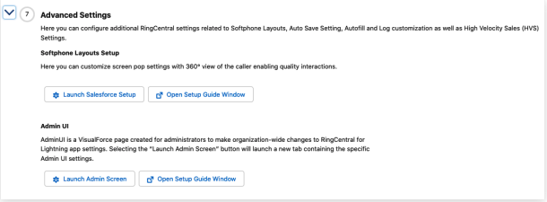

**Option 2**: open from Visualforce Pages.
From Setup → Custom Code → Visualforce Pages → click the hyperlink icon of the adminUI

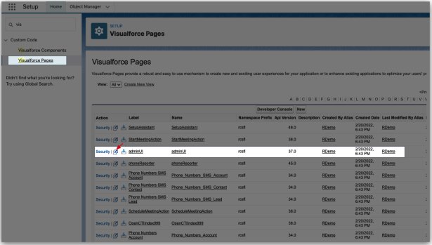

The Admin UI will be opened.

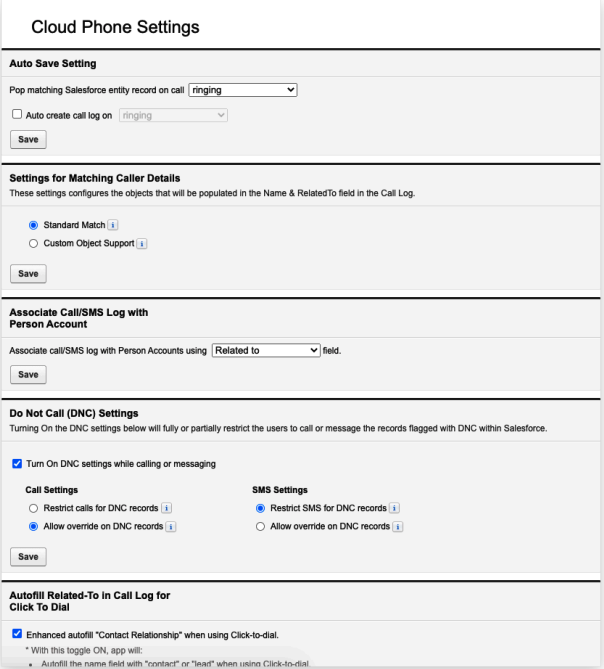

## Salesforce Records Matching Strategy

This is the setup group that controls the matching strategy of the clients in the org.

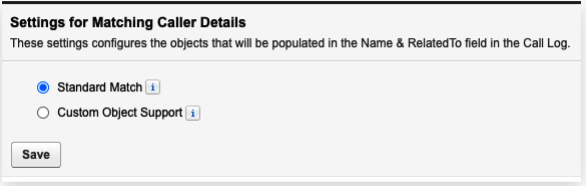

### Settings for Matching Caller Details

The RingCentral for Salesforce supports the Company Directory and the Personal Contacts under the user's RingCentral account. And supports matching the Salesforce records.

This setting controls the matching strategy of matching RingCentral records.

**Standard Match**

With the standard match strategy, the app is using the following record types as record sources:

-   Account,
-   Contact,
-   Lead,
-   Case,
-   Opportunity,
-   Person Account (only when the person account is enabled in the org).

All the records will need to have at least 1 phone type field to be searched as a record.

**Custom Object Support**

With the custom object support strategy, the app is using all record types that were selected in the Softphone layout as record sources. Both Salesforce standard records and custom objects are supported.

To enable this strategy, select it and click the Save button. And the Admin will need to configure the Softphone layout for customizing record types.

Navigate to the Softphone Layout Setting.

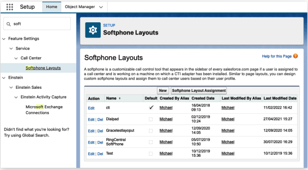

Open or create a softphone layout that is assigned to a target group.

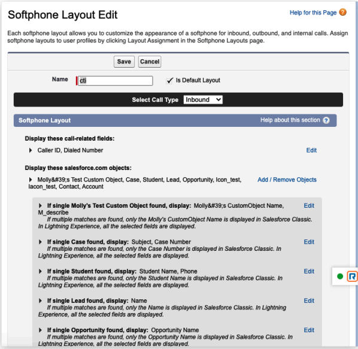

Select the Call Type as Inbound. To simplify the setting, the RingCentral for Salesforce is reading only the Inbound setting as the record source. Do not need to set up the Outbound call type setting.

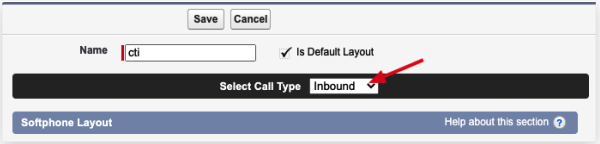

Check the Display these salesforce.com objects session. This is the session that is needed for the record source setup. Click the Add/Remove Objects

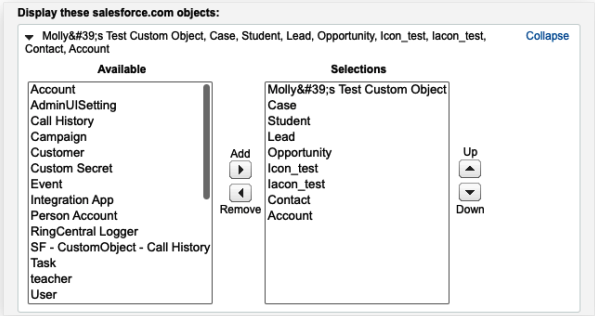

All available record types are listed in the Available box. Select what was needed to the Selections box, and move Up or Down for your preferred sequence.

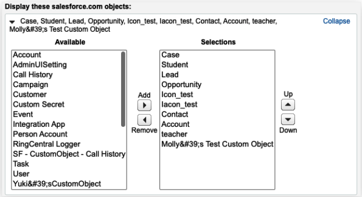

The selected record types will be listed on the following configuration list.

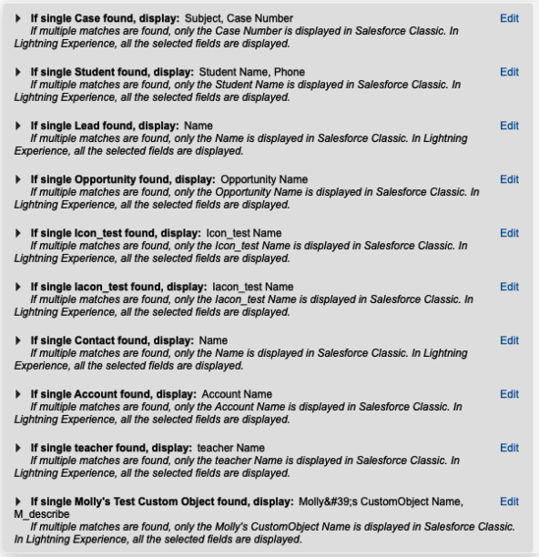

There are many fields in an object. For most of the Salesforce standard objects, the Softphone Layout will usually automatically pick the object's "Name" related field as the primary field to show on the search result. Admin is also allowed to selected other needed fields as primary. But for Custom Objects, Admin will need to select carefully for the primary field to show in the app.

The Primary field is the first field that was selected in the Selections box. The field value will be shown when there's a match to the phone number of the record in the CTI.

When all is done, click the Save button.

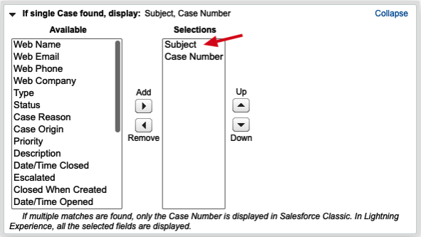

Admin can set up multiple softphone layouts and assign them to different groups. In this way, groups will get different Salesforce record sources in the CTI.

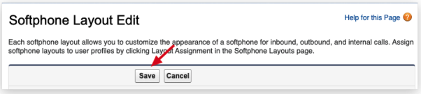

### Associate Call/SMS Log with Person Account

The Person Account is a record type in Salesforce that can be treated as a WhoID type or a WhatID type. That means the Person Account records could be selected in either the Name or the Related to field.

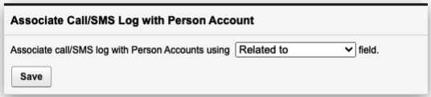

This setting is to select the field that allows the Person Account records to be selected when logging calls to Salesforce.

### Autofill Related-To in Call Log for Click to Dial

When a user clicks to dial from a record's phone number, they might expect the record to be automatically selected in the call log.

This setting is allowing the record to be auto-selected to the call log. Including the record types that were not selected to be supported.

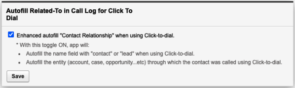

## Call Logging Setup

This setting group is controlling the behavior of the call logging.

### Auto Save Setting

**Pop matching Salesforce entity record on call**

-   Ringing
-   Answered

This is deciding the time that the search results in Salesforce pops up.

**Auto create call log on**

-   Ringing
-   Answered

When this setting is ON, the clients understand this organization is automatically logging calls when the call is ringing or answered.

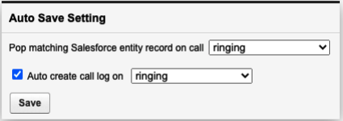

When this is ON, the Auto log calls setting is turned ON and not able to be disabled.

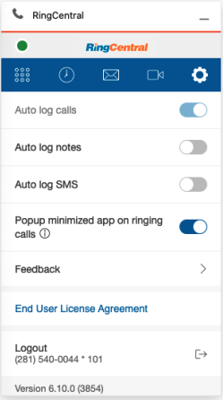

**Auto Create SMS log**

This setting gives the admin a flexibility to enable auto log SMS feature for all the users of their org. And if this toggle is turned ON for an org then all the end users will have the auto log SMS toggle enabled automatically and locked so that they can't disable it.

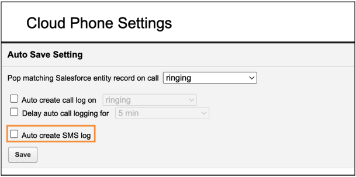

By default this admin setting will be turned OFF.

If this is ON, then the Auto-log SMS setting in the CTI is turned ON and disabled.

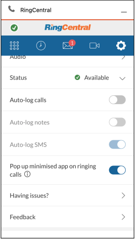

### Call Disposition Setup

This is the example of using the Subject type as the call disposition field (many users use it this way). If the admin wants to use another field for the purpose, they could always build one with a similar setup.

Navigate to Setup → Object Manager → Task → Fields & Relationships → Subject

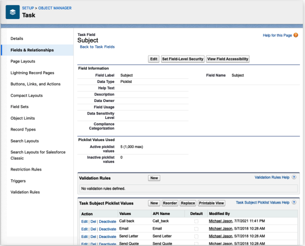

Salesforce had some default values for the field. The Admin can edit or add values to the field.

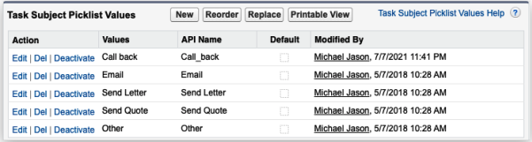

The Subject field in the client will show the values that were set for pickup.

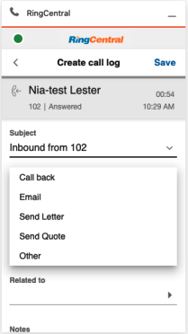

## Log Customization

The Log Customization allows users to pick fields including custom fields for the clients. The field types that were supported include:

-   Date
-   Picklist
-   Text
-   Text Area

When the fields are selected and saved, all users in this organization will see the Call Log layout in the client.

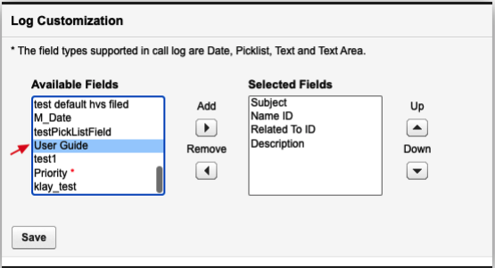

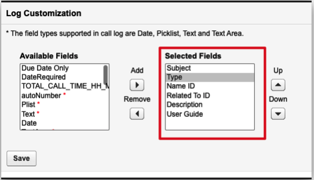

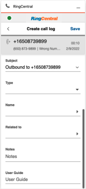

## Adding Call Recording to more Task Record Layout

The RingCentral for Salesforce package creates a Task Layout containing all RingCentral custom fields while installing. So that the admin user can easily assign the layout to whoever is needed in the organization.

The custom fields include:

-   **Call Result**: Connected, Disconnected, etc.
-   **Call Duration**: the duration of the call, in Second.
-   **Call Type**: Direction of the call, including Inbound and Outbound.
-   **Call Recording**: if the call was recorded, the link will automatically be attached to this field after the call was ended
-   **CALL_UNIQUE_ID**: the ID for the RC app to identify the call log ticket. (hidden by default)
-   **CALL_UUID**: the same purpose as CALL_UNIQUE_ID, used for earlier versions. (hidden by default)
-   **external_whoid**: this field is to identify personal account record that was linked in Name or Related to. (hidden by default)
-   **RC Logging Type**: RC is providing logging capability of calls and SMS. This field is to identify the logging type of the record.

To add the Call Recording field to any other Task layouts, the admin can navigate to the Task page layout setting and drag the field to the layout.

## High Velocity Sales (HVS) Support

The High Velocity Sales (HVS) is a Salesforce App that targets improving sales processes and efficiency. The RingCentral for Salesforce supports the HVS experience. Check the Salesforce help document for the HVS setting.

If the Salesforce environment is not enabling HVS, the Admin UI is showing notification as below.

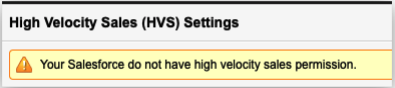

### High Velocity Sales (HVS) Settings

When the HVS is enabled in the Salesforce environment, there will be more setting options on the Admin UI.

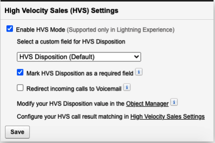

When enabling HVS mode, the admin user can select the HVS disposition field. When a custom field is selected, the admin user will need to map the custom field values to the HVS disposition table.

Click the High Velocity Sales Settings hyperlink. Edit the Define Call Results for Branching. Put the value of the custom field to the table that maps the HVS Call Results and click Save.

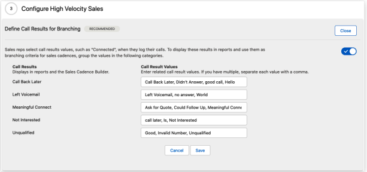

The Redirect incoming calls to Voicemail option will redirect all incoming calls to the user's voicemail when there's already an active call on the client.

## Salesforce Do Not Call (DNC) Support

The Do Not Call (DNC) is a hidden field in a person type record. That includes Contact, Lead, Person Account. When this field is used for flagging the contacts that the users are not supposed to contact, the admin can switch this ON.

### Do Not Call (DNC) Settings

Turning On the DNC settings below will fully or partially restrict the users to call or message the records flagged with DNC within Salesforce.

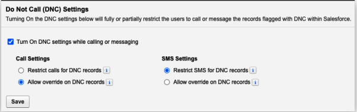

The admin can decide the restriction for both Call and SMS.
