---
hide:
    - toc
---

# Environment Configuration

## Quick Navigation

-   **[Start with the Install Wizard](#start-with-the-install-wizard)** - Configure the Salesforce environment using the Install Wizard
-   **[Setup Call Center](#setup-call-center)** - Create and configure call centers for RingCentral integration
-   **[Setup Softphone Layout](#setup-softphone-layout)** - Configure the softphone layout and assign users
-   **[Enable RingCentral in the Salesforce.com Apps](#enable-ringcentral-in-the-salesforcecom-apps)** - Add CTI to apps and configure global actions
-   **[Analysis and Reports](#analysis-and-reports)** - Set up reports, dashboards, and analytics

---

## Start with the Install Wizard

Admins will need to create a proper configuration for the RingCentral for Salesforce working as expected.

The Install Wizard is designed to help the administrator in configuring the Salesforce environment for the RingCentral application.

Admin users can find the RingCentral Admin for Lightning from the App Launcher.

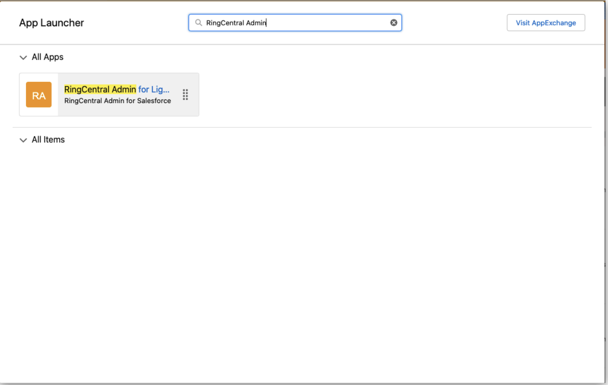

Click to open the app. The Install Wizard will be launched.

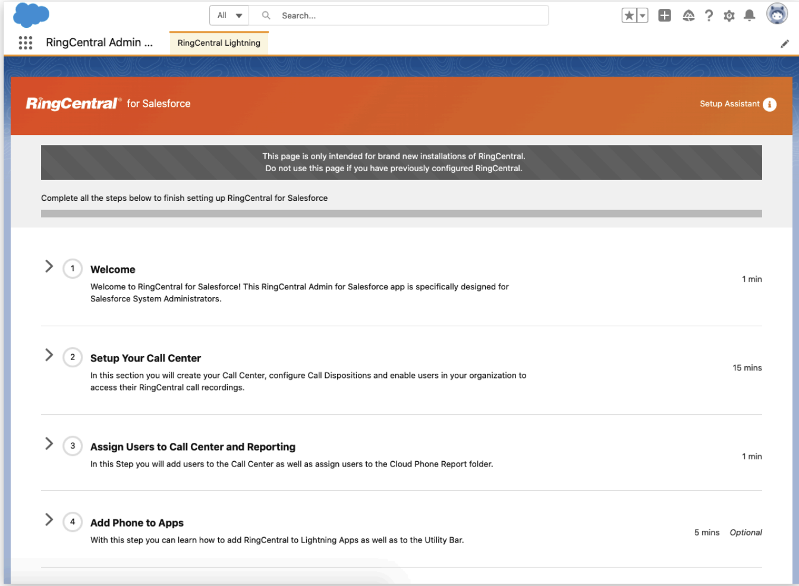

Follow the instructions step by step to complete the configuration.

## Setup Call Center

**About Call Center**

The Call Centers is an application in Salesforce that manages Phone Call integrations. Phone Call integration in Salesforce is called Call Center. A Call Center corresponds to a Computer Telephony Integration (CTI) in Salesforce. Any CTI should be registered to the Call Centers to be enabled in Salesforce applications.

**Create a Call Center**

The admin can either create a call center automatically or manually. As long as it was created in correct steps, it could work correctly.

**Option 1**: Auto generate a Call Center for RingCentral

Click the Create Call Center button

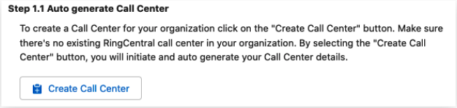

A confirmation message will pop up. The automatically creating call centers is only working when there are no previous call centers created in the Salesforce org. Click the Create button to continue.

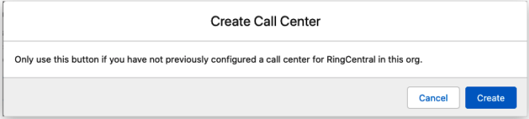

The creation will take a few seconds, and the status will be shown.

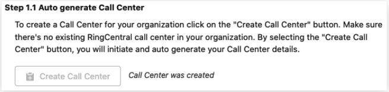

**Option 2**: Manually create a Call Center for RingCentral

For any reason the automatically creating Call Center is not working, the admin can always create a call center manually.

An XML file will be needed to create a call center. Click the Download XML Setup button, and an XML file will be downloaded.

This XML file is unique for the current Salesforce environment. Do not use it for other environments.

Then click the Manually Create Call Center button. The Call Centers setup page will be open. Click the Import button.

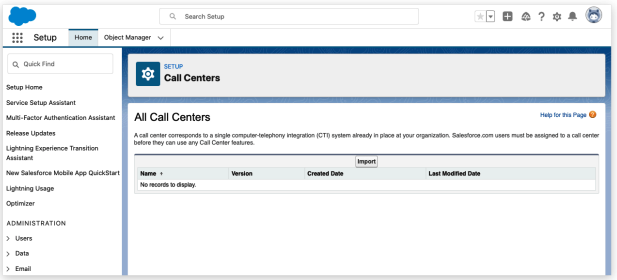

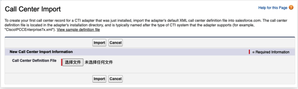

Click the Choose File button, select the XML file that was downloaded, and click the Import button.

A call center will be created.

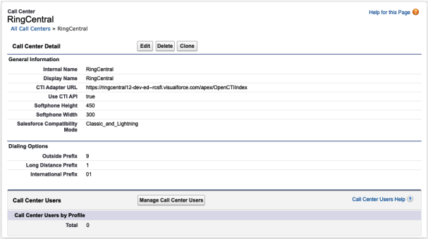

Now go back to the Install Wizard and click the Verify Call Center button.

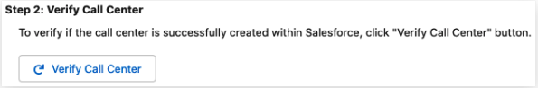

A confirmation notification will pop up.

**Assign Users to a Call Center**

Click the Launch Salesforce User Assignment button and the Call Center that was created will be opened.

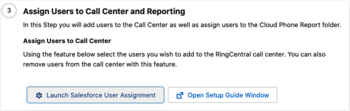

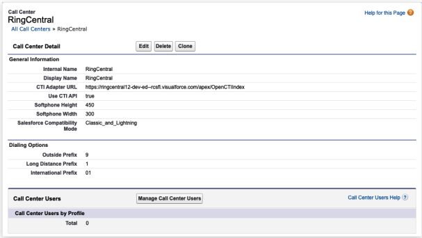

Click the Manage Call Center Users button.

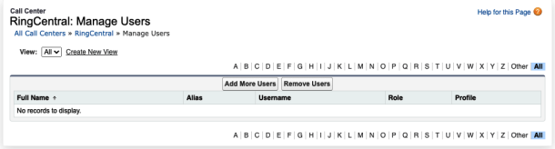

Click the Add More Users button.

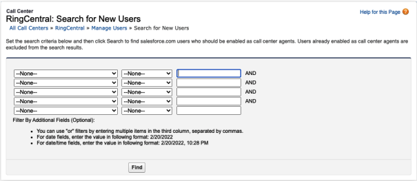

Salesforce is providing a searching tool to filter the target users. Input all needed and click the Find button. The users that fit the criteria will be listed in the table. Select all needed users and click the Add to Call Center button.

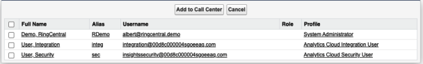

All users that were assigned to the call center will be listed on the table. The admin can always remove the assignment here at any time.

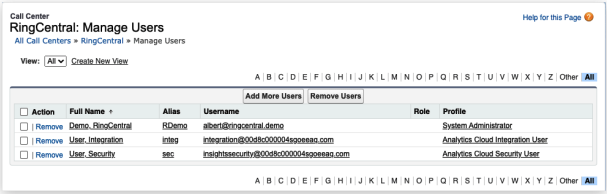

## Setup Softphone Layout

**About Softphone Layout**

A SoftPhone Layout is a set of CTI interaction rules in Salesforce. It's deciding the CTI behavior for a user.

Admins could set up multiple SoftPhone Layouts as needed. But a user can only be assigned to one Softphone Layout.

**Create a Softphone Layout**

The Salesforce creates a default Softphone Layout. The Admin is allowed to use it, or create a new one. Click the New button to create a new layout, or click the Edit button to edit the current layout.

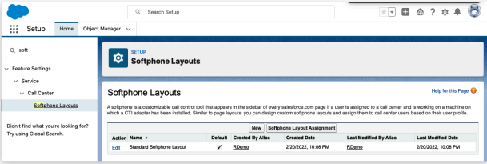

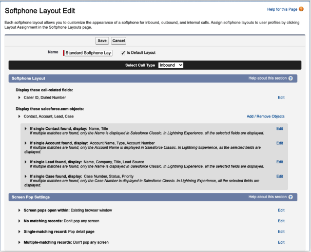

There are 2 sessions in the Softphone Layout setting. The 1st part, the Softphone Layout setting, is for the matching strategy. See more details in setting up a matching strategy.

The 2nd part, the Screen Pop Settings, is impacting the users who are using the current Softphone Layout. Admin can decide the behavior on different cases of matching.

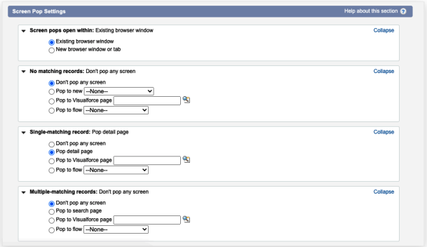

**Assign Users to a Softphone Layout**

An user can only be assigned to a Softphone Layout. On the Softphone Layout homepage, click the Softphone Layout Assignment button to continue.

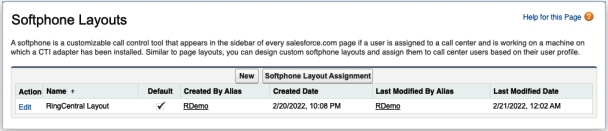

The Softphone Layout is assigned by user profiles. The admin can select the Softphone Layout to assign to any user profile. The default layout will be assigned to all the profiles if there's no further setup.

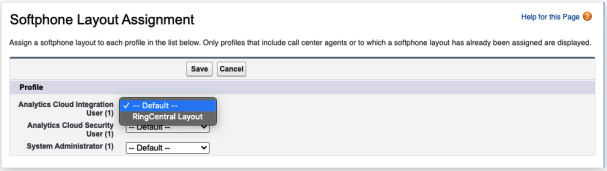

## Enable RingCentral in the Salesforce.com Apps

The RingCentral for Salesforce package installs a RingCentral for Lightning application in Salesforce.

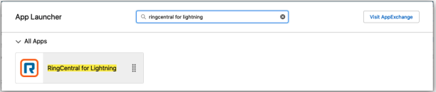

In this App, all usually used entities are enabled. And the CTI utility is also been added. The user could use the CTI directory in this App.

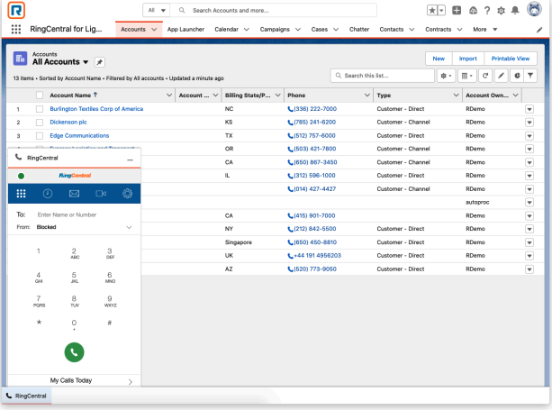

But there are still many other applications in Salesforce. Admin can enable the CTI by the following steps.

**Add CTI to Apps**

Click the Launch Salesforce Setup button on Step 4 in the Install Wizard. Click it to open the App Manager.

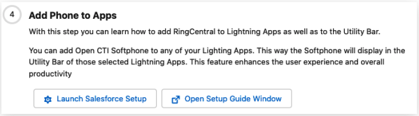

The Admin can also find the App Manager by the following path: Setup → Apps → App Manager.

All the apps that were installed or created will be listed on this view.

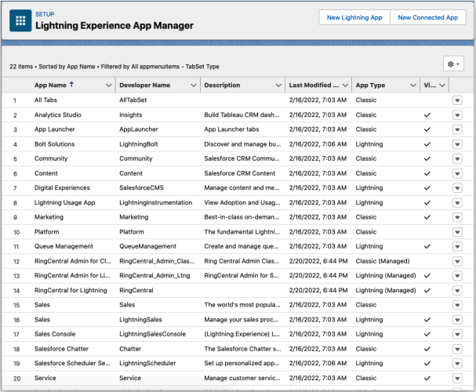

To add the CTI to a Lightning app, click on the dropdown button and select Edit.

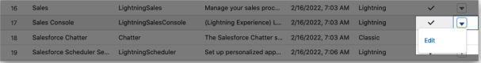

The App Settings tool will be opened. Navigate to the Utility Items tab (Desktop Only).

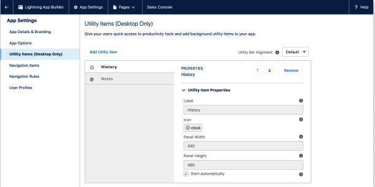

Click the Add Utility Item button, select the Open CTI Softphone.

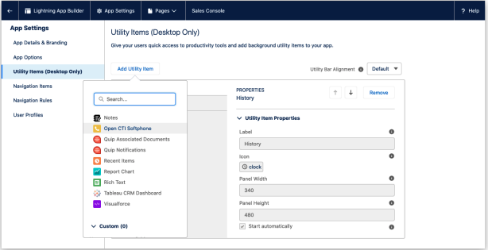

Edit the Label as needed, keep others as default, and Save the configuration.

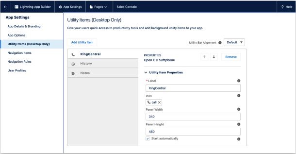

Open the App, and the CTI will show on the utility bar.

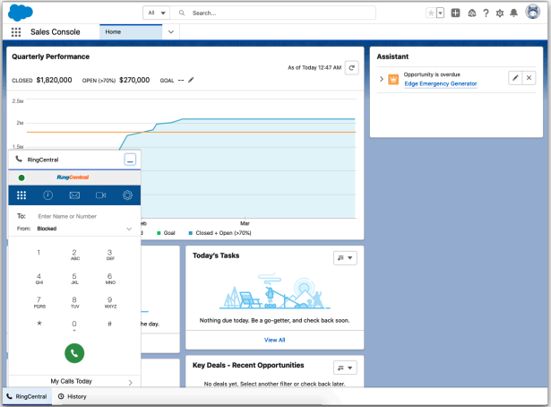

**Add the RingCentral Global Actions**

The Global Action is a quick action entry in Salesforce. It could be configured and assigned to a user group.

Enter the Global Actions set up by the following path: Setup → User Interface → Global Actions → Global Actions.

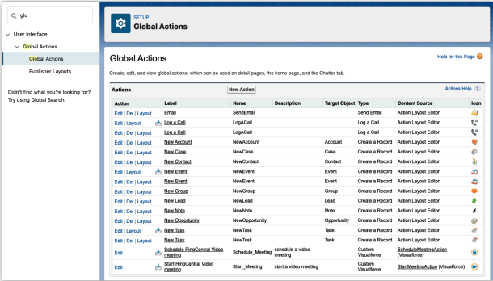

In this view, all Global Actions are listed. Including the

-   Schedule RingCentral Video meeting
-   Start RingCentral Video meeting

Navigate to the Publisher Layouts, create a new layout or edit the current one.

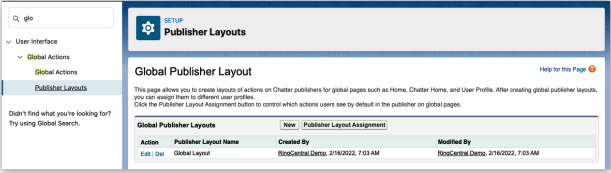

Navigate to the Mobile & Lightning Actions configuration.

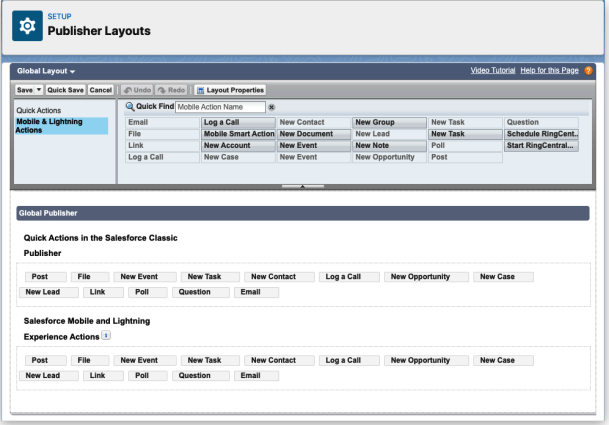

Drag the RingCentral actions to the place that needed. And Save the setting.

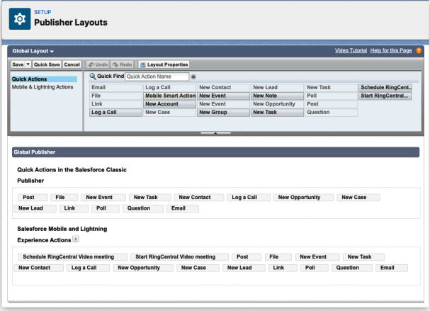

Assign the layout to user profiles that are needed. And users can find the RingCentral actions in the Global action entry.

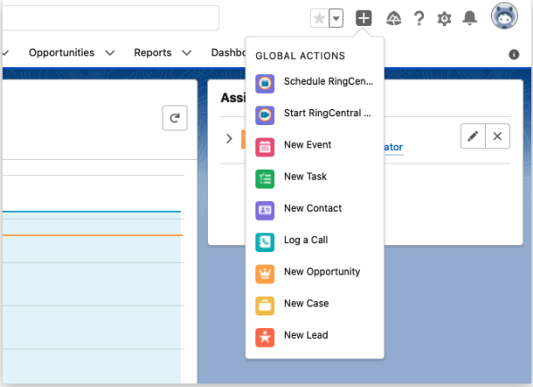

**Enable RingCentral in the Salesforce Mobile**

The RingCentral for Salesforce application provides 2 actions:

-   Call with RingCentral
-   SMS with RingCentral

Both of the actions require the RingCentral Mobile application. Users could install the RingCentral mobile from Google Play (Android) or App Store (iOS).

**Add RingCentral Mobile Actions on the Mobile App**

The admin needs to set up for each record type that needs the Call or SMS with RingCentral actions.

The following example is adding the RingCentral actions to the Lead record. Other types of records is following the same setup flow.

Before any configuration, the Lead record layout on mobile contains the below actions as the attached image.

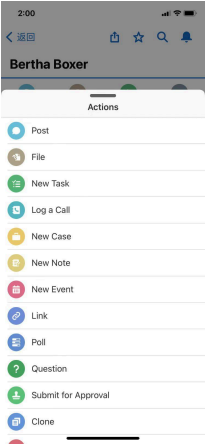

Navigate by the record's page layout setting by Setup → Object Manager → Lead → Page Layouts

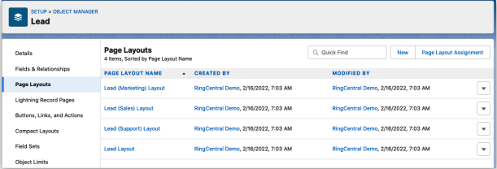

All Layouts in this org are listed here. Select the needed one to edit.

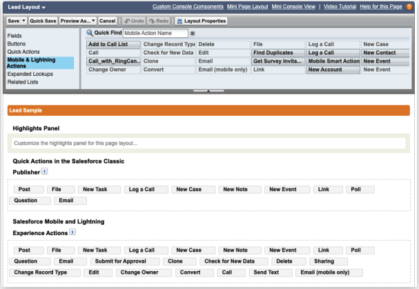

Select Mobile & Lightning Actions and drag the Call_with_RingCentral and SMS with RingCentral to the target location.

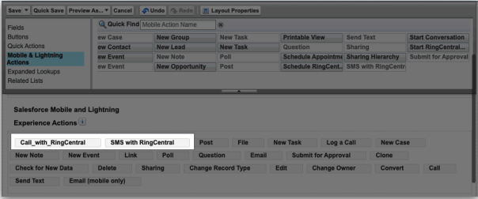

Save the layout. Relaunch the Salesforce Mobile app, both of the actions will be listed on the Lead record action list.

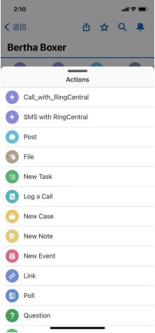

## Analysis and Reports

RingCentral for Salesforce provides native and self-defined data reports. Users could take advantage of these reports by building their own or updating data or formulas to create new reports as needed.

The Analytics Report provides simple access for users to have a good understanding of the team and the individual performance.

**Pre-build Salesforce Reports**

Launch the RingCentral for Lightning app or any other apps that contain the Reports. Click All Folders

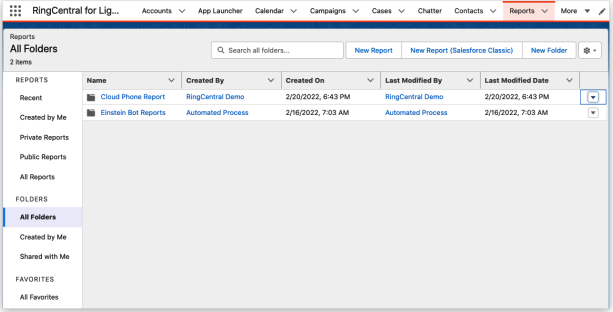

The RingCentral package creates the Cloud Phone Report folder. To control access to this report folder, click the dropdown and select Share.

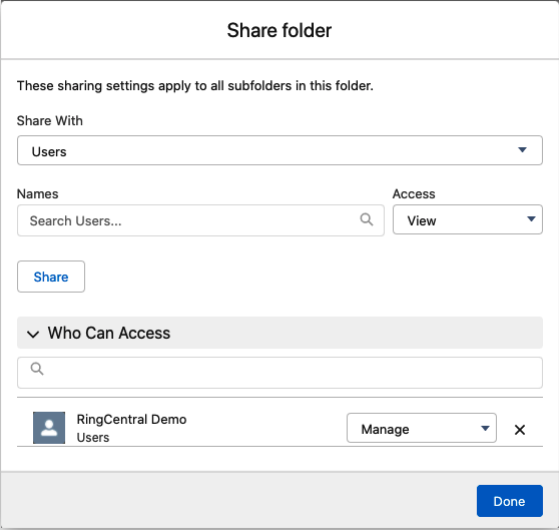

Enter filter conditions and click Done.

**Pre-build Salesforce Dashboard**

Open the Dashboards → All Folders. The RingCentral package creates a Cloud Phone Dashboard folder. To share the folder with more users, click the dropdown and select Share.

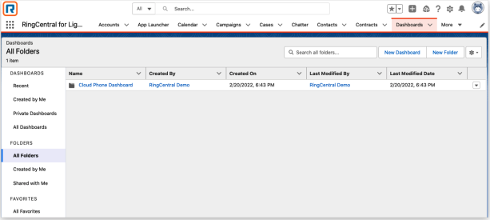

**Analytics Report**

The Analytics Report is a handy dashboard that shows some key data of a team, or individually, depending on the role of the current user in Salesforce.

For example, User A had been assigned to the Remote Sales Manager role in this org. And User B, C, D had been assigned to the Remote Saler role in this org. Then User A can see all data of B, C, D. And User B, C, D can only see their own data in the Analytics Report.

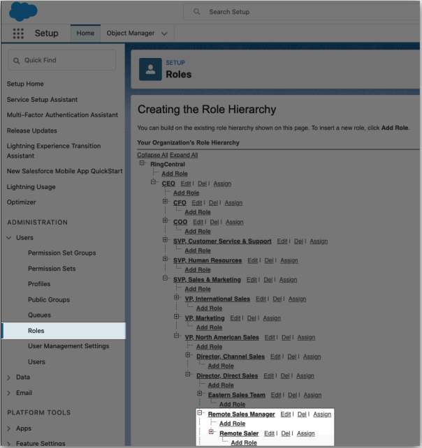
