---
hide:
    - toc
---

# Install RingCentral for Salesforce

## Quick Navigation

-   **[Install RingCentral for Salesforce](#install-ringcentral-for-salesforce)** - Install the RingCentral for Salesforce package from AppExchange
-   **[Uninstall RingCentral for Salesforce](#uninstall-ringcentral-for-salesforce)** - Remove RingCentral for Salesforce from your Salesforce instance

---

Install the RingCentral for Salesforce package from the [Salesforce AppExchange](https://appexchange.salesforce.com/appxListingDetail?listingId=a0N3A00000EORsjUAH). Click "Get It Now" to start the installation. Installation of this application requires an administrator login to Salesforce.com

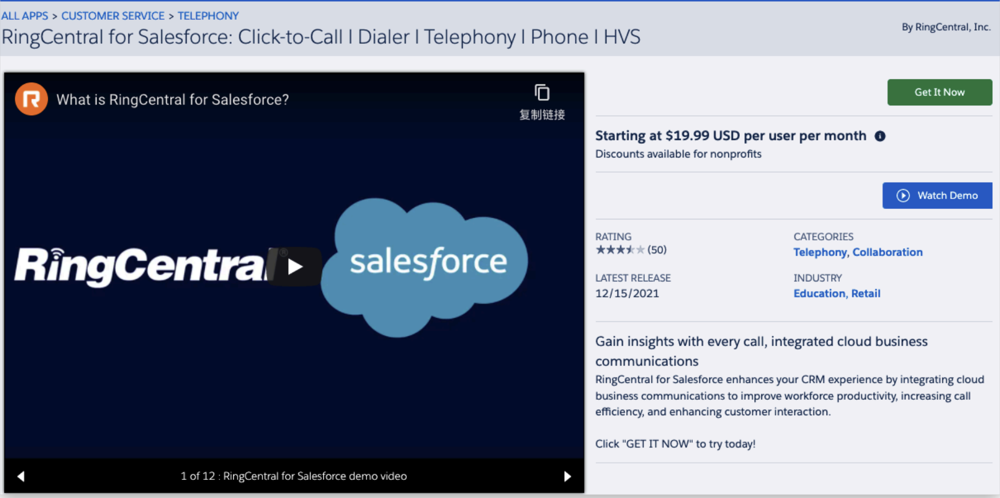

By clicking "Get It Now", the confirm page will appear. Click the "Visit Provider

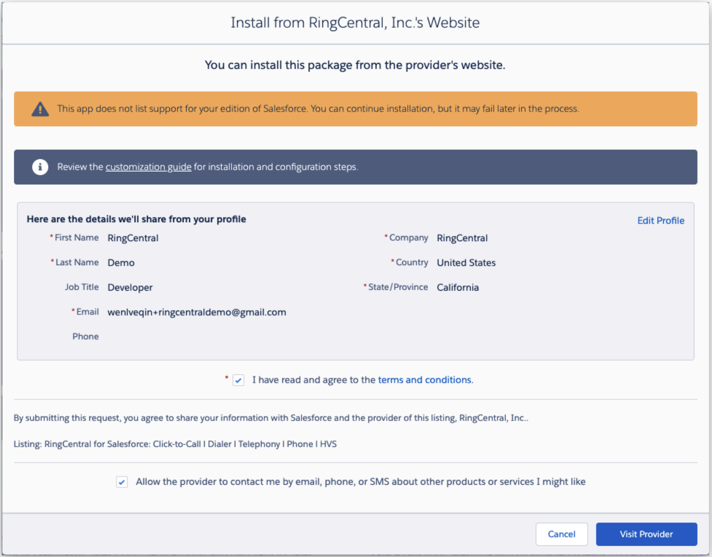

The user will be navigated to the landing page. Select a Production or a Sandbox environment to process the installation. In this guide, we are going to install the application in a Production environment.

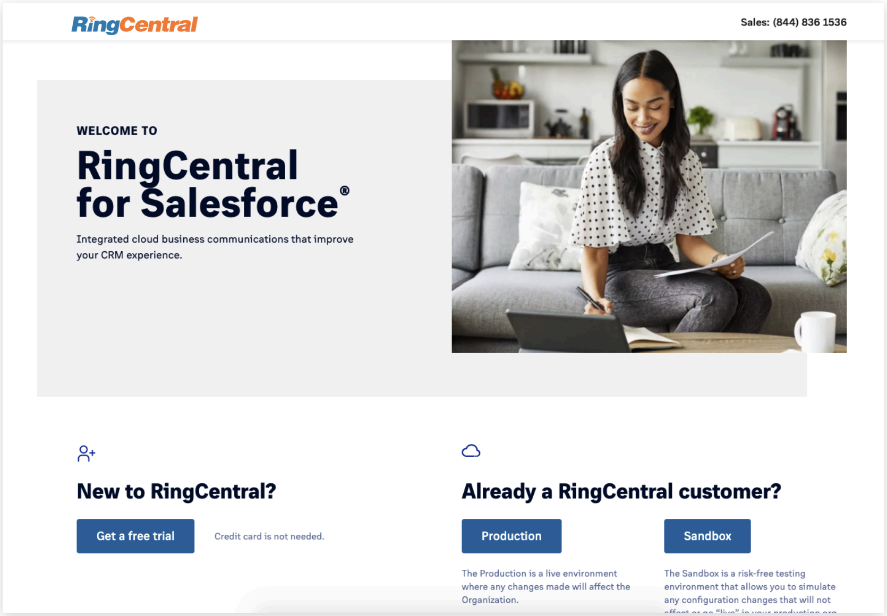

The installation process will be initiated in the Salesforce environment. Select the users that wanted to be installed. And click the Install button.

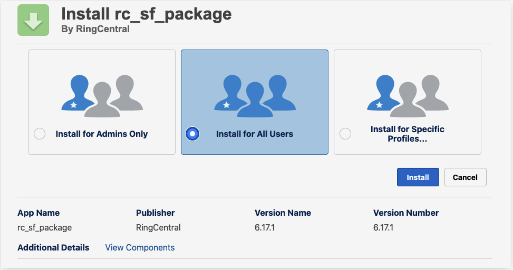

The installation will continue to process. If the installation takes longer than expected, Salesforce will send an email notification when done.

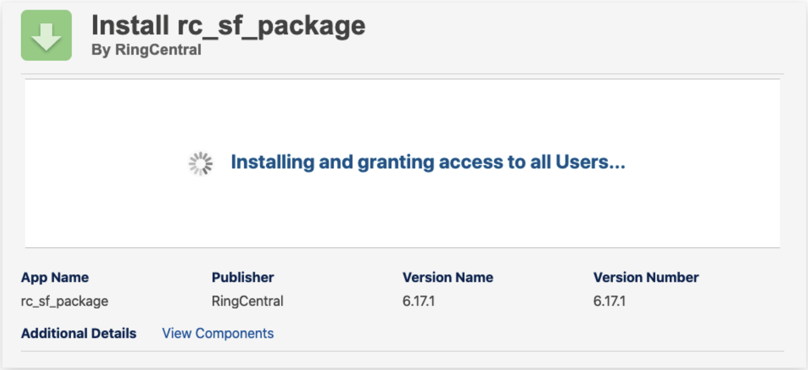

Once the installation is done, the completed page will be displayed.

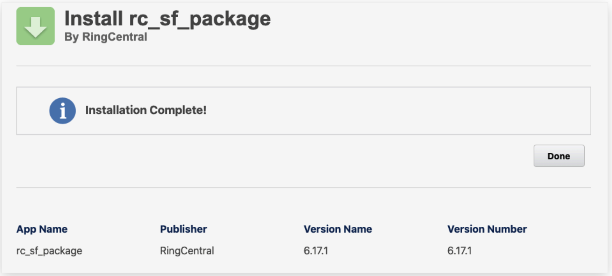

Now the admin can find the installed package in the Salesforce Setup -> Apps -> Packaging -> Installed Packages.

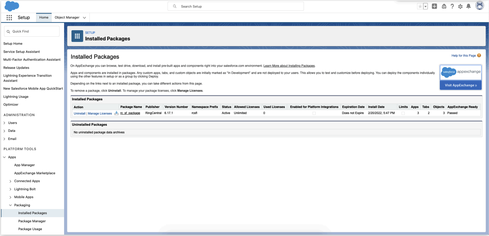

Once the installation is completed, the admin user is able to find the RingCentral for Lightning and RingCentral Admin for Lightning from the App Launcher.

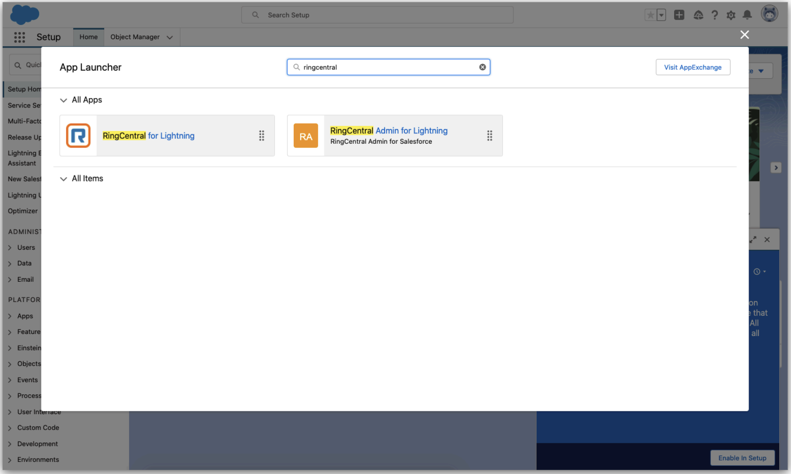

#Uninstall RingCentral for Salesforce

Navigate to the Salesforce Setup -> Apps -> Packaging -> Installed Packages. All installed packages are listed on the table.

RingCentral for Salesforce application is using the Package Name "rc_sf_package". Click the Uninstall in the Actions. The uninstallation will be initialized.

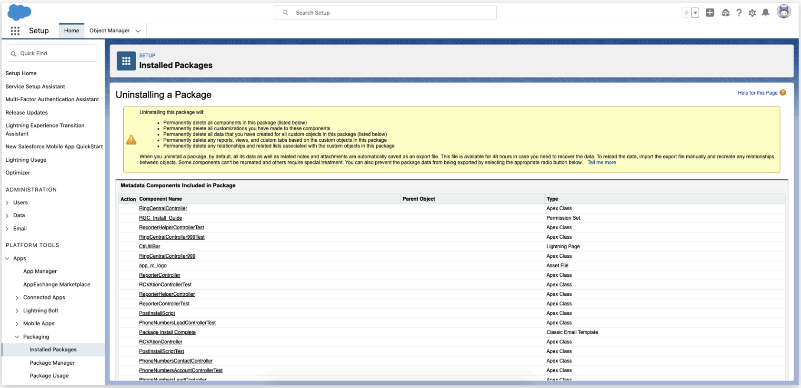

The admin can decide whether save a copy of the package data for later use, and need to confirm the uninstall. And click the Uninstall button to continue.

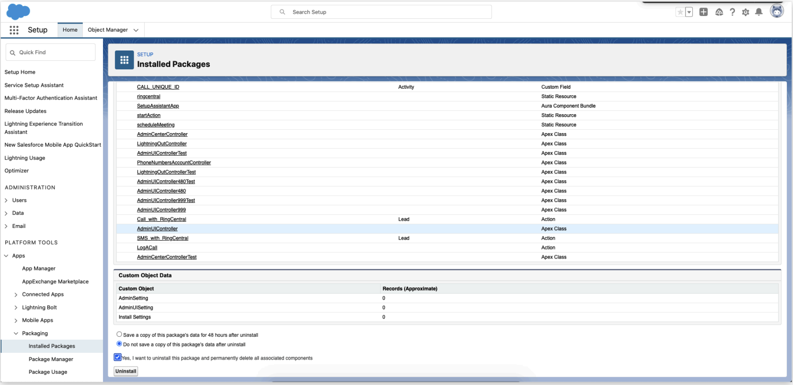

The packages that are going through the uninstallation process will be listed in the Uninstalled packages table. And the uninstallation status will be shown.

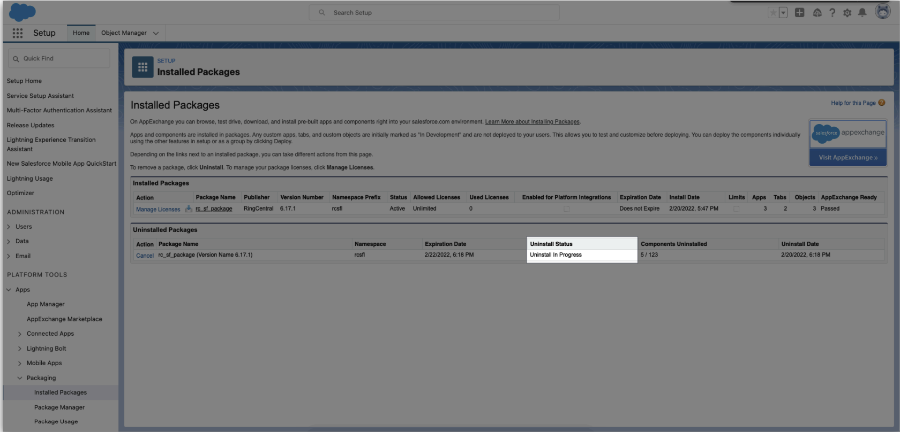

Once the uninstallation is completed, the package will be removed from the Installed Packages table, and the status on the Uninstalled Packages table will be shown Completed.

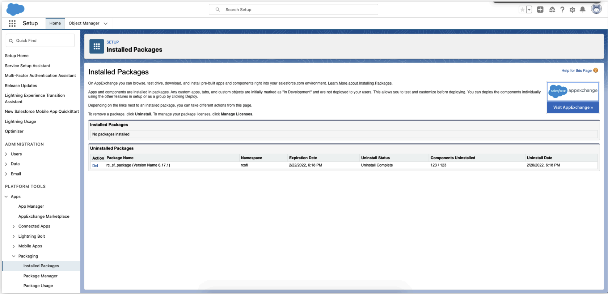
