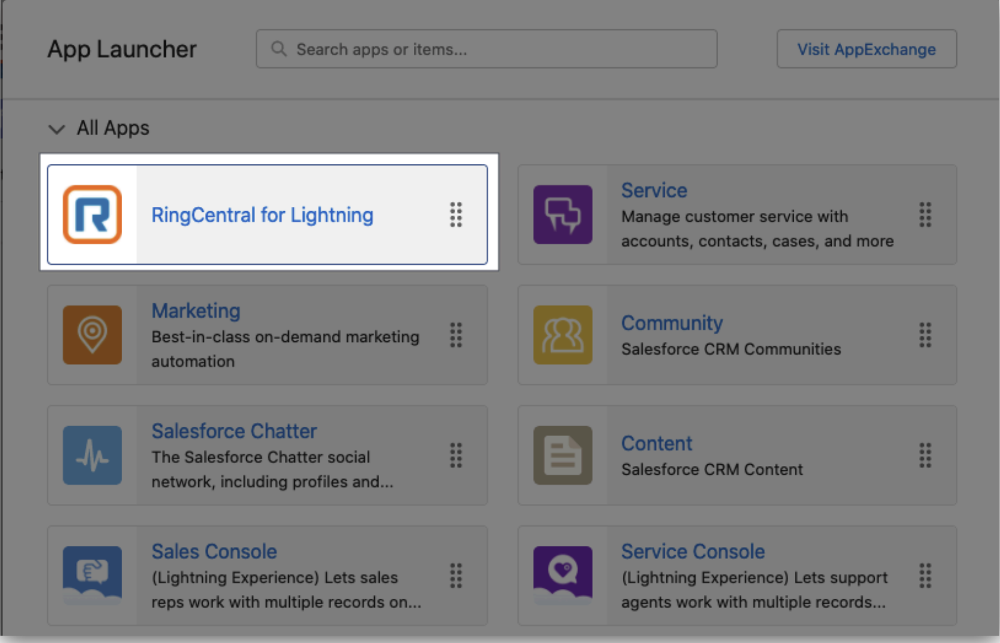
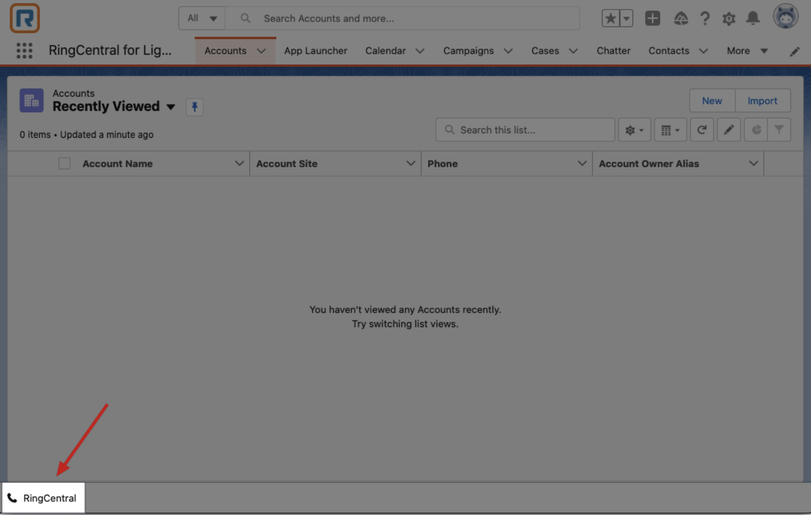
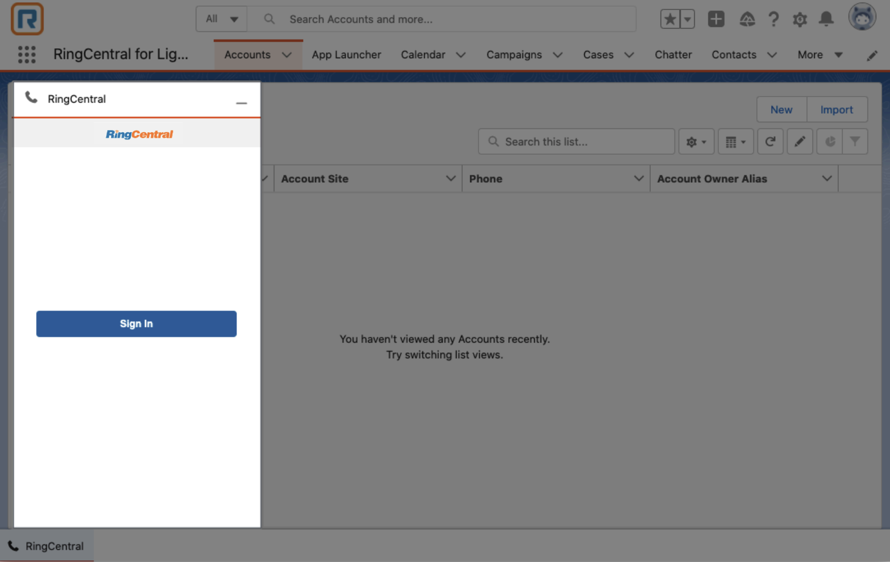
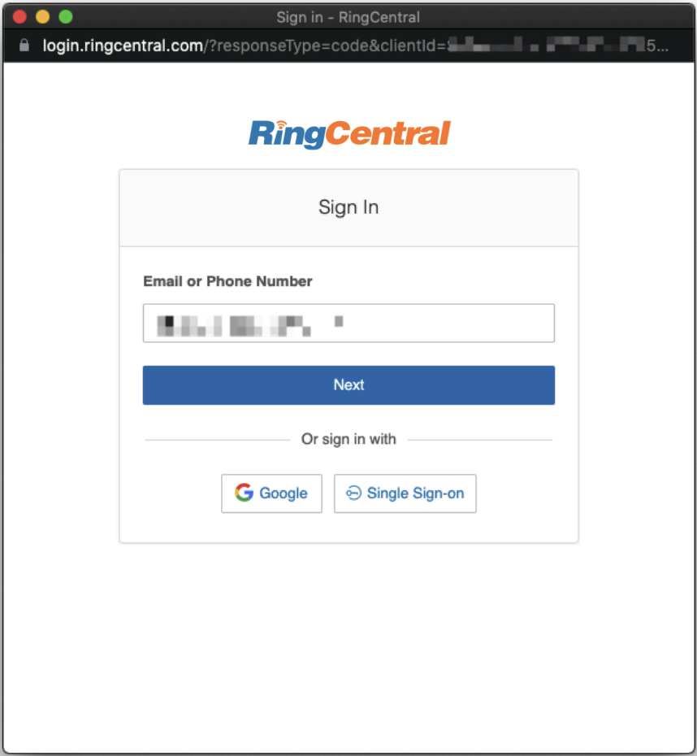
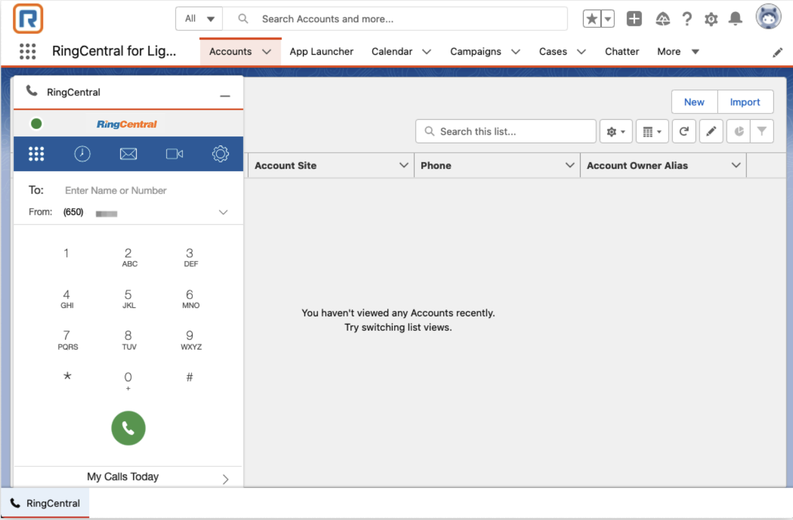

# Getting started with RingCentral for Salesforce

Once RingCentral for Salesforce has been successfully installed and configured by your organization’s administrator, end-users can begin using the RingCentral CTI (Computer Telephony Integration) directly within Salesforce. This section of the guide will walk you through the process of accessing the RingCentral CTI and logging in for the first time.

### Launching RingCentral for Salesforce

Upon installation, RingCentral for Salesforce will create a dedicated Salesforce app named **RingCentral for Lightning**. To access this app, users can search for it in the Salesforce App Launcher, provided they have been granted the necessary access permissions by their Salesforce administrator.

<figure markdown>
  
  <figcaption>Finding the RingCentral app in the Salesforce App Launcher</figcaption>
</figure>

In some cases, Salesforce administrators may choose to hide the **RingCentral for Lightning** app from end-users or integrate the CTI functionality into other custom apps within Salesforce. If you are unable to find the app, it’s a good idea to reach out to your organization’s admin team to inquire about the app’s location or where the CTI has been added.

For apps that include the CTI, users will see a button within the page layout that serves as the access point to RingCentral. Simply click this button, and the RingCentral CTI page will appear, where you can proceed to log in.

<figure markdown>
  
  <figcaption>The RingCentral app can also be found as a button on the bottom of the page</figcaption>
</figure>

### Logging In to RingCentral for Salesforce

To begin using the RingCentral for Salesforce app, click the **Sign-In** button, which will trigger the login process. 

<figure markdown>
  
  <figcaption>When logged out, you will be prompted to login</figcaption>
</figure>

You’ll need to sign in using your existing RingCentral account credentials. If you encounter any issues while obtaining or using your RingCentral account, please contact your organization’s administrator for assistance.

<figure markdown>
  
  <figcaption>Login using your RingCentral credentials</figcaption>
</figure>

After successfully logging in, you will be able to access all of the features of **RingCentral for Salesforce**, seamlessly integrated within the Salesforce interface.

<figure markdown>
  
  <figcaption>Once logged in you will have access to the RingCentral CTI and dialer</figcaption>
</figure>
