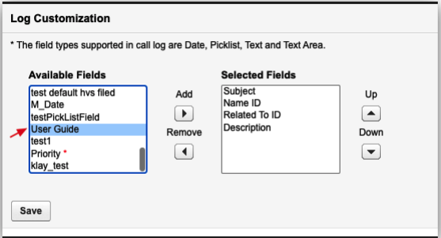
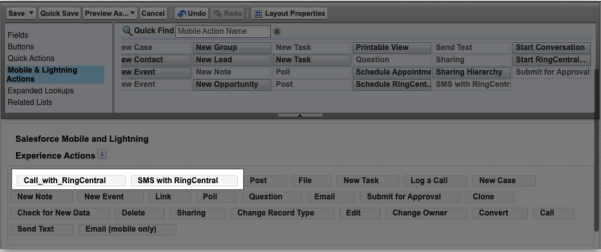
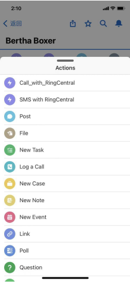
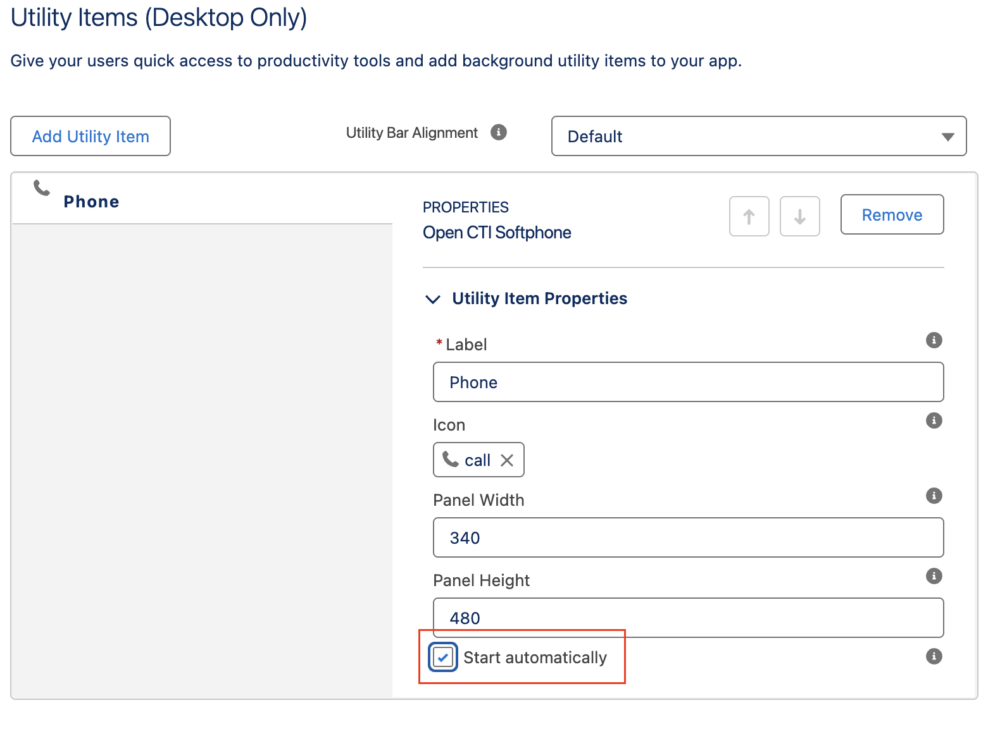

---
hide:
    - toc
---

# General Questions

## Q. I keep seeing 'Webphone Unavailable' error message?

A. Users may encounter a "Webphone Unavailable" error message when attempting to call from RingCentral for Salesforce. This error typically occurs due to insufficient microphone permissions in the browser. To identify and resolve the issue, consider the following rules:

Solution 1: Enable Microphone Permissions

When users see the "Webphone Unavailable" error message, instruct them to click on it. This action will open the browser site settings. Ensure that the toggle for Microphone is turned on. Once enabled, the error message should disappear, allowing users to use RingCentral for Salesforce for making calls.

Solution 2: Check Browser Privacy Settings

If users still encounter the "Webphone Unavailable" error message after allowing microphone permissions, recommend checking the browser privacy settings. For Google Chrome:

1. Go to Browser Settings
2. Select Privacy and security
3. Select Microphone
4. Verify the following: - The correct microphone is selected (e.g., MacBook Pro Microphone (Built-in)(System default)) - Under default behavior, "Sites can ask to use your microphone" radio button is selected - The Salesforce site is not listed under "Not allowed to use your microphone" - The Salesforce site is present under "Allowed to use your microphone"

Solution 3: Check microphone permissions in Salesforce

If all browser permissions are allowed and the error persists, recommend checking permissions in Salesforce:

1. Navigate to Salesforce → Setup → Session Settings → Browser Feature Permissions
2. Ensure either "Include Permissions-Policy HTTP header" is unchecked, or if checked, set Microphone to Always
3. Reference: https://help.salesforce.com/s/articleView?id=000570789&type=1

## Q. Why am I receiving an insufficient privileges error message?

A. Users require access to the RingCentral Visualforce page in their profile. To set up this access, go to the user's profile in Salesforce. Under Visualforce Page Access, check that the page OpenCTIIndex is included.

## Q. Why is the Related To field not auto-populated when logging a call?

A. To ensure the "Related To" field is auto-populated when logging a call, follow these steps:

Enable the "Enhanced autofill 'Contact Relationship' when using click to dial" checkbox.
Access the "Autofill Related-To in Call Log for Click to Dial" settings from the RingCentral Admin for Lightning advanced settings in the Admin UI.

## Q. How to create a custom field and add it to the create call log screen in RingCentral CTI?

A. Salesforce administrators can create a new custom field of various data types (e.g., Date, Text, Text Area, Picklist) and add it to the create call log screen. Users can update this field while on a call with an agent, which will ultimately update the Task object. This feature is beneficial for users who need to update a particular field inside the task during or after a call with an agent. Follow these steps to add a RingCentral custom field or a new custom field to the Call Log Screen:

1. Navigate to Setup -> Object Manager -> Fields & Relationships -> Activity
2. Add a new custom field
3. Go to RingCentral Admin UI (Setup -> Search for 'Visualforce Pages' in Quick Find -> adminUI -> Preview)
4. Under Log Customization, ensure the custom field is added to the Selected Fields from the Available Fields.

## Q. Why do I see the error message "This record was modified by CUSTOMER_NAME during your edit session. Make a note of the data you entered, then reload the record and enter your updates again."?

A. This error occurs because after a Call Log Task is created, RingCentral for Salesforce continues to sync the call log (Call Log Synchronization (ringcentral.com)) in the background, then updates the Call Log Task.

If the customer opens the Task editor before the Call Log sync is complete and then tries to save the call log after the sync has finished, they will encounter this error message.

Solution

-   Recommend that the Salesforce admin apply the 'Delay auto call logging for' setting to overcome this error message.
-   Navigate to Setup -> Search for 'Visualforce Pages' in Quick Find -> adminUI -> Preview
-   Under Auto Save Setting, ensure the checkbox for 'Delay auto call logging for' is enabled with the desired amount of delay time selected.
    This will ensure the Call Log sync happens after the specified delay, allowing users to edit the Task record before the sync occurs.

## Q. What are all the custom fields provided by RingCentral in Salesforce?

A. Below are the RingCentral custom fields

1. Call Identification Fields:

    ● CALL_UNIQUE_ID_c

    - Type: Text
    - Length: 255
    - External ID: true
    - Unique: true
    - Purpose: Unique identifier for each call

    ● CALL_UUID_c

    - Type: Text
    - Length: 255
    - External ID: true
    - Purpose: UUID for the call

2. Call Recording Fields:

    ● Call_Recording_c

    - Type: Text (Formula)
    - Formula: Creates a hyperlink to the call recording
    - Purpose: Links to the call recording in RingCentral

    ● Recording_Information_c

    - Type: Text
    - Purpose: Stores recording metadata

3. Call Details Fields:

    ● call_start_time_c

    - Type: DateTime
    - Purpose: Start time of the call

    ● call_end_time_c

    - Type: DateTime
    - Purpose: End time of the call

    ● CallDurationInSeconds

    - Type: Number
    - Purpose: Duration of the call in seconds

    ● CallDisposition

    - Type: Picklist
    - Purpose: Result or outcome of the call

4. Caller/Callee Information:

    ● caller_name_c

    - Type: Text
    - Purpose: Name of the caller

    ● callee_name_c

    - Type: Text
    - Purpose: Name of the callee

    ● caller_location_c

    - Type: Text
    - Purpose: Location of the caller

    ● callee_location_c

    - Type: Text
    - Purpose: Location of the callee

    ● from_number_c

    - Type: Text
    - Purpose: Caller's phone number

    ● to_number_c

    - Type: Text
    - Purpose: Callee's phone number

5. Logging Type Field:

    ● RC_Logging_Type_c

    - Type: Text
    - Length: 255
    - Purpose: Indicates the type of logging (e.g., 'sms', 'call')

6. Additional Fields:

    ● external_whoid_c

    - Type: Text
    - Purpose: External Who ID reference

    ● hvs_disposition_c

    - Type: Text
    - Purpose: HVS disposition field

    ● key_c

    - Type: Text
    - Purpose: Key field for additional data

7. Contact Fields:

    ● SMS_Number_c

    - Type: Text
    - Purpose: SMS number for the contact

    ● SendSMS_c

    - Type: Boolean
    - Purpose: Flag to indicate if SMS can be sent

8. Admin Settings Fields:

    ● AutoFill_c

    - Type: Boolean
    - Purpose: Auto-fill setting

    ● AutoSave_c

    - Type: Boolean
    - Purpose: Auto-save setting

    ● HvsDispositionField_c

    - Type: Text
    - Purpose: HVS disposition field setting

    ● HvsMode_c

    - Type: Text
    - Purpose: HVS mode setting

    ● IsUnMandatory_c

    - Type: Boolean
    - Purpose: Mandatory field setting

    ● ToVoiceMail_c

    - Type: Boolean
    - Purpose: Voicemail setting

    ● accountRelatedTo_c

    - Type: Text
    - Purpose: Account relation setting

    ● autoSelect_c

    - Type: Boolean
    - Purpose: Auto-select setting

    ● fieldOrder_c

    - Type: Number
    - Purpose: Field order setting

    ● popOnRinging_c

    - Type: Boolean
    - Purpose: Pop on ring setting

    ● saveOnRinging_c

    - Type: Boolean
    - Purpose: Save on ring setting

## Q. Does click to dial work on custom reports?

A. Salesforce does not support the Click to Dial feature on the Custom Reports tab. This is a limitation from Salesforce, and customers need to check with Salesforce to enable this feature for RingCentral to work.

Click to Dial can only be performed from Contacts, Accounts, Leads, Opportunities, Cases, and Custom Objects. The Salesforce developer article for the function we utilize to perform click to dial on these Salesforce objects can be found at: https://developer.salesforce.com/docs/atlas.en-us.api_cti.meta/api_cti/sforce_api_cti_onclicktodial_lex.htm

## Q. Screen pop does not open in a new tab.

A. The issue likely stems from the user utilizing Salesforce Lightning. In Lightning, the screen pop feature does not support opening in a new browser window or tab, which causes it to malfunction. I recommend that the customer contact Salesforce for a potential solution. In classic mode, however, this functionality should work correctly. The user should verify their version and troubleshoot accordingly.

If the customer is using the Classic version of Salesforce, the screen pop function typically works without issues. To troubleshoot in Classic, I recommend the following steps:
Go to Salesforce -> Setup.
In the Quick Find search bar, type "Softphone Layouts."
Edit the RingCentral softphone.
Under Screen Pop Settings, change the "Screen pops open within" option to "New browser window or tab."
Save the settings.

After completing these steps, advise the customer to test an inbound call to verify the solution.

## Q. The contact match does not work for person accounts.

A. We need to verify if the 'Associate Call/SMS Log with Person Account' setting is appropriately selected. If it is set to use the Name field, then users cannot match the records under the Related To field and vice versa.

To change the association of Call/SMS logs with person accounts, follow these steps:

Go to Salesforce -> Setup -> Search for Visualforce Pages in the Quick Find
Click on adminUI -> Click Preview
Under the Associate Call/SMS Log with Person Account section, select the field that you want to use to match records
Click Save

## Q. The contact match does not work for custom objects.

A. We need to check if the custom object is added to the softphone layout.
Recommend the customer to:
Go to Salesforce -> Setup -> Search for Visualforce Pages in the Quick find
Click on adminUI -> Click Preview
Ensure the Custom Object Support radio button is selected under "Settings for Matching Caller Details"
Navigate back to the Setup page and search for Softphone Layouts
Edit the RingCentral softphone
Ensure the custom object is added to "Display these salesforce.com objects:" for inbound, outbound, and internal Call Types

## Q. How to check or update the adapter URL for RingCentral call center?

A.
**Step 1:** Get the correct Adapter URL

-   Log in to your Salesforce org.
-   Go to Setup → Visualforce Pages → find the item named OpenCTIIndex → click the preview icon to open the page.
-   After opening the page, wait a while until the page content is loaded, then copy the URL from the browser.

**Step 2:** Compare with the URL set in the Call Center.

-   Go to Setup → Call Centers → find the item you are currently using (we will create a call center named Cloud Phone App v2 in the latest version) → click the Edit icon.
-   Check the CTI Adapter URL option. Compare the input value with the URL you copied earlier. If it's different, replace it with the copied value from step 1, save the settings, then refresh the CTI app to try again.

##Q. How can I use RingCentral for making calls and sending SMS from the Salesforce mobile app?
A. The RingCentral for Salesforce application provides two actions:

-   Call with RingCentral
-   SMS with RingCentral

Both actions require the **RingCentral Mobile application**. Users can install RingCentral mobile from Google Play (Android) or the App Store (iOS).

The admin needs to set up each record type that needs the Call or SMS with RingCentral actions.
For example, to set up for the Account record type,

1. Go to Setup>Object Manager >Accounts>Page Layouts >Page Layout Assignment.
2. Select the Page Layout you want to change and click Edit.
3. Scroll to the Mobile & Lightning Actions section.
4. Drag the actions you created to the Salesforce Mobile and Lightning Experience section.
5. Click Save.

Upon relaunching the Salesforce Mobile app, both actions will be listed in the Account record action list.

 

##Q. Can I log calls or SMS made from the Salesforce mobile app?
A. Yes, there are two ways to log calls and SMS to the Salesforce task object from the Salesforce mobile app:

1. **Browser Integration**: Users must be logged into the browser RingCentral for Salesforce CTI (Computer Telephony Integration). Direct logging from the Salesforce mobile app is not possible without this browser integration.

2. **Server-side Call Logging**: This method requires admin setup in the integration console (integrations.ringcentral.com) and enabling Activity Sync. Once configured, users can make calls and send SMS through any RingCentral platform (desktop application, mobile application, etc.), and these activities will be logged to the Salesforce standard or custom object activity as a task object. This allows users to log calls and SMS to Salesforce when using the RingCentral mobile app in conjunction with the Salesforce mobile app.

##Q. Is the RingCentral Managed package for Salesforce compatible with ICU locale formats?
A. Yes, the RingCentral for Salesforce integration is compatible with ICU locale formats. However, users should be on version 6.26 or above. Changing ICU (International Components for Unicode) locale formats in Salesforce affects how dates, times, numbers, and currencies are displayed across the platform, including for users in Lightning Experience, Apex, and formulas.
Salesforce has adopted ICU Locale Formats for better international standards support. RingCentral Apex classes have already complied with these changes, and an updated package has been released.

##Q. RingCentral for Salesforce presence does not sync with RingCentral desktop application.

A. Presence in RingCentral for Salesforce CTI: The Salesforce CTI app does not have any automated presence logic and will not modify users' presence under any circumstances, unless the user explicitly sets their presence using the app.

-   The presence in the CTI uses the RingCentral telephony or phone status. The presence statuses used in RingCentral Phone are:
    Available, Busy (On a Call), Do Not Disturb (DND), and Invisible/Offline
-   The presence seen here is the same as the presence from RingCentral for Google and service.ringcentral.com

Presence inside RingCentral App (HUD):

-   The presence inside HUD displays the user presence or the RingCentral App (Jupiter) presence, which is different from the phone presence. It supports several other statuses such as meeting status, manual status, and custom status.

There are many presence statuses in RingCentral: https://developers.ringcentral.com/api-reference/Presence/readUserPresenceStatus

The usage of these presence statuses in different apps may vary. Our platform team is still working on supporting unified presence across all RingCentral apps. However, the APIs are currently in beta (https://developers.ringcentral.com/api-reference/Presence/readUnifiedPresence). Our team will begin implementation once the platform team fully supports these APIs.

##Q. Why cannot I uninstall the RingCentral for Salesforce package (rc_sf_package)?

A. If an admin is unable to uninstall the RingCentral for Salesforce package, they typically see a list of problems with Component Type, Name, and Problem message. The most common reason for uninstallation failure is that the page layout for the Task object is still using RingCentral custom fields. In this case, the Component Type would be Page Layout, the Name would be Task.TaskLayout, and the Problem message would state, "The installed component is referenced by a locally created component (User Profile)."

We recommend the admin take the following steps:

-   Go to Setup → Object Manager → Task → Page Layouts.
-   Open the Task Layout and review it for any RingCentral custom fields.
-   Remove any RingCentral-specific custom fields from the page layout. Examples include Call Result, Call Duration, Call Type, Call Recording, CALL_UNIQUE_ID, CALL_UUID, external_whoid, RC Logging Type, From Number, From Number Location, Caller Name, To Number, To Number Location, Callee Name, Start time, and End time.
-   If this page layout is specific to RingCentral alone, consider removing it completely.
-   Attempt to uninstall the package again.

If after removing all references you still face issues with uninstalling the package, there might be hidden dependencies or issues that require further investigation. In this case, contact Salesforce Support for more specific assistance with the uninstallation process of RingCentral (rc_sf_package).

##Q. Why are missed call queue calls not logged to Salesforce?

A. Below is the reason why missed call queue calls are not logged to Salesforce,

If a call is missed by one member and picked up by another, multiple records will be created as one member logs it as a missed call, while another logs it as a connected call.
The situation worsens if the queue rings all members at once.
To address this problem, the application now ignores Call Queue calls that are ringing and appear to be missed by the current user.
Ringing queue calls are ignored because we can only determine the outcome of the call after it's been picked up by someone or completely missed by the account.
Missed calls are ignored as presumably some other member will pick up the call and log it.

The above behavior is intended. The call should be logged by another member if it is picked up.
If the call is completely missed, it will likely not be logged. The logic to log this would conflict with the logic to avoid duplications. As a workaround, users should follow the server-side call logging logic, which requires an admin to complete the setup in the integration console (integrations.ringcentral.com) and enable Activity Sync. Our server component handles the logging of calls and will be able to log missed call queue calls correctly, as the service sees the call logs from the standpoint of the entire account.

##Q. I have audio issues with RingCentral for Salesforce.
A. Users experiencing audio issues may encounter:

-   Inability to hear audio while placing a call
-   One-way audio
-   Delay in audio

There could be several factors causing audio problems, with the most common reasons being:

-   RingCentral STUN servers are blocked. Customers need to ensure there are no firewall or NAT rules blocking UDP traffic, and that "stun1.ringcentral.com:19302" and "stun2.ringcentral.com:19302" are reachable.
-   SIP messages sent from RingCentral for Salesforce CTI through the websocket to wss://sip\*.ringcentral.com:8083 do not go through.

In such cases, we recommend users follow these steps:

-   Set the RingCentral for Salesforce integration app calling option to "call with RingCentral app." This allows the actual phone calls to be handled by the RC desktop app, while the CTI app should still be able to monitor and log calls.
-   If users still experience audio issues, the problem may be with their network. We recommend users work with their IT department to disable the firewall and test calls or switch to a different network.

##Q. Why do I keep getting "A maximum of 5 web phones could be registered" error message?

A. This error occurs when more than 5 RingCentral webphone instances are already registered for your user account. RingCentral has a hard limit of 5 concurrent webphone registrations per user.

The error is part of RingCentral's WebRTC session management system that prevents resource abuse and ensures call quality. The limit applies across all RingCentral applications (Salesforce, Google, Outlook, Web App, etc.) for the same user account. When you hit this limit, you cannot make outbound calls until you reduce the number of active webphone registrations below 5.

**Common Scenarios That Cause This Error**:

-   You have RingCentral open in 5+ browser tabs or windows
-   Multiple RingCentral Applications (RingCentral for Salesforce, RingCentral for Google, RingCentral desktop, web and mobile apps)
-   Multiple users accessing a single account on different devices
-   Previous sessions didn't properly disconnect, leaving orphaned webphone registrations still active on the server

**Solution**:

-   Close RingCentral tabs in other browsers and unused RingCentral Applications
-   Go to RingCentral Web App → Settings → Switch account or Logout. Logout from other RingCentral applications
-   Restrict access to the RingCentral webphone to only the account owner; avoid sharing credentials with other users
-   Clear cookies and local storage for RingCentral domains. This forces fresh registration

##Q. How does the Sales Engagement feature work with RingCentral?

A. We recommend that the Salesforce admin verify the completion of the Sales Engagement setup by referring to the admin guide (https://netstorage.ringcentral.com/guides/rc-for-salesforce-admin-guide.pdf) on page 58. We must also verify if the customer has followed the exact steps mentioned in https://support.ringcentral.com/article-v2/RingCentral-Salesforce-High-Velocity-Sales-Add-on.html?brand=RC_US&product=RingEX&language=en_US. If the customer has followed the guide and still encounters issues, please collect a meeting recording demonstrating the problem and share it with RingCentral support to troubleshoot the issue.

##Q. I do not see the 'Sales Engagement Disposition' field while logging a call in RingCentral for Salesforce CTI.

A. Users do not see the Sales Engagement Disposition picklist field in the create call log screen if they initiate the call from the RingCentral for Salesforce CTI dialer itself or through the Click to Dial feature. This field only appears when a user initiates the call from the Sales Cadence work queue call button beside the contact. If this field still does not appear when the call is initiated from the work queue, then the Salesforce admin needs to check a few configurations in their Salesforce environment.

**Log Customization**:
Check if the 'Sales Engagement Disposition' field is added to the Selected fields from the Log Customization admin UI settings.

-   Go to Setup → Search for Visualforce Pages in the quick find
-   Select adminUI → click Preview to open the RingCentral adminUI settings
-   Scroll down to 'Log Customization' section
-   Ensure Sales Engagement Disposition field is added to Selected fields from the Available Fields

**Check the Field Level Security**:

-   Go to Setup → Object Manager → Task/Activity → Fields & Relationships
-   Click the field (Sales Engagement Disposition)
-   Click Set Field-Level Security
-   Ensure the profile used by the users has Visible access checked

**Add field to the Task Layout**:

-   Go to Setup → Object Manager → Task
-   Open Page Layouts
-   Edit the layout users are using
-   Drag the missing field (Sales Engagement Disposition) onto the layout
-   Save

##Q. When does the Cadence move to the next step with RingCentral for Salesforce integration?

A. It should be noted that according to the implementation, the cadence only moves to the next step under specific conditions.

**Mandatory Sales Engagement Disposition field**:

The call will NOT move to the next step until:

-   The call is logged as a Salesforce task AND
-   A disposition value is selected AND
-   The call log is saved
    If the disposition is not selected:
-   An error toast "Mandatory fields are required" will appear
-   The call will not be logged as a Salesforce task
-   The Sales Engagement work will remain in the same step.

**Non-mandatory Sales Engagement Disposition field**:

The call can move to the next step in two scenarios:

a. When a disposition field is selected:

-   Call is logged as a Salesforce task
-   Disposition is triggered
-   Sales Engagement work is completed

b. When disposition field is not selected:

-   Call is logged as a Salesforce task
-   No disposition is triggered
-   Sales Engagement work remains in the same step

**Auto Log Settings**:

a. When Auto Log is ON:

-   Call will be logged automatically when the call ends
-   If disposition is selected, it will move to next step
-   If disposition is not selected, it will show a required hint

b. When Auto Log is OFF:

-   Call must be manually saved
-   Disposition must be selected (if mandatory)
-   User must click save button

**Multiple Calls Handling**:

-   If a new call comes in while another Sales Engagement call is active:
-   Current call log section will close
-   Call will not be saved as a Salesforce task
-   Toast "Manually save the call and disposition" will appear
-   New call log section will open

**Disposition Field Options**:

-   Default values include:
    Call Back Later
    Left Voicemail
    Meaningful Connect
    Not Interested
    Unqualified
-   Can be customized with custom picklist fields

**Important Notes**:

-   Sales Engagement mode only supports Salesforce Lightning mode
-   The disposition field becomes uneditable after saving
-   The system supports both manual and automatic logging
-   Multiple Sales Engagement calls can be active simultaneously

## Q. Why some of fields are not displayed in the Task or even if it present why is it empty?(Ex: some of the RingCentral custom fields like Call Recording, Call Duration, Call Start Time, Call End Time, etc.)

A. There could be 2 reason why users does not see a specific field or it is empty in the Task Object of Salesforce after a call/sms is logged. Reason 1 Because of the Field-Level Security and Reason 2 Field was not added to the Task Layout. Below are the resolution steps for Salesforce admin to resolve this issue,

**Check the Field Level Security:**

-   Go to Setup → Object Manager → Task/Activity → Fields & Relationships
-   Click the field (Ex: Call Recording, Call Duration)
-   Click Set Field-Level Security
-   Ensure the profile used by the users has Visible access checked

**Add field to the Task Layout:**

-   Go to Setup → Object Manager → Task
-   Open Page Layouts
-   Edit the layout users are using
-   Drag the missing field (Call Recording, Call Duration) onto the layout
-   Save

## Q. Why are the calls logged (Tasks are created) to Contact and Lead but not to the Accounts, Cases, and Opportunities?

A. When logging calls involving Contacts or Leads associated with Accounts, Cases, or Opportunities, tasks are only being created for the Contact/Lead but not for the related Account/Case/Opportunity records. This is the intended behavior of the Salesforce integration. However, to log tasks to Accounts, Cases, and Opportunities, follow the solutions mentioned below.

**How Entity Matching Works:**

Primary Entity Selection (WhoId)
The system selects one primary entity as the "Who" field:

-   Contact/Lead/Person Account: When phone number matches a Contact/Lead/Person Account.

Related Entity Selection (WhatId)
The system can set a related entity as the "What" field:

-   Account: Associated company/organization
-   Case: Related support case
-   Opportunity: Related sales opportunity

**Why Tasks Don't Appear in Account/Case/Opportunity Activity:**

**Single Task Design**

-   One Task per call - not multiple tasks for different objects
-   WhoId field determines where the task appears in Contact/Lead Activity
-   WhatId field determines where the task appears in Account/Case/Opportunity Activity

**Lead Priority Issue**

When a phone number matches a Lead:

-   WhoId = Lead ID
-   WhatId = empty/null
-   Result: Task only appears in Lead Activity

**Missing Related-To Association**

-   When Contact is primary but no Account/Case/Opportunity is associated:
-   WhoId = Contact ID
-   WhatId = empty/null
-   Result: Task only appears in Contact Activity

**Solutions:**

**Solution 1: Manual Related-To Association (Most Reliable)**
Step-by-Step Process:

1. Complete the call and let it auto-log
2. Open the call log from the widget
3. Click on the "Related To" field
4. Search for the appropriate record:
    - Account: Company/organization name
    - Case: Case number or subject
    - Opportunity: Opportunity name
5. Select the record and save the task

Expected Result:

-   WhoId: Contact/Lead ID
-   WhatId: Account/Case/Opportunity ID
-   Task appears in: Both Contact/Lead Activity AND Account/Case/Opportunity Activity

**Solution 2: Click-to-Dial from Related Record**
For Account/Case/Opportunity Association:

-   Navigate to the Account/Case/Opportunity record in Salesforce
-   Use Click-to-Dial from the Account/Case/Opportunity page
-   System automatically sets Account/Case/Opportunity as Related-To

**(Beta - Feature)**

**Solution 3: Configure Object Priority in Integration Console**
Admin Configuration:

1. Go to RingCentral Admin Console
2. Navigate to Integration Console > Salesforce
3. Configure Object Priority Settings:
    - Set Account as higher priority than Lead
    - Set Case as higher priority than Lead (if applicable)
    - Set Opportunity as higher priority than Lead (if applicable)

**Troubleshooting:**

If Task Still Doesn't Appear in Related Record Activity:

-   Check Task field values - ensure WhatId is populated
-   Verify record relationships in Salesforce
-   Check Integration Console settings for object priority
-   Review call log configuration for field mappings

If Related-To Field is Not Available:

-   Check user permissions for the related object
-   Verify field-level security settings
-   Ensure the related record exists and is accessible

**Summary:**
The key is understanding that Salesforce creates one Task per call, and the WhatId field determines where the task appears in related record Activity. By using the Related-To field to manually associate Account/Case/Opportunity records, or by initiating calls from the appropriate record context, you can ensure tasks appear in both the Contact/Lead Activity and the related record Activity. Following these solutions will create tasks in Account/Case/Opportunity Activity.

## Q. Click to Dial or SMS feature is not enabled after refreshing the Salesforce page.

A. This issue is typically caused by CTI (Computer Telephony Integration) not auto-loading in the Lightning App configuration.

**1. CTI Loading Behavior**
The RingCentral for Salesforce integration requires the CTI adapter to be properly initialized before Click-to-Dial (C2D) and SMS features become available.

**2. Lightning App Configuration Issue**
The CTI integration requires specific Lightning App settings to function properly:

-   Auto-load CTI: Must be enabled in Lightning App configuration
-   Utility Bar Integration: CTI must be properly added to the utility bar
-   Page Load Initialization: CTI needs to initialize on page load, not just on click

**Solutions:**

**Solution 1: Enable CTI Auto-load in Lightning App (Recommended)**
Step-by-Step Instructions:

1. **Access Lightning App Builder**

    - Go to Setup > Lightning App Builder
    - Select the Lightning App being used

2. **Configure Utility Bar**

    - Click on Utility Bar in the app layout
    - Locate the RingCentral CTI component

3. **Enable Auto-load Setting**

    - Find the "Auto-load CTI" or "Load on Page Load" option
    - Check/Enable this setting
    - Save the configuration

4. **Test the Configuration**
    - Refresh the Salesforce page
    - Verify Click-to-Dial and SMS features are available immediately
    - No manual click should be required to enable features

**Solution 2: Verify Utility Bar Configuration**
Check Utility Bar Settings:

-   Go to Setup > Lightning App Builder
-   Select the Lightning App
-   Click Utility Bar
-   Ensure RingCentral CTI is added to the utility bar
-   Verify the component is active and not disabled

**(Beta - Feature)**

**Solution 3: Check Integration Console Settings**
Verify Admin Configuration:

-   Go to RingCentral Admin Console
-   Navigate to Integration Console > Salesforce
-   Check CTI Configuration:
    -   Click-to-Dial: Enabled
    -   SMS Features: Enabled
    -   Auto-logging: Properly configured

**Summary:**
The issue occurs because the CTI integration is not configured to auto-load in the Lightning App. By enabling the "Auto-load CTI" setting in the Lightning App Builder, the RingCentral integration will initialize automatically on page load, making Click-to-Dial and SMS features immediately available without requiring manual user interaction.

This is a configuration issue, not a code defect, and can be resolved through proper Lightning App setup.

## Q. Why don't I see caller ID when there is an incoming call to the call queue in Salesforce CTI?

A. This is expected behavior in the Salesforce CTI integration. Caller ID information is not displayed for call queue calls due to the way the system handles queue-based routing and privacy considerations.

**Root Cause Analysis:**

**1. Call Queue Call Handling**
When calls come through a call queue, the Salesforce CTI integration treats them differently from direct calls:

-   Queue calls are routed through the call queue system before reaching individual agents
-   Caller information is masked during the queue routing process for privacy and security
-   The system prioritizes queue management over individual caller identification

**2. Privacy and Security Considerations**
The integration is designed to protect caller privacy when calls are routed through queues:

-   Caller ID masking prevents unauthorized access to caller information
-   Queue-based routing ensures calls are distributed according to business rules
-   Agent-level restrictions limit what information is visible during queue calls

**3. Technical Implementation**
The Salesforce CTI integration has specific logic for handling call queue calls:

-   Queue calls bypass normal caller ID display mechanisms
-   System focuses on queue name and call routing information
-   Caller details are intentionally withheld until the call is properly routed

**Solutions and Workarounds:**

**Solution 1: Use Queue Name Tooltip (Available Feature)**

-   Hover over the call queue name in the CTI interface
-   Wait for the tooltip to appear (short delay)
-   View the complete queue information in the tooltip
-   This provides queue-specific details about the incoming call

**Solution 2: Check Call Assignment**

-   Wait for the call to be assigned to an agent
-   Caller information may become available after assignment
-   Check the call details once the call is in progress

**Why This Design Exists:**

1. **Queue Management Priority**
2. **Privacy Protection**
3. **Performance Optimization**

**Summary:**
The absence of caller ID for call queue calls is intentional behavior in the Salesforce CTI integration. This design prioritizes queue management, protects caller privacy, and optimizes system performance. While caller ID is not displayed during queue routing, users can access queue information through the hover tooltip feature and may see caller details once the call is assigned to an agent.

This is not a bug or configuration issue, but rather the expected behavior for queue-based call handling in the Salesforce CTI system.

## Q. Why can't I change my presence in RingCentral for Salesforce CTI? It always stays on 'Invisible' presence, and I cannot switch to Busy/Available.

A. This occurs when the user's allowToSeeMyPresence value is set to false, which restricts the user from changing their status. We recommend following these steps to set allowSeeMyPresence to True:

Steps:

1. Log in to https://service.ringcentral.com.
2. If this issue is happening for an admin user, select the Admin Portal dropdown on the top right and choose My Extension. If this issue is happening for a standard user, continue with the steps below.
3. Navigate to the Settings tab.
4. Under Devices & Numbers > Phones, look for Presence and select it.
5. Go to Permissions and set "Allow other users to see my Presence status" to On.

If this issue occurs for multiple users, the admin can navigate to individual user extensions from Admin Portal > Users > Users with Extensions. Select the user and perform steps 4 and 5.

## Q. Why can't I see older conversations in the RingCentral for Salesforce CTI?

A. The current implementation retrieves 7 days of message history by default, with a limit of 250 text messages across all conversations. This feature was developed to address performance concerns. However, some conversations within this timeframe may not be visible due to the message count limit.

## Q. Why are SMS messages not automatically logged in Salesforce?

A. There could be several factors contributing to SMS messages not being automatically logged. First, we need to check if the SMS was logged after a certain delay. Message synchronization is not in real-time, so it might have some delay, but eventually, the SMS will be logged to Salesforce. Users can expect up to 8-10 minutes of delay in SMS logging.

The SMS auto-logging issue might occur when multiple person accounts or contacts share the same phone number. The system can't determine which record to log to, resulting in 'no match' in the Name field. To resolve this, ensure each phone number is unique across your person accounts and contacts, or merge duplicate records if they represent the same person.

Another factor to consider is that the conversation needs to have a selected match to appear in activities. It doesn't matter if the heading shows the correct name, but no contact is selected in the Name dropdown. Typically, if there is a single match, our app will try to select that, but sometimes the app may see other viable options and leave this unselected. 

In conclusion, in multiple match scenarios, select the contact to log an SMS, and in single match scenarios, ensure that the Name field is selected correctly to log an SMS.