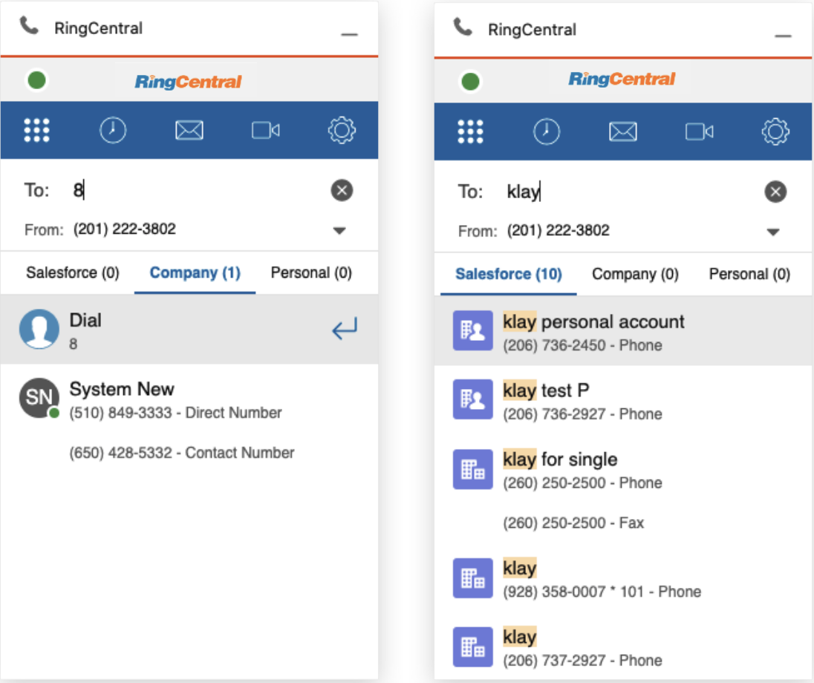

---
hide:
    - toc
---

# Calls

## Quick Navigation

-   **[Call mode setting](#call-mode-setting)** - Configure calling modes and environment requirements
-   **[Audio setting](#audio-setting)** - Set up audio input/output devices and permissions
-   **[Region setting](#region-setting)** - Configure location and phone number formatting
-   **[Dialer page layout](#dialer-page-layout)** - Understand the dialer interface
-   **[Call history page layout](#call-history-page-layout)** - View and manage call history
-   **[Outbound calls](#outbound-calls)** - Make calls using Click to Dial, Call back, and Dialer
-   **[Inbound calls](#inbound-calls)** - Handle incoming calls and notifications
-   **[Call Control](#call-control)** - Control calls with mute, hold, transfer, and recording
-   **[Call logging](#call-logging)** - Log calls to Salesforce and manage auto-logging

---

## Call mode setting

RingCentral for Salesforce provides 4 calling modes. Navigate to Settings → Calling for the list of modes.

They are:

-   Call with the browser (Recommended)
-   Call with the RingCentral App
-   Call with the RingCentral Phone
-   RingOut

For the best telephony experience, the "Call with the browser" mode is recommended.

**Environment requirement for each mode**

-   **Call with the browser**: Only a browser that supports WebRTC is needed.
-   **Call with the RingCentral App**: The RingCentral App should be installed on the same PC/Mac, and logged in with the same RingCentral account as RingCentral for Salesforce.
-   **Call with the RingCentral Phone**: The RingCentral Phone should be installed on the same PC/Mac, and logged in with the same RingCentral account as RingCentral for Salesforce.
-   **RingOut**: Another phone device with a valid phone number.

## Audio setting

The audio settings are only available for Call with the Browser mode. Navigate to the Settings → Audio.

The Audio settings allow users to select their audio input and output devices. Additionally, when audio permissions are blocked by the browser, the user can re-initiate the access request.

Click the Check Permission hyperlink, the App will ask to grant browser audio permissions.

## Region setting

The Region setting is to set up the current location of the user. The app will format a 7 or 8 digit local phone number to an E.164 formatted phone number with the country code and the area code in the region setting.

By default, the app follows the region settings in the current Salesforce organization. The end-user can still select the region as needed.

For example. select the Country (+1) United States, and enter Area Code 650. when the user dials the "local" number 539xxxx, the app is actually dialing +1650539xxxx.

## Dialer page layout

The Dialer page is the app's home page. Users can make outbound calls from this page.

The To: field is for phone number input. You may use the keypad to dial or select alphanumerics from the keyboard to search for additional records.

The From: field is for the user to select the direct numbers to make outbound calls. This is also the phone number that the person receiving the call will see on their Caller ID screen.

## Call history page layout

The Call history page shows the call history of the current user. To ensure the best performance, only the last 7 days or the last 250 calls will be shown on the list.

The Call log status will be shown on the call history page. See more details on the Call logging session section in this guide.

The user can also find some handy tools on the expansion on the call history page. Including Call back, Send SMS, and Add/View contact details.

When the phone number of an inbound call matches a Salesforce record, this button will open the Salesforce record detail page.

When the phone number does not match a Salesforce record, this button is used to create a new record type in Salesforce.

## Outbound calls

RingCentral for Salesforce supports multiple ways to make outbound calls.

### Click to Dial

When the user logs into the app, the Phone type fields turn to clickable hyperlinks. When the user clicks the hyperlink, a call will be made to the phone number using the RingCentral for Salesforce app.

If the "Autofill Related-To in Call Log for Click To Dial" option in the Admin Setting has been switched ON, the Salesforce record that was clicked will be brought to the Call log page.

### Call back from history

The user can also call back from the Call history or the SMS history list. When clicking the call back button from the history list, the match result will be brought to the new call.

### Call from dialer

To make outbound calls from the dialer, users can either click the numbers and make the call from the dialer page or type in the To field to make calls.

When the user is clicking the phone number from the dial pad, the app will allow the user to continue clicking. However, when the user is typing from the keyboard in the To field, the directory search page will open.

The user can navigate between the directory sources to find a target record.

When the user types in more than 3 characters, the app will auto initiate the search into Salesforce.

The searched Salesforce record types were set up by the Admin in the Admin setting.

The user can click any search result to make an outbound call.

## Inbound calls

In the call with browser mode, the user is able to answer inbound calls within the integration app.

When there's an inbound call, the app will open its call log and control page if there's currently no existing call log and/or control page open.

The app will show the caller info with the match result from all directory sources, including Company Directory, Salesforce Records, and Personal Contacts.

In the call log and control page, the user can

-   Forward the call to another number
-   Ignore the call
-   Forward the call to voicemail and reject the call
-   Answer the call.

Find more details about inbound call controls on the call control session.

If there's already a call log page in the front of the App, the app will show a notification for an inbound call. If the user decides to answer the new inbound call, its call log session will open. Otherwise, calls will stay on the former call log page.

## Call Control

### Inbound call control

-   **Ignore the inbound call**: The inbound call will be ignored. The caller will not notice but only hear the call ringing without answering. The CTI will stop ringing for this call.
-   **Forward the inbound call**: Forward the inbound call to a pre-set phone number or a custom phone number. When the call is forwarded, the CTI will stop ringing for this call.
-   **Forward the inbound call to Voicemail**: Forward the inbound call to the user's voicemail. When the call is forwarded, the CTI will stop ringing.
-   **Answer the inbound call**: The inbound call will be answered. The call status will be changed from ringing to connected. the call log and control page will automatically open.

### Connected call control

When a call is connected, the user will be able to find the call controls on the call log and control page. including

-   **Mute/Unmute**: Mute the voice input of the CTI. The user can still hear the voice from the other party of the call. Click to switch between Mute and Unmute status.
-   **Hold/Unhold**: Switch the status of the call between Hold and Unhold. While the call is in Hold status, both parties can not hear or speak to each other. The telephony system will play pre-set hold music. The call information session on the call log and control page will turn orange for status notification.

-   **Record/Stop recording/Resume recording**: Switch the recording status between Recording and Not recording. Each time when the recording was initiated, the telephony system will play the recording notification audio. If there are several recordings (Record → Stop → Resume → etc. ) in a call, all recordings will be merged into a single recording.

The Administrator of this org set up mandatory recording for all calls. In this case, the end-user will not be able to switch the recording status.
When a call is being recorded, the CTI will show status notification for the call.

-   **Transfer**: The user can transfer the current call to a phone number or contact from Salesforce records, Company Directory, or Personal contact. Enter the phone number and click the complete transfer button, the call will be transferred to the phone number.
-   **Keypad**: When the user needs to enter DTMF tones during a call, they can open the dial pad for more actions.

### Multiple calls control

When there are multiple calls on the app, the user can control all calls in one interface.

Click the goes back button in the call log and control page, or the View button on the header to open the All Calls page.

All calls will be listed on the page, and the user can easily switch between them.

### Call control in multiple tabs

Many Salesforce users open multiple tabs while working. To ensure call connection and audio quality, RingCentral for Salesforce provides a solution for multiple tabs call controlling.

1. When calls have been connected in multiple tabs, the audio connection will always be merged to the latest connection.
2. When there are calls on other tabs, the user can always take the call to the current page.

## Call logging

On the Call logging and control page, the user can log the call to Salesforce. The user can either log it during an active call or later, from the call history list.

Log during an active call.

Log or update a historical call

The call log fields are defined by the admin of the organization.

The user can view the call log in Salesforce by clicking the view button on the call history list. The user can also see the call logs from the record activities.

The Call log button is also showing the call logging status. When the icon is red, it means that the call has not been logged yet. When the call log icon is green, it means that the call has been logged.

### Auto log calls

When the admin has enabled an Auto Log calls strategy in the Admin Setting, the Auto log calls setting will be set ON and manual call logging will be disabled in the end-users interface.

Otherwise, the end-user is allowed to switch the setting ON/OFF.

When this setting is ON, when there's an active call (Inbound or Outbound), the app will auto-create a call log to the matched Salesforce record.

The call log could be created when the call was ringing or answered, dependent on the Admin Setting.

### Auto log notes

The Auto log notes setting is only available when Auto log calls is set to ON.

When the Auto log notes setting is ON, all edits on the call log page in the app will automatically update to the call log record in Salesforce.

### Ringtone Volume

The CTI App offers convenient control over your ringtone volume. You can easily adjust the ringtone volume using the intuitive slider provided within the app.

To access the ringtone volume settings:

1. Navigate to Settings.
2. Select Audio.
3. Locate the Ringtone volume option.

Use the slider to increase or decrease the volume level according to your preference. The default value of the slider is 50.

### Calls on other devices

If the RingCentral for Salesforce is working on other call modes, the app will show all calls under the same account to the app, so that the user can easily log any calls that are happening on any devices.

Click on the call item and the user can start logging the call.

The RingCentral for Salesforce offers limited call control for calls on other devices. They are

-   Mute/Unmute
-   Transfer
-   Hold/Unhold
-   End the call

