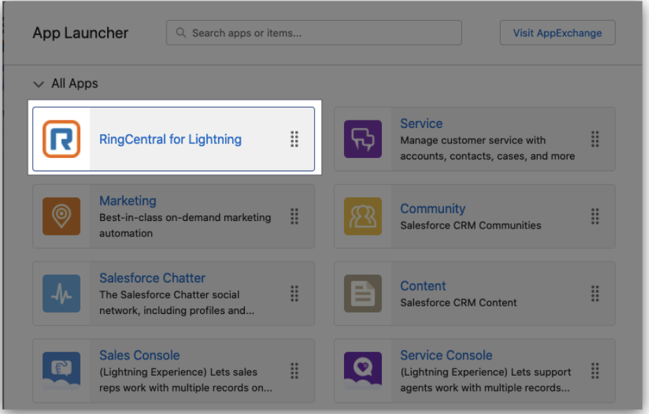
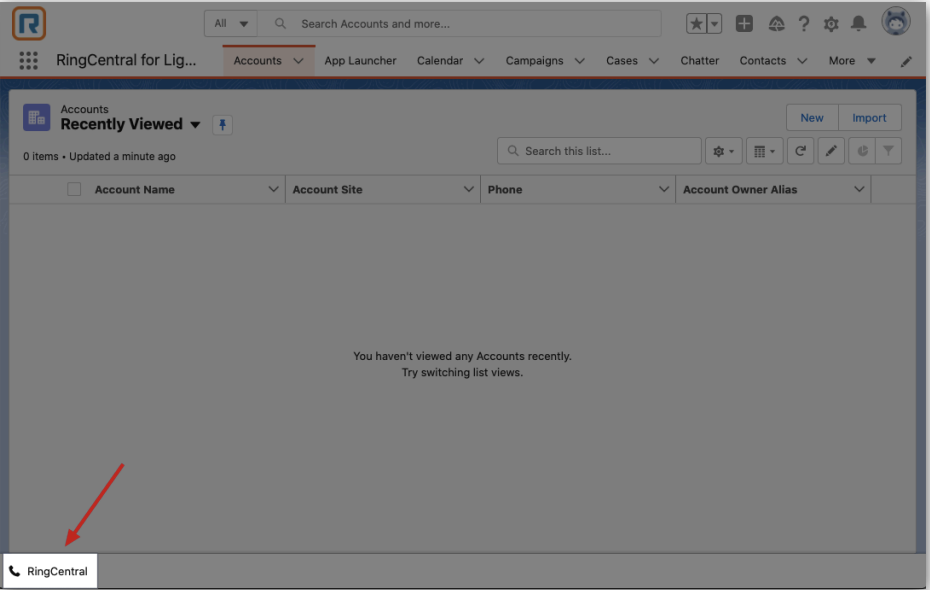
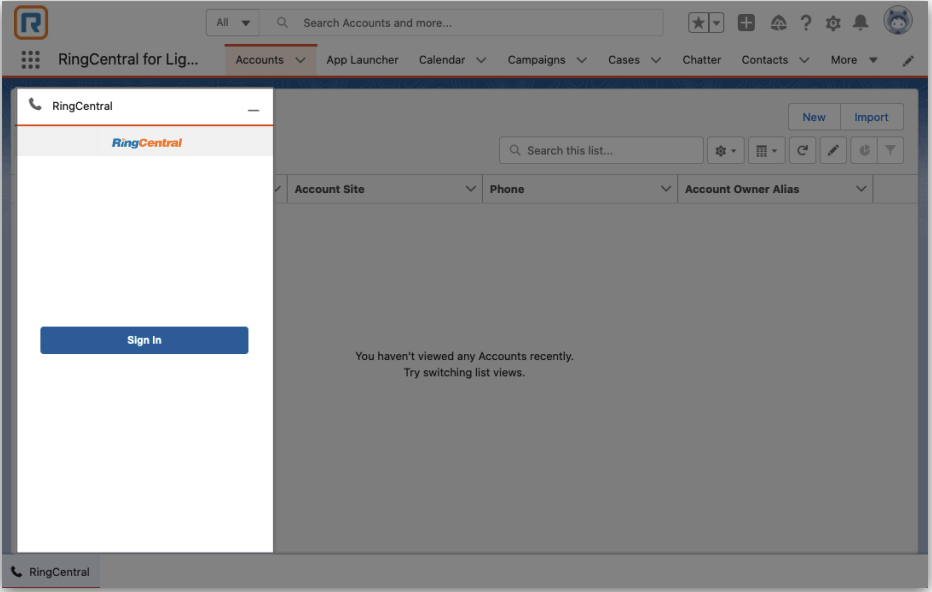
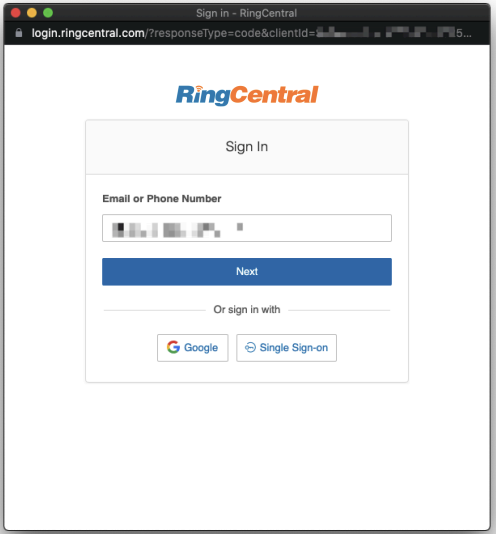
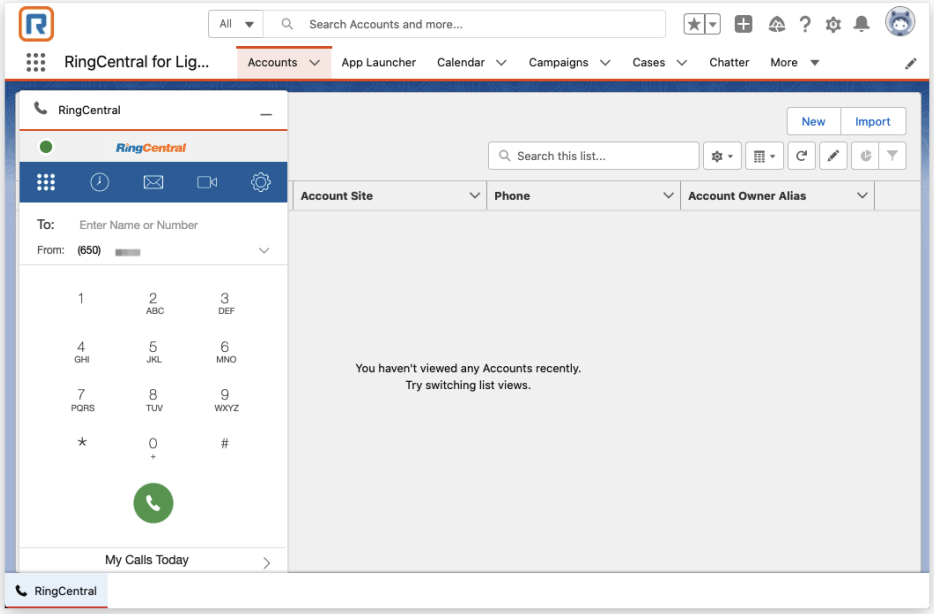

---
hide:
    - toc
---

# Initiating RingCentral for Salesforce

## Quick Navigation

-   **[Launch the RingCentral for Salesforce](#launch-the-ringcentral-for-salesforce)** - Find and access the RingCentral CTI in Salesforce
-   **[Log in to RingCentral for Salesforce](#log-in-to-ringcentral-for-salesforce)** - Sign in to your RingCentral account

---

When RingCentral for Salesforce has been installed and configured by the administrator of the organization, the end-users can find the RingCentral CTI within Salesforce.

This part of the guide will show how to access the RingCentral CTI and the basic login process.

## Launch the RingCentral for Salesforce

RingCentral for Salesforce will create a Salesforce App named RingCentral for Lightning. Users can find this app in the Salesforce App Launcher if the user has been granted access to this App.

In some organizations, the Admins might decide to hide this app from end-users or add the CTI to some other apps. In this case, ask the organization's admin where the CTI app is located within Salesforce.

For any apps the CTI has been added to, the end-users can find the CTI entrance on the button of the page.

Click it and the CTI page will pop up to allow login.

## Log in to RingCentral for Salesforce

Click on the Sign-in button to initiate the login process. Use your RingCentral account to log in to RingCentral for Salesforce.

If there are any problems getting a RingCentral account, contact your organization admin.

After successfully logging in, the user can see the RingCentral for Salesforce in the app.

