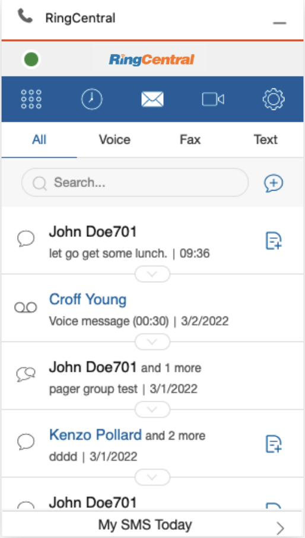
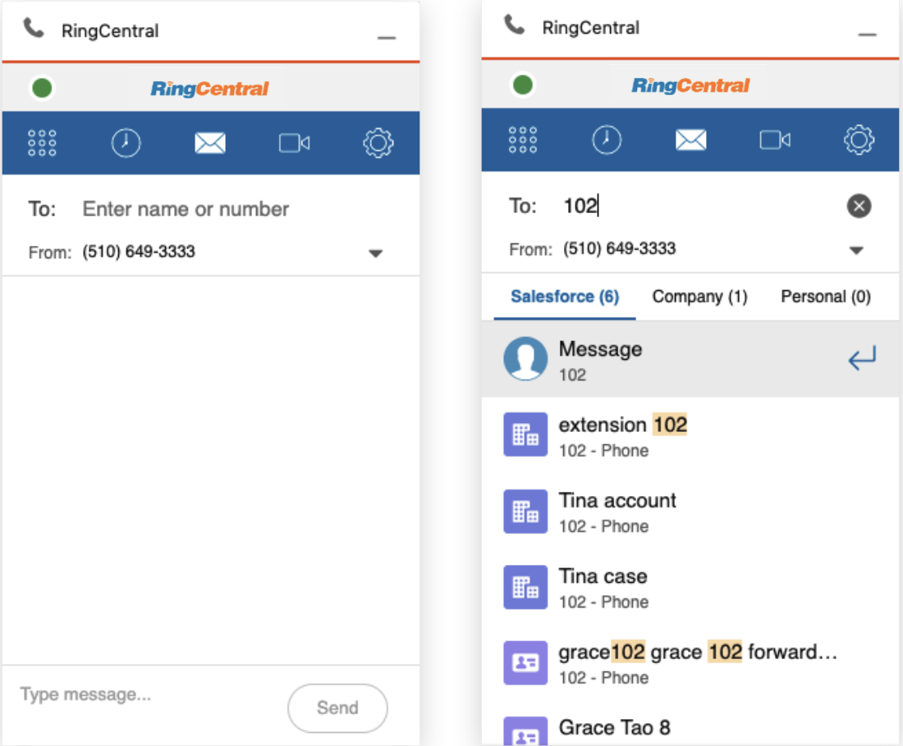
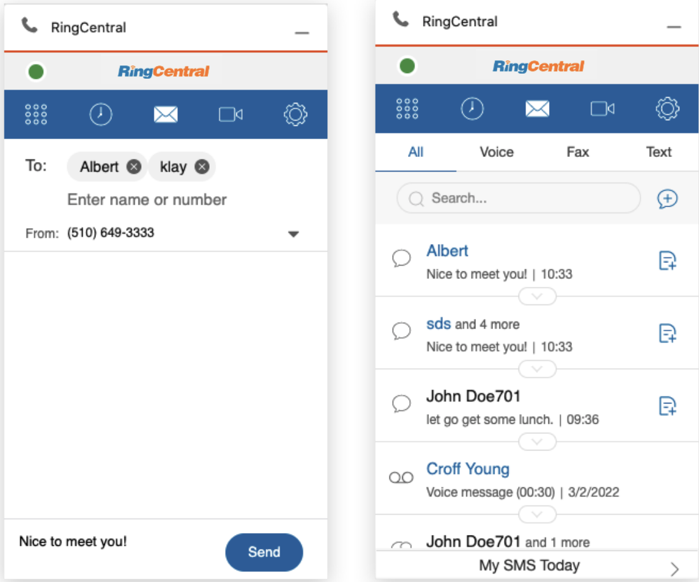
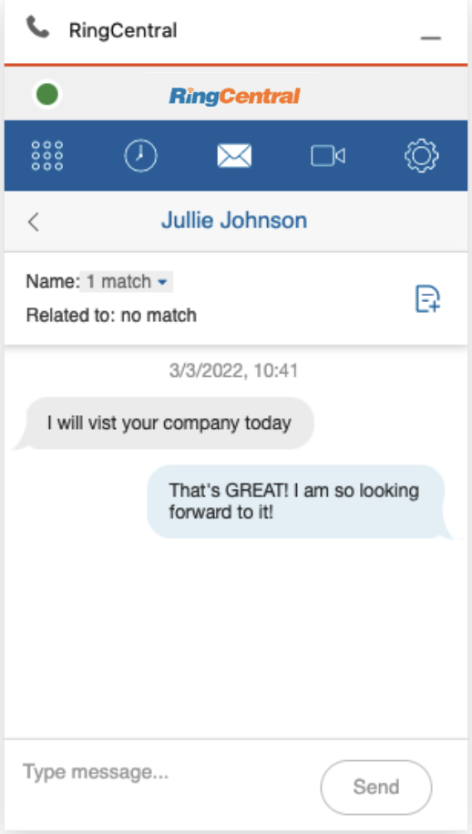
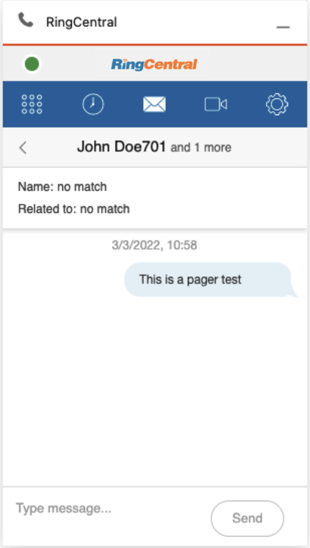
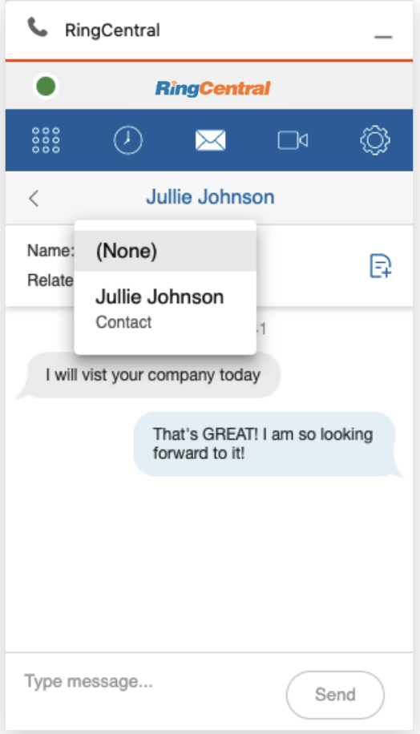
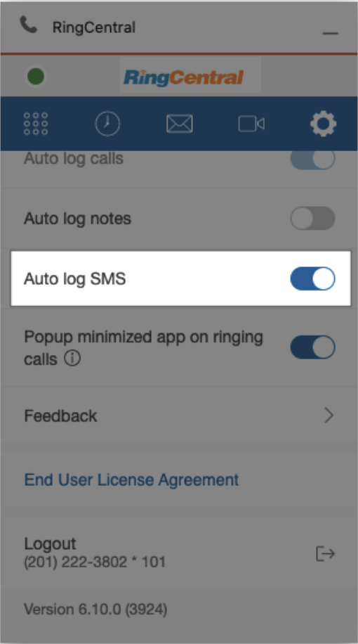
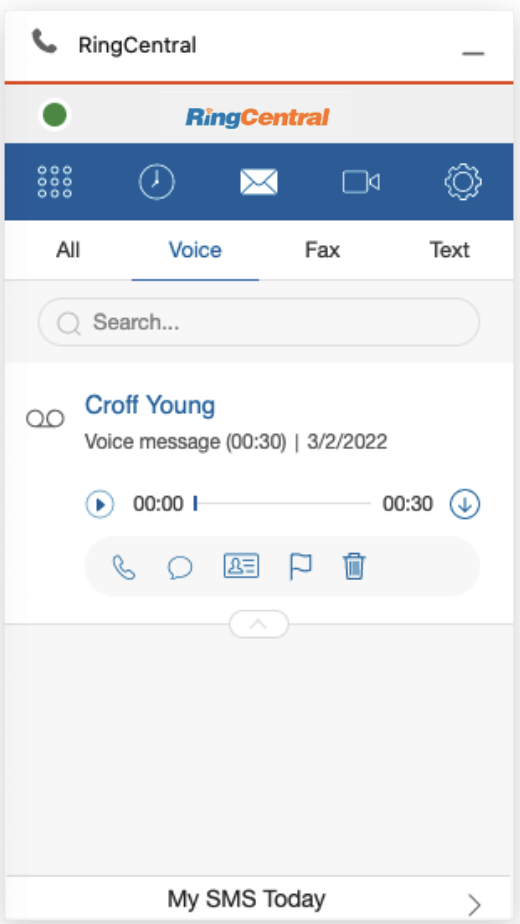
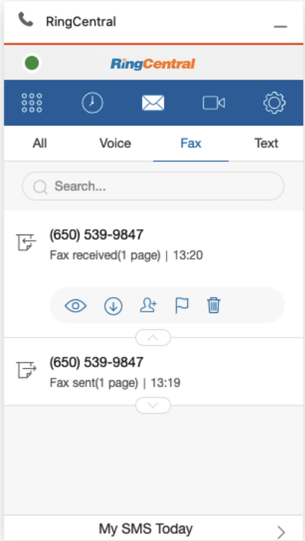

---
hide:
    - toc
---

# Messages

## Quick Navigation

-   **[Message List](#message-list)** - Access Fax, Voicemail and SMS services
-   **[Compose SMS](#compose-sms)** - Send SMS messages to contacts
-   **[SMS conversation](#sms-conversation)** - Manage SMS conversations
-   **[Internal pager](#internal-pager)** - Use peer-to-peer and group pager functions
-   **[Log SMS](#log-sms)** - Log SMS conversations to Salesforce
-   **[Auto log SMS](#auto-log-sms)** - Automatically update SMS log records
-   **[Voicemail](#voicemail)** - Listen, download, and manage voicemail messages
-   **[Fax](#fax)** - Read, download, and manage fax documents

---

## Message List

RingCentral for Salesforce provides Fax, Voicemail and SMS services. The user can access these services within the Message page by clicking on the "envelope" icon.

The user can access all Message types within this section, and can listen to voicemails, read incoming fax documents, and send and receive SMS messages from and to customers.

## Compose SMS

Click the button to compose a SMS. User may send messages to contacts within their directory or directly to an end users SMS number.

The user can sent a SMS to multiple recipients at one time. When an SMS is sent to multiple addresses, all SMSs will break into individual conversations.

## SMS conversation

When an SMS is sent or received, a conversation is created. All new SMS messages that are sent or received with the same phone number will be automatically merged into the conversation.

## Internal pager

RingCentral for Salesforce allows internal users to use the internal pager functions. It supports peer to peer pager and group pager.

## Log SMS

The user can log SMS conversations into Salesforce. Click the Name or the Related to dropdown, all Salesforce records that match to the phone number will be listed.

Select a matching record and click the log button to log the conversation.

## Auto log SMS

When the auto log SMS is ON, the app will automatically update the Salesforce log records when the conversation was updated.

## Voicemail

Users can listen to a voicemail message, download it, call back, SMS back, or delete the voicemail.

## Fax

Users can read a Fax file, download it, or delete the Fax.

