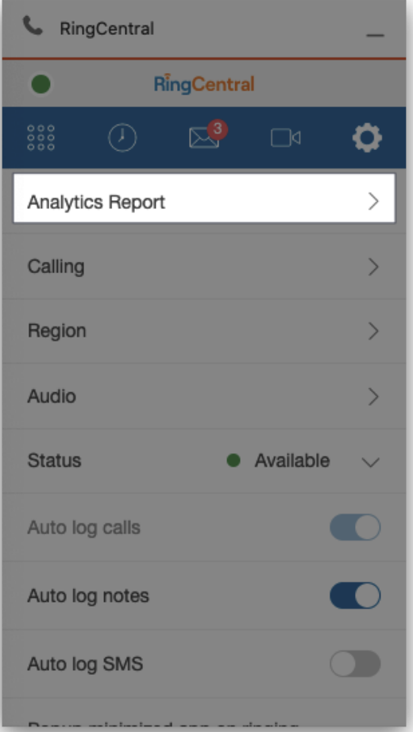
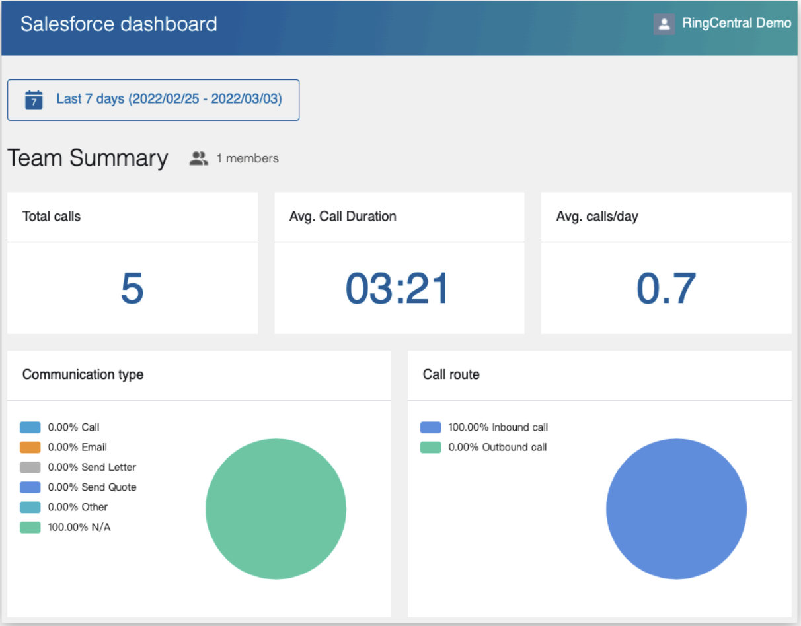
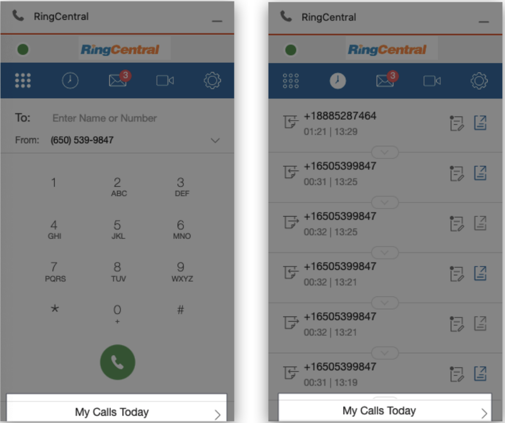
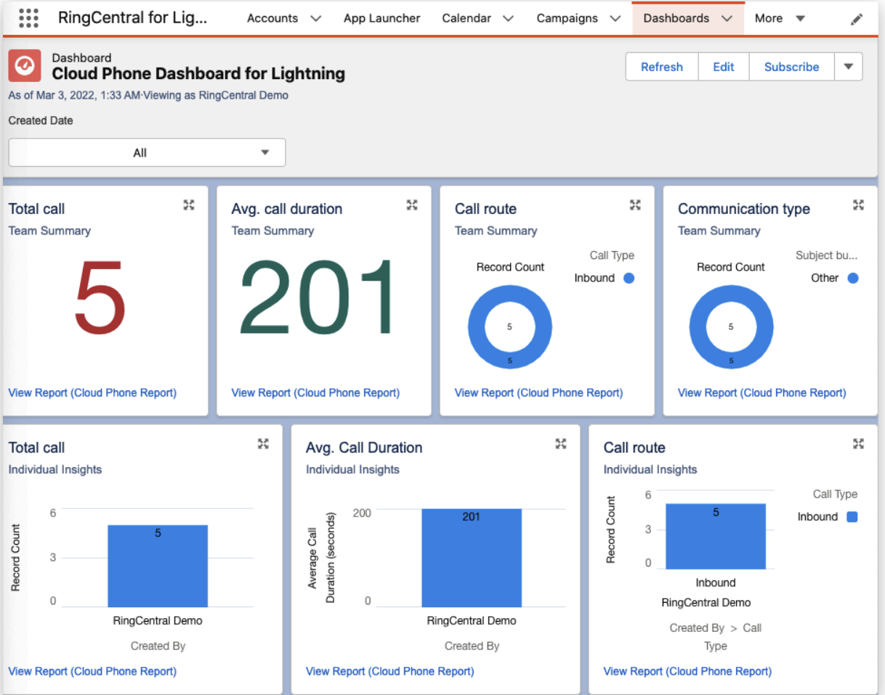

---
hide:
    - toc
---

# Reports and Analytics

## Quick Navigation

-   **[Analytics Report](#analytics-report)** - View phone data analytics and team performance
-   **[Salesforce Reports](#salesforce-reports)** - Access My Calls Today and My SMS Today reports
-   **[Salesforce Dashboard](#salesforce-dashboard)** - View RingCentral dashboards in Salesforce

---

## Analytics Report

RingCentral for Salesforce provides Analytics Reporting so that users can have a view of their own phone data.

The supervisor of a group in Salesforce organization can have a view of the whole team.

## Salesforce Reports

RingCentral for Salesforce also provides Salesforce reports, including My Calls Today and My SMS Today.

The user can access the My Calls Today report from the dialer page and the Call history page.

## Salesforce Dashboard

RingCentral for Salesforce also builds a basic Salesforce dashboard. The user who has the proper Salesforce permissions can find the dashboard on the Dashboard list.

