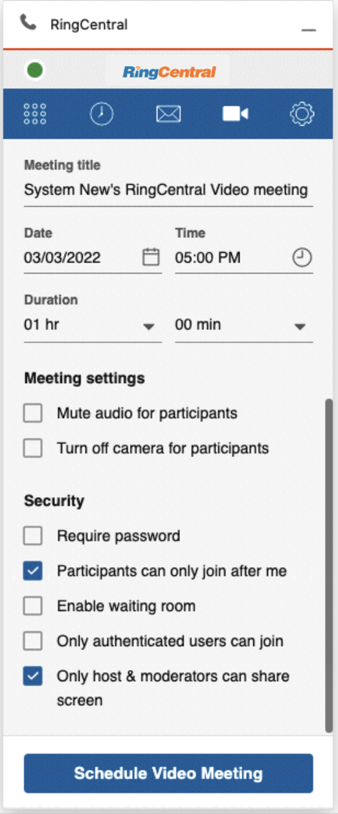
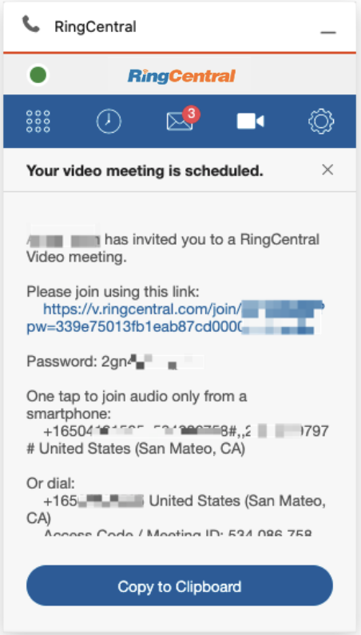
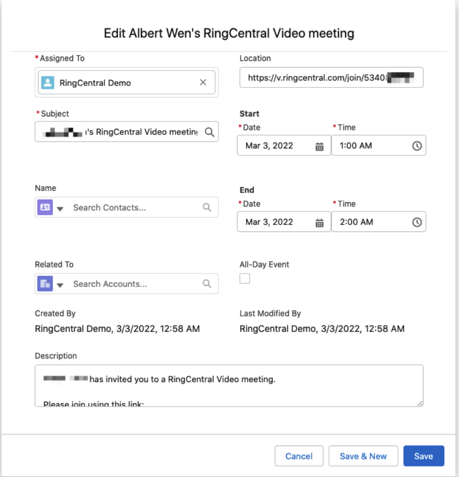
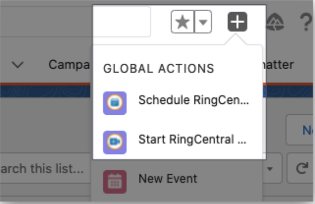
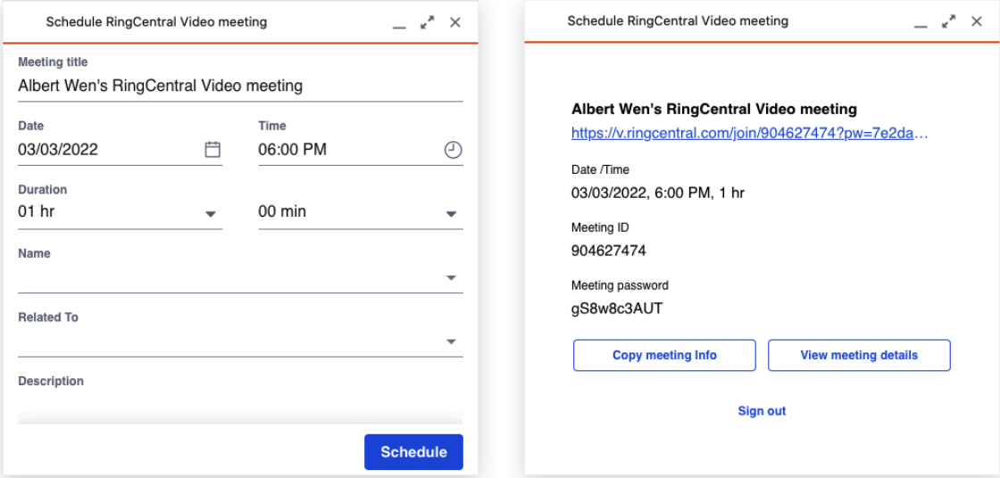
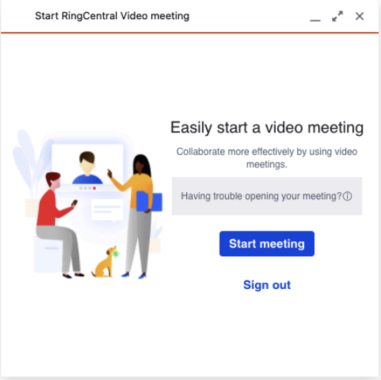

---
hide:
    - toc
---

# Video

## Quick Navigation

-   **[Schedule meeting from App](#schedule-meeting-from-app)** - Schedule RingCentral video meetings from the app
-   **[Schedule meeting from Global actions](#schedule-meeting-from-global-actions)** - Use global actions for video meetings

---

## Schedule meeting from App

Get more details about RingCentral Video on RingCentral Support.

RingCentral for Salesforce provides full RingCentral Video settings.

Click the Schedule Video Meeting button to schedule a RingCentral video meeting to Salesforce.

RingCentral for Salesforce would create a meeting in Salesforce and open it for edit.

## Schedule meeting from Global actions

RingCentral for Salesforce provides Global Actions for Scheduling and Starting a RingCentral Video meeting.

The Admin user will need to config the Global Action to the organization.

### Schedule RingCentral Video meeting

The schedule meeting page will show up. Edit and click Schedule to schedule a meeting.

### Start RingCentral Video meeting

The RingCentral for Salesforce will initiate a RingCentral Video meeting. If for some reason (for example, browser block) the video window is not popping out, users can click the Start meeting button to re-initiate the meeting.

