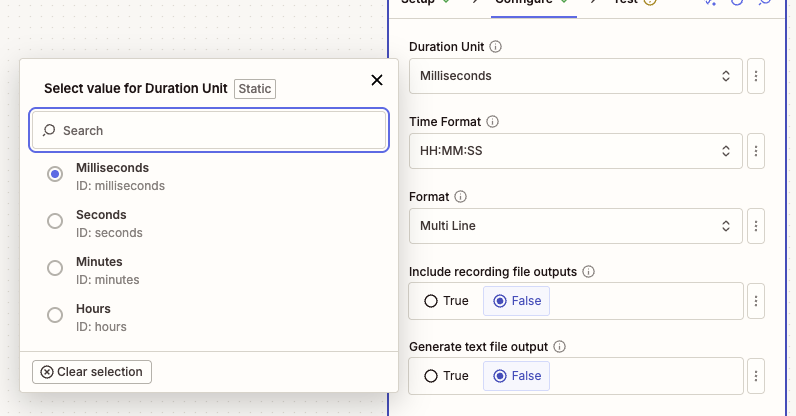
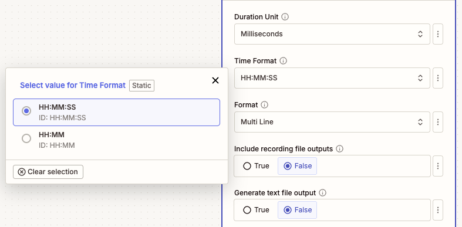
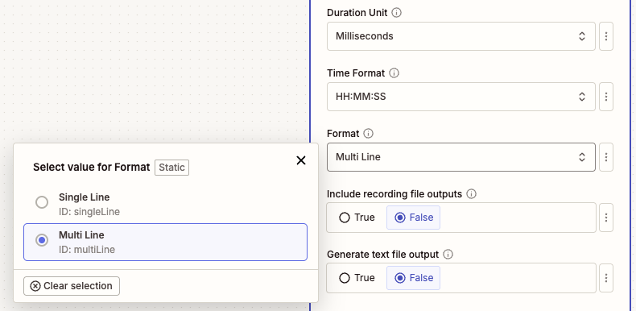
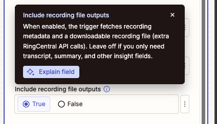
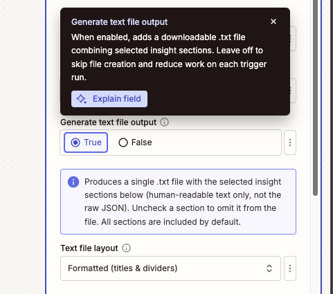
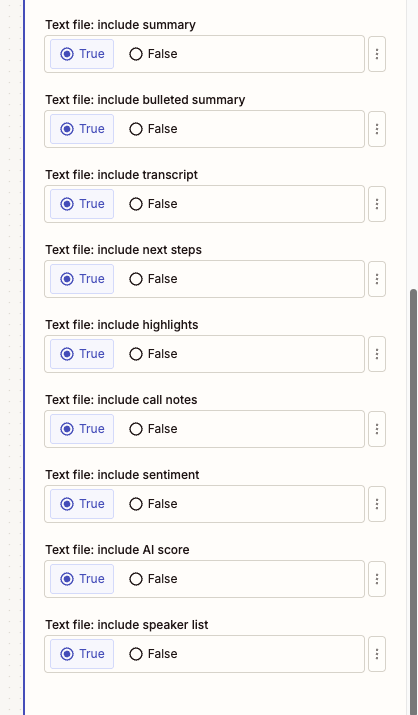
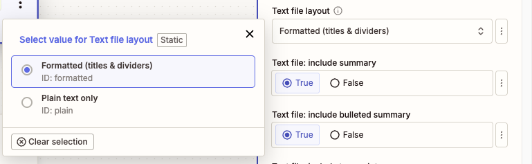

---
hide:
    - path
    - toc
---

# ACE Processed Recording

## Overview

Use this instant trigger when ACE (formerly RingSense) finishes processing a call recording and produces transcript, summary, and insight data. The trigger fires from the ACE insights webhook and returns formatted fields that are ready to map into later Zap steps.

This trigger is designed for workflows that need AI-generated conversation output, such as saving transcripts, routing follow-up tasks, sending summaries to a CRM, or storing sentiment and next-step data.

## Requirements

The connected RingCentral account needs an ACE license (formerly RingSense) with access to processed recording insights.

!!! note "Feature Warning"
    During Zap setup, warning messages are displayed if the connected account is missing the required ACE license or features. Some setup messages may still use the former RingSense name.

## Configure

1. **Duration Unit**: Choose the unit for the `Recording Duration` output field.

    - **Milliseconds**: Keeps the duration closest to the original ACE event value.
    - **Seconds**: Useful for most workflow calculations.
    - **Minutes**: Useful for reports and summaries.
    - **Hours**: Useful for long-call reporting.

    {style="max-width: 796px; width: 100%; height: auto;"}

2. **Time Format**: Choose how formatted durations and transcript timestamps are displayed.

    - **HH:MM:SS**: Shows hours, minutes, and seconds.
    - **HH:MM**: Shows hours and minutes only.

    {style="max-width: 787px; width: 100%; height: auto;"}

3. **Format**: Choose how transcript, summary, and insight text should be formatted.

    - **Multi Line**: Easier for people to read in emails, notes, tasks, and documents.
    - **Single Line**: Easier for conditional steps, Looping by Zapier, spreadsheets, or apps that expect one item per line.

    {style="max-width: 790px; width: 100%; height: auto;"}

4. **Include recording file outputs** (Optional): Turn this on only when the Zap needs the actual call recording file or recording metadata.

    When enabled, the trigger fetches recording metadata and exposes:

    - **Recording URI**
    - **Recording Content URI**
    - **Recording Content Type**
    - **Recording File**

    Leave this off when the Zap only needs transcript, summary, sentiment, next steps, or other insight fields. Keeping it off avoids extra RingCentral API calls.

    {style="max-width: 424px; width: 100%; height: auto;"}

5. **Generate text file output** (Optional): Turn this on when the Zap needs one downloadable `.txt` file with selected insight sections.

    {style="max-width: 481px; width: 100%; height: auto;"}

    The text file can include:

    - Summary
    - Bulleted summary
    - Transcript
    - Next steps
    - Highlights
    - Call notes
    - Sentiment
    - AI score
    - Speaker list

    {style="max-width: 418px; width: 100%; height: auto;"}

    Choose **Formatted** for section titles and dividers, or **Plain text only** when a downstream app needs minimal text without headings.

    {style="max-width: 769px; width: 100%; height: auto;"}

!!! tip "When to Enable Optional Files"
    Leave optional file outputs off unless a later Zap step needs a file field. Turn on **Include recording file outputs** for the call audio file, and turn on **Generate text file output** for one combined transcript and insights text file.

## Output

The trigger includes identifiers, timing fields, participants, insight text, and raw event data.

### Recording and Call Fields

- **ID**: The source recording record ID.
- **Event Type**: The ACE event type, such as `Create`.
- **Title**: Title generated for the processed recording.
- **Domain**: ACE domain, typically `pbx`.
- **ACE URI**: URI for the ACE record.
- **Source Session ID**: Source call session ID.
- **Source Record ID**: Source recording record ID.
- **Call Direction**: Direction of the call, such as inbound or outbound.
- **Owner Extension ID**: RingCentral extension ID associated with the recording owner.
- **Recording Duration (ms)**: Original recording duration in milliseconds.
- **Recording Duration**: Duration converted to the selected **Duration Unit**.
- **Recording Duration Formatted**: Duration formatted according to **Time Format**.
- **Recording Start Time**: Date and time when the recording started.
- **Creation Time**: Date and time when ACE created the insight record.
- **Last Modified Time**: Date and time when ACE last modified the insight record.

### Optional Recording File Fields

These fields are populated only when **Include recording file outputs** is enabled and the recording is available:

- **Recording URI**: RingCentral API URI for recording metadata.
- **Recording Content URI**: URI used to download the recording content.
- **Recording Content Type**: MIME type for the recording file.
- **Recording File**: Downloadable recording file for later Zap steps.

### Insight Fields

- **Transcript**: Formatted transcript text.
- **Summary**: ACE-generated call summary.
- **Highlights**: Formatted highlights text.
- **Highlights List**: Highlights as a list of individual items.
- **Next Steps**: Formatted next steps text.
- **Next Steps List**: Next steps as a list of individual items.
- **Speaker Info**: Formatted speaker list.
- **Host Name**: Name of the host or owner-side participant, when identified.
- **Host Phone Number**: Phone number for the host or owner-side participant, when identified.
- **Customer Names**: Customer-side participant names, when identified.
- **Customer Phone Numbers**: Customer-side participant phone numbers, when identified.
- **Bulleted Summary List**: Summary bullets as a list of individual items.
- **Event Origin**: Origin of the event. This trigger processes recording-origin events.
- **Call Notes**: ACE call notes, when available.
- **Sentiment**: ACE sentiment value, when available.
- **Raw**: Raw ACE event JSON.

### Combined Text File

- **Combined Insights (Text File)**: A downloadable `.txt` file containing the selected insight sections. This field is populated when **Generate text file output** is enabled.

## Sample Output

```json
{
  "id": "recording-1758068132637",
  "eventType": "Create",
  "title": "Call from John Doe to Jane Doe",
  "domain": "pbx",
  "ringsenseUri": "https://api-rcapps.ringcentral.com/ai/ringsense/v1/accounts/~/domains/pbx/recordings/recording-1758068132637",
  "sourceSessionId": "session-1758068132637",
  "sourceRecordId": "recording-1758068132637",
  "callDirection": "Outbound",
  "ownerExtensionId": "extension-1758068132637",
  "recordingDurationMs": 60000,
  "recordingDuration": 60,
  "recordingDurationFormatted": "00:01:00",
  "recordingStartTime": "2025-09-17T00:14:32.637Z",
  "creationTime": "2025-09-17T00:16:32.637Z",
  "lastModifiedTime": "2025-09-17T00:17:32.637Z",
  "transcript": "John Doe (+18883770028) | 00:00:05\nThanks for calling today.",
  "summary": "The customer asked about next steps and pricing.",
  "highlights": "Jane Doe (+16508783254) | 00:00:20\nRequested a follow-up email.",
  "highlightsList": ["Jane Doe (+16508783254) | 00:00:20\nRequested a follow-up email."],
  "nextSteps": "John Doe (+18883770028) | 00:00:45\nSend pricing details.",
  "nextStepsList": ["John Doe (+18883770028) | 00:00:45\nSend pricing details."],
  "speakerInfo": "John Doe (+18883770028)\nJane Doe (+16508783254)",
  "hostName": "John Doe",
  "hostPhoneNumber": "+18883770028",
  "customerNames": ["Jane Doe"],
  "customerPhoneNumbers": ["+16508783254"],
  "bulletedSummaryList": ["Customer asked about pricing."],
  "eventOrigin": "Recording",
  "callNotes": "Sample call note.",
  "sentiment": "Positive",
  "recordingUri": "https://api-rcapps.ringcentral.com/restapi/v1.0/account/400371259008/recording/recording-1758068132637",
  "recordingContentUri": "https://api-rcapps.ringcentral.com/restapi/v1.0/account/400371259008/recording/recording-1758068132637/content",
  "recordingContentType": "audio/mpeg",
  "recordingFile": "Sample Recording File",
  "insightsTextFile": "Sample Combined Insights Text File",
  "raw": "{\"event\":\"/ai/ringsense/v1/public/accounts/~/domains/pbx/insights\",\"body\":{\"eventType\":\"Create\"}}"
}
```

!!! info "Output Variations"
    Optional recording file fields are only populated when **Include recording file outputs** is enabled and the file is available. **Combined Insights (Text File)** is only populated when **Generate text file output** is enabled. Some insight fields may be empty if ACE did not produce that section for the recording.
