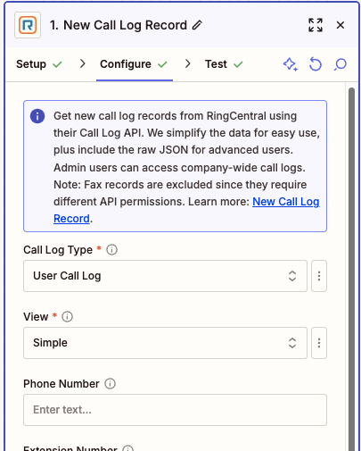
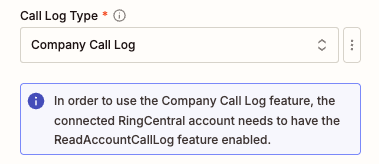
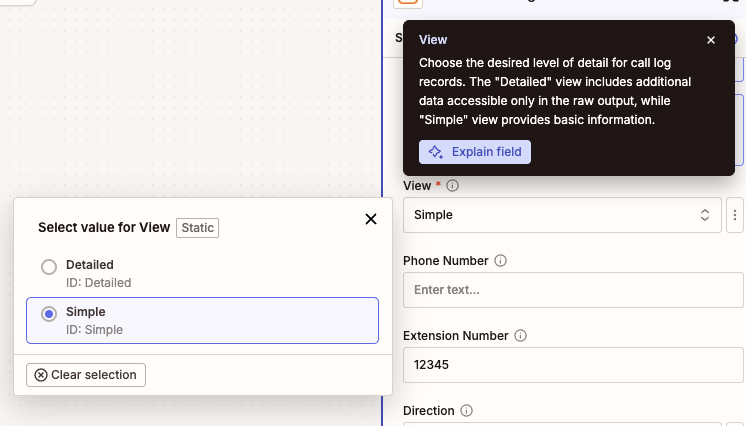
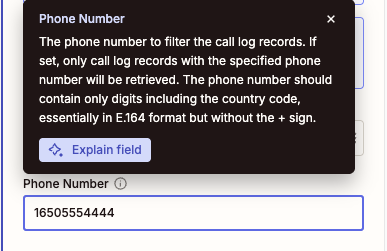
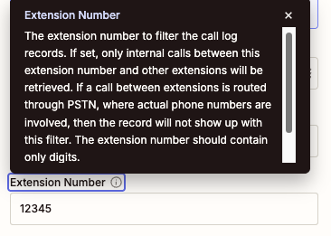
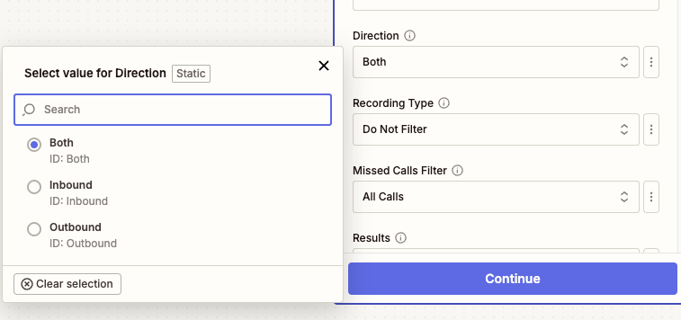
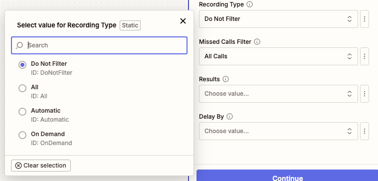
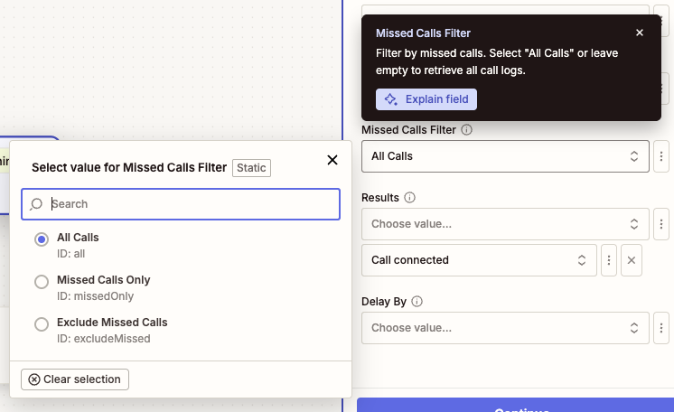
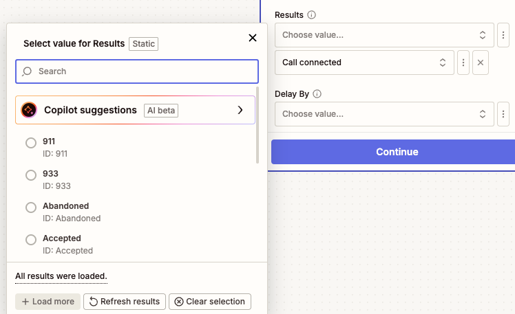
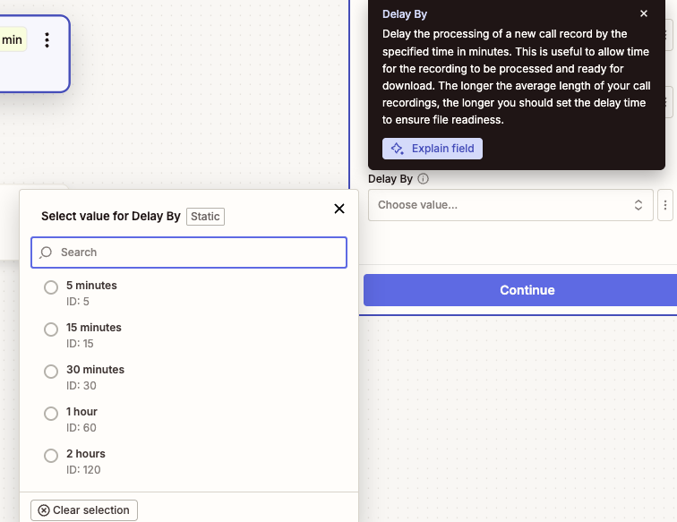

---
hide:
    - path
    - toc
---

# Call Log

## Overview

Use this trigger to monitor and respond to new call log entries in your RingCentral account. This polling-based trigger checks for new call logs at regular intervals and triggers your Zap when new calls are detected.

The trigger simplifies call log data for easy use in Zapier workflows while also providing raw JSON output for advanced users who need access to additional fields. Administrative users can access company-wide call logs with appropriate permissions.



## Configure

1. **Call Log Type**: Choose between `User Call Log` and `Company Call Log`. 

    - **User Call Log**: Retrieves call logs for the connected user only
    - **Company Call Log**: Retrieves call logs for the entire company (requires `ReadAccountCallLog` permission or admin access)

    Warning messages will be displayed if the required permissions are not met or if additional features like RingSense transcripts are unavailable.

    

2. **View**: Choose the level of detail for call log records. The default is `Simple` view.

    - **Simple**: Provides basic call information
    - **Detailed**: Includes additional data fields (reflected in the raw output only)

    

3. **Phone Number Filter** (Optional): Filter calls by a specific phone number. Enter the phone number in E.164 format without the leading `+` (digits only, including country code). This will only include calls to or from the specified number. Leave blank to include all calls.

    

4. **Extension Number Filter** (Optional): Filter calls by a specific extension number. This only includes internal calls between the specified extension and other extensions. Note that calls routed through PSTN (involving external phone numbers) will not appear with this filter. Leave blank to include all calls.

    

5. **Call Direction Filter** (Optional): Filter calls by their direction.

    - **Both** (default): Include calls in any direction
    - **Inbound**: Include only incoming calls
    - **Outbound**: Include only outgoing calls

    

6. **Recording Type Filter** (Optional): Filter calls based on recording status.

    - **Do Not Filter** (default): Include all calls regardless of recording status
    - **All**: Include only recorded calls (any recording type)
    - **Automatic**: Include only automatically recorded calls
    - **On Demand**: Include only manually recorded calls

    

7. **Missed Calls Filter** (Optional): Filter calls based on whether they were missed.

    - **All Calls** (default): Include all calls regardless of missed status
    - **Missed Calls Only**: Include only missed calls
    - **Exclude Missed Calls**: Include only calls that were answered

    

8. **Call Results Filter** (Optional): Filter calls by their outcome or result. This is a multi-select field where you can choose specific call results from the dropdown menu (e.g., Call Connected, Voicemail, Busy, No Answer). Leave blank to include all call results.

    

9. **Delay By** (Optional): Set a processing delay to ensure recording files are ready for download. There is typically a delay between when call log data becomes available and when recording files are fully processed. Choose a delay based on your average call length:

    - **5 minutes**: For short calls
    - **15 minutes**: For typical business calls  
    - **30 minutes**: For longer calls (recommended minimum)
    - **1-2 hours**: For very long calls or recordings

    Most recordings are ready within 30 minutes, but longer delays may be needed for exceptionally long calls.

    

## Output

The Call Log trigger provides comprehensive information about each call log record. The output includes simplified fields optimized for Zapier workflows, plus a complete raw JSON response for advanced users requiring additional data.

### Basic Call Information

- **URI**: Unique URI identifier for the call log record
- **ID**: Unique identifier for the call log record  
- **Session ID**: Session identifier for the call
- **Telephony Session ID**: Telephony session identifier

### Call Details

- **Start Time**: Date and time when the call started (datetime format)
- **Duration**: Call length in seconds
- **Type**: Type of call (e.g., Voice, Fax)
- **Direction**: Call direction (Inbound or Outbound)
- **Action**: Action performed during the call
- **Result**: Call outcome (e.g., Call Connected, Voicemail, Busy, No Answer)
- **Transport**: Transport method used for the call

### Recording Information

When a call has been recorded, the following fields will be populated:

- **Recording ID**: Unique identifier for the call recording
- **Recording URI**: API URI to access recording metadata
- **Recording Content URI**: Direct URI to download the recording file
- **Recording Type**: Type of recording (Automatic or On Demand)
- **Recording Content Type**: MIME type of the recording file (e.g., audio/mpeg)
- **Recording File**: Actual audio file attachment (available for download)
- **Recording Player URL**: Shareable URL providing access to a web-based recording player

!!! note "Recording File Availability"
    Recording files may not be immediately available after a call ends. The system needs time to process and prepare the files. Use the "Delay By" option to ensure recording files are ready when your Zap triggers. Longer calls typically require more processing time.

!!! warning "Recording Player URL Access"
    The Recording Player URL requires recipients to have a RingCentral account and appropriate permissions to view the recording. This URL is only valid while the recording remains in the RingCentral system according to the [data retention policy](https://support.ringcentral.com/article-v2/RingCentral-data-retention-policies.html?brand=RingCentral&product=RingEX&language=en_US).

### Participant Information

The trigger provides detailed information about call participants:

#### To (Recipient) Information
- **To Name**: Name of the person or entity being called
- **To Phone Number**: Phone number of the recipient
- **To Extension Number**: Extension number (for internal calls)
- **To Location**: Geographic location information (when available)

#### From (Caller) Information
- **From Name**: Name of the person initiating the call
- **From Phone Number**: Phone number of the caller
- **From Extension Number**: Extension number (for internal calls)
- **From Location**: Geographic location information (when available)

### Transcript Information

- **Transcripts**: A text transcript of what was said during the call. This field is only available when call transcription is enabled and you have a RingSense license assigned.

!!! note "RingSense Transcript Requirements"
    To access call transcripts, the connected user extension requires the RingSense license assigned. For Company Call Log records, the individual user extensions that made the calls also need RingSense licenses assigned. If these requirements are not met, warning messages will be displayed during configuration.

### Raw Data

- **Raw**: Complete, unprocessed JSON response from the RingCentral API containing all available data for advanced users who need access to additional fields not included in the simplified output.

### Sample Output

```json
{
  "id": "call-log-1758068132637",
  "sessionId": "session-1758068132637",
  "telephonySessionId": "telephony-session-1758068132637",
  "startTime": "2025-09-17T00:15:32.637Z",
  "duration": 1580,
  "type": "Voice",
  "direction": "Outbound",
  "action": "VoIP Call",
  "result": "Accepted",
  "transport": "PSTN",
  "from": "+1234567890 (John Doe)",
  "to": "+1234567891 (Jane Doe)",
  "toExtensionNumber": "No Data",
  "toName": "Jane Doe",
  "toPhoneNumber": "+1234567891",
  "fromExtensionNumber": "No Data",
  "fromName": "John Doe",
  "fromPhoneNumber": "+1234567890",
  "recordingId": "recording-1758068132637",
  "recordingUri": "https://api-rcapps.ringcentral.com/restapi/v1.0/account/account-1758068132637/recording/recording-1758068132637",
  "recordingContentUri": "https://api-rcapps.ringcentral.com/restapi/v1.0/account/account-1758068132637/recording/recording-1758068132637/content",
  "recordingType": "Automatic",
  "recordingContentType": "audio/mp3",
  "recordingFile": "Sample File",
  "transcript": "Sample Transcripts",
  "raw": "{\"uri\":\"https://api-rcapps.ringcentral.com/restapi/v1.0/account/~/extension/~/call-log/call-log-1758068132637\",\"id\":\"call-log-1758068132637\",\"sessionId\":\"session-1758068132637\",\"telephonySessionId\":\"telephony-session-1758068132637\",\"startTime\":\"2025-09-17T00:15:32.637Z\",\"duration\":1580,\"type\":\"Voice\",\"direction\":\"Outbound\",\"action\":\"VoIP Call\",\"result\":\"Accepted\",\"transport\":\"PSTN\",\"from\":{\"name\":\"John Doe\",\"phoneNumber\":\"+1234567890\",\"location\":\"Belmont, CA\"},\"to\":{\"name\":\"Jane Doe\",\"phoneNumber\":\"+1234567891\",\"location\":\"Belmont, CA\"},\"recording\":{\"id\":\"recording-1758068132637\",\"uri\":\"https://api-rcapps.ringcentral.com/restapi/v1.0/account/account-1758068132637/recording/recording-1758068132637\",\"type\":\"Automatic\",\"contentUri\":\"https://api-rcapps.ringcentral.com/restapi/v1.0/account/account-1758068132637/recording/recording-1758068132637/content\"},\"extension\":{\"uri\":\"https://api-rcapps.ringcentral.com/restapi/v1.0/account/~/extension/extension-1758068132637\",\"id\":\"extension-1758068132637\"}}"
}
```

!!! info "Output Variations"
    The output format may vary depending on the selected view (Simple or Detailed) and whether the call was recorded. Not all fields will be present for every call log record, depending on the call type and available data.
