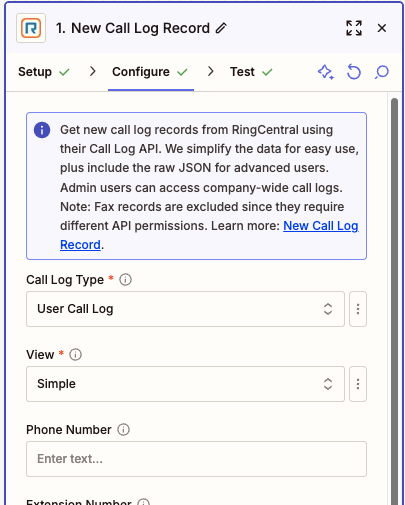
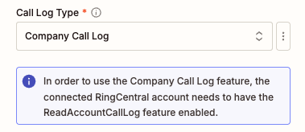
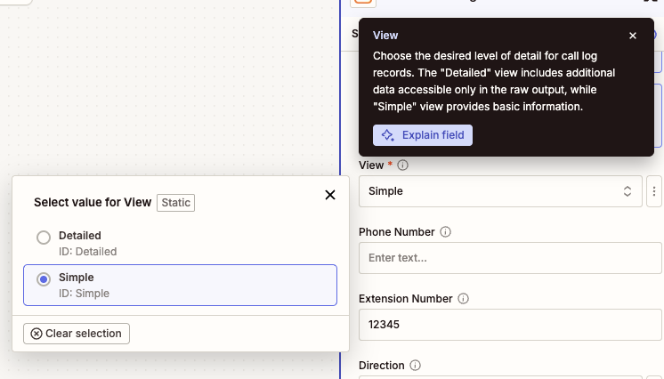
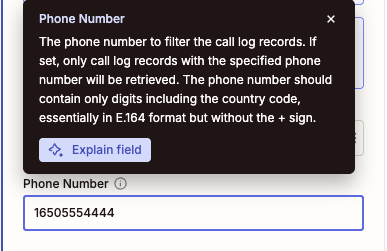
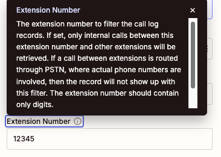
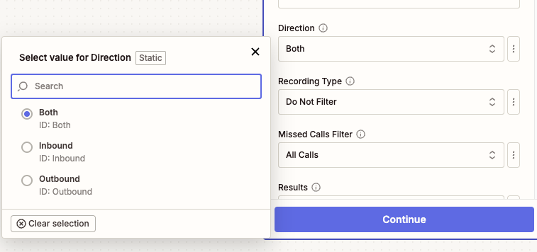
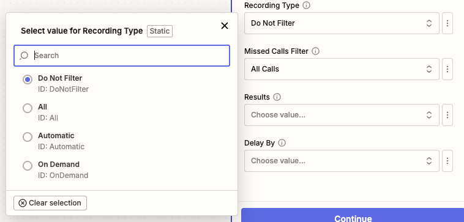
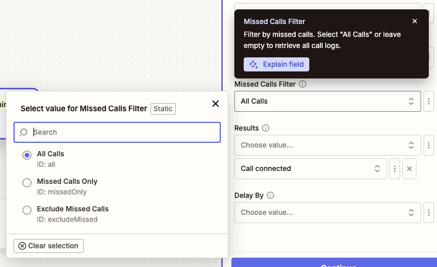
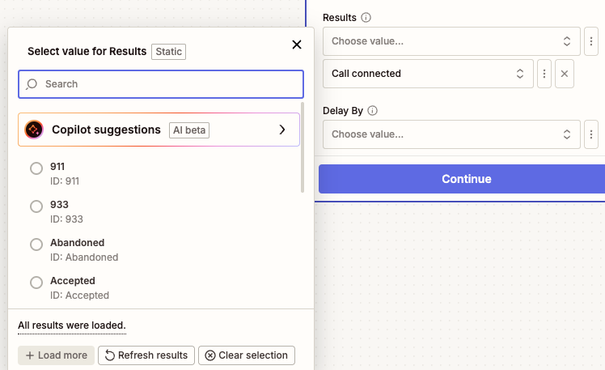
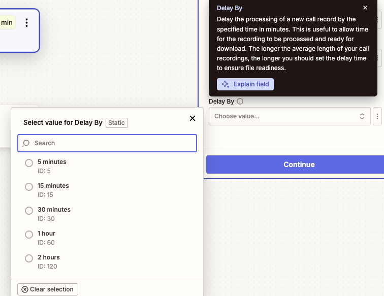

---
hide:
    - path
    - toc
---

# New Call Log Record

## Overview

Use this trigger to monitor and respond to new voice call log entries in your RingCentral account. This polling-based trigger checks for new call logs at regular intervals and triggers your Zap when new calls are detected.

The trigger simplifies call log data for easy use in Zapier workflows while also providing raw JSON output for advanced users who need access to additional fields. Administrative users can access company-wide call logs with appropriate permissions.



## Recent Feature Highlights

The New Call Log Record trigger is the recommended trigger for workflows that need flexible call monitoring. Recent updates added or improved the following customer-facing options:

- **Company-wide monitoring**: Admin users can choose `Company Call Log` to monitor calls across the account, including calls to shared business numbers, call queues, and IVR flows.
- **More explicit filters**: Filter by phone number, extension number, direction, missed-call status, call result, and recording type. Options like `Both`, `All Calls`, and `Do Not Filter` make it clearer when a filter is intentionally not narrowing results.
- **Recording and transcript outputs**: Recorded calls can include a downloadable recording file, recording player URL, and transcripts when the required AI Conversation Expert (formerly RingSense) access is available.
- **Raw data for advanced workflows**: The `raw` field contains the RingCentral API response as JSON, and `Detailed` view can add more API data to that raw JSON for users who want to process it themselves.
- **Safer detailed-mode controls**: Detailed view includes a `Record Limit` option so high-volume accounts, especially company call log workflows, can reduce payload size.

## Configure

1. **Call Log Type**: Choose between `User Call Log` and `Company Call Log`.

    - **User Call Log**: Retrieves call logs for the connected user's extension only.
    - **Company Call Log**: Retrieves call logs for the entire company. This requires `ReadAccountCallLog` permission or admin access.

    Use `Company Call Log` when the Zap needs to monitor calls to a main company number, call queue, IVR, or another shared routing point. Connect the Zap as an admin, choose `Company Call Log`, then use the phone number filter to narrow the Zap to the main number or first number callers are expected to dial.

    Use `User Call Log` when the Zap only needs calls for the connected user's own extension.

    !!! tip "Missed Call Trigger vs. New Call Log Record"
        The Missed Call trigger only monitors missed calls for the logged-in extension. For missed calls to company numbers, call queues, IVR menus, or other shared routing flows, use this New Call Log Record trigger with `Company Call Log`. Add the main company number or expected entry number in **Phone Number Filter**, and use **Missed Calls Filter** or **Call Results Filter** if the Zap should only continue for missed-call outcomes.

    Warning messages will be displayed if the required permissions are not met or if additional features like AI Conversation Expert transcripts are unavailable.

    

2. **View**: Choose the level of detail for call log records. The default is `Simple` view.

    - **Simple**: Recommended for most Zaps. It provides all standard mapped output fields, including call details, participants, recording fields, transcripts, and the `raw` JSON field.
    - **Detailed**: Adds more API data to the `raw` JSON field only. The standard mapped output fields are the same as `Simple` view.

    Choose `Detailed` only if you plan to parse the raw JSON yourself, for example with Code by Zapier, and need fields that are not exposed as standard Zapier output fields. Detailed view can create larger payloads and may hit Zapier's approximate 6 MB response-size limit on high-volume accounts. When `Detailed` is selected, use **Record Limit** to reduce how many records are requested per poll.

    

    <!-- Screenshot placeholder: Detailed view warning and Record Limit field. -->

3. **Phone Number Filter** (Optional): Filter calls by a specific phone number. Enter the phone number in E.164 format without the leading `+` (digits only, including country code). This will only include calls to or from the specified number. Leave blank to include all calls.

    For company-wide workflows, this is commonly set to the main company number, call queue number, IVR number, or the first phone number callers are expected to dial.

    

4. **Extension Number Filter** (Optional): Filter calls by a specific extension number. This only includes internal calls between the specified extension and other extensions. Note that calls routed through PSTN (involving external phone numbers) will not appear with this filter. Leave blank to include all calls.

    

5. **Call Direction Filter** (Optional): Filter calls by their direction.

    - **Both** (default): Include calls in any direction
    - **Inbound**: Include only incoming calls
    - **Outbound**: Include only outgoing calls

    

6. **Recording Type Filter** (Optional): Filter calls based on recording status.

    - **Do Not Filter** (default): Include all calls regardless of recording status
    - **All**: Include only recorded calls (any recording type)
    - **Automatic**: Include only automatically recorded calls
    - **On Demand**: Include only manually recorded calls

    

7. **Missed Calls Filter** (Optional): Filter calls based on whether they were missed.

    - **All Calls** (default): Include all calls regardless of missed status
    - **Missed Calls Only**: Include only missed calls
    - **Exclude Missed Calls**: Include only calls that were answered

    

8. **Call Results Filter** (Optional): Filter calls by their outcome or result. This is a multi-select field where you can choose specific call results from the dropdown menu (e.g., Call Connected, Voicemail, Busy, No Answer). Leave blank to include all call results.

    

9. **Delay By** (Optional): Set a processing delay to ensure recording files are ready for download. There is typically a delay between when call log data becomes available and when recording files are fully processed. Choose a delay based on your average call length:

    - **5 minutes**: For short calls
    - **15 minutes**: For typical business calls
    - **30 minutes**: For longer calls (recommended minimum)
    - **1-2 hours**: For very long calls or recordings

    Most recordings are ready within 30 minutes, but longer delays may be needed for exceptionally long calls.

    

## Output

The New Call Log Record trigger provides comprehensive information about each call log record. The output includes standard fields optimized for Zapier workflows, plus a raw JSON response for advanced users requiring additional data.

The standard output fields are the same in `Simple` and `Detailed` view. `Detailed` view only affects the amount of data included in the `raw` JSON field.

### Basic Call Information

- **URI**: Unique URI identifier for the call log record
- **ID**: Unique identifier for the call log record
- **Session ID**: Session identifier for the call
- **Telephony Session ID**: Telephony session identifier

### Call Details

- **Start Time**: Date and time when the call started (datetime format)
- **Duration**: Call length in seconds
- **Type**: Type of call. This trigger retrieves voice call records.
- **Direction**: Call direction (Inbound or Outbound)
- **Action**: Action performed during the call
- **Result**: Call outcome (e.g., Call Connected, Voicemail, Busy, No Answer)
- **Transport**: Transport method used for the call

### Recording Information

When a call has been recorded, the following fields will be populated:

- **Recording ID**: Unique identifier for the call recording
- **Recording URI**: API URI to access recording metadata
- **Recording Content URI**: Direct URI to download the recording file
- **Recording Type**: Type of recording (Automatic or On Demand)
- **Recording Content Type**: MIME type of the recording file (e.g., audio/mpeg)
- **Recording File**: Actual audio file attachment (available for download)
- **Recording Player URL**: Shareable URL providing access to a web-based recording player

!!! note "Recording File Availability"
    Recording files may not be immediately available after a call ends. The system needs time to process and prepare the files. Use the "Delay By" option to ensure recording files are ready when your Zap triggers. Longer calls typically require more processing time.

!!! warning "Recording Player URL Access"
    The Recording Player URL requires recipients to have a RingCentral account and appropriate permissions to view the recording. This URL is only valid while the recording remains in the RingCentral system according to the [data retention policy](https://support.ringcentral.com/article-v2/RingCentral-data-retention-policies.html?brand=RingCentral&product=RingEX&language=en_US).

### Participant Information

The trigger provides detailed information about call participants:

#### To (Recipient) Information
- **To Name**: Name of the person or entity being called
- **To Phone Number**: Phone number of the recipient
- **To Extension Number**: Extension number (for internal calls)

#### From (Caller) Information
- **From Name**: Name of the person initiating the call
- **From Phone Number**: Phone number of the caller
- **From Extension Number**: Extension number (for internal calls)

### Transcript Information

- **Transcripts**: A text transcript of what was said during the call. This field is only available when call transcription is enabled and the required AI Conversation Expert license is available.

!!! note "AI Conversation Expert Transcript Requirements"
    To access call transcripts, the connected user extension requires the AI Conversation Expert license (formerly named RingSense). For Company Call Log records, the individual user extensions that made the calls also need AI Conversation Expert licenses assigned. If these requirements are not met, warning messages will be displayed during configuration.

### Raw Data

- **Raw**: Unprocessed JSON response from the RingCentral API containing the available data for advanced users who need access to additional fields not included in the standard output.

`Simple` view includes the standard call log API response in `raw`. `Detailed` view requests RingCentral's detailed call log response and places that expanded data in `raw`. Use `Detailed` when you want to process raw call legs or nested API fields yourself; otherwise, `Simple` is easier and lighter.

### Sample Output

```json
{
  "uri": "https://api-rcapps.ringcentral.com/restapi/v1.0/account/~/extension/~/call-log/call-log-1758068132637",
  "id": "call-log-1758068132637",
  "sessionId": "session-1758068132637",
  "telephonySessionId": "telephony-session-1758068132637",
  "startTime": "2025-09-17T00:15:32.637Z",
  "duration": 1580,
  "type": "Voice",
  "direction": "Outbound",
  "action": "VoIP Call",
  "result": "Accepted",
  "transport": "PSTN",
  "from": "+1234567890 (John Doe)",
  "to": "+1234567891 (Jane Doe)",
  "toExtensionNumber": "No Data",
  "toName": "Jane Doe",
  "toPhoneNumber": "+1234567891",
  "fromExtensionNumber": "No Data",
  "fromName": "John Doe",
  "fromPhoneNumber": "+1234567890",
  "recordingId": "recording-1758068132637",
  "recordingUri": "https://api-rcapps.ringcentral.com/restapi/v1.0/account/account-1758068132637/recording/recording-1758068132637",
  "recordingContentUri": "https://api-rcapps.ringcentral.com/restapi/v1.0/account/account-1758068132637/recording/recording-1758068132637/content",
  "recordingType": "Automatic",
  "recordingContentType": "audio/mp3",
  "recordingFile": "Sample File",
  "recordingPlayerUrl": "https://app.ringcentral.com/recordings/player?id=call-log-1758068132637&recordingId=recording-1758068132637",
  "transcripts": "Sample Transcripts",
  "raw": "{\"uri\":\"https://api-rcapps.ringcentral.com/restapi/v1.0/account/~/extension/~/call-log/call-log-1758068132637\",\"id\":\"call-log-1758068132637\",\"sessionId\":\"session-1758068132637\",\"telephonySessionId\":\"telephony-session-1758068132637\",\"startTime\":\"2025-09-17T00:15:32.637Z\",\"duration\":1580,\"type\":\"Voice\",\"direction\":\"Outbound\",\"action\":\"VoIP Call\",\"result\":\"Accepted\",\"transport\":\"PSTN\",\"from\":{\"name\":\"John Doe\",\"phoneNumber\":\"+1234567890\",\"location\":\"Belmont, CA\"},\"to\":{\"name\":\"Jane Doe\",\"phoneNumber\":\"+1234567891\",\"location\":\"Belmont, CA\"},\"recording\":{\"id\":\"recording-1758068132637\",\"uri\":\"https://api-rcapps.ringcentral.com/restapi/v1.0/account/account-1758068132637/recording/recording-1758068132637\",\"type\":\"Automatic\",\"contentUri\":\"https://api-rcapps.ringcentral.com/restapi/v1.0/account/account-1758068132637/recording/recording-1758068132637/content\"},\"extension\":{\"uri\":\"https://api-rcapps.ringcentral.com/restapi/v1.0/account/~/extension/extension-1758068132637\",\"id\":\"extension-1758068132637\"}}"
}
```

!!! info "Output Variations"
    Standard mapped output fields are the same in Simple and Detailed view, but not every field will be populated for every call. For example, recording fields are only populated for recorded calls, and transcripts depend on AI Conversation Expert availability. The raw JSON field is where Simple and Detailed view differ.
