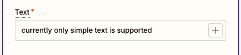

---
hide:
    - path
    - toc
---

# Create Post

## Overview

Use this action to create a post in RingCentral Team Messaging chats.

## Configure

1. Select how you want to specify that chat to post to. There are 4 options:
    - Use personal chat
    - Pick from recent teams
    - Enter a conversation link
    - Enter a specific chat Id
  
    

2. If you choose to pick from recent teams, you will see a list of recent teams to choose from. The list is limited to 250 items and support searching within the 250 items. Please note that only teams are included, direct chats and group conversations are not included.

    

3. If you choose to enter a conversation link, you will be able to see a Conversation Link input field. The simplest way to get the conversation link is to open the conversation in the RingCentral App and copy the link from there.

    {style="max-width:600px"}

4. Then paste that link input the Conversation Link input field.

    

5. If you choose to enter a specific chat Id. A Chat Id input field will be available. The simplest way to get the chat Id is the same as the conversation link. The chat Id is that last part of the link.

    

6. Please wait a few seconds after each change to the configuration as the app will attempt to verify the validity of the configuration. The app will check whether the conversation link is in the correct format. The app will also check whether the specified chat is accessible to the current user. If the chat is not accessible, you will see an error message. Please note that this will not check whether you are a member of the chat or not.

    

7. Lastly, enter the message you want to post. Currently, only simple text is supported.

    

8. Once you have configured all the fields, please click continue and make sure to test the action before publishing the zap. This test will verify that the current user has access to post in the specified chat.

## Output

The action will output the post Id of the created post.

