# Building your first RingCentral Zap

Zapier makes it easy to connect different apps and automate workflows without coding. By integrating RingCentral with Google Drive through Zapier, you can automatically save call recordings, ensuring they are securely archived and easily accessible.

This guide walks you through setting up a simple Zap to move RingCentral call recordings to Google Drive. While this serves as a great starting point, Zapier offers endless possibilities for automating tasks with RingCentral—such as logging calls in a CRM, sending notifications, or generating reports.

Follow along to set up your first Zap, and explore the many ways you can streamline your workflows with RingCentral and Zapier!

## Setting up the triggering event

Follow these steps to set up your first Zap using RingCentral:

1. Log in to your Zapier account.
    <figure markdown>
      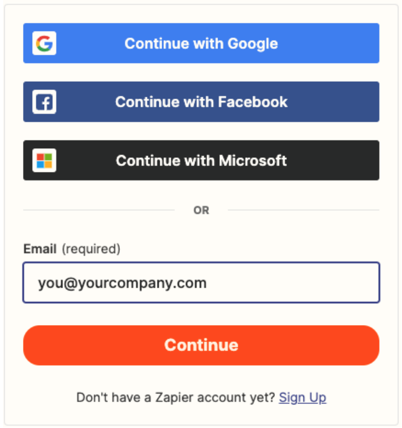{.mw-400}
      <figcaption>Login to Zapier</figcaption>
    </figure>
2. Click “+ Create Zap” in the top-left corner of the Zapier home page.
    <figure markdown>
      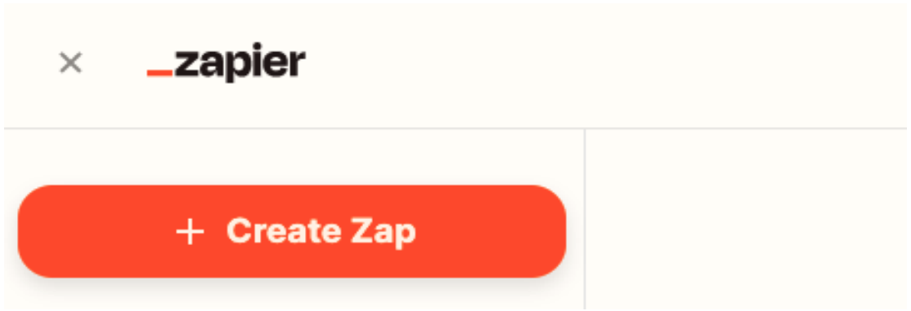{.mw-400}
      <figcaption>Create a Zap in Zapier</figcaption>
    </figure>
3. Choose RingCentral as the trigger app.
    <figure markdown>
      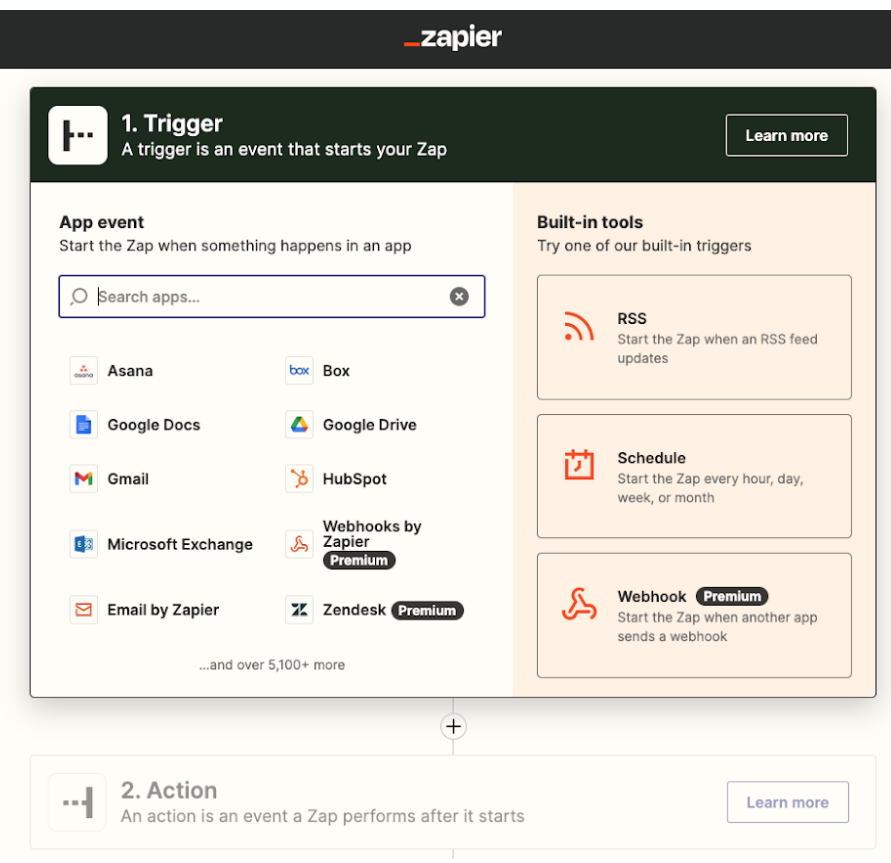{.mw-400}
      <figcaption>Choose RingCentral as the triggering app</figcaption>
    </figure>
4. Select a trigger event, such as “New Call Recording”.
    <figure markdown>
      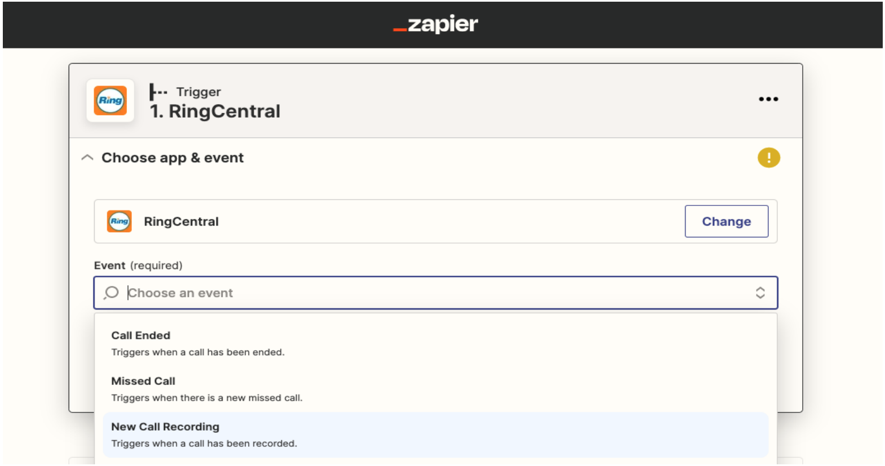{.mw-400}
      <figcaption>Select the trigger</figcaption>
    </figure>
5. When prompted, connect to your RingCentral account by entering your credentials.

## Test your trigger

1. Inititate the testing process within Zapier to proceed. 
    <figure markdown>
      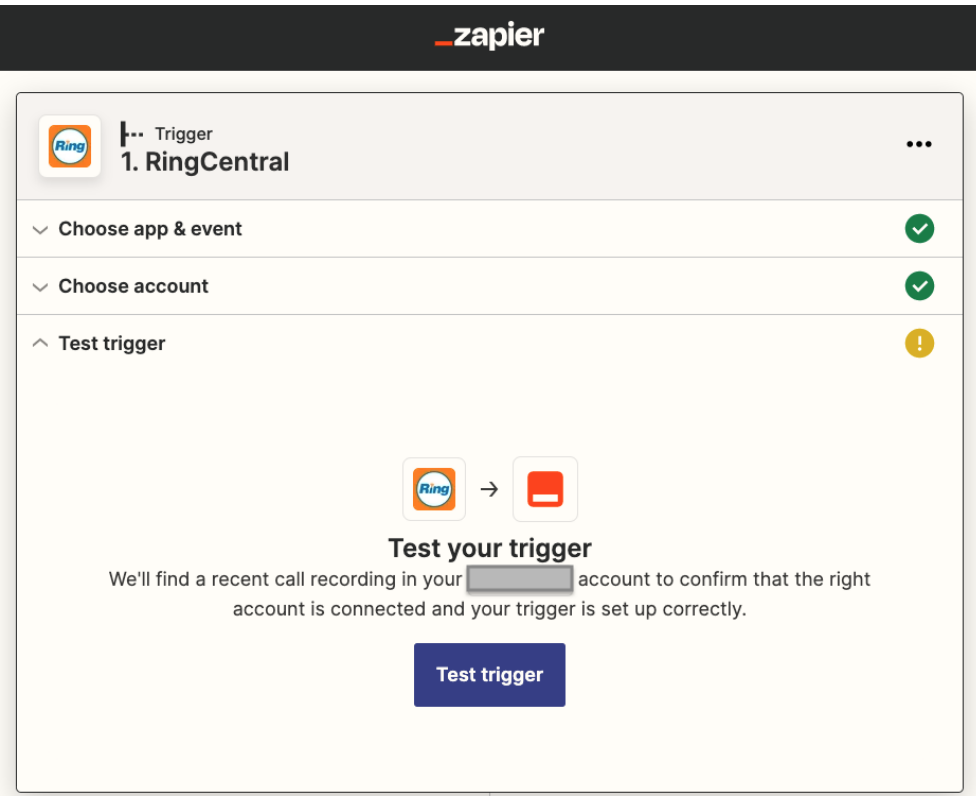{.mw-400}
      <figcaption>Test your call recording trigger</figcaption>
    </figure>
2. Test your trigger by making a test call and checking if Zapier detects it.
    <figure markdown>
      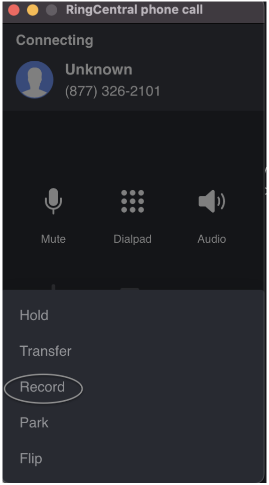{.mw-400}
      <figcaption>Place a call</figcaption>
    </figure>
3. Verify the outputs from the triggering event.
    <figure markdown>
      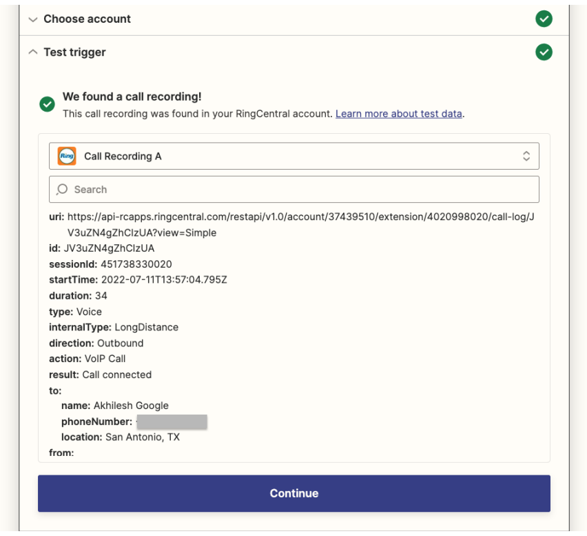{.mw-400}
      <figcaption>View the test results</figcaption>
    </figure>

## Selecting what actions will be invoked

Once your trigger is set up, choose an action app that determines what happens next. For example, if you want to save call recordings to Google Drive:

1. Select Google Drive as your action app.
2. Choose Upload File as the action event.
    <figure markdown>
      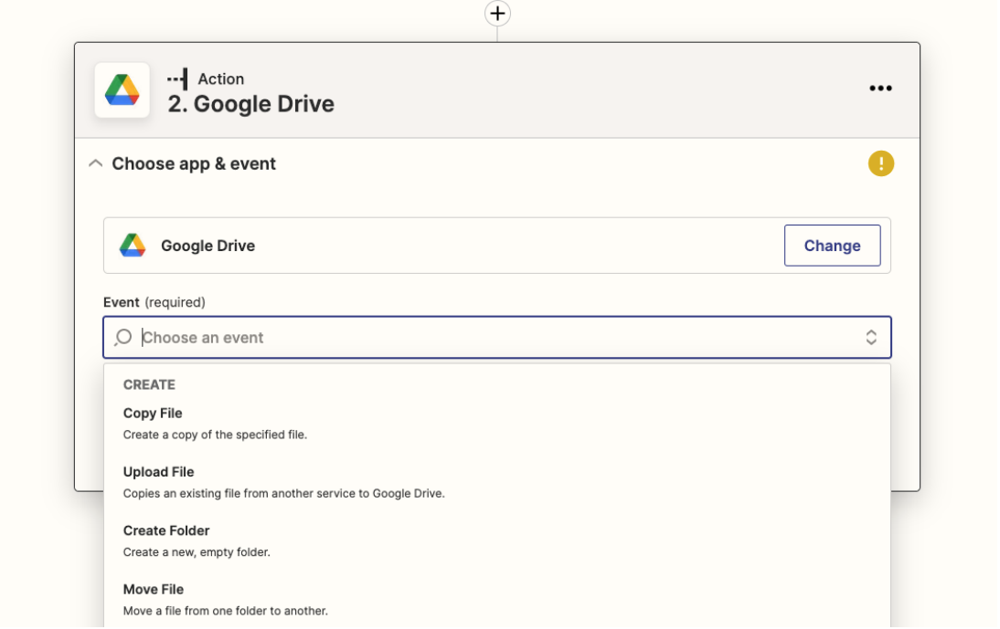{.mw-400}
      <figcaption>Select the Google Drive upload action</figcaption>
    </figure>
3. Connect your Google Drive account.
    <figure markdown>
      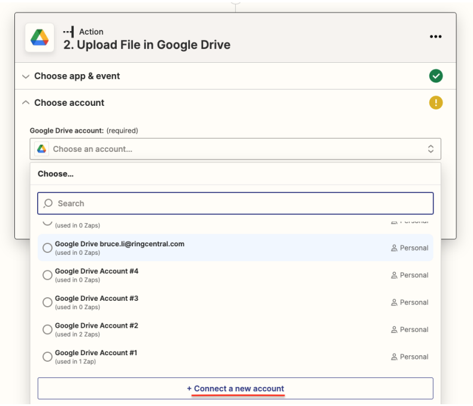{.mw-400}
      <figcaption>Connect to Google Drive</figcaption>
    </figure>
    <figure markdown>
      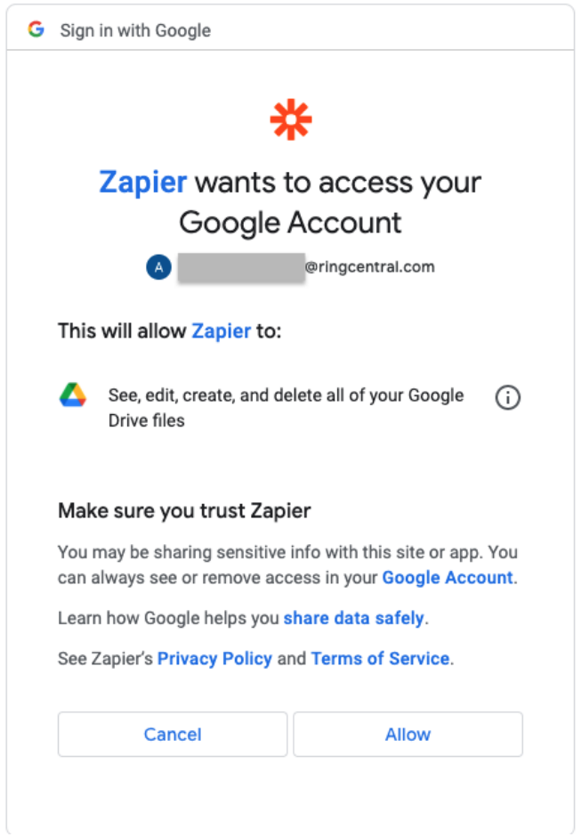{.mw-400}
      <figcaption>Authorize Google</figcaption>
    </figure>
    <figure markdown>
      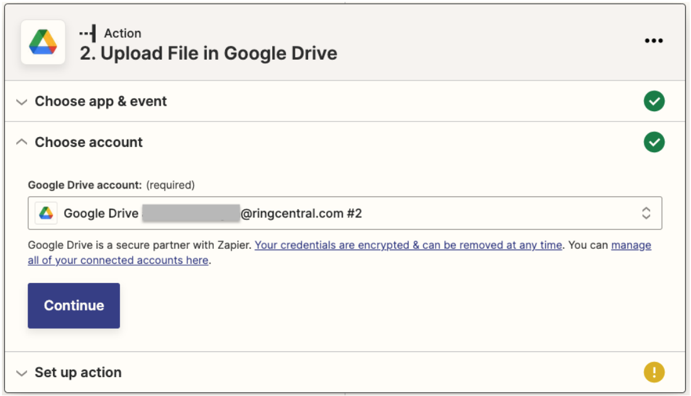{.mw-400}
      <figcaption>Verify the account and sheet you are connecting to</figcaption>
    </figure>
4. Map data fields to ensure the correct information is stored.
    <figure markdown>
      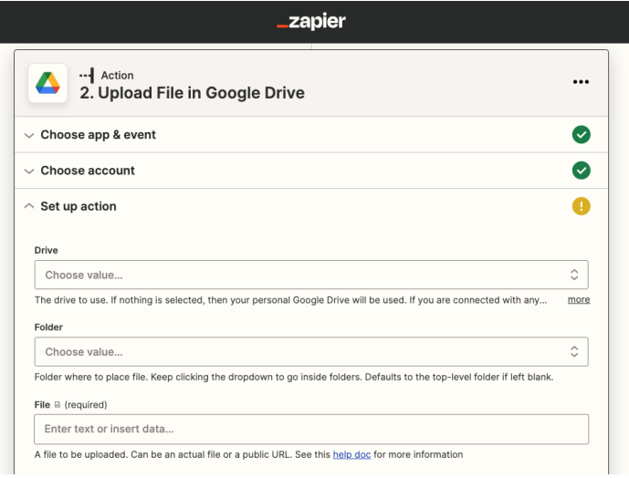{.mw-400}
      <figcaption>Map data fields to store document</figcaption>
    </figure>
    <figure markdown>
      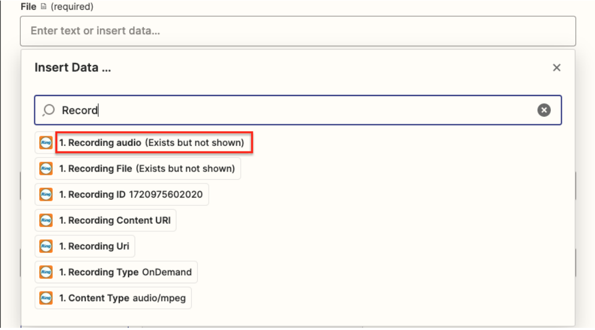{.mw-400}
      <figcaption>Select the call recording field from the trigger</figcaption>
    </figure>
    <figure markdown>
      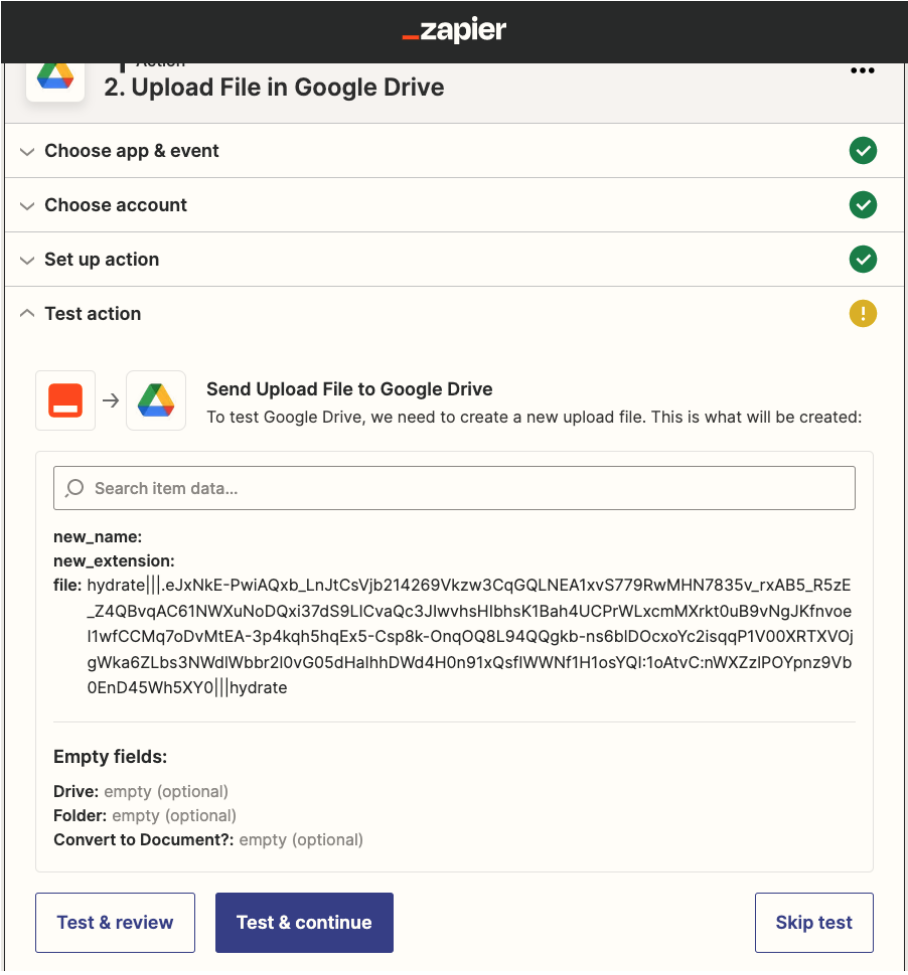{.mw-400}
      <figcaption>Confirm the storage of files and contents in Google Drive</figcaption>
    </figure>
5. Test the action to confirm the file uploads successfully.
    <figure markdown>
      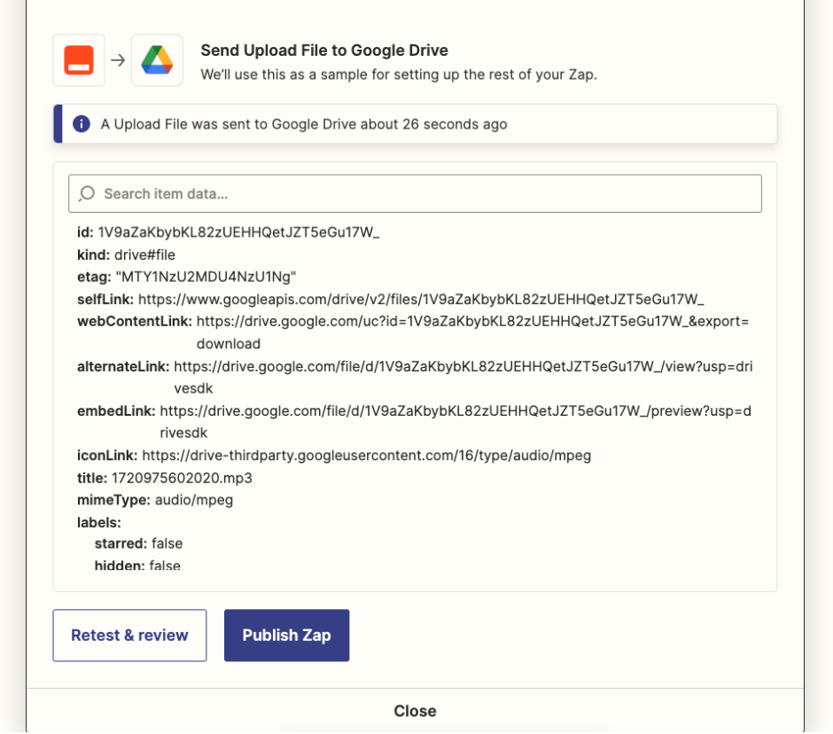{.mw-400}
      <figcaption>Test the action to verify file is created</figcaption>
    </figure>

## Publishing Your Zap

Once your trigger and action are configured: Click Publish Zap.

<figure markdown>
  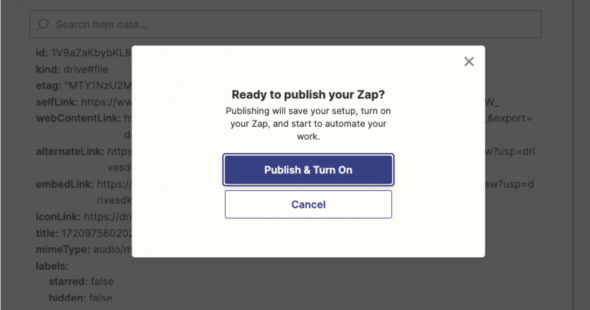{.mw-500}
  <figcaption>Publish your app to enable it</figcaption>
</figure>

## Name your Zap and save it to a folder.

Ensure the Zap is turned ON.

<figure markdown>
  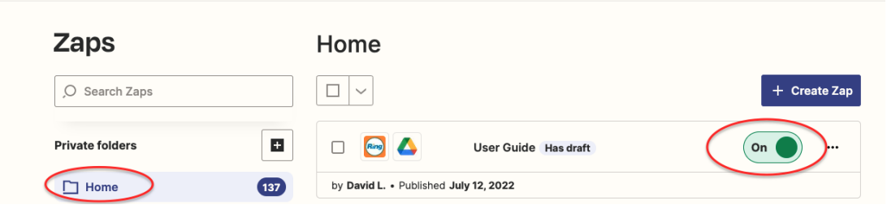{.mw-600}
  <figcaption>Verify it is enabled, and change the name</figcaption>
</figure>

