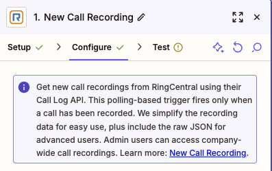
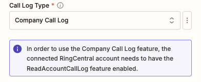
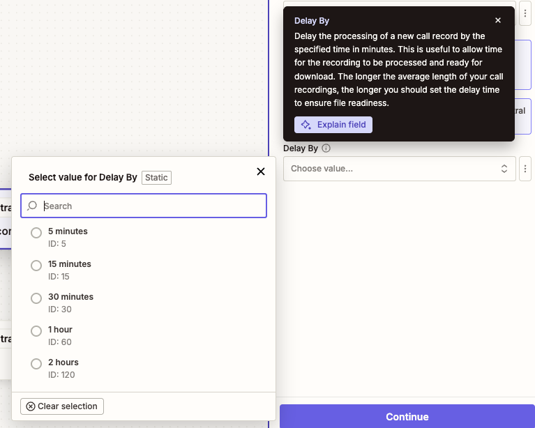

---
hide:
    - path
    - toc
---

# New Call Recording

## Overview

Use this trigger to monitor and respond to new call recordings in your RingCentral account. This polling-based trigger is a specialized version of the Call Log trigger that automatically filters to only include calls that have been recorded, making it ideal for workflows that specifically need to process recorded calls.

The trigger simplifies recording data for easy use in Zapier workflows while also providing raw JSON output for advanced users who need access to additional fields. Administrative users can access company-wide call recordings with appropriate permissions.



## Configure

1. **Call Log Type**: Choose between `User Call Log` and `Company Call Log`. 

    - **User Call Log**: Retrieves call recordings for the connected user only
    - **Company Call Log**: Retrieves call recordings for the entire company (requires `ReadAccountCallLog` permission or admin access)

    Warning messages will be displayed if the required permissions are not met or if additional features like RingSense transcripts are unavailable.

    

2. **Delay By** (Optional): Set a processing delay to ensure recording files are ready for download. There is typically a delay between when call log data becomes available and when recording files are fully processed. Choose a delay based on your average call length:

    - **5 minutes**: For short calls
    - **15 minutes**: For typical business calls  
    - **30 minutes**: For longer calls (recommended minimum)
    - **1 hour**: For very long calls
    - **2 hours**: For exceptionally long calls or recordings

    Most recordings are ready within 30 minutes, but longer delays may be needed for exceptionally long calls.

    

!!! note "RingCentral Features Required"
    To access call transcripts, the connected RingCentral account needs to have RingSense license enabled. For Company Call Log records, the individual users who made the calls also need RingSense licenses assigned. Warning messages will be displayed during configuration if these requirements are not met.

## Output

The New Call Recording trigger provides comprehensive information about each recorded call. The output includes simplified fields optimized for Zapier workflows, plus a complete raw JSON response for advanced users requiring additional data.

### Basic Call Information

- **URI**: Unique URI identifier for the call log record
- **ID**: Unique identifier for the call log record  
- **Session ID**: Session identifier for the call
- **Telephony Session ID**: Telephony session identifier

### Call Details

- **Start Time**: Date and time when the call started (datetime format)
- **Duration**: Call length in seconds
- **Type**: Type of call (e.g., Voice, Fax)
- **Direction**: Call direction (Inbound or Outbound)
- **Action**: Action performed during the call
- **Result**: Call outcome (e.g., Call Connected, Voicemail, Busy, No Answer)
- **Transport**: Transport method used for the call

### Recording Information

Since this trigger specifically filters for recorded calls, the following recording fields will always be populated:

- **Recording ID**: Unique identifier for the call recording
- **Recording URI**: API URI to access recording metadata
- **Recording Content URI**: Direct URI to download the recording file
- **Recording Type**: Type of recording (Automatic or On Demand)
- **Recording Content Type**: MIME type of the recording file (e.g., audio/mpeg)
- **Recording File**: Actual audio file attachment (available for download)
- **Content Type**: Content type of the recording
- **Recording Audio**: Audio content of the recording
- **Recording Player URL**: Shareable URL providing access to a web-based recording player

!!! note "Recording File Availability"
    Recording files may not be immediately available after a call ends. The system needs time to process and prepare the files. Use the "Delay By" option to ensure recording files are ready when your Zap triggers. Longer calls typically require more processing time.

!!! warning "Recording Player URL Access"
    The Recording Player URL requires recipients to have a RingCentral account and appropriate permissions to view the recording. This URL is only valid while the recording remains in the RingCentral system according to the [data retention policy](https://support.ringcentral.com/article-v2/RingCentral-data-retention-policies.html?brand=RingCentral&product=RingEX&language=en_US).

### Transcript Information

- **Transcripts**: A text transcript of what was said during the call. This field is only available when call transcription is enabled and you have a RingSense license assigned.

!!! note "RingSense Transcript Requirements"
    To access call transcripts, the connected user extension requires the RingSense license assigned. For Company Call Log records, the individual user extensions that made the calls also need RingSense licenses assigned. If these requirements are not met, warning messages will be displayed during configuration.

### Raw Data

- **Raw**: Complete, unprocessed JSON response from the RingCentral API containing all available data for advanced users who need access to additional fields not included in the simplified output.

### Sample Output

```json
{
  "uri": "https://api-rcapps.ringcentral.com/restapi/v1.0/account/~/extension/~/call-log/call-log-1758068132637",
  "id": "call-log-1758068132637",
  "sessionId": "session-1758068132637",
  "telephonySessionId": "telephony-session-1758068132637",
  "startTime": "2025-09-17T00:15:32.637Z",
  "duration": 1580,
  "type": "Voice",
  "direction": "Outbound",
  "action": "VoIP Call",
  "result": "Accepted",
  "transport": "PSTN",
  "recordingId": "recording-1758068132637",
  "recordingUri": "https://api-rcapps.ringcentral.com/restapi/v1.0/account/account-1758068132637/recording/recording-1758068132637",
  "recordingContentUri": "https://api-rcapps.ringcentral.com/restapi/v1.0/account/account-1758068132637/recording/recording-1758068132637/content",
  "recordingType": "Automatic",
  "recordingContentType": "audio/mp3",
  "recordingFile": "Sample File",
  "contentType": "audio/mp3",
  "recordingAudio": "Sample Audio Content",
  "recordingPlayerUrl": "https://app.ringcentral.com/recordings/player/recording-1758068132637",
  "transcripts": "Sample Transcripts",
  "raw": "{\"uri\":\"https://api-rcapps.ringcentral.com/restapi/v1.0/account/~/extension/~/call-log/call-log-1758068132637\",\"id\":\"call-log-1758068132637\",\"sessionId\":\"session-1758068132637\",\"telephonySessionId\":\"telephony-session-1758068132637\",\"startTime\":\"2025-09-17T00:15:32.637Z\",\"duration\":1580,\"type\":\"Voice\",\"direction\":\"Outbound\",\"action\":\"VoIP Call\",\"result\":\"Accepted\",\"transport\":\"PSTN\",\"recording\":{\"id\":\"recording-1758068132637\",\"uri\":\"https://api-rcapps.ringcentral.com/restapi/v1.0/account/account-1758068132637/recording/recording-1758068132637\",\"type\":\"Automatic\",\"contentUri\":\"https://api-rcapps.ringcentral.com/restapi/v1.0/account/account-1758068132637/recording/recording-1758068132637/content\"},\"extension\":{\"uri\":\"https://api-rcapps.ringcentral.com/restapi/v1.0/account/~/extension/extension-1758068132637\",\"id\":\"extension-1758068132637\"}}"
}
```

## Key Differences from Call Log Trigger

The New Call Recording trigger is a streamlined version of the Call Log trigger with the following differences:

- **Automatic Filtering**: Only includes calls that have been recorded - no need to manually configure recording filters
- **Simplified Configuration**: Fewer configuration options since it's focused specifically on recorded calls
- **Recording-Focused Output**: All recording-related fields will always be populated since only recorded calls are included

!!! tip "When to Use This Trigger"
    Use the New Call Recording trigger when you specifically need to work with recorded calls only. If you need more granular filtering options or want to process all calls (recorded and unrecorded), use the standard Call Log trigger instead.

!!! info "Output Consistency"
    Since this trigger only includes recorded calls, recording-related fields will always contain data, making it more predictable for workflows that depend on recording information.
