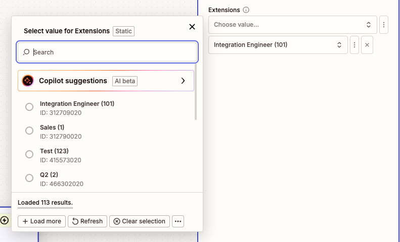
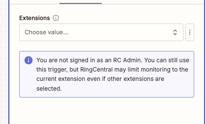

---
hide:
    - path
    - toc
---

# New Fax Received

## Overview

Use this instant trigger when a RingCentral extension receives a new inbound fax. The trigger returns fax metadata, sender and recipient fields, page information, and fax document attachments.

RingCentral admins can monitor up to 50 selected extensions. If no extensions are selected, the trigger monitors the connected user's extension.

This trigger is recommended for new inbound fax workflows. Because it is an instant trigger, it can start the Zap earlier than older polling-based fax triggers that wait for the next polling interval.

## Configure

1. **Extensions** (Optional): Search by extension number or name and select one or more extensions to monitor.

    Admin users can select up to 50 extensions. If no extensions are selected, the trigger monitors the connected user's extension.

    

    If the connected user is not a RingCentral admin, RingCentral may limit monitoring to the current extension even if other extensions are selected. A warning is shown in the Zap configuration.

    

## Trigger Behavior

This trigger is for inbound faxes only. It ignores non-fax message events and outbound fax events.

During trigger setup, sample loading is intentionally lighter for this trigger. It checks up to 3 selected extensions and requests a small page of fax records so testing is less likely to time out on large accounts.

## Output

The trigger returns fields commonly used for inbound fax workflows.

### Fax Information

- **ID**: RingCentral fax message ID.
- **Creation Time**: Date and time the fax was created.
- **Direction**: Fax direction. For this trigger, this is inbound.
- **Fax Page Count**: Number of pages in the fax.
- **Fax Resolution**: Fax resolution, when available.
- **Last Modified Time**: Date and time the fax record was last modified.
- **Message Content**: Message content derived from the fax subject.
- **Message Status**: Fax message status.
- **Priority**: Message priority.
- **Read Status**: Whether the fax is read or unread.
- **Subject**: Fax subject, often the sender phone number.

### Participant Information

#### From (Sender) Information

- **From Name**: Sender name, when available.
- **From Phone Number**: Sender fax number.
- **From Extension Number**: Sender extension number, when available.
- **From Phone Number and Name**: Combined sender phone number and name.

#### To (Recipient) Information

- **To Name**: Recipient name, when available.
- **To Phone Number**: Recipient fax number.
- **To Extension Number**: Recipient extension number, when available.
- **To Phone Number and Name**: Combined recipient phone number and name.

### Attachment Information

- **Attachment ID**: Attachment identifier.
- **Attachment File**: Downloadable fax document.
- **Attachment Type**: Attachment type, such as rendered document.
- **Attachment Content Type**: MIME type for the fax document, such as `application/pdf`.
- **Attachment Filename**: File name when available.
- **Attachment Size**: File size when available.

## Sample Output

```json
{
  "id": "974123364020",
  "creationTime": "2025-09-17T00:15:32.637Z",
  "direction": "Inbound",
  "faxPageCount": 1,
  "faxResolution": "High",
  "lastModifiedTime": "2025-09-17T00:15:33.790Z",
  "messageContent": "+16505130207",
  "messageStatus": "Received",
  "priority": "Normal",
  "readStatus": "Unread",
  "subject": "+16505130207",
  "from": "+16505130207",
  "fromExtensionNumber": "No Data",
  "fromName": "No Data",
  "fromPhoneNumber": "+16505130207",
  "to": "+18883770028 (Main Fax)",
  "toExtensionNumber": "12345",
  "toName": "Main Fax",
  "toPhoneNumber": "+18883770028",
  "attachments": [
    {
      "id": "974123364020",
      "type": "RenderedDocument",
      "contentType": "application/pdf",
      "filename": "fax.pdf",
      "size": 234567,
      "file": "Sample Fax PDF File"
    }
  ]
}
```

!!! note "Fax File Availability"
    Fax document files are returned as attachment files when available. Downstream Zap steps can map the attachment file into apps that accept file uploads.

<!-- TODO: Confirm whether inbound faxes to shared company numbers, call queues, or delegated fax lines require special setup. -->
