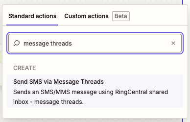
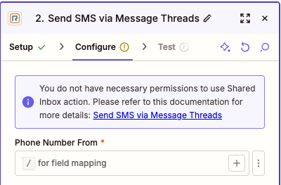
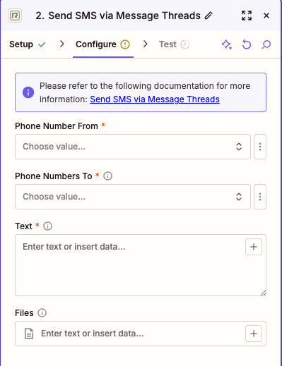
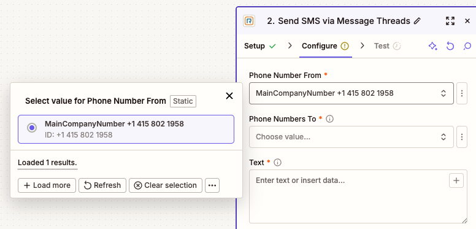

---
hide:
    - path
    - toc
---

# Send SMS via Message Threads

## Overview

Use this action to send an SMS or MMS message through RingCentral Message Threads, also known as Shared Inbox. This action is intended for teams that send messages from shared phone numbers such as the main company number, call queue numbers, site numbers, or IVR numbers.



Message Threads organize SMS conversations by the shared sender number and the customer's phone number, so future replies and follow-ups stay in the same thread. Multiple SMS handlers can work with the same shared number when they have the required Shared Inbox access.

Use **Send SMS via Message Threads** for Shared Inbox workflows. Use **Send SMS/MMS** for standard one-to-one SMS/MMS sent from the connected user's own RingCentral extension number.

## Requirements

- The connected RingCentral user extension must have a Business SMS Booster license assigned, which enables access to Message Threads.
- The connected RingCentral user must be a user extension.
- The connected user must be assigned as an SMS recipient or handler for at least one supported shared inbox resource.
- The shared sender number must support both SMS and MMS sending.

If the connected user does not meet these requirements, Zapier shows a warning during setup.



For more information about Message Threads and Shared Inbox behavior, see the [RingCentral SMS Thread Messaging guide](https://developers.ringcentral.com/guide/messaging/sms/threads).

## Configure



1. **Phone Number From**: Select the shared RingCentral phone number that should send the message.

    The dropdown lists main company numbers available to the connected user for now.

    

    To use another Shared Inbox number, such as a call queue, site, or IVR number, choose the custom field option and enter the phone number manually.

2. **Phone Numbers To**: Enter one or more recipient phone numbers.

    Up to 10 recipient phone numbers are sent. If more than 10 values are provided, only the first 10 are used.

3. **Text**: Enter the message text.

    The maximum text length is 1000 characters. If the text is longer than 1000 characters, the action truncates it before sending.

4. **Files** (Optional): Add files when the Zap should send MMS.

    !!! tip "SMS or MMS"
        If no files are added, the action sends SMS. If files are added, the action sends MMS. You can add up to 10 files, and the combined attachment size must be 1.5 MB or less.

    Supported file types include common image, video, audio, vCard, compressed, PDF, RTF, HTML, text, CSV, and calendar files.

5. Test the action before publishing the Zap.

    Testing verifies that the connected user can send from the selected shared inbox number to the selected recipient number.

## Notes

- The action creates or continues a message thread between the selected shared sender number and each customer phone number.
- If an open thread already exists but is assigned to another SMS handler, RingCentral may reject the send because the current user is not assigned to that thread.
- RingCentral opt-out and messaging policy rules still apply to messages sent by this action.

## Output

The action returns fields commonly used for message-thread workflows.

### Message Information

- **ID**: RingCentral message ID.
- **Thread ID**: Message thread ID.
- **Record Type**: Message record type.
- **Availability**: Message availability.
- **Creation Time**: Date and time the message was created.
- **Last Modified Time**: Date and time the message was last updated.
- **Direction**: Message direction. For this action, this is outbound.
- **Message Status**: Message status, such as queued or sent.
- **Text**: Text content of the SMS/MMS message.
- **Type**: Message type. This is `SMS` when no files are attached and `MMS` when files are attached.

### Participant Information

#### Author Information

- **Author Extension ID**: Extension ID of the user who sent the message.
- **Author Name**: Name of the user who sent the message.
- **Author Extension Type**: Extension type of the user who sent the message.

#### From Information

- **From Phone Number**: Shared inbox phone number used to send the message.

#### To Information

- **To Phone Number**: Recipient phone number.

### Attachment Information

When a message has attachments, the following fields may be populated:

- **Attachment ID**: Attachment identifier.
- **Attachment Content Type**: MIME type for the attachment.
- **Attachment URI**: RingCentral URI for the attachment.

## Sample Output

```json
{
  "availability": "Alive",
  "author": {
    "extensionId": "63536924004",
    "extensionType": "User",
    "name": "John Doe"
  },
  "creationTime": "2025-11-27T19:15:13.614Z",
  "direction": "Outbound",
  "from": {
    "phoneNumber": "+18559100010"
  },
  "id": "2268375770",
  "lastModifiedTime": "2025-11-27T19:15:13.614Z",
  "messageStatus": "Queued",
  "recordType": "AliveMessage",
  "text": "Let me know if it resolves your issue",
  "threadId": "940617a4-e9d2-4ff8-884d-2efac946b31c",
  "to": [
    {
      "phoneNumber": "+18551003738"
    }
  ],
  "type": "SMS"
}
```
