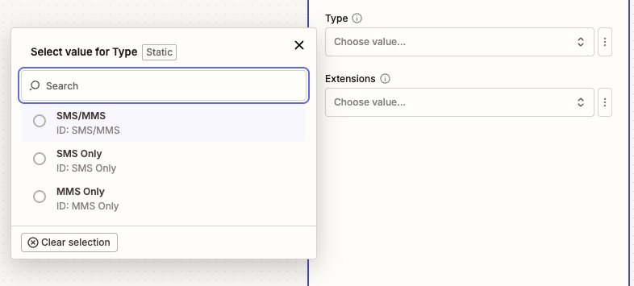

---
hide:
    - path
    - toc
---

# New SMS/MMS Received

## Overview

Use this instant trigger when a RingCentral extension receives a new SMS or MMS message. The trigger can return message metadata, message text, and sender and recipient fields.

RingCentral admins can monitor up to 50 selected extensions with one Zap. Non-admin users can only subscribe to SMS/MMS messages for their own extension. If the connected user is not an admin, a warning is shown during configuration.

## Configure

1. **Type**: Choose which inbound messages should trigger the Zap.

    - **SMS/MMS**: Receive both SMS and MMS messages.
    - **SMS Only**: Receive simple text-only SMS messages. If someone sends an image or other media, RingCentral treats that message as MMS and this trigger mode ignores it.
    - **MMS Only**: Receive only MMS messages.

    !!! tip "Choosing SMS Only"
        Choose `SMS Only` when the Zap should only run for plain text messages. Choose `SMS/MMS` or `MMS Only` when the Zap should also run for messages that include images or other media.

    

2. **Extensions** (Optional): Search by extension number or name and select one or more extensions to monitor.

    Admin users can select up to 50 extensions to monitor with one Zap. If no extensions are selected, the trigger monitors the connected user's extension.

    

    If the connected user is not an admin, this trigger can only subscribe to SMS/MMS messages for that user's own extension. A warning is shown in the Zap configuration.

    

## Output

The trigger returns fields commonly used for messaging workflows.

### Message Information

- **ID**: RingCentral message ID.
- **Creation Time**: Date and time the message was created.
- **Direction**: Message direction. For this trigger, this is inbound.
- **Message Content**: Text content of the SMS/MMS message.
- **Priority**: Message priority.
- **Read Status**: Whether the message is read or unread.
- **Subject**: Message subject. For SMS, this typically contains the message text.

### Participant Information

#### From (Sender) Information

- **From Name**: Sender name, when available.
- **From Phone Number**: Sender phone number.
- **From Extension Number**: Sender extension number, when available.
- **From Phone Number and Name**: Combined sender phone number and name.

#### To (Recipient) Information

- **To Name**: Recipient name, when available.
- **To Phone Number**: Recipient phone number.
- **To Extension Number**: Recipient extension number, when available.
- **To Phone Number and Name**: Combined recipient phone number and name.

## Sample Output

```json
{
  "id": 401060286008,
  "creationTime": "2025-09-17T00:15:32.637Z",
  "direction": "Inbound",
  "messageContent": "Can you send me the updated quote?",
  "priority": "Normal",
  "readStatus": "Unread",
  "subject": "Can you send me the updated quote?",
  "from": "+18883770028 (John Doe)",
  "fromExtensionNumber": "12345",
  "fromName": "John Doe",
  "fromPhoneNumber": "+18883770028",
  "to": "+16508783254 (Support)",
  "toExtensionNumber": "67890",
  "toName": "Support",
  "toPhoneNumber": "+16508783254"
}
```
