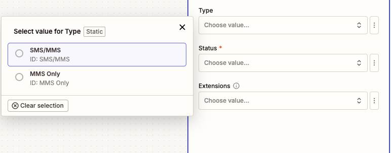
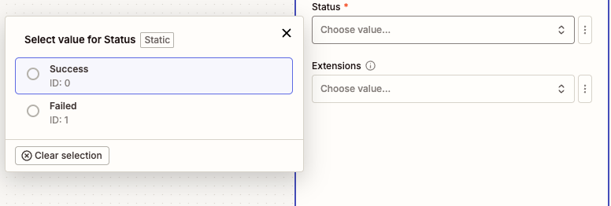
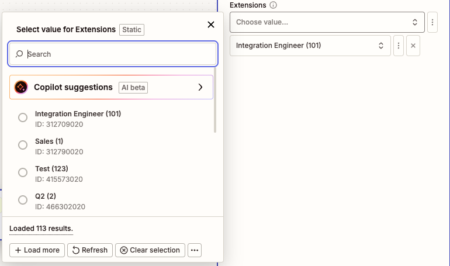
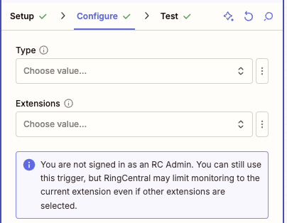

---
hide:
    - path
    - toc
---

# New SMS/MMS Sent

## Overview

Use this instant trigger when a RingCentral extension sends a new SMS or MMS message. The trigger can return message metadata, message text, sender and recipient fields, and MMS attachments when available.

RingCentral admins can monitor up to 50 selected extensions with one Zap. Non-admin users can only subscribe to SMS/MMS messages sent from their own extension.

## Configure

1. **Type**: Choose which outbound messages should trigger the Zap.

    - **SMS/MMS**: Include outbound SMS and MMS messages.
    - **MMS Only**: Include only outbound messages with MMS attachments.

    

2. **Status**: Choose which outbound message status should trigger the Zap.

    

3. **Extensions** (Optional): Search by extension number or name and select one or more extensions to monitor.

    Admin users can select up to 50 extensions to monitor with one Zap. If no extensions are selected, the trigger monitors the connected user's extension.

    

    If the connected user is not an admin, this trigger can only subscribe to SMS/MMS messages sent from that user's own extension.

    

## Output

The trigger returns fields commonly used for sent-message workflows.

### Message Information

- **ID**: RingCentral message ID.
- **Creation Time**: Date and time the message was created.
- **Direction**: Message direction. For this trigger, this is outbound.
- **Message Content**: Text content of the SMS/MMS message.
- **Priority**: Message priority.
- **Read Status**: Whether the message is read or unread.
- **Subject**: Message subject. For SMS, this typically contains the message text.

### Participant Information

#### From (Sender) Information

- **From Name**: Sender name, when available.
- **From Phone Number**: Sender phone number.
- **From Extension Number**: Sender extension number, when available.
- **From Phone Number and Name**: Combined sender phone number and name.

#### To (Recipient) Information

- **To Name**: Recipient name, when available.
- **To Phone Number**: Recipient phone number.
- **To Extension Number**: Recipient extension number, when available.
- **To Phone Number and Name**: Combined recipient phone number and name.

### Attachment Information

When a message has attachments, the following fields may be populated:

- **Attachment ID**: Attachment identifier.
- **Attachment File**: Downloadable file for the attachment.
- **Attachment Type**: Attachment type, such as text or MMS attachment.
- **Attachment Content Type**: MIME type for the attachment.

## Sample Output

```json
{
  "id": 401060286008,
  "creationTime": "2025-09-17T00:15:32.637Z",
  "direction": "Outbound",
  "messageContent": "I just sent the updated quote.",
  "priority": "Normal",
  "readStatus": "Read",
  "subject": "I just sent the updated quote.",
  "from": "+18883770028 (Sales)",
  "fromExtensionNumber": "12345",
  "fromName": "Sales",
  "fromPhoneNumber": "+18883770028",
  "to": "+16508783254 (Jane Doe)",
  "toExtensionNumber": "No Data",
  "toName": "Jane Doe",
  "toPhoneNumber": "+16508783254",
  "attachments": [
    {
      "id": 401060286008,
      "type": "Text",
      "contentType": "text/plain",
      "file": "Sample Text File"
    }
  ]
}
```
